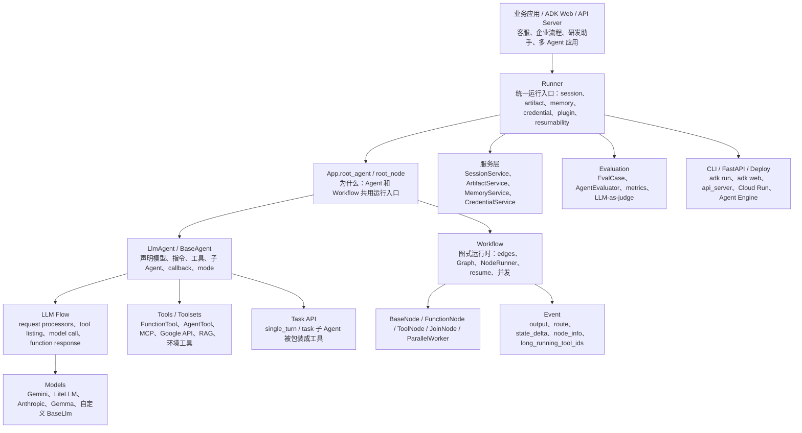
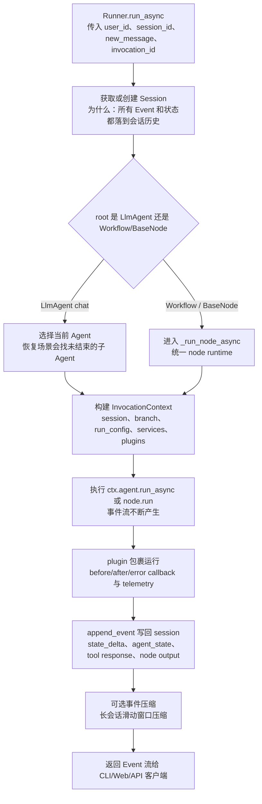
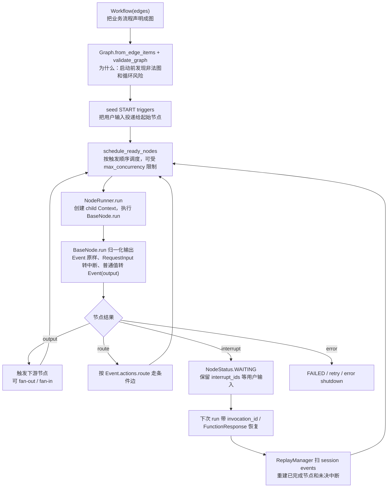
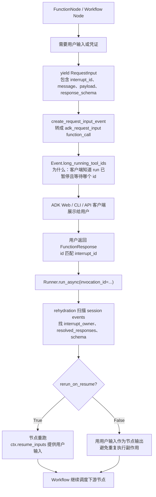
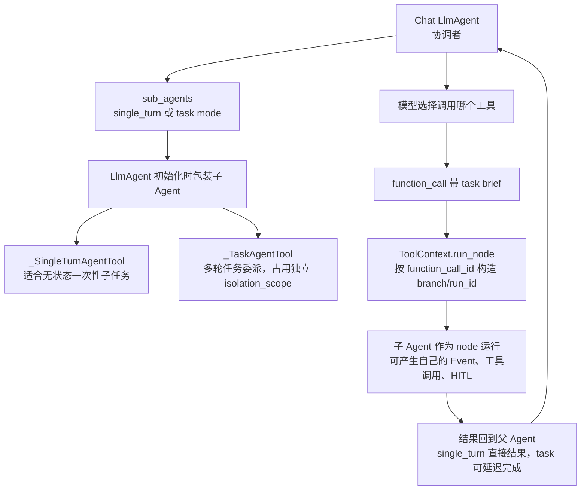
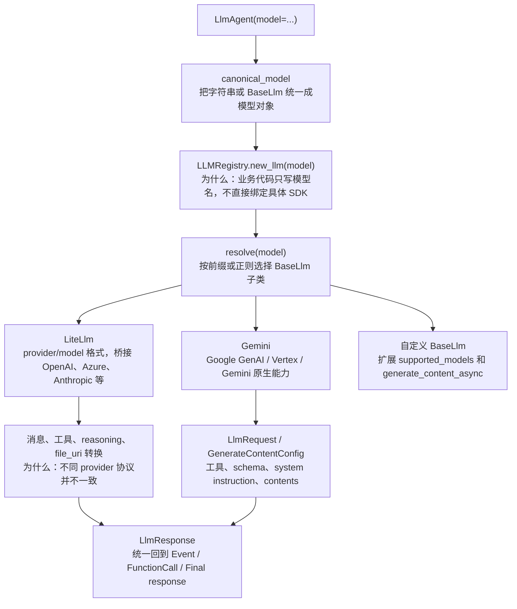
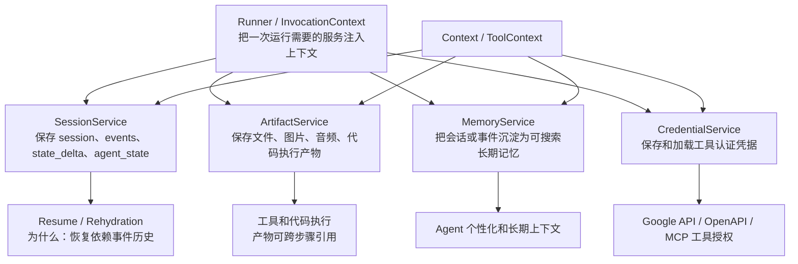
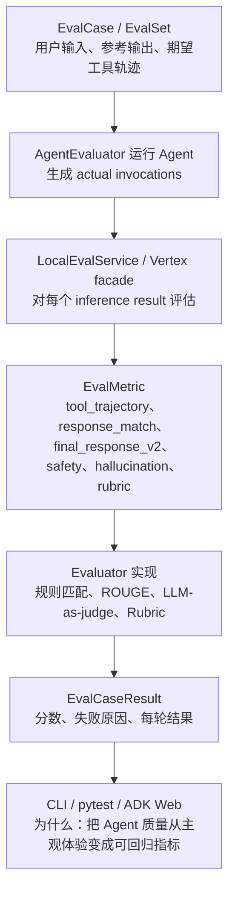
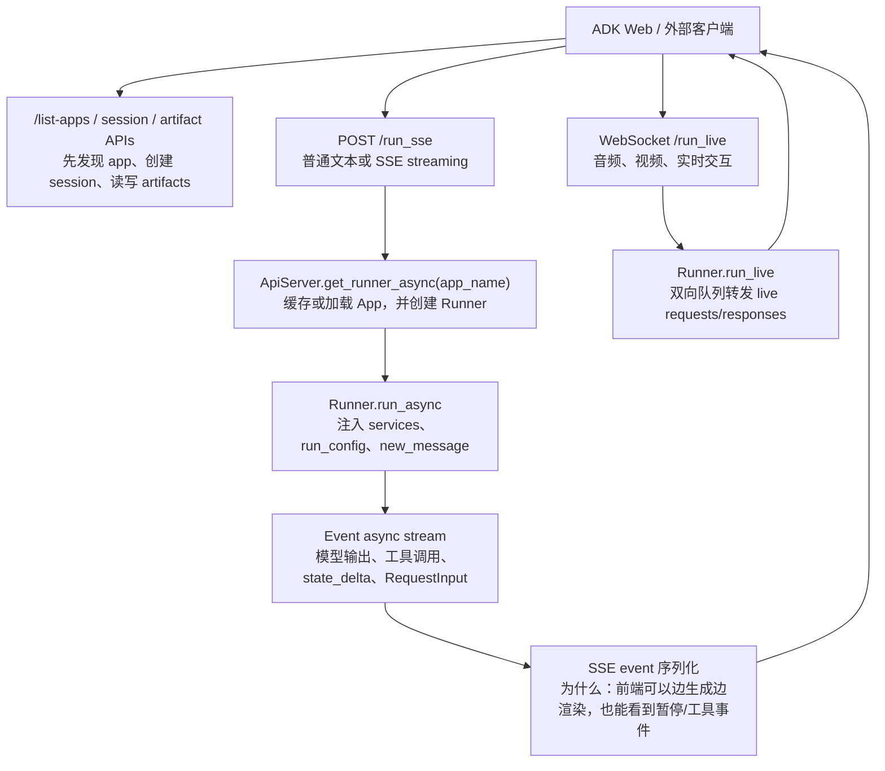
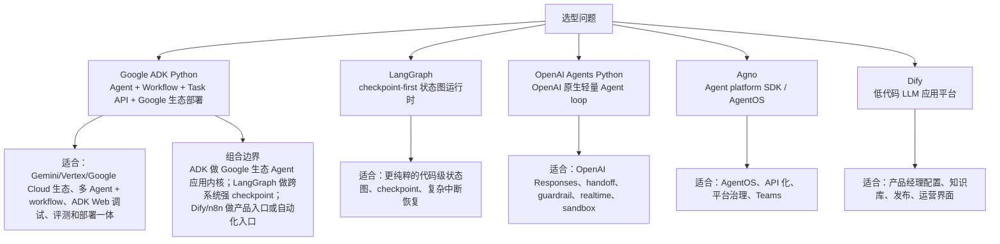

# Google ADK Python 源码分析

源码版本：

- 仓库：`google/adk-python`
- 本地源码：`sources/adk-python`
- 当前提交：`2de8a53525261a0dcf53588fbbb5ebd7d4c3a9c2`
- 标签描述：`v1.32.0-631-g2de8a535`
- 包名：`google-adk`
- Python 要求：`>=3.10`

## 1. 一句话定位

Google ADK Python 是一个代码优先的 Agent 应用开发框架。ADK 2.0 的特点不是只封装一个 LLM Agent，而是把 `Agent`、`Workflow`、`Runner`、`Event`、`Session`、`Tool`、`Task API`、`Evaluation`、`ADK Web/API Server/Deploy` 放进同一套开发体验里，特别适合 Gemini / Vertex AI / Google Cloud 生态里的多 Agent 应用。

为什么这么设计：ADK 把 Agent loop 和图式 Workflow runtime 放在同一个运行入口 `Runner` 下。简单任务用 `LlmAgent`，复杂确定性流程用 `Workflow`，需要子 Agent 委派时用 Task API，最后统一落到 Event / Session / Evaluation / API Server。这样既能写代码，又能用 ADK Web 调试和用 eval 做质量回归。

## 2. 总体架构图



## 3. 源码分层

| 层级 | 关键文件 | 作用 |
| --- | --- | --- |
| Public API | `src/google/adk/__init__.py` | 对外导出 Agent、Workflow、Runner、tools、sessions 等入口 |
| App / Runner | `apps/app.py`、`runners.py` | App 持有 root_agent/root_node；Runner 管 session、plugins、memory、credential、resumability |
| Agent 定义 | `agents/base_agent.py`、`agents/llm_agent.py` | Agent 树、子 Agent、callback、LLM 配置、工具、运行模式 |
| LLM Flow | `flows/llm_flows/*` | 构建 LlmRequest、处理 instructions/tools、调用模型、执行 function calls |
| Workflow Runtime | `workflow/_workflow.py`、`_base_node.py`、`_node_runner.py` | 图编排、节点执行、并发、输出/路由/中断归一化、resume rehydration |
| Event / Context | `events/event.py`、`agents/context.py`、`agents/invocation_context.py` | 运行时事件、状态增量、分支、隔离作用域、用户输入恢复 |
| Tools | `tools/*` | FunctionTool、AgentTool、MCP、Google API、RAG、环境工具、认证工具 |
| Task API | `tools/agent_tool.py`、`agents/llm/task/*` | 将子 Agent 包装成 single_turn 或 task 委派工具 |
| Session / Memory | `sessions/*`、`memory/*` | 会话事件存储、SQLite/DB/Vertex、长期记忆服务 |
| Evaluation | `evaluation/*` | EvalCase、EvalSet、metrics、AgentEvaluator、LocalEvalService、LLM-as-judge |
| CLI / Server / Deploy | `cli/*` | `adk run`、`adk web`、FastAPI server、SSE、WebSocket live、Cloud Run/GKE/Agent Engine 部署 |

## 4. 主流程：Runner 如何驱动 Agent / Workflow



源码证据：

- `src/google/adk/runners.py:137-173` 定义 `Runner`，它管理 app、root agent/node、artifact、session、memory、credential、context cache、resumability。
- `src/google/adk/runners.py:943-979` 是 `run_async` 主入口，支持 `invocation_id` 恢复中断调用，支持 `new_message` 和 `state_delta`。
- `src/google/adk/runners.py:988-1015` 约束 root `LlmAgent` 必须是 chat mode，并在有 task 子 Agent 时避免旧的子 Agent resume 逻辑绕过 coordinator。
- `src/google/adk/runners.py:1081-1109` 根据 resumability 决定创建新 invocation context，还是从历史中恢复 invocation context。
- `src/google/adk/runners.py:1117-1131` 调用 `ctx.agent.run_async(ctx)` 并把事件继续 yield 出去。
- `src/google/adk/runners.py:1132-1150` 在 invocation 结束后运行事件压缩，并把 compaction events 写入 session。

## 5. Agent 设计：声明式配置 + 可作为 Workflow Node

`BaseAgent` 是所有 Agent 的基础，它继承 Workflow 的 `BaseNode`。这意味着 Agent 不只是聊天对象，也可以作为 Workflow 图里的节点执行。

源码证据：

- `src/google/adk/agents/base_agent.py:93-147` 定义 `BaseAgent(BaseNode)`，包含 `name`、`description`、`parent_agent`、`sub_agents`。
- `src/google/adk/agents/base_agent.py:283-313` 的 `run_async` 负责 before callback、核心 `_run_async_impl`、after callback。
- `src/google/adk/agents/base_agent.py:315-330` 把 Agent 适配成 node runtime 的 `_run_impl`，保留 event author 和 node path。
- `src/google/adk/agents/llm_agent.py:223-244` 定义默认模型、live 模型和 `model` 继承规则。
- `src/google/adk/agents/llm_agent.py:253-304` 区分 `instruction` 和 `static_instruction`，后者主要服务上下文缓存优化。
- `src/google/adk/agents/llm_agent.py:529-570` 的 `_run_async_impl` 运行 LLM flow，并在可恢复模式下写 agent end state。
- `src/google/adk/agents/llm_agent.py:587-607` 把 LlmAgent 包装成 Workflow graph node 执行。

为什么这么设计：ADK 不把“Agent”和“Workflow Node”分成两套世界。Agent 可以独立 chat，也可以被 Workflow 调度；Workflow 也可以成为 App 的 root node。这样复杂应用可以逐步演进：先写一个 Agent，后面再把它放进流程图。

## 6. LLM Flow：一次模型调用如何推进

ADK 的 LLM Flow 是典型的“预处理 -> 模型调用 -> 后处理 -> 工具执行 -> 再循环”。

源码证据：

- `src/google/adk/flows/llm_flows/base_llm_flow.py:916-929` 的 `run_async` 循环执行 one step，直到 final response 或异常 partial 情况。
- `base_llm_flow.py:931-946` 创建 `LlmRequest`，先跑 preprocess processors。
- `base_llm_flow.py:947-972` 在可恢复场景检查最近事件是否仍有 long-running tool call 未解决，未解决则暂停。
- `base_llm_flow.py:974-988` 如果恢复后最后事件是 function call，则不重新调模型，直接处理 function calls。
- `base_llm_flow.py:990-1016` 调模型并把 `LlmResponse` 转成 `Event`。
- `base_llm_flow.py:1037-1057` 运行 request processors、解析 toolset auth、再处理 agent tools。
- `flows/llm_flows/functions.py:546-664` 执行单个 function call，包含 before_tool_callback、after_tool_callback、错误回调、telemetry、function response event。
- `flows/llm_flows/functions.py:635-643` 对 long-running 或 deferred response 工具跳过自动 FunctionResponse，这正是 task delegation / 长任务恢复的关键。

## 7. Workflow Runtime：ADK 2.0 的图式编排



源码证据：

- `src/google/adk/workflow/_workflow.py:138-160` 定义 `Workflow(BaseNode)`，支持 `edges`、`graph`、`max_concurrency`。
- `_workflow.py:176-180` 把 edge definitions 编译成 Graph 并执行 `validate_graph()`。
- `_workflow.py:182-209` 明确禁止 `mode='task'` 的 LlmAgent 作为静态 workflow graph node，要求用 chat coordinator 或动态 `ctx.run_node`。
- `_workflow.py:239-294` 是 Workflow 的 orchestration loop：SETUP、resume scan、seed start triggers、run loop、finalize。
- `_workflow.py:298-388` 的 `_run_loop` 调度 ready nodes、等待 pending tasks，并用 recovered sequence 保持恢复时的确定性顺序。
- `_workflow.py:412-448` 调度 ready node 时会跳过正在运行或等待未解决 interrupt 的节点，并检查并发上限。
- `src/google/adk/workflow/_base_node.py:57-80` 定义 `rerun_on_resume`、`wait_for_output`、`retry_config` 等节点控制项。
- `_base_node.py:197-230` 把节点 yield 的 `Event`、`RequestInput`、普通值统一归一化成 Event。
- `src/google/adk/workflow/_node_runner.py:50-56` 说明 NodeRunner 负责创建 child Context、迭代 node.run、写 output/route/interrupt_ids。
- `_node_runner.py:287-305` 从 Event 中提取 `output`、`long_running_tool_ids`、`actions.route`、`transfer_to_agent`。

为什么这么设计：Workflow 不直接返回任意 Python 值，而是把所有节点结果归一化成 Event。Event 既是 UI 展示材料，也是 session 持久化材料，还是恢复时 rehydration 的事实来源。

## 8. HITL / Resume：RequestInput 与事件重放



源码证据：

- `src/google/adk/events/request_input.py:28-64` 定义 `RequestInput`，包含 `interrupt_id`、`payload`、`message`、`response_schema`。
- `workflow/utils/_workflow_hitl_utils.py:47-69` 把 `RequestInput` 转成 `adk_request_input` function call，并设置 `long_running_tool_ids=[interrupt_id]`。
- `_workflow_hitl_utils.py:95-114` 用 `create_request_input_response` 构造恢复时的 FunctionResponse。
- `events/event.py:121-125` 的 `long_running_tool_ids` 告诉 Agent client 哪些 function call 是 long running。
- `workflow/utils/_rehydration_utils.py:231-357` 扫描 session events，重建节点状态、interrupt owner、resolved responses 和 schema。
- `workflow/_workflow.py:642-645` 子节点有 interrupt 时把 interrupt ids 写入 node state 和 loop state。
- `workflow/_workflow.py:726-744` 收集 WAITING 节点剩余 interrupt，并把它们传播到父 Context。

为什么这么设计：ADK 的恢复核心不是“保存一个外部 checkpoint 对象”，而是让 Event 历史成为可重放事实。这样 ADK Web、CLI、API Server、Eval 都能基于同一种事件格式观察、暂停、恢复和复盘。

## 9. Task API / AgentTool：子 Agent 如何委派



源码证据：

- `src/google/adk/agents/llm_agent.py:1110-1114` 当 agent mode 是 `task` 时自动加入 `FinishTaskTool`。
- `llm_agent.py:1116-1133` 把 sub_agents 按 mode 包装成 `_SingleTurnAgentTool` 或 `_TaskAgentTool`。
- `src/google/adk/tools/agent_tool.py:108-122` 定义 `AgentTool`，把 Agent 当成可调用工具。
- `agent_tool.py:145-203` 根据子 Agent 的输入/输出 schema 构造 FunctionDeclaration。
- `agent_tool.py:343-380` `_SingleTurnAgentTool` 使用 `tool_context.run_node` 执行子 Agent，并用 function call id 构造子 branch。
- `agent_tool.py:389-449` `_TaskAgentTool` 是任务委派标记，声明中强调不要和其他工具并行调用，并把响应延迟交给框架处理。
- `events/event.py:135-147` 的 `isolation_scope` 说明 Task API 用 function-call id 隔离委派 Agent 的上下文，避免看到 coordinator 的全部对话历史。

为什么这么设计：多 Agent 不一定要显式写一个 GroupChat。ADK 让父 Agent 把子 Agent 看成工具，但运行时又保留子 Agent 自己的 Event、branch、isolation_scope 和可恢复能力。这样既符合模型“调用工具”的接口，又能保留多 Agent 的工程可观测性。

## 10. Tool / Model / Google 生态适配

ADK 的工具系统覆盖很宽：普通函数、AgentTool、MCP、Google API、Vertex AI Search / RAG、LlamaIndex retrieval、OpenAPI、Spanner、BigQuery、GCS、Pub/Sub、环境工具、Bash、Computer Use 等。模型层则通过 `BaseLlm` 和 `LLMRegistry` 接入 Gemini、LiteLLM、Anthropic、Gemma 等。

源码证据：

- `src/google/adk/tools/base_tool.py:51` 定义 `BaseTool`。
- `src/google/adk/tools/function_tool.py:42` 定义 `FunctionTool`。
- `src/google/adk/tools/base_toolset.py:63` 定义 `BaseToolset`。
- `src/google/adk/tools/mcp_tool/mcp_toolset.py:66` 定义 `McpToolset`。
- `src/google/adk/tools/retrieval/vertex_ai_rag_retrieval.py:39` 定义 Vertex AI RAG retrieval。
- `src/google/adk/tools/retrieval/llama_index_retrieval.py:31` 定义 LlamaIndex retrieval 工具。
- `src/google/adk/models/base_llm.py:32` 定义 `BaseLlm`。
- `src/google/adk/models/google_llm.py:88` 定义 Gemini 模型适配。
- `src/google/adk/models/lite_llm.py:2586` 定义 LiteLLM 适配。
- `src/google/adk/models/registry.py:36-40` 用 `LLMRegistry.new_llm(model: str)` 将字符串模型名解析成模型对象。

### 10.1 Provider / Model 适配细节



这一层的关键设计是“上层 Agent 不关心 provider SDK”。`LlmAgent` 只声明 `model="gemini-2.5-flash"` 或 `model="openai/gpt-4o"` 这类名称，底层由 `LLMRegistry` 解析到 Gemini、LiteLLM 或自定义 `BaseLlm`。这也是 ADK 能同时保留 Google 生态主场、又能接其他模型的原因。

源码证据：

- `src/google/adk/models/base_llm.py:32-47` 定义 `BaseLlm` 和 `supported_models()`，所有模型适配器都以它为抽象边界。
- `src/google/adk/models/registry.py:40-56` 的 `new_llm(model)` 会先解析模型名前缀，再实例化对应 `BaseLlm` 子类。
- `registry.py:119-173` 的 `resolve(model)` 支持 `[model_class]:model_name` 形式，也会对 provider/model 形态提示使用 LiteLLM。
- `src/google/adk/models/__init__.py:51-76` 注册 Gemini、Gemma、LiteLLM 等模型匹配规则，Gemini / Vertex 资源路径会优先落到 Gemini 适配器。
- `src/google/adk/models/google_llm.py:88` 定义 `Gemini(BaseLlm)`，`google_llm.py:165-167` 给出 Gemini 支持模型规则。
- `src/google/adk/models/lite_llm.py:307-323` 从 `provider/model` 字符串中提取 provider；`lite_llm.py:2586` 定义 `LiteLlm(BaseLlm)`；`lite_llm.py:2933` 提供 LiteLLM 支持模型规则。
- `lite_llm.py:2325-2327` 在调用前先识别 provider，再构造消息、工具和请求参数，说明它不是简单透传，而是做 provider 协议翻译。

为什么这么设计：Agent 框架最容易被模型 SDK 绑死。ADK 用 `BaseLlm + LLMRegistry + LlmRequest/LlmResponse` 把“模型选择”和“Agent 运行时”隔开：上层继续使用 Event、Tool、FunctionCall、Evaluation；下层各 provider 负责把这些抽象翻译成自己的 API。

### 10.2 Runner 周边服务层：Session / Artifact / Memory / Credential



这一层解释了为什么 `Runner` 看起来比普通 SDK 的“调用器”更重：ADK 要承接本地调试、Web UI、API Server、恢复、评测和部署，运行时必须有统一的服务抽象。`SessionService` 是事件事实来源，`ArtifactService` 让工具产物可持久化，`MemoryService` 让会话知识能沉淀，`CredentialService` 让工具授权不散落在业务代码里。

源码证据：

- `src/google/adk/agents/invocation_context.py:150-153` 在 `InvocationContext` 中集中持有 `artifact_service`、`session_service`、`memory_service`、`credential_service`。
- `src/google/adk/sessions/base_session_service.py:54-61` 定义 `BaseSessionService`；`base_session_service.py:154-156` 的 `append_event` 是事件写入会话的核心入口。
- `src/google/adk/artifacts/base_artifact_service.py:87-128` 定义 artifact 抽象，包含 `save_artifact` 和 `load_artifact`。
- `src/google/adk/memory/base_memory_service.py:44` 定义 `BaseMemoryService`；`base_memory_service.py:124-126` 定义 `search_memory`。
- `src/google/adk/auth/credential_service/base_credential_service.py:28-58` 定义 `BaseCredentialService`，提供 `load_credential` / `save_credential`。
- `src/google/adk/agents/context.py:684-725` 把 `Context.load_artifact` / `save_artifact` 转发到 invocation context 的 artifact service。
- `context.py:773-798` 把工具凭据保存和加载转发到 credential service。
- `context.py:899-978` 提供 add session/events/memory/search memory，这些能力给工具和 Agent 共享。
- `src/google/adk/cli/utils/service_factory.py:170-240` 根据 CLI/Web 选项创建 session service；`service_factory.py:242-269` 创建 memory service；`service_factory.py:272-340` 创建 artifact service，并支持 URI、local storage、in-memory fallback。

为什么这么设计：ADK 没有把状态、文件、记忆、凭据藏在 Agent 对象里，而是通过服务层注入。这样同一个 Agent 可以在 `adk run` 用本地或内存服务，在 `adk web` 被 UI 调试，在 `api_server` 后面换成数据库、GCS、Vertex 相关服务，源码层面的运行模型保持一致。

## 11. Evaluation：把 Agent 质量变成可回归指标



源码证据：

- `src/google/adk/evaluation/agent_evaluator.py:97` 定义 `AgentEvaluator`。
- `agent_evaluator.py:196` 提供 `AgentEvaluator.evaluate(...)` 入口。
- `src/google/adk/evaluation/eval_case.py:135` 定义 `EvalCase`。
- `src/google/adk/evaluation/eval_metrics.py:44-52` 定义 `tool_trajectory_avg_score`、`response_match_score`、`final_response_match_v2` 等指标名。
- `src/google/adk/evaluation/local_eval_service.py:194-217` 并发评估 inference results。
- `local_eval_service.py:337-380` 遍历 eval metrics 并调用对应 evaluator。
- `tests/integration/test_single_agent.py:21` 等集成测试直接调用 `AgentEvaluator.evaluate`，说明 eval 是测试体系的一部分。

为什么这么设计：Agent 质量不能只靠“看起来回答不错”。ADK 把 eval case、工具轨迹、最终响应匹配、LLM-as-judge 和 pytest/CLI/Web 打通，适合在团队里做回归测试。

## 12. CLI / Web / API Server / Deploy

ADK 的产品化入口比纯 SDK 更完整：

- `adk run`：命令行交互。
- `adk web`：本地 Web 调试 UI。
- `adk api_server` / `get_fast_api_app`：把 agent directory 暴露成 FastAPI。
- `/run_sse`：SSE 流式响应。
- `/run_live`：WebSocket live mode。
- `adk deploy`：部署到 Vertex Agent Engine、Cloud Run、GKE。

源码证据：

- `src/google/adk/cli/api_server.py:947` 定义 `get_fast_api_app`。
- `api_server.py:1132` 注册 `/list-apps`。
- `api_server.py:1600` 注册 `/run_sse`。
- `api_server.py:1696` 注册 `/run_live` WebSocket。
- `src/google/adk/cli/fast_api.py:403` 提供外部使用的 `get_fast_api_app` helper。
- `src/google/adk/cli/cli_tools_click.py:1874` 定义 `adk api_server` 命令。

### 12.1 ADK Web / API Server 运行链路



这条链路说明 ADK Web 不是单独的调试玩具，而是直接吃 `ApiServer + Runner + Event`。页面发起 `/run_sse` 后，服务端根据 app_name 找到 Runner，Runner 产出的 Event 一边写入 session，一边被转换成 SSE 推回前端；如果是 `/run_live`，则通过 WebSocket 把实时输入输出接到 `Runner.run_live`。

源码证据：

- `src/google/adk/cli/api_server.py:650-656` 说明 `ApiServer` 负责提供 FastAPI app，并暴露 agent runners。
- `api_server.py:714` 维护 `runner_dict: dict[str, Runner]`，避免每次请求重复创建 Runner。
- `api_server.py:721-832` 的 `get_runner_async` / `_create_runner` 从 app 加载和服务层创建 Runner，并注入 artifact/session/memory/credential service。
- `api_server.py:947` 定义 `get_fast_api_app`，集中注册 HTTP 和 WebSocket 路由。
- `api_server.py:1600-1690` 的 `/run_sse` 从请求中取 app、user、session、new_message，再调用 `runner.run_async`，把事件转换成 SSE streaming response。
- `api_server.py:1696-1801` 的 `/run_live` 建立 WebSocket，读取实时输入，并调用 `runner.run_live(...)` 做双向流。
- `src/google/adk/cli/fast_api.py:403` 暴露更轻量的 `get_fast_api_app` helper，方便外部服务直接嵌入 ADK API Server。
- `src/google/adk/cli/cli_tools_click.py:1838-1840` 的 `adk web` 使用 FastAPI app；`cli_tools_click.py:1874-1966` 的 `adk api_server` 也走同一个 app 入口。

为什么这么设计：ADK 把“本地 Web 调试”和“生产 API Server”尽量放在同一条运行链路上。这样浏览器里看到的事件、CLI 里跑出的事件、评测里记录的事件，本质上都来自 `Runner`，减少了“调试正常、服务化后不一致”的风险。

## 13. 真实示例：电商售后工单

```python
from google.adk import Agent, Workflow
from google.adk.events.request_input import RequestInput
from google.adk.workflow import node


@node(rerun_on_resume=True)
async def approve_refund(ctx, order_id: str):
    if "refund_approved" not in ctx.state:
        yield RequestInput(
            interrupt_id=f"refund:{order_id}",
            message=f"订单 {order_id} 申请退款，需要主管确认。",
            response_schema=dict,
        )
        return
    return {"approved": ctx.state["refund_approved"]}


triage_agent = Agent(
    name="triage_agent",
    model="gemini-2.5-flash",
    instruction="判断用户问题类型，订单退款交给流程节点处理。",
)

root_agent = Workflow(
    name="ecommerce_after_sales",
    edges=[
        ("START", triage_agent, approve_refund),
    ],
)
```

这个例子对应源码主线：

- `Workflow(edges=...)` 会被编译成 Graph，进入 `_workflow.py` 的调度循环。
- `triage_agent` 既是 LlmAgent，也能作为 Workflow Node 执行。
- `RequestInput` 会变成 `adk_request_input` function call，并通过 `long_running_tool_ids` 通知客户端暂停。
- 用户批准后，用相同 `invocation_id` 恢复，rehydration 从 session events 中找到已完成节点和未决 interrupt。

## 14. 应用场景

1. Google Cloud / Vertex AI 生态 Agent 应用：Gemini、Vertex AI Search、Vertex AI RAG、Agent Engine 部署。
2. 企业内部多 Agent 工作流：用 Workflow 管确定性流程，用 LlmAgent 管智能节点。
3. 客服、售后、审批类 HITL：RequestInput / auth request / long_running_tool_ids 提供暂停恢复。
4. 研发或数据助手：工具层接 BigQuery、Spanner、GCS、Google API、MCP、环境工具。
5. 需要评测闭环的 Agent 团队：EvalCase + AgentEvaluator + pytest/CLI/Web。
6. 想用 ADK Web 调试复杂事件流：Event 里有 node_info、branch、state_delta、tool calls。

## 15. 和其他框架对比



| 对比对象 | ADK 更强的地方 | 对方更强的地方 |
| --- | --- | --- |
| LangGraph | Agent、Workflow、Task API、ADK Web、Eval、Google Cloud 部署一体化 | checkpoint-first 状态图更纯粹，生态更聚焦复杂状态恢复 |
| OpenAI Agents Python | Google/Gemini/Vertex 生态、内置 Workflow Runtime、Eval、API Server | OpenAI Responses、handoff、guardrail、Realtime/Sandbox 更原生 |
| Agno | Google 生态和 ADK Web / Eval 更强，Workflow Runtime 更像框架内核 | AgentOS、服务化平台治理、Team/Workflow 产品形态更突出 |
| Dify | 代码控制、Workflow 运行时、评测和 Google Cloud 部署更适合工程团队 | 低代码应用配置、知识库运营、权限和发布界面更完整 |
| Haystack / LlamaIndex | 能把 RAG 工具纳入 Agent/Workflow 应用 | 重 RAG ingestion、DocumentStore、pipeline 调试更专业 |

## 16. 设计思想总结

1. Agent 和 Workflow 统一到 Node：`BaseAgent(BaseNode)` 让 Agent 能独立运行，也能成为流程节点。
2. Event 是系统事实：对话、工具、状态、路由、节点输出、中断都落成 Event，服务 UI、持久化和 resume。
3. 恢复依赖事件重放：Workflow 通过 rehydration 扫 session events 重建节点状态，而不是只靠内存。
4. 子 Agent 工具化：single_turn / task 子 Agent 通过 AgentTool 接入模型 function call，同时保留 branch 和 isolation_scope。
5. Google 生态优先：Gemini、Vertex AI、Google API、Agent Engine、Cloud Run、GKE、ADK Web/API Server 是天然主场。
6. 质量工程内置：Evaluation 不是外部附属，而是和 AgentEvaluator、EvalCase、metrics、pytest/CLI/Web 打通。

## 17. 分享口径

可以这样讲：

Google ADK Python 的核心不是“Gemini Agent 的简单封装”，而是一个面向生产开发的 Agent 应用框架。它用 `LlmAgent` 表达智能节点，用 `Workflow` 表达确定性流程，用 `Runner` 统一运行入口，用 `Event + Session` 保存所有可观察事实，用 `RequestInput` 做 HITL，用 Task API 做子 Agent 委派，用 Evaluation 做质量回归。

如果要和 LangGraph 放在一起讲，可以说：LangGraph 更像“专注状态图和 checkpoint 的通用运行时”，ADK 更像“Google 生态下 Agent + Workflow + Web 调试 + Eval + 部署的一体化开发框架”。在 Google Cloud 场景优先看 ADK；跨模型、强 checkpoint-first、复杂状态机内核可以看 LangGraph；产品配置入口可组合 Dify 或 n8n。
