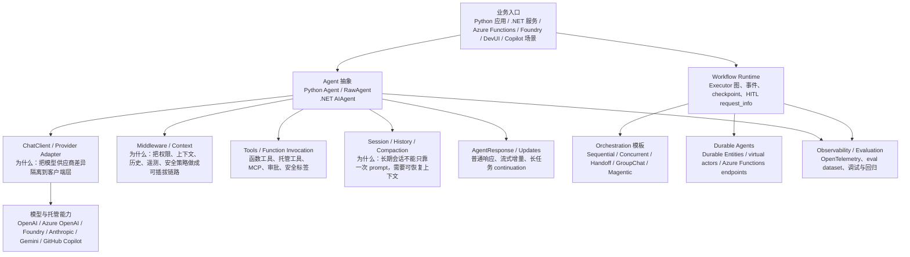
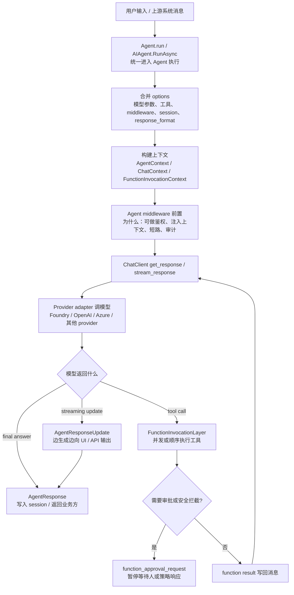
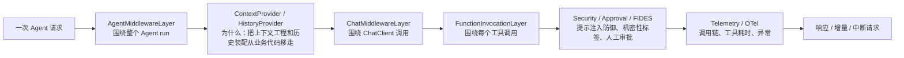
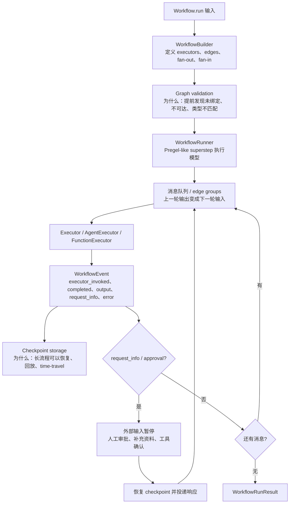
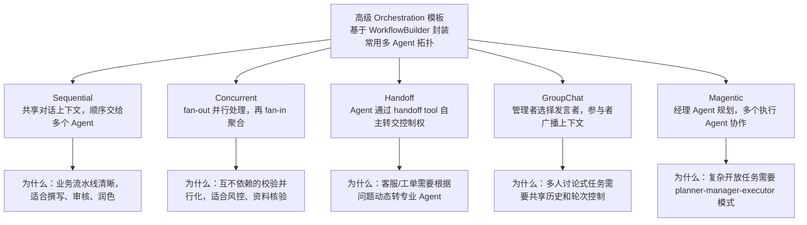
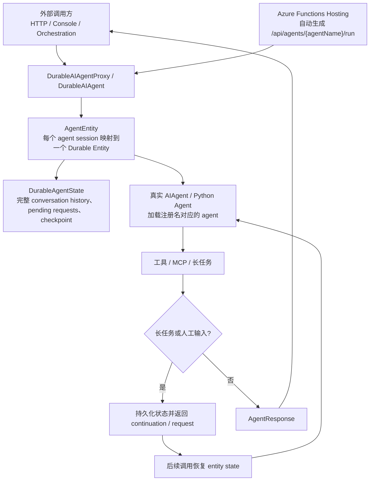
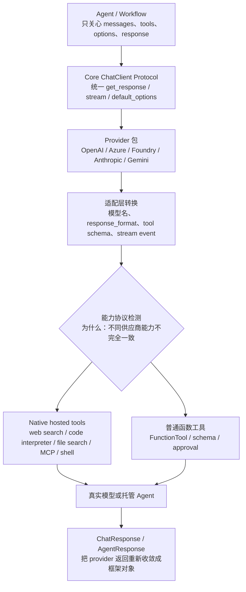
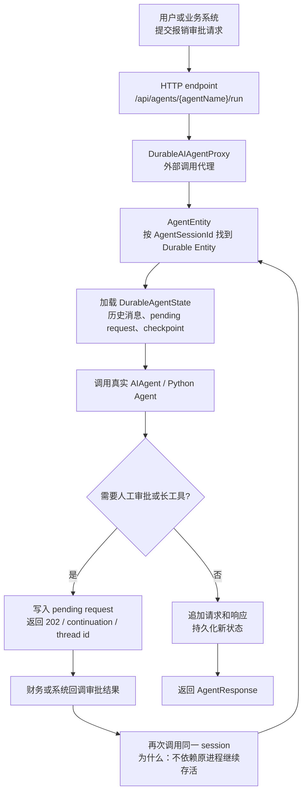
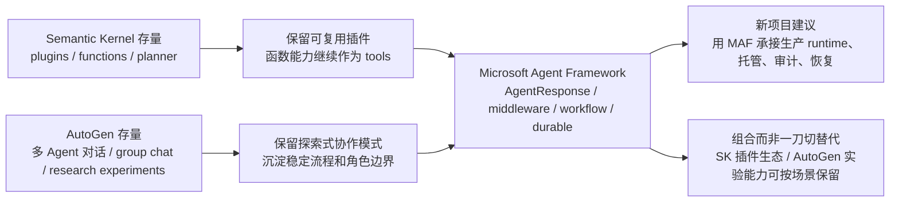
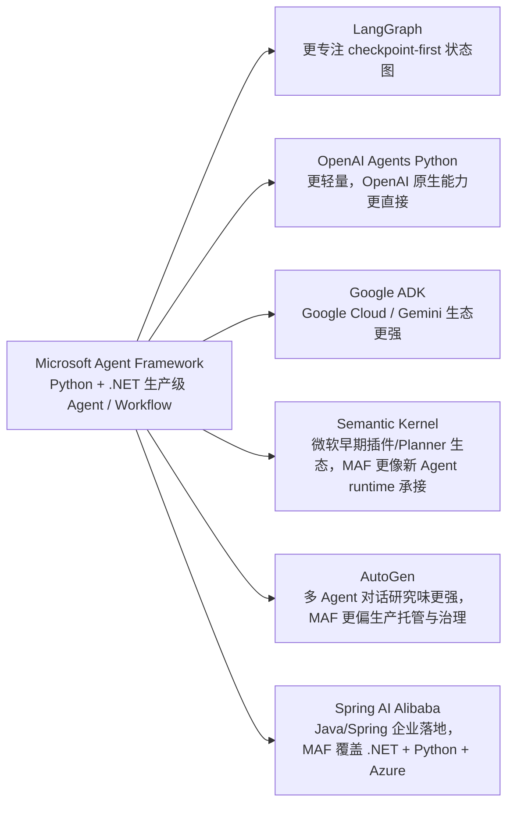

# Microsoft Agent Framework 源码分析

源码版本：
- 仓库：`microsoft/agent-framework`
- 本地源码：`sources/agent-framework`
- 当前提交：`23bfa4957521c50326ad68daee93c9f5b251f38c`
- 标签描述：`dotnet-1.13.0-47-g23bfa4957`

## 1. 一句话定位

Microsoft Agent Framework 是一个面向生产环境的多语言 Agent / Workflow 框架。它不是只封装一次 LLM 调用，而是把 Python Agent、.NET `AIAgent`、ChatClient/provider adapter、middleware、tools、session、streaming、workflow、orchestration、durable agents、hosting、observability、evaluation 和微软生态入口放进同一套工程。

为什么这么设计：企业里的 Agent 通常不是“问模型一句话”就结束，而是要接入不同模型供应商、跑多步流程、等待人工审批、记录审计链路、支持流式 UI、支持长任务恢复，还要能在 Python 和 .NET 服务里复用。MAF 的源码把这些能力拆成 Agent、ChatClient、Middleware、Workflow、Durable Hosting 几层，目的是让简单 Agent 仍然容易写，复杂生产流程也能逐步加治理能力。

## 2. 总体架构图

见图源：[architecture.mmd](architecture.mmd)。



## 3. 源码分层

| 层级 | 关键文件 | 作用 |
| --- | --- | --- |
| Python Agent API | `python/packages/core/agent_framework/_agents.py` | `BaseAgent`、`RawAgent`、`Agent`、工具合并、session run、Agent as tool |
| Python ChatClient | `python/packages/core/agent_framework/_clients.py` | `BaseChatClient`、工具/中间件默认选项、provider 能力协议 |
| Python Middleware | `python/packages/core/agent_framework/_middleware.py` | `AgentContext`、`ChatContext`、`FunctionInvocationContext`、Agent/Chat middleware layer |
| Python Tools | `python/packages/core/agent_framework/_tools.py` | FunctionTool、FunctionInvocationLayer、并发工具执行、approval / termination |
| Python Session | `python/packages/core/agent_framework/_sessions.py` | `SessionContext`、history、工具和 middleware 扩展 |
| Python Workflow | `python/packages/core/agent_framework/_workflows/*` | `Workflow`、`WorkflowBuilder`、runner、events、checkpoint、context |
| Python Orchestrations | `python/packages/orchestrations/agent_framework_orchestrations/*` | sequential、concurrent、handoff、group chat、magentic 等高级模板 |
| .NET Agent | `dotnet/src/Microsoft.Agents.AI.Abstractions/*` | `AIAgent`、`AgentResponse`、`AgentResponseUpdate`、`AgentRunOptions` |
| .NET Workflow | `dotnet/src/Microsoft.Agents.AI.Workflows/*` | `Workflow`、`WorkflowBuilder`、`WorkflowRunner`、checkpoint、external request |
| Durable / Hosting | `docs/features/durable-agents/README.md`、durabletask / Azure Functions 包 | Durable Entity、virtual actor、HTTP endpoint、长任务恢复 |

## 4. Agent 主流程

见图源：[agent-run-flow.mmd](agent-run-flow.mmd)。



源码证据：
- `python/packages/core/agent_framework/_agents.py:214` 定义 `SupportsAgentRun` 协议，说明 Agent 只需要暴露 `run` 语义即可被编排层使用。
- `python/packages/core/agent_framework/_agents.py:353` 定义 `BaseAgent`，`_agents.py:662` 定义 `RawAgent`，`_agents.py:1683` 定义更高层 `Agent`。
- `_agents.py:103-142` 负责工具规范化和 options 合并，体现“默认配置 + 单次调用覆盖”的设计。
- `python/packages/core/agent_framework/_clients.py:217` 定义 `BaseChatClient`，注释说明它负责消息准备和工具规范化，但不直接把 middleware 混在基础抽象里。
- `_clients.py:578-651` 把 `tools`、`response_format`、`middleware` 放进 client 默认选项。
- `.NET` 侧 `dotnet/src/Microsoft.Agents.AI.Abstractions/AIAgent.cs:38` 定义 `AIAgent`，`RunAsync` / `RunStreamingAsync` 重载集中在 `251-502`，说明 C# 侧也用统一 Agent 抽象承接普通和流式调用。

## 5. Provider Adapter 与模型能力

MAF 的 provider 设计更偏“provider-leading client”：核心层定义 ChatClient / Agent / Tool 的共同语义，具体 provider 包负责把 Foundry、Azure OpenAI、OpenAI、Anthropic、Gemini、GitHub Copilot 等能力转成统一接口。

源码证据：
- `_clients.py:668`、`698`、`728`、`758`、`789`、`819` 分别定义 code interpreter、web search、image generation、MCP、file search、shell 等 provider/tool capability protocol。
- `docs/decisions/0021-provider-leading-clients.md` 记录 provider-leading clients 决策，说明为什么把 OpenAI/Foundry 等包拆出去，而不是让 core 依赖所有 provider。

为什么这么设计：模型供应商在工具格式、结构化输出、托管文件搜索、MCP、shell/code interpreter 支持上差异很大。如果把差异塞进 Agent loop，Agent 会变成 provider switch；拆到 ChatClient 后，Agent/Workflow 可以保持稳定，provider 演进也不会把核心运行时拖乱。

## 6. Middleware / Context / Session

见图源：[middleware-flow.mmd](middleware-flow.mmd)。



源码证据：
- `_middleware.py:72` 定义 `MiddlewareTermination`，允许 middleware 主动终止后续执行。
- `_middleware.py:93`、`204`、`373` 分别定义 `AgentContext`、`FunctionInvocationContext`、`ChatContext`。
- `_middleware.py:1104` 定义 `ChatMiddlewareLayer`，`_middleware.py:1254` 定义 `AgentMiddlewareLayer`。
- `_sessions.py:161` 定义 `SessionContext`，`_sessions.py:272`、`289-318` 支持 session 级扩展 tools 和 middleware。
- `docs/decisions/0016-python-context-middleware.md` 说明 Python ContextProvider / HistoryProvider / SessionContext 的设计动机。
- `docs/decisions/0007-agent-filtering-middleware.md` 说明 agent filtering middleware 为什么被抽成链路。

为什么这么设计：企业 Agent 的“横切关注点”很多，鉴权、脱敏、上下文压缩、审计、提示注入防御、工具审批都不应该散落在业务 Agent 代码里。middleware-first 让这些能力可插拔，也让框架能在 Python 和 .NET 上用相近模式表达治理逻辑。

## 7. Tools / 审批 / 安全

工具系统承担三件事：把本地函数或外部工具变成模型可见 schema；执行模型返回的 tool call；在执行前后接入 middleware、安全标签、approval 和 telemetry。

源码证据：
- `_tools.py:560-581` 暴露工具 `invoke` 协议。
- `_tools.py:1428` 附近的注释明确 `MiddlewareTermination` 可由 middleware 触发，工具层需要把它向上冒泡。
- `_tools.py:1738-1761` 对并发工具调用做 termination handling。
- `security.py:1278-1281` 处理 `function_approval_request`，说明安全策略可把工具调用转成审批请求。
- `security.py:1661-1678` 的 `approval_on_violation` 设计支持“违规时请求审批而不是直接阻断”。
- `docs/decisions/0024-prompt-injection-defense.md` 记录 FIDES deterministic prompt injection defense。

为什么这么设计：工具是 Agent 最容易造成真实副作用的地方。MAF 没有把工具当作普通 Python/C# 函数直接裸调，而是把 tool call 放进 FunctionInvocationContext、middleware、安全标签和 approval 流程中，便于做审计、暂停、人工确认和提示注入防御。

## 8. Workflow Runtime

见图源：[workflow-flow.mmd](workflow-flow.mmd)。



源码证据：
- `_workflows/_workflow.py:103` 定义 `WorkflowRunResult`，`_workflow.py:208` 定义 `Workflow`。
- `_workflow.py:218-256` 的文档描述 executor 收消息、处理、路由响应、处理 request_info 的运行方式，接近 Pregel-like superstep。
- `_workflows/_workflow_builder.py:53` 定义 `WorkflowBuilder`，`_workflow_builder.py:91-151` 配置 checkpoint、output、max iterations。
- `_workflows/_runner.py:56-79` 设置 max iterations，`_runner.py:123-179` 在消息未收敛时循环，超限抛出 `WorkflowConvergenceException`。
- `_workflows/_events.py:146` 定义 `WorkflowEvent`，`_events.py:164-181` 列出 executor_invoked、completed、output、request_info 等事件工厂。
- .NET 侧 `WorkflowBuilder.cs:254-369` 提供 `AddEdge`，`406-540` 提供 FanOut/FanIn，`550`、`612` 附近做 unbound/unreachable validation。
- `.NET` `WorkflowSession.cs:176-200` 根据 checkpoint 创建或恢复 run，`WorkflowSession.cs:536` 保存 step completed 的 checkpoint。

为什么这么设计：Agent loop 适合“模型决定下一步”，Workflow 适合“业务流程有明确拓扑”。MAF 把 Workflow 做成 executor 图和事件流，是为了让并发、分支、人工中断、checkpoint、恢复、可视化和验证成为运行时能力，而不是每个业务流程手写一套状态机。

## 9. Orchestration 模板

见图源：[orchestration-flow.mmd](orchestration-flow.mmd)。



源码证据：
- `_sequential.py:63` 定义 `SequentialBuilder`，`_sequential.py:187-225` 解析参与者，`_sequential.py:229-264` 构造 workflow。
- `_concurrent.py:177-181` 说明 ConcurrentBuilder 的 wiring 是 dispatcher -> fan-out -> participants -> fan-in -> aggregator。
- `_handoff.py:566-588` 说明 HandoffBuilder 让 Agent 用 `.add_handoff()` 在多个 Agent 间转交控制权。
- `_handoff.py:929-1008` 构建全连接或配置化 handoff workflow，并把 handoff 工具/middleware 接入 executor。
- `_group_chat.py:97-107` 描述 group chat orchestrator 的循环：保存历史、广播、选择发言者、接收响应、继续广播。
- `_group_chat.py:591` 定义 `GroupChatBuilder`，`_group_chat.py:882-907` 支持 `with_request_info` 人工介入。

## 10. .NET 主线

.NET 不是附属示例，而是 MAF 的并行一等实现。`AIAgent` 把同步结果、流式结果、session、continuation、function invocation 和 workflow 都放到 C# 生态中，适合 ASP.NET、Worker Service、Azure Functions 和企业 .NET 后端。

源码证据：
- `AIAgent.cs:38` 定义抽象基类；`AIAgent.cs:251-366` 是非流式 `RunAsync` 重载和 `RunCoreAsync`；`AIAgent.cs:382-502` 是流式 `RunStreamingAsync` 重载和 `RunCoreStreamingAsync`。
- `AgentResponse.cs:28`、`AgentResponseUpdate.cs:35` 分别定义最终响应和流式增量；`AgentRunOptions.cs:48-53` 提到 background / continuation token。
- `FunctionInvocationDelegatingAgent.cs:15-61` 通过 delegating agent 包装 function middleware 到 ChatClient factory，说明 .NET 侧也把工具调用做成可插拔链路。
- `AgentExtensions.cs:38-89` 把 `AIAgent` 转成 `AIFunction`，体现 Agent-as-tool 设计。

## 11. Durable Agents / Hosting

见图源：[durable-flow.mmd](durable-flow.mmd)。



源码证据：
- `docs/features/durable-agents/README.md:21` 说明 Durable agents 基于 Durable Entities / virtual actors，每个 agent session 对应一个 entity instance。
- 同文档 `47-55` 列出 .NET 核心类型：`DurableAIAgent`、`DurableAIAgentProxy`、`AgentEntity`、`DurableAgentSession`。
- `60-68` 列出 Python 侧 `agent-framework-durabletask`、`DurableAIAgentWorker`、`DurableAIAgentClient`、`AgentEntity`。
- `72-77` 说明 Azure Functions hosting 会生成 `/api/agents/{agentName}/run`。

为什么这么设计：普通 Agent session 解决“当前进程里的上下文”，Durable Agents 解决“进程重启、长任务、外部等待、serverless 托管”问题。把 session 映射成 Durable Entity，等于把每个 Agent 会话变成一个可持久化 virtual actor。

## 12. 真实例子：企业报销审批 Agent

场景：员工提交报销单，系统需要查政策、验发票、验预算、判断风险，必要时暂停给财务审批，最后写回 ERP。

MAF 里的落地方式：
1. 入口用 Azure Functions 或自研 API 接收报销单，调用 Durable Agent endpoint。
2. Triage Agent 判断报销类型、金额和风险等级。
3. Sequential orchestration 先做“政策检索 -> 信息抽取 -> 风险摘要”。
4. Concurrent orchestration 并行跑发票校验、预算校验、合规校验。
5. 发现高风险时通过 `request_info` 或 function approval 暂停，等待财务人员确认。
6. Durable Agent 保存会话和 checkpoint，即使审批隔天才回来也能继续。
7. middleware 统一记录审计、脱敏、提示注入防御和 OpenTelemetry trace。
8. Evaluation 用固定报销样例评估工具调用是否正确、拒绝理由是否符合公司政策。

这能解释源码为什么要拆这些层：Agent 负责智能判断，Workflow 负责流程拓扑，Middleware 负责治理，Durable 负责长任务恢复，Evaluation 负责质量闭环。

## 13. 代码片段作证：核心抽象不是口号

下面几段代码能证明 MAF 的设计不是文档层口号，而是直接落在类层级、协议层级和运行入口里。

### 13.1 Python：RawAgent 与 Agent 分层

```python
class RawAgent(BaseAgent, Generic[OptionsCoT]):
    """A Chat Client Agent without middleware or telemetry layers.

    This is the core chat agent implementation. For most use cases,
    prefer :class:`Agent` which includes all standard layers.
    """

class Agent(
    AgentMiddlewareLayer,
    AgentTelemetryLayer,
    RawAgent[OptionsCoT],
    Generic[OptionsCoT],
):
```

源码证据：`python/packages/core/agent_framework/_agents.py:662-666`、`1683-1687`。

为什么这么设计：`RawAgent` 给框架保留“最薄执行内核”，`Agent` 再叠 middleware 和 telemetry。这样既能给高级用户留出低层扩展点，也能让普通生产使用默认带治理能力。

### 13.2 Python：ChatClient 是 provider adapter 的共同入口

```python
class SupportsChatGetResponse(Protocol[OptionsContraT]):
    """A protocol for a chat client that can generate responses."""

    def get_response(...):
        ...

def create_agent(
    ...,
    tools: ToolTypes | Callable[..., Any] | Sequence[...] | None = None,
    default_options: OptionsCoT | Mapping[str, Any] | None = None,
    middleware: Sequence[MiddlewareTypes] | None = None,
) -> Agent[OptionsCoT]:
```

源码证据：`python/packages/core/agent_framework/_clients.py:85-97`、`578-605`、`646-651`。

为什么这么设计：Agent 不直接依赖 OpenAI、Foundry 或 Anthropic SDK，而是依赖结构化协议。provider 包只要实现 `get_response`、工具转换和 options 映射，就能进入统一 Agent/Workflow 流程。

### 13.3 .NET：公开 RunAsync 委托给 RunCoreAsync

```csharp
public Task<AgentResponse> RunAsync(
    IEnumerable<ChatMessage> messages,
    AgentSession? session = null,
    AgentRunOptions? options = null,
    CancellationToken cancellationToken = default)
{
    CurrentRunContext = new(this, session, messages as IReadOnlyCollection<ChatMessage> ?? messages.ToList(), options);
    return this.RunCoreAsync(messages, session, options, cancellationToken);
}

protected abstract Task<AgentResponse> RunCoreAsync(...);
```

源码证据：`dotnet/src/Microsoft.Agents.AI.Abstractions/AIAgent.cs:334-366`。

为什么这么设计：公开 API 保持统一重载和上下文设置，具体 Agent 只实现核心执行逻辑。这样 .NET 侧也能像 Python 一样把 session、options、streaming、middleware 包装在统一入口周围。

### 13.4 Agent-as-tool：Agent 可以降级成函数

```csharp
public static AIFunction AsAIFunction(this AIAgent agent, ...)
{
    var response = await agent.RunAsync(query, session: session, options: agentRunOptions, cancellationToken: cancellationToken);
    return response.Text;
}
```

源码证据：`dotnet/src/Microsoft.Agents.AI/AgentExtensions.cs:67-82`。

为什么这么设计：复杂系统里一个 Agent 经常要被另一个 Agent 调用。MAF 把 Agent 转成 `AIFunction`，等于把“多 Agent 协作”收敛到工具调用模型，减少一套额外协议。

## 14. Provider Adapter 细节：为什么强调 provider-leading

见图源：[provider-adapter-detail.mmd](provider-adapter-detail.mmd)。



Provider adapter 这一层重点做四件事：
1. **隔离依赖**：`docs/decisions/0021-provider-leading-clients.md:17` 明确要求 core 只包含抽象、middleware infrastructure 和 telemetry，不放 provider-specific code 或依赖。
2. **统一命名与发现**：同 ADR `34-41` 把 OpenAI / Azure / Foundry 的客户端命名和 `model` 参数收敛，降低不同后端之间的迁移成本。
3. **统一工具边界**：`_clients.py:668`、`698`、`728`、`758`、`789`、`819` 分别定义 code interpreter、web search、image generation、MCP、file search、shell 的能力协议。
4. **统一输出形态**：`_clients.py:346-363` 用 `response_format` finalizer 把流式 update 汇总成 `ChatResponse`，避免上层直接处理 provider-specific event。

可以这样理解：MAF 不是把所有 provider “抹平到最低公分母”，而是把共同部分放进 ChatClient，把差异能力用 capability protocol 暴露出来。上层 Agent 可以写得统一，但仍能按 provider 能力启用 native tool。

## 15. Durable Agents 实战恢复链路

见图源：[durable-resume-practice.mmd](durable-resume-practice.mmd)。



真实恢复过程可以按“报销审批隔天恢复”来讲：
1. 用户提交报销单，请求打到 `/api/agents/{agentName}/run`。
2. `DurableAIAgentProxy` 不直接在当前 HTTP 进程里跑完整 Agent，而是把请求发给对应 `AgentEntity`。
3. `AgentEntity` 根据 `AgentSessionId` 加载 `DurableAgentState`，包括历史消息、已完成步骤和待处理请求。
4. 真实 Agent 做政策判断、预算校验、发票识别。遇到高风险发票时，工具审批或 `request_info` 生成 pending request。
5. HTTP 可返回 202、continuation 或 thread id，原进程可以结束，系统不需要一直占用计算资源。
6. 财务隔天审批后，用同一个 session/thread id 回调；entity 重新加载状态，跳过已经完成的上下文，继续执行后续写回 ERP。
7. 最后 response 和新历史被追加到持久化状态，后续任何 worker 都可以恢复同一会话。

源码证据：
- `docs/features/durable-agents/README.md:5-14` 对比普通 Agent 与 Durable Agent：普通历史在内存，Durable Agent 持久化历史和执行状态。
- `README.md:21-28` 说明每个 agent session 映射到一个 Durable Entity，entity 加载 `DurableAgentState`、调用底层 `AIAgent`、再持久化更新状态。
- `README.md:52-55` 说明 `.NET` 的 `DurableAIAgentProxy`、`AgentEntity`、`DurableAgentSession` 分工。
- `README.md:74-80` 说明 Azure Functions 自动生成 HTTP endpoint、支持 thread_id、`x-ms-thread-id` 和 fire-and-forget。
- `README.md:127-140` 说明 durable orchestration 会 checkpoint，失败重放时已完成 agent call 不会重复执行。

为什么这么设计：长任务 Agent 最大的问题不是“能不能调用模型”，而是“调用过程中人不回复、进程重启、worker 扩缩容、工具耗时很长时状态还在不在”。Durable Entity 把一次会话变成可持久化 actor，解决的是生产运行稳定性。

## 16. Semantic Kernel / AutoGen 迁移关系

见图源：[migration-map.mmd](migration-map.mmd)。



迁移关系不要讲成“MAF 完全替代 SK/AutoGen”，更准确的口径是：

| 来源 | 存量资产 | 迁移到 MAF 时怎么处理 | 不建议迁移的情况 |
| --- | --- | --- | --- |
| Semantic Kernel | plugins、functions、planner、企业 .NET 集成 | 把稳定函数能力包装为 tools，把新 Agent 入口迁到 `AIAgent` / middleware / workflow / durable | 只是已有 SK 插件调用，没有长任务、托管、审计、workflow 诉求 |
| AutoGen | 多 Agent 对话、GroupChat、研究型实验、角色协作 prompt | 把已经稳定的角色边界沉淀成 MAF Agent，把固定协作拓扑放到 orchestration/workflow | 仍在快速探索多 Agent 协作策略，需要高自由度对话实验 |
| 新项目 | 没有历史包袱 | 优先用 MAF 建 Agent runtime，再按 provider 和 hosting 选择实现 | 只做一次性脚本或单 provider 轻量 demo |

分享时可以这样说：SK 更像“应用内 AI kernel 与插件生态”，AutoGen 更像“多 Agent 协作实验场”，MAF 则更像“微软把 AgentResponse、middleware、workflow、durable hosting、observability/eval 收拢后的生产 runtime”。所以迁移策略是：稳定能力迁到 MAF 的工具和 workflow，实验性对话可继续保留 AutoGen 思路，存量 SK 插件按收益逐步迁移。

## 17. 对比分析

见图源：[comparison-flow.mmd](comparison-flow.mmd)。



| 对比对象 | MAF 的优势 | MAF 的边界 |
| --- | --- | --- |
| LangGraph | Python + .NET 双语、provider/hosting/durable/eval/OTel 更平台化 | 状态图纯度、生态成熟度和 LangChain 组合上，LangGraph 仍更专注 |
| OpenAI Agents Python | 生产治理、workflow、durable、.NET/Azure 入口更完整 | 如果只用 OpenAI 原生 Responses / Realtime / sandbox，OpenAI Agents 更轻 |
| Google ADK | 微软生态、.NET、Azure Functions、Foundry/Copilot 入口更自然 | Google Cloud / Vertex / Gemini 原生体验 ADK 更顺 |
| AutoGen | 更偏生产运行时、hosting、durable、workflow 模板 | 开放式多 Agent 研究、对话实验 AutoGen 更灵活 |
| Semantic Kernel | MAF 更聚焦现代 AgentResponse、middleware、workflow、durable | SK 现有插件/企业存量生态仍需要迁移评估 |

## 18. 核心设计思想

1. **多语言一致抽象**：Python `Agent` 和 .NET `AIAgent` 都围绕 run、stream、session、tools、response 建模，降低跨语言团队理解成本。
2. **Provider-leading adapter**：供应商差异放进 ChatClient / provider 包，Agent 和 Workflow 不直接绑定模型 SDK。
3. **Middleware-first 治理**：鉴权、上下文、历史、工具审批、安全、遥测通过 middleware 插入，而不是污染业务 Agent。
4. **Workflow 与 Agent 分层**：Agent 处理智能决策，Workflow 处理确定拓扑、并发、checkpoint 和 HITL。
5. **Durable-first 生产路径**：长任务不是靠内存等待，而是通过 Durable Entity / checkpoint / continuation 恢复。
6. **事件化与可观测**：响应、流式增量、workflow event、trace、eval 让 Agent 不再是黑盒。

## 19. 分享口径

开场可以这样讲：

> Microsoft Agent Framework 解决的不是“怎么快速调一个模型”，而是“一个企业 Agent 怎么从本地开发走到生产运行”。它把 Agent、工具、模型适配、middleware、workflow、durable hosting 和评测治理都放在同一套框架里，而且 Python 和 .NET 都是一等实现。

三条主线：
1. **Agent 主线**：用户输入进入 Agent，Agent 通过 ChatClient 调模型，模型可能返回答案、工具调用或流式更新；middleware 和 session 贯穿全程。
2. **Workflow 主线**：复杂业务不是无限循环，而是 executor 图、事件流、checkpoint、HITL 和 orchestration 模板。
3. **生产治理主线**：工具审批、安全标签、提示注入防御、OpenTelemetry、Evaluation、Durable Agents 和 Azure Functions 才是它区别于轻量 SDK 的关键。

总结一句：MAF 最适合讲成“微软生态下的生产级 Agent runtime”，它比轻量 SDK 更重，比纯状态图框架更平台化，适合 Python/.NET 团队把 Agent 做成长期可运行、可恢复、可审计的服务。
