# AgentScope 源码分析

源码路径：`sources/agentscope`

固定提交：`39efe8af2b56f5121e8ddaf5f4755e3ecfd723a7`

提交说明：`fix(formatter): include tool_name in ollama tool result messages (#2006)`

## 1. 一句话定位

AgentScope 是一个偏生产级的 Python Agent runtime 和服务框架。它不只是把“模型 + 工具”包一层，而是把事件流、权限系统、人审/外部执行、middleware、RAG、长期记忆、workspace/sandbox、多会话服务都放在 Agent 主循环周围。

如果用一句话讲给别人听：AgentScope 适合做“可服务化、可审计、可暂停恢复、可接入工作区和知识库的 Agent 后端”。

## 2. 总体架构

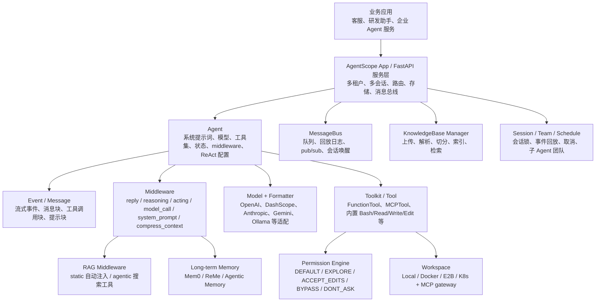

为什么这样设计：AgentScope 把“智能体自己思考和行动”与“生产系统如何控制、观察、隔离它”拆开。`Agent` 负责推理-行动循环，`Middleware` 负责横切扩展，`PermissionEngine` 负责副作用治理，`Workspace` 负责执行边界，`App` 和 `MessageBus` 负责服务化和多会话。

## 3. 源码分层

| 层级 | 关键目录 / 文件 | 作用 |
| --- | --- | --- |
| Agent runtime | `src/agentscope/agent/_agent.py` | 核心回复循环、模型调用、工具执行、人审/外部执行恢复 |
| Event / Message | `src/agentscope/event`、`src/agentscope/message` | 把流式文本、thinking、tool call、tool result、HITL 都变成事件和消息块 |
| Middleware | `src/agentscope/middleware/_base.py` | 在 reply、reasoning、acting、model_call、system_prompt、compress_context 插入扩展 |
| Tool / Permission | `src/agentscope/tool`、`src/agentscope/permission` | 函数工具、MCP 工具、内置代码/文件工具，以及模式化权限判断 |
| Model / Formatter | `src/agentscope/model`、`src/agentscope/formatter` | 多 provider 适配与消息格式转换 |
| RAG / Memory | `src/agentscope/rag`、`src/agentscope/middleware/_rag.py`、`_longterm_memory` | 知识库检索和长期记忆接入 |
| Workspace | `src/agentscope/workspace` | local、Docker、E2B、K8s 工作区和沙箱内 MCP gateway |
| App service | `src/agentscope/app` | FastAPI 服务、路由、存储、消息总线、session、workspace、知识库管理 |

## 4. 主流程：一次 Agent 回复怎么跑

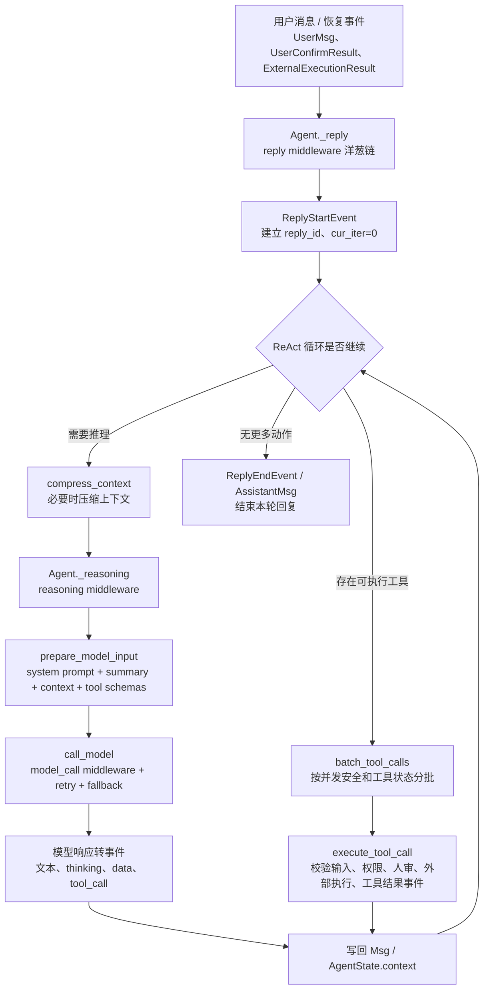

源码证据：

- `src/agentscope/agent/_agent.py:97-113`：`Agent` 构造函数接收 `model`、`toolkit`、`middlewares`、`state`、`offloader`、`model_config`、`context_config`、`react_config`。
- `src/agentscope/agent/_agent.py:155-157`：每个 Agent 持有 `PermissionEngine(self.state.permission_context)`。
- `src/agentscope/agent/_agent.py:555-603`：`_reply` 会先走 `on_reply` middleware 洋葱链，再进入 `_reply_impl`。
- `src/agentscope/agent/_agent.py:714-745`：`_reply_impl` 按“检查输入 -> 处理事件/消息 -> 进入 reasoning-acting 循环”推进。
- `src/agentscope/agent/_agent.py:973-1009`：`_reasoning_impl` 先发 `ModelCallStartEvent`，准备消息和工具 schema，再调用模型。
- `src/agentscope/agent/_agent.py:2288-2308`：模型输入由 system prompt、summary、context、tool schemas 组成。

## 5. Tool + Permission + HITL

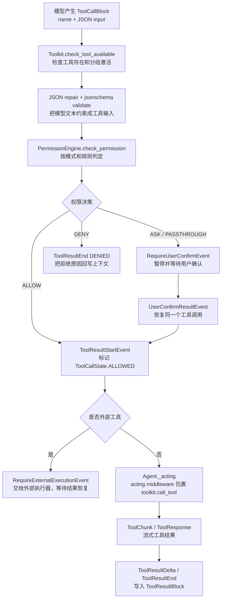

为什么这样设计：生产级 Agent 最大风险不是“能不能调用工具”，而是“谁允许它调用、调用参数是否可信、外部系统如何接管、被拒绝或中断后上下文怎么闭合”。AgentScope 把工具执行拆成输入校验、权限判断、HITL、外部执行、工具结果事件几个阶段，便于审计和恢复。

源码证据：

- `src/agentscope/agent/_agent.py:1563-1582`：`_execute_tool_call` 的注释明确说明它处理输入校验、权限检查、事件发射、上下文写入，真正 I/O 通过 `_acting` 交给 middleware hook。
- `src/agentscope/agent/_agent.py:1602-1623`：工具输入先 JSON repair，再用工具 schema 做 `jsonschema.validate`。
- `src/agentscope/agent/_agent.py:1640-1652`：工具执行前调用 `PermissionEngine.check_permission`。
- `src/agentscope/agent/_agent.py:1658-1675`：`ASK / PASSTHROUGH` 会发 `RequireUserConfirmEvent` 并暂停。
- `src/agentscope/agent/_agent.py:1701-1705`：外部工具会先发 `RequireExternalExecutionEvent`，让外部执行器接管。
- `src/agentscope/permission/_engine.py:77-115`：权限检查按 `DEFAULT / EXPLORE / ACCEPT_EDITS / BYPASS / DONT_ASK` 分派。
- `src/agentscope/permission/_engine.py:117-194`：默认模式按 deny、ask、工具自检、allow、默认 ask 的顺序判定。
- `src/agentscope/permission/_engine.py:196-259`：EXPLORE 模式只允许 read-only 调用，修改类操作直接拒绝。

## 6. Middleware：横切扩展点

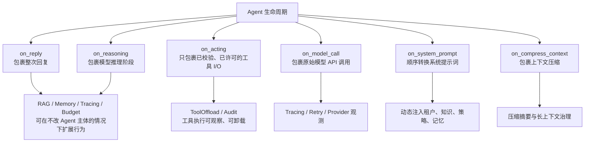

源码证据：

- `src/agentscope/middleware/_base.py:12-28`：注释明确把 middleware 分成 onion pattern hooks 和 transformer pattern hook。
- `src/agentscope/middleware/_base.py:65-89`：`on_reply` 包裹整次回复。
- `src/agentscope/middleware/_base.py:91-112`：`on_reasoning` 包裹推理阶段。
- `src/agentscope/middleware/_base.py:114-154`：`on_acting` 只包裹已校验、已许可的工具 I/O。
- `src/agentscope/middleware/_base.py:160-187`：`on_model_call` 包裹原始模型调用。
- `src/agentscope/middleware/_base.py:211-220`：`on_system_prompt` 是顺序转换管线。

设计思想：AgentScope 没有把 RAG、记忆、追踪、预算控制、TTS、工具卸载都塞进 `Agent` 主类，而是让它们通过生命周期 hook 插入。这是典型的 middleware / chain-of-responsibility / decorator 组合。

## 7. RAG 与长期记忆

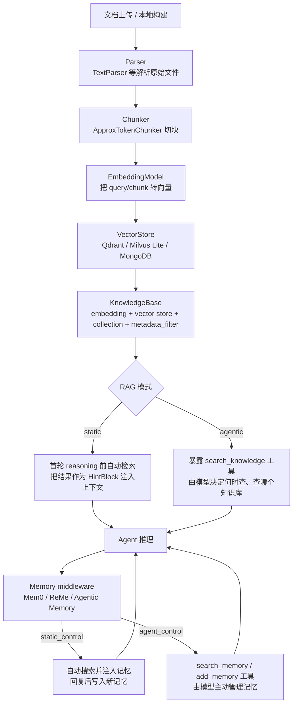

源码证据：

- `src/agentscope/middleware/_rag.py:10-21`：RAG middleware 支持 `agentic` 和 `static` 两种模式。
- `src/agentscope/middleware/_rag.py:27-30`：文档索引不是 middleware 职责，parser、chunker、embedding、insert 属于调用方或服务层知识库管理器。
- `src/agentscope/middleware/_rag.py:105-120`：agentic 模式暴露 `search_knowledge` 工具，而且标记为 read-only、concurrency-safe。
- `src/agentscope/middleware/_rag.py:196-215`：工具 schema 会把可选知识库枚举收窄到当前绑定的知识库名，减少模型幻觉。
- `src/agentscope/rag/_knowledge.py:4-17`：`KnowledgeBase` 是 embedding model + vector store + scope 的运行时句柄。
- `src/agentscope/rag/_knowledge.py:25-31`：`metadata_filter` 是多租户/多知识库共用物理 collection 时的防御性隔离。

为什么这样设计：RAG 在 AgentScope 里不是一个单独“问答链”，而是 Agent runtime 的上下文增强能力。static 模式适合客服/知识问答，agentic 模式适合复杂任务中由模型自己决定检索时机。长期记忆也同理，既可以自动注入，也可以暴露为工具让 Agent 主动管理。

## 8. Workspace / Sandbox

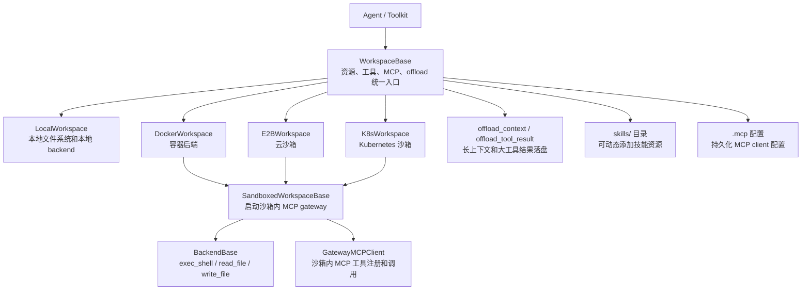

源码证据：

- `src/agentscope/workspace/_base.py:4-23`：Workspace 提供 resources、tools、offload，并服务 Agent、User、Developer 三类消费者。
- `src/agentscope/workspace/_base.py:101-114`：`WorkspaceBase` 管生命周期、目录布局、offload、MCP 持久化、skill 管理。
- `src/agentscope/workspace/_sandboxed_base.py:5-17`：Docker/E2B/K8s 这类沙箱工作区复用 in-sandbox MCP gateway 的模板方法生命周期。
- `src/agentscope/workspace/_sandboxed_base.py:165-180`：初始化时 provision backend，再启动/恢复 gateway。

设计思想：Workspace 把“Agent 能看见和操作的世界”抽象成统一资源边界。Local、Docker、E2B、K8s 的差异被压到 backend/gateway 层，Agent 和工具层不需要关心实际执行环境。

## 9. 服务模式：多会话、多租户、事件回放

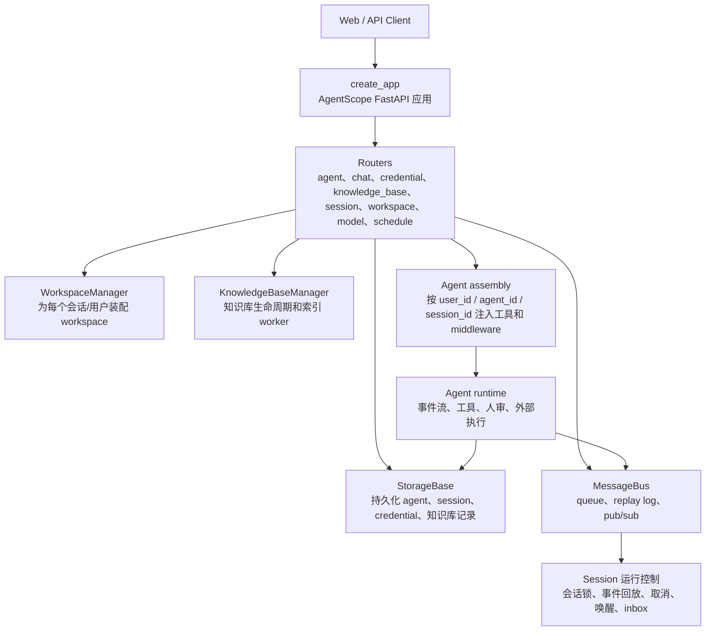

源码证据：

- `src/agentscope/app/_app.py:42-60`：`create_app` 接收 storage、message_bus、workspace_manager、knowledge_base_manager 等服务化依赖。
- `src/agentscope/app/_app.py:61-85`：注释说明它既可独立运行，也可挂载到已有 FastAPI app。
- `src/agentscope/app/_app.py:151-167`：可以按 `user_id / agent_id / session_id` 注入额外 middleware 和工具，适合多租户权限、审计、集成差异。
- `src/agentscope/app/message_bus/_base.py:4-15`：MessageBus 是 live transport，故意和持久化 Storage 分离。
- `src/agentscope/app/message_bus/_base.py:16-41`：MessageBus 提供 drain queue、replay log、transient broadcast 三类语义。

为什么这样设计：Agent 服务不是一次函数调用。真实业务会有 SSE 事件回放、会话取消、后台唤醒、团队协作、知识库索引、租户隔离。AgentScope 把这些放到 App 和 MessageBus 层，而不是塞进模型调用函数。

## 10. 真实例子：企业研发助手

场景：公司想做一个研发助手，能读内部文档、查项目代码、在沙箱里跑命令，并且高风险操作需要人工确认。

对应链路：

1. 用户在 Web UI 提问：“分析订单服务最近失败的原因，必要时给出补丁建议。”
2. 请求进入 AgentScope App 的 `chat` 路由，绑定当前 `user_id / session_id / workspace_id`。
3. App 装配 Agent：模型、内置文件/命令工具、RAG middleware、Mem0/ReMe memory、权限上下文。
4. `RAGMiddleware` 先检索“订单服务排障手册”，以 `HintBlock` 注入上下文。
5. 模型产生 `Grep` / `Read` / `Bash` 工具调用。
6. `PermissionEngine` 允许 read-only 命令，遇到 `Edit` / `Write` 或危险 Bash 时发 `RequireUserConfirmEvent`。
7. 允许后，工具在 Workspace/Sandbox 里执行，结果流式写回 `ToolResultBlock`。
8. Agent 汇总分析和补丁建议；所有模型调用、工具调用、人审事件都能通过 event/message 复盘。

这能解释 AgentScope 的核心价值：它把“Agent 会做事”升级成“Agent 在可控工作区里、带权限和事件证据地做事”。

## 11. 横向对比

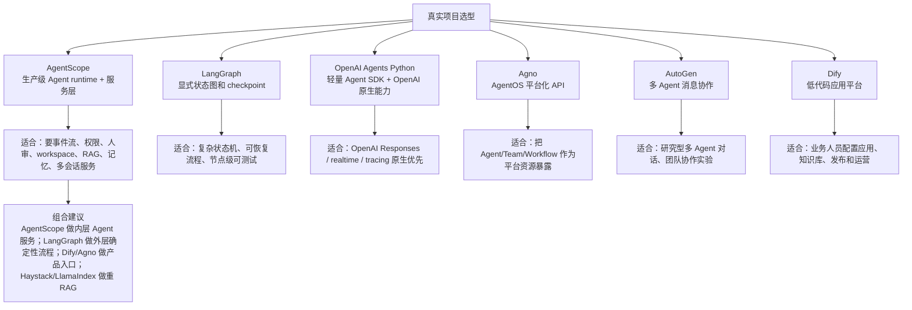

| 对比对象 | AgentScope 更强的点 | 对方更强的点 |
| --- | --- | --- |
| LangGraph | 更像完整 Agent 服务后端：事件、权限、workspace、RAG、记忆、多会话都有现成结构 | 显式状态图、checkpoint、复杂流程恢复更强 |
| OpenAI Agents Python | provider 更开放，内置服务层/workspace/permission 更突出 | OpenAI Responses、Realtime、Tracing 原生生态更直接 |
| Agno | 更强调事件/权限/workspace/sandbox 和服务内核 | AgentOS 平台化入口、API 暴露、run/session 管理体验更产品化 |
| AutoGen | 更偏生产执行边界，而不是只做多 Agent 对话 | 多 Agent 消息协作、研究型团队对话更成熟 |
| Dify | 代码优先，适合自研 Agent 后端和沙箱执行 | 低代码应用配置、知识库运营、发布和权限 UI 更完整 |
| Haystack / LlamaIndex | 能把 RAG 作为 Agent middleware 接入 | 大规模 ingestion、复杂检索 pipeline、评测和数据连接器更专业 |

## 12. 专题一：Streaming / Event 细节

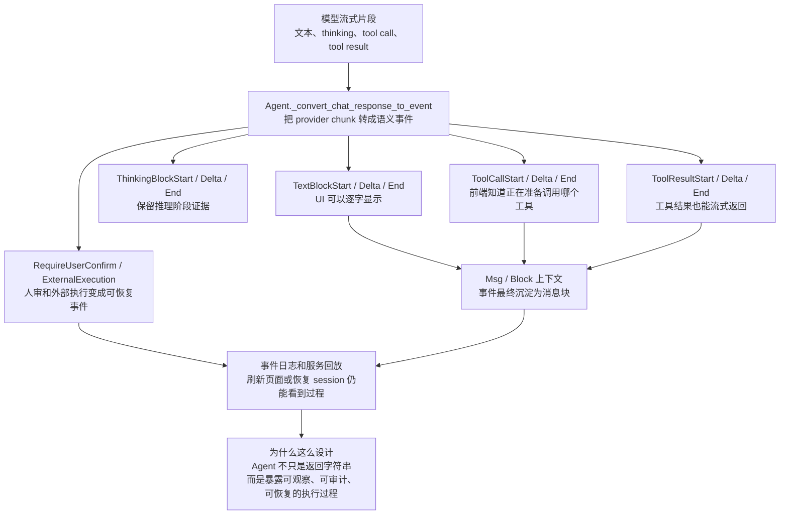

AgentScope 的 streaming 不是简单 token stream，而是语义事件流。源码里 `src/agentscope/event/_event.py` 把事件拆得很细：`ReplyStartEvent` / `ReplyEndEvent` 表示整次回复边界，`ModelCallStartEvent` / `ModelCallEndEvent` 表示模型调用边界，`TextBlockDeltaEvent`、`ThinkingBlockDeltaEvent`、`ToolCallDeltaEvent`、`ToolResultTextDeltaEvent` 等表示不同内容块的增量。

关键入口在 `src/agentscope/agent/_agent.py` 的 `_convert_chat_response_to_event`。模型返回 chunk 后，Agent 不直接把字符串拼完再返回，而是把 chunk 转成 text、thinking、tool call、tool result、HITL、external execution 等事件。这样 UI 可以边跑边展示，服务端可以把事件写入日志，调试时也能知道“现在卡在模型输出、工具调用、人审还是外部执行”。

这背后的设计思想是：生产级 Agent 需要可观察的执行过程。一个客服或研发助手如果只给最终答案，很难做审计、恢复和排障；如果每个阶段都有事件，前端、日志、回放、监控都能复用同一套语义流。

## 13. 专题二：Service Session 细节

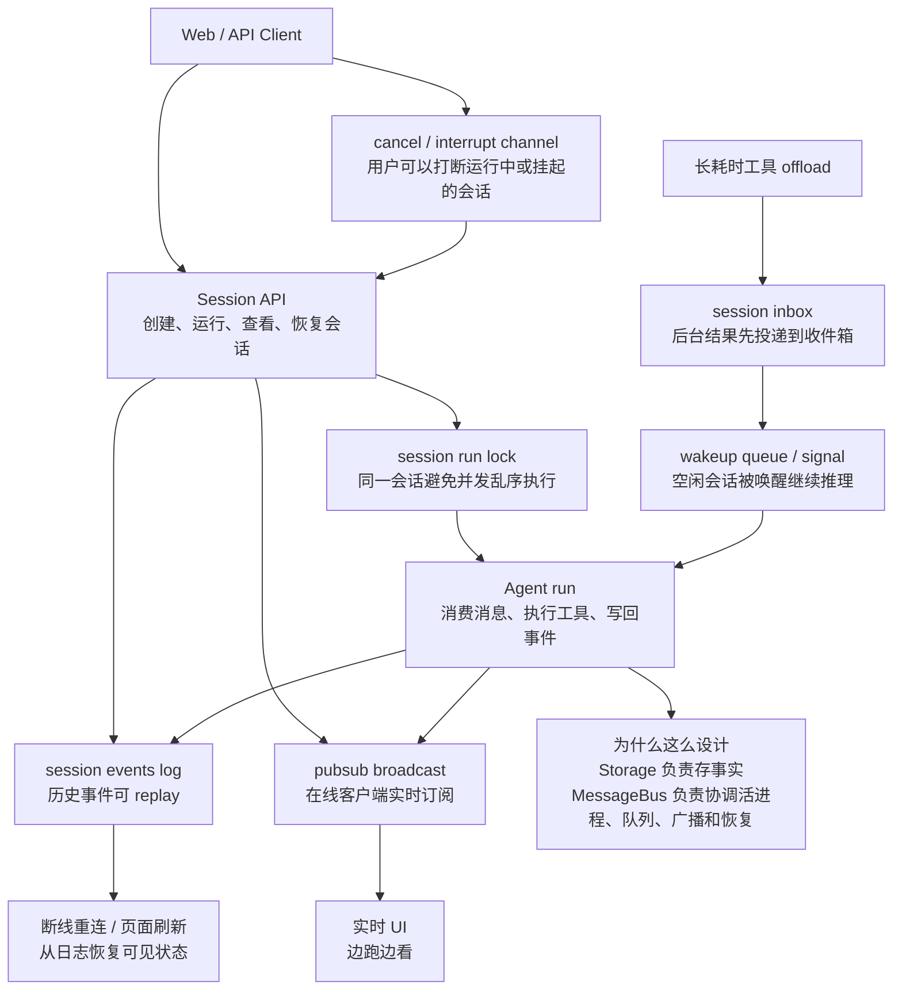

服务模式最容易被低估。AgentScope 的 `MessageBus` 不是数据库的重复实现，而是专门处理“活会话”的协调层。`src/agentscope/app/message_bus/_base.py` 的职责覆盖 queue、log、pubsub、lock：queue 用来传递待处理消息，log 用来回放历史事件，pubsub 用来广播实时事件，lock 用来保证同一 session 不被并发 run 搅乱。

`src/agentscope/app/message_bus/_keys.py` 进一步把 session event log、session run lock、inbox、wakeup queue、cancel/interrupt channel 拆成不同 key。这说明服务层考虑的是多进程、多客户端、长耗时工具、用户打断、断线重连这些生产问题。

一个典型链路是：用户在 Web 页面发起 run，后端拿 session lock，Agent 运行时持续写 event log 并通过 pubsub 推给页面；如果工具 offload 到后台，结果先进入 inbox，再通过 wakeup signal 唤醒空闲 session 继续 reasoning；如果用户点击中断，interrupt channel 会把中断信号送到运行中或挂起的会话。

这背后的设计思想是：Storage 存“事实”，MessageBus 管“过程”。只靠数据库能记录最后结果，但很难处理实时广播、恢复、唤醒和取消；而 Agent 服务化真正麻烦的地方，恰恰在这些过程控制。

## 14. 专题三：Workspace + Permission 真实链路

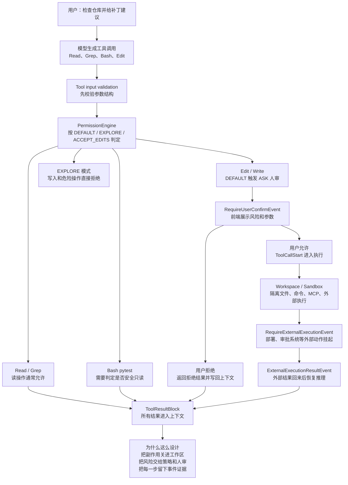

真实例子可以这样讲：用户让研发助手“检查这个仓库为什么测试失败，并给一个补丁建议”。模型可能先调用 `Read`、`Grep` 找代码，再调用 `Bash pytest` 复现问题，最后想调用 `Edit` 或 `Write` 修改文件。

AgentScope 的链路不是“模型想调就调”。`src/agentscope/agent/_agent.py` 里 `_execute_tool_call` 先做 tool input validation，再检查工具是否可用，然后交给 `PermissionEngine`。`src/agentscope/permission/_engine.py` 里不同模式有不同策略：`EXPLORE` 更偏只读，写入类动作会被拒绝；`DEFAULT` 可以对风险动作返回 ASK，让前端通过 `RequireUserConfirmEvent` 让人确认；允许后才进入 workspace/sandbox 执行。

如果工具是外部系统动作，例如部署、发工单、调用审批系统，AgentScope 还可以发出 `RequireExternalExecutionEvent`，让会话挂起等待外部系统结果，再通过 `ExternalExecutionResultEvent` 恢复。最终，允许、拒绝、执行结果都会写成 tool result 并进入上下文。

这背后的设计思想是：AgentScope 把“能力”和“授权”拆开。工具负责能做什么，PermissionEngine 决定能不能做，Workspace/Sandbox 决定在哪里做，Event stream 记录做了什么。这个拆法比把权限判断散落在每个工具里更容易审计和维护。

## 15. 专题四：组合边界图

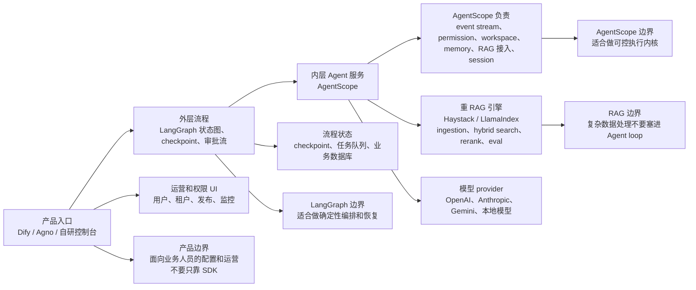

AgentScope 不一定要单独“包打天下”。更稳的组合方式是把它放在内层，负责一个可控 Agent 服务：事件流、权限、人审、workspace、memory、RAG 接入、多会话服务。外层如果有明确的业务流程、审批节点、补偿和恢复需求，可以交给 LangGraph 做状态图和 checkpoint。

如果是企业知识库和复杂检索，Haystack / LlamaIndex 更适合作为重 RAG 数据层，负责 ingestion、chunk、hybrid search、rerank、eval，AgentScope 通过 middleware 或 tool 把检索结果接进 Agent loop。Dify、Agno 或自研控制台更适合作为产品入口，处理用户、租户、发布、运营和可视化配置。

分享时可以强调边界：LangGraph 解决“流程如何稳定走下去”，AgentScope 解决“一个 Agent 在执行时如何被观察、授权、隔离和恢复”，RAG 框架解决“知识如何被处理和检索”，产品平台解决“业务人员如何使用和运营”。这样比单纯比较谁替代谁更贴近真实项目。

## 16. 核心设计思想和范式

### 16.1 事件驱动，而不是只返回字符串

AgentScope 把回复开始、模型调用、文本 delta、tool call、tool result、用户确认、外部执行都建模成事件。这样前端可以流式显示，服务端可以回放，调试时也能定位“卡在模型、权限还是工具”。

### 16.2 Middleware / Chain of Responsibility

`_reply`、`_reasoning`、`_acting`、`_call_model` 都有可插拔链。RAG、memory、tracing、budget control 不需要侵入 Agent 主类。

### 16.3 Policy Object

`PermissionEngine` 把权限模式和规则集中成策略对象。DEFAULT、EXPLORE、ACCEPT_EDITS 等模式各自有独立方法，减少“到处 if 判断”的风险。

### 16.4 Adapter / Formatter

模型适配和消息格式转换分层：AgentScope 内部用统一 `Msg` / block 表示上下文，formatter 再转成 OpenAI、Anthropic、Gemini、Ollama 等 provider 需要的格式。

### 16.5 Template Method

`SandboxedWorkspaceBase` 抽象沙箱工作区生命周期，Docker、E2B、K8s 只实现 provision、teardown、bootstrap 等差异点。

### 16.6 Service Runtime

`create_app`、`MessageBus`、workspace manager、knowledge base manager 说明 AgentScope 的目标不是 demo SDK，而是可嵌入企业后端的 Agent 服务运行时。

## 17. 局限性

- 如果项目核心是复杂确定性状态机、强 checkpoint 和图节点级恢复，LangGraph 仍然更合适。
- 如果目标是业务人员低代码配置和运营 AI 应用，Dify 更直接。
- 如果 RAG ingestion、混合检索、rerank、评测是主战场，Haystack / LlamaIndex 更专业。
- 如果只想快速写 OpenAI 原生 handoff、guardrail、realtime demo，OpenAI Agents Python 更轻。
- AgentScope 覆盖面较宽，分享源码时要抓住主线，否则容易变成模块清单。

## 18. 推荐源码阅读顺序

1. `src/agentscope/agent/_agent.py`：先看 `_reply_impl`、`_reasoning_impl`、`_execute_tool_call`、`_prepare_model_input`、`_call_model`。
2. `src/agentscope/event` 和 `src/agentscope/message`：理解事件如何变成消息块。
3. `src/agentscope/middleware/_base.py`：理解扩展点。
4. `src/agentscope/tool/_toolkit.py`、`src/agentscope/tool/_adapters.py`、`src/agentscope/permission/_engine.py`：理解工具和权限。
5. `src/agentscope/middleware/_rag.py`、`src/agentscope/rag/_knowledge.py`：理解 RAG 接入方式。
6. `src/agentscope/workspace`：理解 local/sandbox 工作区。
7. `src/agentscope/app/_app.py`、`src/agentscope/app/message_bus/_base.py`：理解服务化。

## 19. 分享口径

开场可以这样讲：

> AgentScope 的源码重点不是“它又实现了一个 Agent”，而是它把 Agent 运行时放进了生产系统语境：事件流、权限、人审、workspace、RAG、记忆、多会话服务都围绕同一个 Agent loop 展开。

三条主线：

1. Agent loop：模型推理、工具调用、上下文写回如何闭环。
2. 控制面：middleware、permission、HITL、workspace 如何把副作用管住。
3. 服务化：FastAPI、MessageBus、session、knowledge base manager 如何让 Agent 变成后端服务。

结尾可以强调：

> AgentScope 适合讲“Agent 从 demo 走向生产时，需要补哪些 runtime 能力”。它和 LangGraph、Dify、Haystack 不是简单替代关系，而是可以按外层流程、产品入口、RAG 数据层进行组合。
