# Agno 源码架构精读

Agno 的定位不是“再封装一个 `agent.run()`”，而是一个 **Agent platform SDK**：用代码定义 `Agent`、`Team`、`Workflow`，再通过 `AgentOS` 把这些组件暴露为 REST、WebSocket、MCP、界面接口、调度、权限和可观测能力。

- 源码目录：`sources/agno`
- 上游仓库：`agno-agi/agno`
- 当前固定提交：`02f13bb182fe2afdf8a6ceea80b36b14d14b5f38`
- Python 包版本：`libs/agno/pyproject.toml` 中为 `2.7.1`
- 分析重点：Agent 主循环、Team 协作、Workflow 编排、AgentOS 服务化、记忆/知识/审批/观测、与 LangGraph / CrewAI / PydanticAI / Dify 的边界

## 1. 总体结论

Agno 最值得讲的主线是：**把 Agent 从“本地脚本对象”提升成“可运行、可管理、可继续、可审批、可对外提供 API 的平台组件”**。

| 层次 | 核心对象 | 解决的问题 |
| --- | --- | --- |
| 单 Agent 能力层 | `Agent` | 模型调用、工具、知识、记忆、Hook、结构化输出、session |
| 多 Agent 协作层 | `Team` | leader 调度多个 Agent 或嵌套 Team，支持 coordinate、route、broadcast、tasks |
| 确定性流程层 | `Workflow` / `Step` | 用步骤、条件、循环、并行、路由组织长流程，并支持 HITL 暂停恢复 |
| 平台服务层 | `AgentOS` | FastAPI、WebSocket、MCP、接口、权限、调度、数据库生命周期 |
| 生产治理层 | db、approval、tracing、scheduler | 状态持久化、审批、审计、可观测和定时执行 |

## 2. 架构图

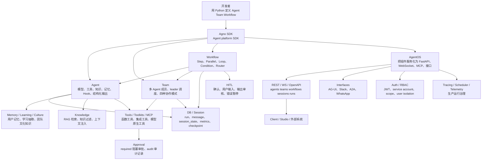

为什么这么设计：Agno 把“推理执行”和“平台运行”分成两层。`Agent/Team/Workflow` 保持 Python 代码可组合，`AgentOS` 统一处理外部访问、认证授权、数据库生命周期、MCP、接口和调度。这样既能写代码，又能把代码组件推向生产运行面。

## 3. 源码证据

| 结论 | 证据 |
| --- | --- |
| `Agent` 是厚配置对象，不只是模型 wrapper | `sources/agno/libs/agno/agno/agent/agent.py:69` 定义 `Agent`；`session_state` 在 `:90`，`memory_manager` 在 `:118`，`knowledge` 在 `:151`，`tools` 在 `:174`，`pre_hooks` 在 `:191`，`output_schema` 在 `:299`。 |
| Agent 主链路是显式分阶段执行 | `sources/agno/libs/agno/agno/agent/_run.py:771` 的 docstring 写出 13 步：读 session、hook、工具、消息、记忆、模型、解析、存储。关键实现点在 `:819`、`:848`、`:869`、`:885`、`:906`、`:953`、`:1146`。 |
| Team 明确支持四种协作模式 | `sources/agno/libs/agno/agno/team/mode.py:6` 定义 `TeamMode`；`coordinate`、`route`、`broadcast`、`tasks` 分别在 `:12`、`:15`、`:18`、`:21`。 |
| Workflow 的 Step 可承载 Agent、Team、函数或嵌套 Workflow | `sources/agno/libs/agno/agno/workflow/step.py:66` 定义 `Step`；`agent/team/executor/workflow` 四类 executor 在 `:71` 到 `:74`；HITL 配置在 `:90` 到 `:118`。 |
| AgentOS 是平台服务化入口 | `sources/agno/libs/agno/agno/os/app.py:223` 定义 `AgentOS`；`agents/teams/workflows` 参数在 `:232` 到 `:234`；`authorization`、`enable_mcp_server`、`scheduler` 分别在 `:238`、`:244`、`:253`；核心 routers 挂载在 `:557` 到 `:559`。 |
| 审批是工具执行安全边界 | `sources/agno/libs/agno/agno/approval/decorator.py:21` 定义 `approval`；`required` 会创建阻塞审批，`audit` 要求已有 HITL 标记，关键逻辑在 `:45` 到 `:61`。 |

## 4. Agent 主流程

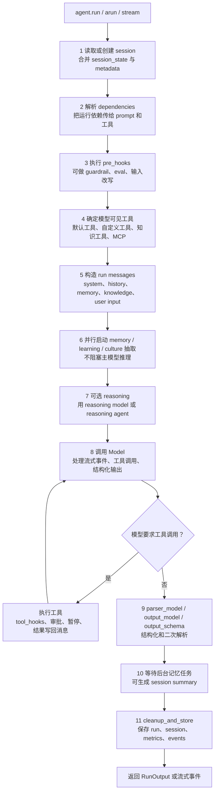

分享时可以这样讲：Agno 的 Agent loop 不只是“模型 -> 工具 -> 模型”。它先做 session 和上下文装配，再做 hook 与工具选择，中间并行做记忆/学习抽取，最后把 run 和 session 持久化。这说明 Agno 面向的是长生命周期 Agent，而不是一次性脚本。

### 代码片段证据

```python
@dataclass(init=False)
class Agent:
    model: Optional[Model] = None
    session_state: Optional[Dict[str, Any]] = None
    memory_manager: Optional[MemoryManager] = None
    knowledge: Optional[Union[KnowledgeProtocol, Callable[..., KnowledgeProtocol]]] = None
    tools: Optional[Union[List[Union[Toolkit, Callable, Function, Dict]], Callable[..., List]]] = None
    pre_hooks: Optional[List[Union[Callable[..., Any], BaseGuardrail, BaseEval]]] = None
    output_schema: Optional[Union[Type[BaseModel], Dict[str, Any]]] = None
```

这段结构说明：Agno 直接把 session、memory、knowledge、tools、hooks、output schema 都作为 Agent 的一等配置，而不是外部临时拼接。

## 5. Team 协作流程

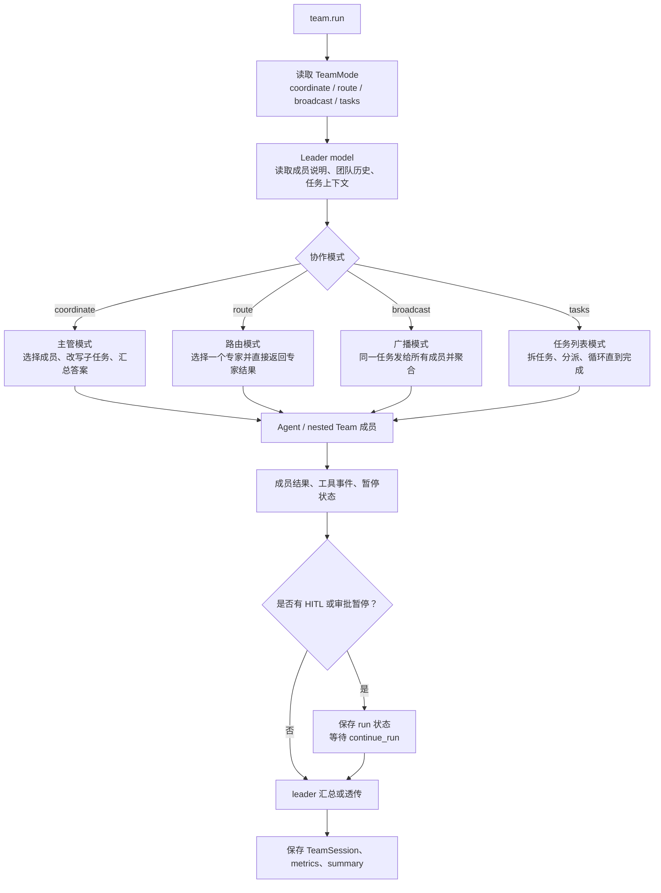

为什么这么设计：多 Agent 协作有不同复杂度。`route` 适合专家路由，`broadcast` 适合多视角并行，`coordinate` 适合主管汇总，`tasks` 适合目标拆解和循环推进。Agno 把这些模式固定成枚举，降低了“每个项目都手写一套 team prompt”的不确定性。

## 6. Workflow 流程

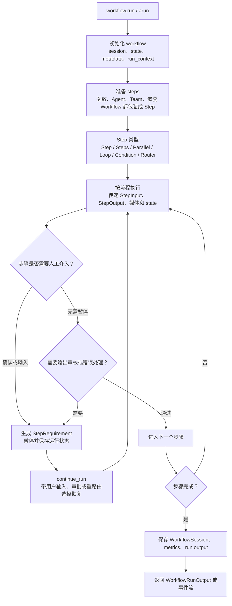

Agno 的 Workflow 更像“业务流程编排器”，不是 LangGraph 那种以 checkpoint-first 状态图为核心的通用图运行时。它的强项是把函数、Agent、Team 和嵌套 Workflow 放进同一套 Step 体系，并把人工确认、输入、输出审核和错误暂停作为流程控制的一部分。

## 7. AgentOS 服务化流程

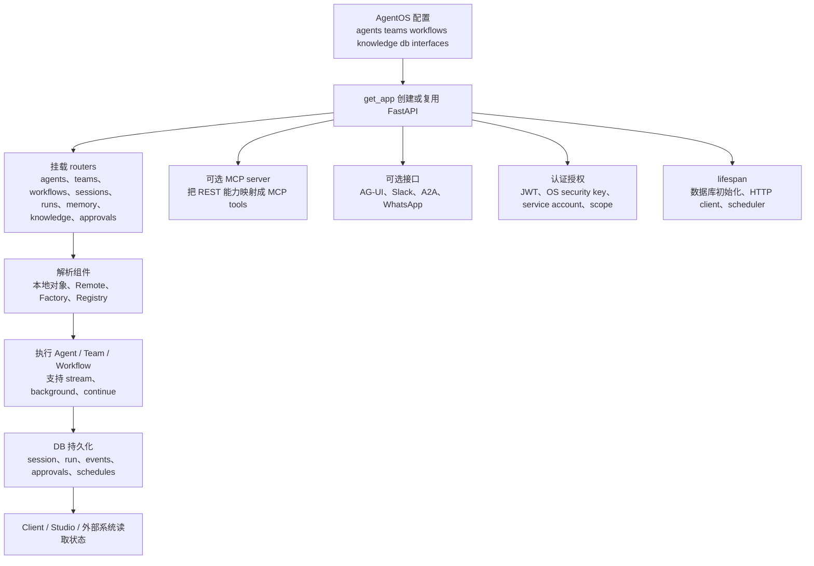

为什么这么设计：如果只提供 `agent.run()`，团队还要自己补 API、鉴权、会话、暂停恢复、审批、调度和前端对接。AgentOS 把这些平台共性收进框架，让 Agent/Team/Workflow 可以直接成为服务端资源。

### 7.1 AgentOS router 细节

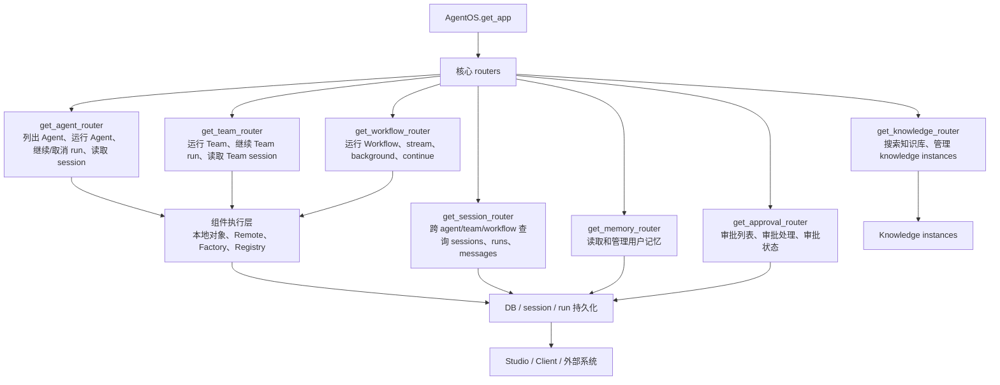

源码证据：`sources/agno/libs/agno/agno/os/app.py:46` 到 `:63` 引入 agents、teams、workflows、session、memory、knowledge、approvals 等 router；`os/app.py:557` 到 `:559` 挂载 Agent / Team / Workflow 的运行入口；`os/app.py:1026`、`:1035`、`:1046` 说明 session、memory、knowledge、approval 这些治理入口也由 AgentOS 统一挂载。

为什么这么设计：Agno 把 `Agent`、`Team`、`Workflow` 都当成“服务端资源”。业务系统不需要知道 Python 对象怎么创建，只要通过 router 找到组件、提交 run、继续暂停任务、查询 session/run、处理 approval 即可。这也是 Agno 和单纯 Agent SDK 最大的边界差异。

### 7.2 MCP 细节

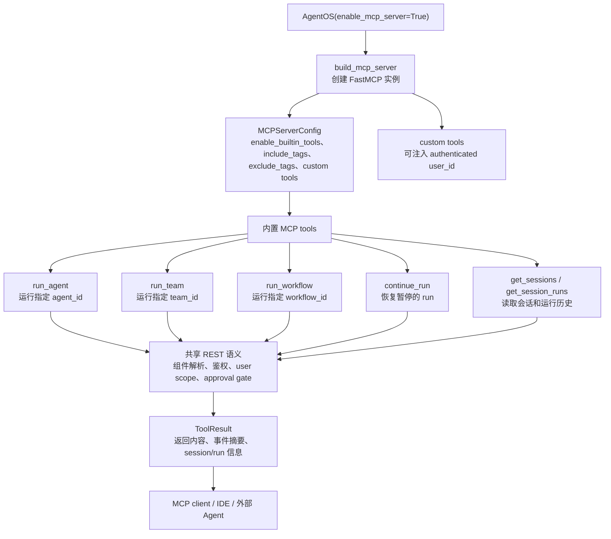

源码证据：`sources/agno/libs/agno/agno/os/mcp.py:648` 构建 FastMCP server；`:749`、`:777`、`:803`、`:846`、`:921`、`:980` 分别注册 `run_agent`、`run_team`、`run_workflow`、`continue_run`、`get_sessions`、`get_session_runs`。`os/config.py:28` 到 `:30` 也把 MCP tools 分成 core 和 session 两类。

为什么这么设计：MCP 在 Agno 里不是另一套运行时，而是 AgentOS REST 能力的另一个传输面。它复用组件解析、鉴权、user scope、approval gate 和 session 服务，所以 IDE、外部 Agent、MCP client 可以像调用工具一样运行 Agno 平台里的 Agent/Team/Workflow。

## 8. 记忆、知识、审批

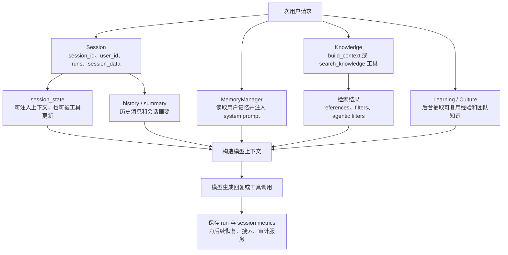

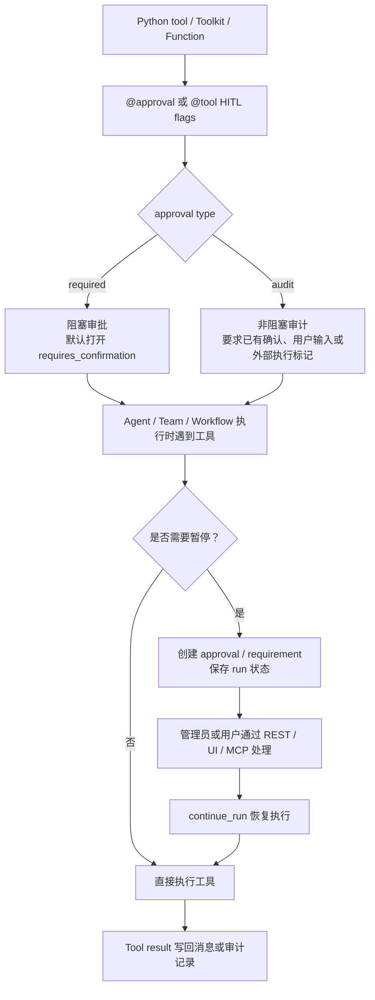

这两张图可以帮助听众理解：Agno 关注的是“Agent 的生产状态”，包括用户记忆、知识检索、运行状态、审批记录和后续恢复，而不是只关注模型调用结果。

## 9. 真实示例

### 9.1 企业财务审批 Agent 平台

场景：员工提交“帮我审核这笔供应商付款是否可以放行”。系统需要查合同、查发票、查付款历史、查风险规则，超过金额阈值时必须人工审批。

Agno 写法：

- `Agent` 负责判断付款风险，并通过工具查合同、发票和历史付款。
- `@approval(type="required")` 标记真正执行付款或放行的工具。
- `Knowledge` 接公司财务制度和采购合同。
- `AgentOS` 暴露 REST / UI / MCP，财务系统可以调用，审批人可以继续 run。

为什么 Agno 合适：它把工具审批、session 持久化、continue_run 和服务化入口都放进框架，不需要每个项目自己补一套审批恢复机制。

### 9.1.1 最小代码示例：Agent + tool + approval + AgentOS

下面这段不是为了展示完整业务代码，而是说明 Agno 的核心组合方式：先用代码定义 Agent 和工具，再用 `@approval` 给高风险工具加审批边界，最后用 AgentOS 把它服务化。

```python
from agno.agent import Agent
from agno.approval import approval
from agno.models.openai import OpenAIChat
from agno.os import AgentOS
from agno.tools import tool


def lookup_invoice(invoice_id: str) -> str:
    return f"invoice={invoice_id}, amount=128000, vendor=ACME"


@approval(type="required")
@tool()
def release_payment(invoice_id: str) -> str:
    return f"payment released for {invoice_id}"


finance_agent = Agent(
    id="finance-approval",
    name="财务付款审批 Agent",
    model=OpenAIChat(id="gpt-4.1"),
    tools=[lookup_invoice, release_payment],
    instructions=[
        "先核对发票、供应商和金额风险。",
        "只有确认符合规则时才调用 release_payment。",
    ],
    markdown=True,
)

agent_os = AgentOS(
    id="finance-agent-os",
    agents=[finance_agent],
    enable_mcp_server=True,
    authorization=True,
)

app = agent_os.get_app()
```

分享时可以强调：这段代码背后不是简单函数调用。`release_payment` 会被标记成需要审批的工具；AgentOS 会把 Agent 暴露成服务端资源；如果 run 因审批暂停，外部系统可以通过 REST / UI / MCP 处理后再 `continue_run`。

### 9.2 知识库问答 + 后台学习

场景：售后工程师问“某型号设备 E23 报错怎么处理”。系统先检索知识库，回答后把新发现的问题处理经验沉淀成学习或团队文化知识。

Agno 写法：

- `Agent.knowledge` 注入设备手册、维修记录。
- `search_knowledge=True` 让模型可主动检索。
- `memory_manager` 保留用户偏好或现场上下文。
- 后台 learning / cultural knowledge 抽取可复用经验。

为什么 Agno 合适：它不是最强 RAG ingestion 框架，但适合把 RAG 结果纳入 Agent 的长会话状态和平台运行。

### 9.3 多角色研究团队

场景：做竞品分析，需要“市场研究员、技术分析员、财务分析员”分别处理，再由负责人汇总。

Agno 写法：

- 用多个 `Agent` 建成员。
- 用 `Team(mode=coordinate)` 做主管汇总。
- 如果只是选一个专家，用 `route`；如果要所有专家同时分析，用 `broadcast`；如果目标需要拆解，用 `tasks`。

为什么 Agno 合适：TeamMode 把常见多 Agent 模式显式化，比完全靠 prompt 描述更稳定。

### 9.4 订单处理 Workflow

场景：电商售后自动处理：识别诉求、查订单、判断退款规则、必要时让人工确认、最终写回工单。

Agno 写法：

- `Workflow` 把“识别、查询、判断、审批、写回”拆成 Step。
- 某些 Step 是普通函数，某些 Step 是 Agent，复杂分支用 Router 或 Condition。
- 对高风险动作设置 `requires_confirmation` 或输出审核。

为什么 Agno 合适：它适合“业务步骤明确，但每个步骤里又可能有 Agent 推理”的流程。

## 10. 横向对比

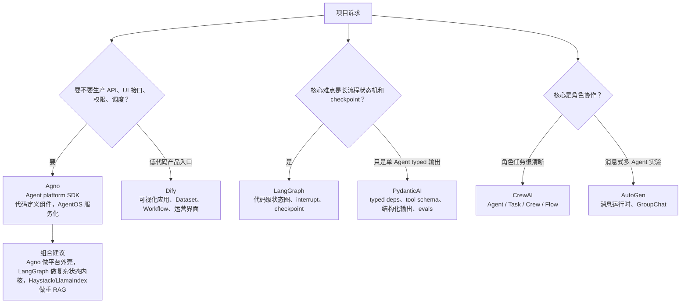

| 框架 | 和 Agno 的区别 | 组合建议 |
| --- | --- | --- |
| LangGraph | LangGraph 更像 checkpoint-first 状态图运行时；Agno 更像 Agent/Team/Workflow 的平台 SDK。 | 复杂状态内核用 LangGraph，外层 API、审批、界面、MCP 可以参考 Agno 思路。 |
| CrewAI | CrewAI 更强调角色、任务、Crew 编排；Agno 除 Team 外还强调 AgentOS 和生产运行。 | 角色任务型分享讲 CrewAI；要讲平台化运行讲 Agno。 |
| PydanticAI | PydanticAI 更强调 typed deps、tool schema、结构化输出和 evals；Agno 更强调运行平台和状态治理。 | PydanticAI 做 typed inner agent，Agno 或 LangGraph 做外层服务/流程。 |
| Dify | Dify 是低代码产品平台；Agno 是代码优先 SDK + 服务化入口。 | 业务团队配置入口用 Dify；工程团队代码定义 Agent 平台可看 Agno。 |
| Haystack / LlamaIndex | 它们更重 RAG 数据管线和检索工程；Agno 的 knowledge 更像 Agent 上下文能力。 | 重 RAG 用 Haystack/LlamaIndex，Agno Agent 调用其检索服务。 |

### 10.1 Agno + LangGraph + RAG 组合边界

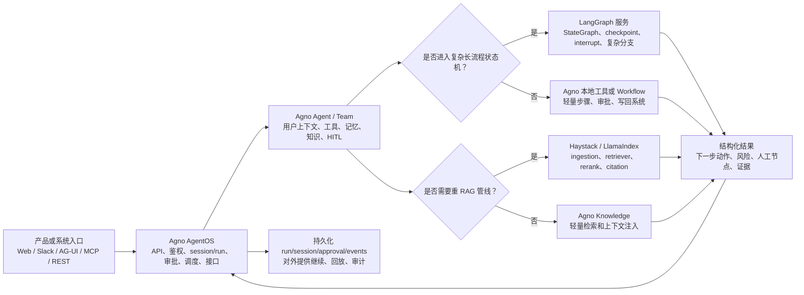

边界建议：Agno 做“平台外壳和运行治理”，LangGraph 做“复杂状态内核”，Haystack/LlamaIndex 做“重 RAG 数据管线”。这样三者不是替代关系，而是分层协作关系：Agno 接入口、会话、审批和 MCP；LangGraph 处理可恢复长流程；RAG 框架处理数据接入、召回、重排和引用。

## 11. 核心设计思想

1. **平台化优先**：`AgentOS` 说明 Agno 不满足于本地调用，而是把 Agent 作为可被 API、UI、MCP 和调度系统管理的资源。
2. **分层抽象**：`Agent` 处理单体推理，`Team` 处理多 Agent 协作，`Workflow` 处理确定性步骤，`AgentOS` 处理服务化和治理。
3. **状态一等公民**：session、run、session_state、metrics、checkpoint、continue_run 贯穿 Agent、Team、Workflow。
4. **HITL 内建**：审批、确认、用户输入、输出审核不是外部临时能力，而是 tool 和 step 的执行语义。
5. **生产治理内建**：auth、RBAC、tracing、scheduler、interfaces、MCP 都在源码层进入 AgentOS。

## 12. 局限性

- 如果只想要最精细的 checkpoint 状态图和可中断恢复，LangGraph 更专注。
- 如果只想要 typed business agent 和强结构化输出，PydanticAI 更轻。
- 如果核心是 RAG ingestion、索引、重排和 DocumentStore，Haystack / LlamaIndex 更专业。
- 如果需要业务人员拖拽配置、发布应用和运营知识库，Dify 更产品化。
- Agno 的能力面很宽，学习时不能只看 `Agent`，必须连 `Team`、`Workflow`、`AgentOS` 一起看，否则会误判它只是一个 Agent wrapper。

## 13. 分享口径

开场可以这样讲：

> Agno 这类框架的价值，不在于它能不能调用一个模型，而在于它把 Agent 运行时升级成平台组件。它有单 Agent loop，有多 Agent Team，有确定性 Workflow，还有 AgentOS 把这些组件变成 API、WebSocket、MCP、审批、调度和权限体系。

三条主线：

1. `Agent` 主线：模型、工具、记忆、知识、hook 和结构化输出如何组成一次 run。
2. `Team / Workflow` 主线：多 Agent 协作和确定性业务流程如何复用同一套 session、HITL、持久化能力。
3. `AgentOS` 主线：为什么生产环境需要 API、权限、调度、MCP、接口和数据库生命周期，而不只是 `agent.run()`。

总结：

Agno 适合讲“代码优先的 Agent 平台化”。如果听众熟悉 LangGraph，可以强调：LangGraph 解决复杂状态图，Agno 更强调把 Agent/Team/Workflow 服务化、治理化、产品接入化。
