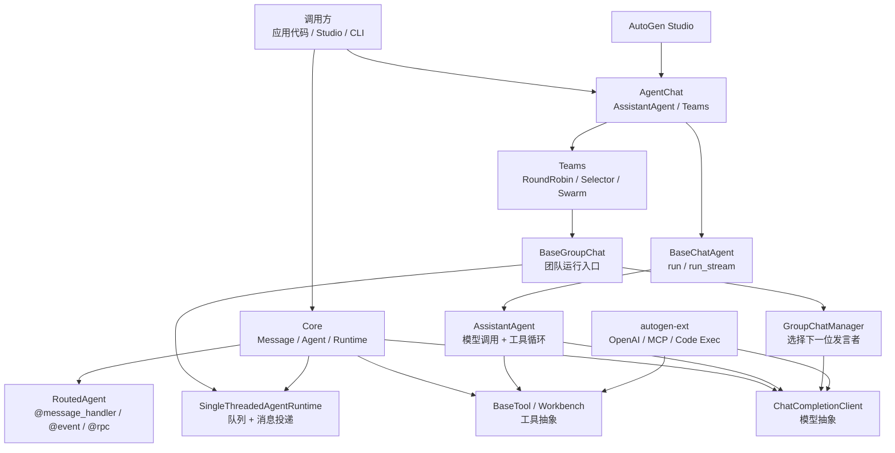

# AutoGen 源码架构精读

分析对象：`sources/autogen`，固定源码提交 `027ecf0a379bcc1d09956d46d12d44a3ad9cee14`。

这版重点不是“AutoGen 有哪些模块”，而是沿源码关键路径拆清楚：Runtime 如何投递消息，AssistantAgent 如何做模型和工具循环，GroupChat 如何映射到底层 Core Runtime。

## 1. 总体结论

AutoGen 的核心不是单个聊天机器人封装，而是一个**消息驱动的多 Agent 运行时**。

- **Core**：定义 AgentRuntime、消息投递、topic、handler、模型和工具抽象。
- **AgentChat**：把底层能力包装成 AssistantAgent、Team、GroupChat、消息类型和终止条件。
- **Extensions**：接入 OpenAI、MCP、代码执行等外部能力。
- **Studio / Bench**：提供可视化原型和评测入口，不是运行时主干。

分享口径：

> AutoGen 更像“多 Agent actor runtime + Chat Team API”，而不是单纯的 prompt 编排库。

## 2. 最高层架构

| 层级 | 源码位置 | 精读重点 |
| --- | --- | --- |
| Core | `python/packages/autogen-core/src/autogen_core` | `AgentRuntime`、`SingleThreadedAgentRuntime`、`RoutedAgent`、模型和工具协议 |
| AgentChat | `python/packages/autogen-agentchat/src/autogen_agentchat` | `BaseChatAgent.run_stream`、`AssistantAgent.on_messages_stream`、`BaseGroupChat`、Team manager |
| Extensions | `python/packages/autogen-ext/src/autogen_ext` | OpenAI client、MCP Workbench、代码执行、外部模型和工具适配 |
| Studio / Bench | `python/packages/autogen-studio`、`python/packages/agbench` | 可视化原型入口和评测工具 |

架构图见：[architecture.mmd](architecture.mmd)。



## 3. 源码精读一：Runtime 消息投递

主线：

```text
send_message / publish_message
  -> SendMessageEnvelope / PublishMessageEnvelope
  -> SingleThreadedAgentRuntime queue
  -> _process_next
  -> _process_send / _process_publish
  -> RoutedAgent handler
```

源码证据：

- `autogen_core/_agent_runtime.py:21-50` 定义 `AgentRuntime`、`send_message()`、`publish_message()`。
- `autogen_core/_single_threaded_agent_runtime.py:332` 实现 `send_message()`。
- `autogen_core/_single_threaded_agent_runtime.py:387` 实现 `publish_message()`。
- `autogen_core/_single_threaded_agent_runtime.py:466` 处理点对点 send。
- `autogen_core/_single_threaded_agent_runtime.py:557` 处理 topic publish。
- `autogen_core/_single_threaded_agent_runtime.py:671` 由 `_process_next()` 分派队列消息。
- `autogen_core/_single_threaded_agent_runtime.py:796` 启动队列处理循环。

关键片段：

```python
class AgentRuntime(Protocol):
    async def send_message(...)
    async def publish_message(...)

class SingleThreadedAgentRuntime(AgentRuntime):
    """...processes all messages using a single asyncio queue."""
```

设计含义：AutoGen 的底座更接近 actor/event runtime。`send_message` 表达 RPC，`publish_message` 表达事件广播。AgentChat 的 GroupChat 也是把参与者、manager、topic 注册进 runtime，然后让消息驱动协作。

运行时消息流图见：[runtime-message-flow.mmd](runtime-message-flow.mmd)。

## 4. 源码精读二：RoutedAgent 处理器范式

`RoutedAgent` 通过装饰器把消息类型映射到 handler。`@event` 表达“收到事件后处理，不要求响应”，`@rpc` 表达“请求响应”，`@message_handler` 是更通用的声明式入口。

源码证据：

- `autogen_core/_routed_agent.py:85` 定义 `message_handler()`。
- `autogen_core/_routed_agent.py:205` 定义 `event()`。
- `autogen_core/_routed_agent.py:325` 定义 `rpc()`。
- `autogen_core/_routed_agent.py:415` 定义 `RoutedAgent`。

关键片段：

```python
class RoutedAgent(BaseAgent):
    """...route messages to handlers based on the type of the message."""
```

设计含义：这是“声明式路由 + 类型驱动 handler”。调用方不用知道具体函数名，只要消息类型和订阅关系正确，runtime 就能把消息送到对应 Agent。

## 5. 源码精读三：AssistantAgent 工具循环

`BaseChatAgent` 统一 `run` 和 `run_stream`，`AssistantAgent` 负责把用户消息、memory、model_context、tools、handoff 和模型调用串起来。

主线：

```text
BaseChatAgent.run / run_stream
  -> AssistantAgent.on_messages_stream
  -> 更新 memory 和 model_context
  -> _call_llm
  -> _process_model_result
  -> _execute_tool_calls
  -> _reflect_on_tool_use_flow 或 ToolCallSummaryMessage
  -> Response / TaskResult
```

源码证据：

- `agents/_base_chat_agent.py:111` 定义 `run()`。
- `agents/_base_chat_agent.py:155` 定义 `run_stream()`。
- `agents/_assistant_agent.py:827-851` 构造 workbench/tools、model_context、`reflect_on_tool_use`、`max_tool_iterations`。
- `agents/_assistant_agent.py:901` 定义 `on_messages_stream()`。
- `agents/_assistant_agent.py:940-1004` 更新 memory、消息上下文并处理模型结果。
- `agents/_assistant_agent.py:1056` 定义 `_call_llm()`。
- `agents/_assistant_agent.py:1118` 定义 `_process_model_result()`。
- `agents/_assistant_agent.py:1196` 定义 `_execute_tool_calls()`。
- `agents/_assistant_agent.py:1240` 把工具结果写回 `model_context`。
- `agents/_assistant_agent.py:1409` 定义 `_reflect_on_tool_use_flow()`。
- `agents/_assistant_agent.py:1507` 不反思时生成工具调用摘要。

关键片段：

```python
class AssistantAgent(BaseChatAgent, Component[AssistantAgentConfig]):
    """An agent that provides assistance with tool use."""
```

设计含义：AssistantAgent 是“组合器”，不是 provider。模型由 `ChatCompletionClient` 抽象，工具由 `Workbench` 和 `BaseTool` 抽象，Agent 只编排上下文和控制循环。

流程图见：[agent-flow.mmd](agent-flow.mmd)。

## 6. 源码精读四：GroupChat 如何落到 Core Runtime

`BaseGroupChat` 的关键定位是：把 AgentChat API 映射到 Core Runtime。初始化时注册 participant container、group chat manager 和 topic subscriptions；运行时发布 `GroupChatStart`，随后 manager 选择 speaker，participant 响应，再回到 manager 判断终止。

主线：

```text
Team.run_stream
  -> _init(runtime)
  -> register participant containers
  -> register group chat manager
  -> add topic subscriptions
  -> publish GroupChatStart
  -> manager.handle_start / select_speaker
  -> participant container 调真实 ChatAgent
  -> GroupChatAgentResponse
  -> termination / max_turns
  -> GroupChatTermination / TaskResult
```

源码证据：

- `teams/_group_chat/_base_group_chat.py:40` 定义 `BaseGroupChat`。
- `teams/_group_chat/_base_group_chat.py:191-241` 注册参与者、manager 和订阅。
- `teams/_group_chat/_base_group_chat.py:351` 定义 `run_stream()`。
- `teams/_group_chat/_base_group_chat.py:535` 发布 `GroupChatStart`。
- `teams/_group_chat/_base_group_chat.py:550` 处理 `GroupChatTermination`。
- `teams/_group_chat/_base_group_chat_manager.py:87` 处理 `GroupChatStart`。
- `teams/_group_chat/_base_group_chat_manager.py:135` 处理 agent response。
- `teams/_group_chat/_base_group_chat_manager.py:306` 抽象 `select_speaker()`。
- `teams/_group_chat/_round_robin_group_chat.py:72` 定义轮询选择。
- `teams/_group_chat/_selector_group_chat.py:50-52` 说明 Selector 可用模型或自定义函数选 speaker。
- `teams/_group_chat/_swarm_group_chat.py:82` 定义 Swarm 的 speaker selection。

关键片段：

```python
class BaseGroupChat(Team, ABC, ComponentBase[BaseModel]):
    """The base class for group chat teams."""
```

设计含义：GroupChat 是“Team API 到消息运行时的适配层”。它看起来像群聊，底层实际是 topic、manager、container 和 runtime 的组合。

流程图见：[groupchat-flow.mmd](groupchat-flow.mmd)。

## 7. 源码精读五：Model / Tool / Workbench 抽象边界

AutoGen 把外部能力压到 Core 协议和 Ext 实现里：Core 定义 `ChatCompletionClient`、`BaseTool`、`Workbench`，Ext 再实现 OpenAI、MCP 等具体适配。

源码证据：

- `autogen_core/models/_model_client.py:209` 定义 `ChatCompletionClient`。
- `autogen_core/models/_model_client.py:212` 定义 `create()`。
- `autogen_core/models/_model_client.py:242` 定义 `create_stream()`。
- `autogen_core/tools/_base.py:96` 定义 `BaseTool`。
- `autogen_core/tools/_base.py:115` 定义 `schema`。
- `autogen_core/tools/_base.py:177-179` 定义 `run()` 和 `run_json()`。
- `autogen_core/tools/_workbench.py:78` 定义 `Workbench`。
- `autogen_ext/models/openai/_openai_client.py:1179` 定义 `OpenAIChatCompletionClient`。
- `autogen_ext/tools/mcp/_workbench.py:47` 定义 `McpWorkbench`。

关键片段：

```python
class ChatCompletionClient(ComponentBase[BaseModel], ABC):
    async def create(...)
    def create_stream(...)

class BaseTool(ABC, Tool, Generic[ArgsT, ReturnT], ComponentBase[BaseModel]):
    async def run(...)
```

设计含义：这是典型的 Ports and Adapters。Core 是端口，Ext 是适配器，AgentChat 依赖抽象而不是依赖 OpenAI/MCP 具体实现。

## 8. 核心设计思想和范式

| 设计思想 | 源码证据 | 解释 |
| --- | --- | --- |
| 运行时优先 | `AgentRuntime`、`SingleThreadedAgentRuntime` | 先有消息、topic、queue、handler，再包装聊天 Agent |
| Actor / Event 模型 | `send_message`、`publish_message` | Agent 是消息处理单元，点对点和广播协作并存 |
| 声明式消息路由 | `@message_handler`、`@event`、`@rpc` | 消息类型决定进入哪个 handler |
| Template Method | `BaseChatAgent.run_stream`、`on_messages_stream` | 基类固定外部运行协议，子类实现具体行为 |
| Strategy | RoundRobin、Selector、Swarm | 替换 speaker selection 策略实现不同 Team |
| Ports and Adapters | `ChatCompletionClient`、`BaseTool`、`Workbench` | Core 定义抽象端口，Ext 实现具体 provider |
| Stateful Agent | `model_context`、memory、state save/load | Agent 可保留上下文和状态，不是纯函数 |

## 9. 应用场景和 LangGraph 对比

AutoGen 更适合：

- **多 Agent 研究协作**：检索、阅读、总结、审查拆成多个 AssistantAgent。
- **团队式聊天原型**：快速演示“多个专家一起讨论问题”。
- **人机协同流程**：UserProxyAgent、终止条件、流式事件适合聊天型 human-in-the-loop。
- **工具和代码执行任务**：AssistantAgent + Workbench + Code Executor 适合工具密集任务。
- **可视化原型和演示**：Studio 适合先把 Agent、Team、模型配置跑起来。
- **存量系统维护**：项目进入 maintenance mode 后，新项目要谨慎，但存量系统仍需要读懂边界。

| 维度 | AutoGen | LangGraph | 判断 |
| --- | --- | --- | --- |
| 核心模型 | AgentRuntime + Message + Team，偏 actor/message runtime | StateGraph + Node + Edge + Checkpoint，偏状态机运行时 | 对话协作优先 AutoGen；状态流控制优先 LangGraph |
| 多 Agent 表达 | RoundRobin、Selector、Swarm 等 Team 模式内建 | 多 Agent 通常建模为节点、子图、条件边和共享状态 | 想快速组织“谁发言”用 AutoGen；想明确“状态如何变”用 LangGraph |
| 流程可控性 | 通过 manager、termination、topic 控制，语义偏群聊 | 显式边、条件路由、interrupt、checkpoint | 复杂分支、暂停恢复、审计回放更偏 LangGraph |
| 状态管理 | Agent 自身有状态，Team/Manager 可保存状态，但全局状态不是第一入口 | 全局状态是第一等概念，节点读写状态，checkpoint 可持久化 | 业务状态强约束时选 LangGraph |
| 项目建议 | 适合源码学习、原型、存量维护 | 更适合新项目里的复杂 Agent Runtime | 新项目优先评估 LangGraph 或 Microsoft Agent Framework |

## 10. 真实例子：两个 Agent 协作做源码审查

场景：一个 Assistant 负责解释源码，另一个 Reviewer 负责挑问题；它们围绕“Graphiti 的 `add_episode()` 是否适合同步请求里直接调用？”进行多轮讨论。

AutoGen 可以这样理解：

```python
assistant = AssistantAgent(
    name="source_reader",
    model_client=model_client,
    tools=[read_file, search_code],
)
reviewer = AssistantAgent(name="reviewer", model_client=model_client)
team = RoundRobinGroupChat([assistant, reviewer], termination_condition=MaxMessageTermination(6))
await team.run(task="分析 Graphiti.add_episode 的调用成本和使用边界")
```

| 业务动作 | AutoGen 机制 | 为什么便于理解源码 |
| --- | --- | --- |
| Agent 之间发消息 | Core runtime message delivery | AutoGen 底层是消息运行时，不只是聊天循环。 |
| Agent 响应特定消息 | `RoutedAgent` / handler | 不同消息类型可以路由到不同处理函数。 |
| 单 Agent 调工具 | `AssistantAgent` tool loop | 模型决定是否调用工具，再把工具结果放回上下文。 |
| 多 Agent 协作 | `GroupChat` | 把成员、发言顺序和终止条件组合成团队运行。 |
| 模型/工具隔离 | Model / Tool / Workbench contract | 运行时不绑定某个模型供应商或工具实现。 |

分享时这样讲：AutoGen 更像“多 Agent 消息系统”。如果 LangGraph 是状态图，CrewAI 是角色任务团队，那么 AutoGen 的强项是消息投递、Agent handler 和多 Agent 对话协议。

## 11. 分享建议

建议分享顺序：

1. 先说明版本状态：AutoGen 已进入 maintenance mode，但源码仍适合学习多 Agent runtime。
2. 再讲四层架构：Core、AgentChat、Extensions、Studio。
3. 精读 Core Runtime：`send_message/publish_message -> queue -> handler`。
4. 精读 AssistantAgent：`on_messages_stream -> model/tool loop -> TaskResult`。
5. 精读 GroupChat：Team API 如何映射到 runtime、manager、topic。
6. 最后讲设计范式和 LangGraph 对比。

收束口：

> AutoGen 源码最值得看的不是某个 prompt，而是它如何把多 Agent 系统拆成 Runtime、Agent、Message、Team、Model、Tool 几层。读懂 Runtime、AssistantAgent、GroupChat 三条主线，就读懂了它的多 Agent 设计。
