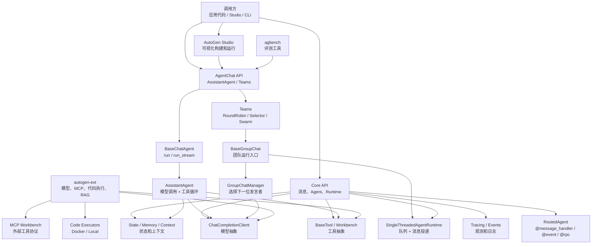

# AutoGen 源码架构分析

分析对象：`sources/autogen` 当前固定源码提交 `027ecf0a379bcc1d09956d46d12d44a3ad9cee14`。

AutoGen 当前官方 README 明确标记为 maintenance mode，新项目官方建议迁移到 Microsoft Agent Framework。本文仍然从源码角度分析 AutoGen 现有架构，重点放在 Python workspace 中的 Core、AgentChat、Extensions、Studio 四层。

## 1. 总体结论

AutoGen 的源码主线不是单个 Agent 循环，而是一个分层的多 Agent 应用框架：

- **Core**：提供消息、Agent、Runtime、模型、工具、状态、观测等底层协议。
- **AgentChat**：在 Core 之上提供用户最常用的 AssistantAgent、Team、GroupChat、终止条件和消息类型。
- **Extensions**：实现 OpenAI、Azure、Anthropic、Ollama、MCP、代码执行、GraphRAG 等生态适配。
- **Studio / Bench**：提供可视化构建和评测工具。

一句话分享口径：

> AutoGen 是“运行时优先”的多 Agent 框架：底层 Core 负责消息投递和事件驱动 Agent Runtime，上层 AgentChat 把它包装成 AssistantAgent 和多 Agent Team，Extensions 再接入模型、工具、代码执行和 MCP。

## 2. 最高层分层

| 层级 | 目录/文件 | 主要职责 |
| --- | --- | --- |
| Workspace | `python/pyproject.toml`、`python/packages/*` | Python uv workspace，统一管理多个包 |
| Core API | `packages/autogen-core/src/autogen_core` | AgentRuntime、RoutedAgent、消息、模型抽象、工具抽象、状态、trace |
| AgentChat API | `packages/autogen-agentchat/src/autogen_agentchat` | AssistantAgent、BaseChatAgent、Teams、GroupChat、消息和终止条件 |
| Extensions API | `packages/autogen-ext/src/autogen_ext` | 模型 client、MCP、代码执行、RAG、外部集成 |
| Studio | `packages/autogen-studio` | Web UI / no-code 原型工具 |
| Bench / Samples | `packages/agbench`、`python/samples` | 评测和示例 |
| .NET / Protos | `dotnet`、`protos` | 跨语言和分布式运行时相关基础 |

架构图见：[architecture.mmd](architecture.mmd)。



## 3. 源码分支分析

### 3.1 Core：消息运行时是底座

源码证据：

- `autogen_core/_agent_runtime.py:21` 定义 `AgentRuntime` 协议。
- `autogen_core/_agent_runtime.py:22` 定义点对点 `send_message()`。
- `autogen_core/_agent_runtime.py:50` 定义发布订阅 `publish_message()`。
- `autogen_core/_single_threaded_agent_runtime.py:149` 定义 `SingleThreadedAgentRuntime`。
- `autogen_core/_single_threaded_agent_runtime.py:332` 实现 `send_message()`。
- `autogen_core/_single_threaded_agent_runtime.py:387` 实现 `publish_message()`。
- `autogen_core/_single_threaded_agent_runtime.py:796` 启动消息处理循环。

关键片段：

```python
class AgentRuntime(Protocol):
    async def send_message(...)
    async def publish_message(...)
```

```python
class SingleThreadedAgentRuntime(AgentRuntime):
    """A single-threaded agent runtime that processes all messages using a single asyncio queue."""
```

设计含义：Core 把 Agent 看成消息处理单元，既支持 RPC 式的 send，也支持事件广播式的 publish。AgentChat 的 GroupChat 也是映射到这个 runtime 之上。

### 3.2 RoutedAgent：用装饰器声明消息处理器

源码证据：

- `autogen_core/_routed_agent.py:85` 定义通用 `message_handler()`。
- `autogen_core/_routed_agent.py:205` 定义事件处理 `event()`。
- `autogen_core/_routed_agent.py:325` 定义 RPC 处理 `rpc()`。
- `autogen_core/_routed_agent.py:415` 定义 `RoutedAgent`。

关键片段：

```python
class RoutedAgent(BaseAgent):
    """A base class for agents that route messages to handlers based on the type of the message."""
```

设计含义：底层 Agent 不是固定聊天机器人，而是“按消息类型路由的 actor”。这也是 AutoGen 比纯聊天框架更偏运行时的地方。

### 3.3 AgentChat：用户常用入口

源码证据：

- `agents/_base_chat_agent.py:17` 定义 `BaseChatAgent`。
- `agents/_base_chat_agent.py:72` 定义抽象 `on_messages()`。
- `agents/_base_chat_agent.py:111` 定义 `run()`。
- `agents/_base_chat_agent.py:155` 定义 `run_stream()`。
- `agents/_assistant_agent.py:90` 定义 `AssistantAgent`。
- `agents/_assistant_agent.py:882` 定义 `on_messages()`。
- `agents/_assistant_agent.py:901` 定义 `on_messages_stream()`。

关键片段：

```python
class BaseChatAgent(ChatAgent, ABC, ComponentBase[BaseModel]):
    """Base class for a chat agent."""
```

```python
class AssistantAgent(BaseChatAgent, Component[AssistantAgentConfig]):
    """An agent that provides assistance with tool use."""
```

Agent 主流程图见：[agent-flow.mmd](agent-flow.mmd)。

### 3.4 AssistantAgent：模型调用和工具循环

`AssistantAgent` 的源码文档直接说明了工具调用行为：模型没有工具调用时直接返回；有工具调用时立即执行；如果 `reflect_on_tool_use=True`，会再做一次模型推理形成最终回复。

源码证据：

- `agents/_assistant_agent.py:137` 说明 tool call behavior。
- `agents/_assistant_agent.py:139` 说明无工具调用直接返回。
- `agents/_assistant_agent.py:140` 说明模型返回工具调用时立即执行。
- `agents/_assistant_agent.py:141` 说明不反思时返回工具调用摘要。
- `agents/_assistant_agent.py:142` 说明反思时再次模型推理。

设计含义：AssistantAgent 是“模型 client + 上下文 + tools/workbench + memory + handoff”的组合器，真正的模型适配和工具执行分别下沉到 core/ext。

### 3.5 Team / GroupChat：多 Agent 编排

源码证据：

- `teams/_group_chat/_base_group_chat.py:40` 定义 `BaseGroupChat`。
- `teams/_group_chat/_base_group_chat.py:59` 说明它负责 AgentChat API 与 Core Runtime 的映射。
- `teams/_group_chat/_base_group_chat.py:191` 初始化时注册参与者和 manager。
- `teams/_group_chat/_base_group_chat.py:247` 定义 `run()`。
- `teams/_group_chat/_base_group_chat.py:351` 定义 `run_stream()`。
- `teams/_group_chat/_round_robin_group_chat.py:16` 定义 RoundRobin manager。
- `teams/_group_chat/_round_robin_group_chat.py:72` 按轮转选择 speaker。
- `teams/_group_chat/_selector_group_chat.py:50` 定义 Selector manager。
- `teams/_group_chat/_selector_group_chat.py:51` 说明它用模型或 selector function 选择下一位发言者。

关键片段：

```python
class BaseGroupChat(Team, ABC, ComponentBase[BaseModel]):
    """The base class for group chat teams."""
```

```python
class RoundRobinGroupChatManager(BaseGroupChatManager):
    """A group chat manager that selects the next speaker in a round-robin fashion."""
```

GroupChat 流程图见：[groupchat-flow.mmd](groupchat-flow.mmd)。

### 3.6 Model / Tool / Workbench：外部能力统一抽象

源码证据：

- `autogen_core/models/_model_client.py:209` 定义 `ChatCompletionClient`。
- `autogen_core/models/_model_client.py:212` 定义 `create()`。
- `autogen_core/models/_model_client.py:242` 定义 `create_stream()`。
- `autogen_core/tools/_base.py:96` 定义 `BaseTool`。
- `autogen_core/tools/_base.py:115` 生成 tool schema。
- `autogen_core/tools/_base.py:176` 定义抽象 `run()`。
- `autogen_core/tools/_workbench.py:78` 定义 `Workbench`。
- `autogen_ext/models/openai/_openai_client.py:1179` 定义 `OpenAIChatCompletionClient`。
- `autogen_ext/tools/mcp/_workbench.py:47` 定义 `McpWorkbench`。

关键片段：

```python
class ChatCompletionClient(ComponentBase[BaseModel], ABC):
    async def create(...)
    def create_stream(...)
```

```python
class BaseTool(ABC, Tool, Generic[ArgsT, ReturnT], ComponentBase[BaseModel]):
    async def run(...)
```

设计含义：Core 定义协议，Ext 做具体 provider 和工具生态。这样 AgentChat 不直接绑定 OpenAI 或 MCP，而是依赖统一抽象。

## 4. 核心设计思想

### 4.1 运行时优先

AutoGen 的 Core 先定义消息、topic、runtime、handler，再往上包装聊天 Agent。它比 CrewAI 更底层，比 LangChain 的 Runnable 更偏 actor/runtime。

### 4.2 分层 API

Core 给框架开发者，AgentChat 给应用开发者，Extensions 给生态适配，Studio 给可视化原型。每层职责相对清晰。

### 4.3 消息驱动和发布订阅

`send_message` 解决点对点请求响应，`publish_message` 解决 topic 广播；GroupChat 正是通过 topic 把参与者和 manager 串起来。

### 4.4 状态和流式输出

BaseChatAgent 强调 Agent 是 stateful，并通过 `run_stream` 输出中间事件、模型流式 chunk 和最终 TaskResult。

### 4.5 可插拔生态

模型、工具、workbench、代码执行、MCP 都通过抽象接口接入，便于替换 provider 或扩展工具源。

### 4.6 声明式组件

大量类继承 `Component` / `ComponentBase`，配合 Pydantic config 支持序列化、Studio、配置化加载和团队编排。

## 5. 应用场景和 LangGraph 对比

适合 AutoGen 的场景：

- **多 Agent 研究协作**：把检索、阅读、总结、审查拆成多个 AssistantAgent，用 RoundRobin 或 SelectorGroupChat 组织对话。
- **团队式聊天原型**：需要快速演示“多个专家一起讨论问题”时，AgentChat 的 Team API 比直接写底层图更快。
- **人机协同流程**：UserProxyAgent、终止条件、流式事件适合做 human-in-the-loop 的聊天型应用。
- **工具和代码执行任务**：AssistantAgent + Workbench + Code Executor 适合网页浏览、代码执行、文件处理等工具密集型任务。
- **可视化原型和演示**：AutoGen Studio 适合把 Agent、Team、模型配置先可视化跑起来，再沉淀为代码。
- **存量 AutoGen 系统维护**：AutoGen 已进入 maintenance mode，新项目需谨慎；但存量系统仍需要理解 Runtime、Team 和 Extension 边界。

选型口径：

> 如果目标是“多个聊天 Agent 通过消息协作”，AutoGen 表达直接；如果目标是“可恢复、可审计、可精确控制的状态流”，LangGraph 更合适。

### 5.1 AutoGen vs LangGraph

| 维度 | AutoGen | LangGraph | 选型判断 |
| --- | --- | --- | --- |
| 核心模型 | AgentRuntime + Message + Team，偏 actor/message runtime。 | StateGraph + Node + Edge + Checkpoint，偏状态机运行时。 | 对话协作优先 AutoGen；状态流控制优先 LangGraph。 |
| 多 Agent 表达 | RoundRobin、Selector、Swarm 等 Team 模式内建。 | 多 Agent 通常建模为节点、子图、条件边和共享状态。 | 想快速组织“谁发言”用 AutoGen；想明确“状态如何变”用 LangGraph。 |
| 流程可控性 | 通过 manager、termination、topic 控制，语义偏群聊。 | 通过显式边、条件路由、interrupt、checkpoint 控制。 | 复杂分支、暂停恢复、审计回放更偏 LangGraph。 |
| 状态管理 | Agent 自身有状态，Team/Manager 可保存状态，但不是以全局 StateGraph 为中心。 | 全局状态是第一等概念，节点读写状态，checkpoint 可持久化。 | 业务状态强约束时选 LangGraph。 |
| 工具生态 | 通过 autogen-ext 接模型、MCP、代码执行、GraphRAG。 | 通常复用 LangChain 工具生态，并在图节点中组合。 | 工具密集聊天原型 AutoGen 顺手；工程化组合 LangGraph 更稳。 |
| 项目状态 | 官方 README 标记 maintenance mode，适合学习和存量维护。 | LangGraph 仍是活跃 Agent Runtime 方向。 | 新项目优先评估 LangGraph 或 Microsoft Agent Framework。 |

与其他框架的简要对比：

| 维度 | AutoGen | CrewAI | LangGraph |
| --- | --- | --- | --- |
| 核心心智 | 多 Agent 消息运行时 + Chat Team | 角色化 Agent 团队和任务 | 状态图和可控执行流 |
| 底层控制 | Core Runtime 明确 | 中等，偏业务语义 | 强，状态/边/检查点明确 |
| 上手表达 | AgentChat 简洁，Core 较底层 | 最接近业务协作话术 | 更偏工程图建模 |
| 团队协作 | RoundRobin、Selector、Swarm 等内建 Team | Crew / Process / manager agent | 需要用图节点和子图建模 |
| 当前状态 | maintenance mode，适合存量和源码学习 | 活跃业务框架 | 活跃且适合复杂运行时 |

## 6. 分享建议

建议分享顺序：

1. 先说明版本状态：AutoGen 已进入 maintenance mode，但源码仍很适合学习多 Agent runtime 设计。
2. 再讲四层架构：Core、AgentChat、Extensions、Studio。
3. 再讲 Core 主线：`AgentRuntime -> queue -> send/publish -> RoutedAgent handler`。
4. 再讲 AgentChat 主线：`BaseChatAgent.run -> AssistantAgent.on_messages_stream -> model/tool loop -> TaskResult`。
5. 再讲 GroupChat：Team 把参与者注册进 runtime，由 manager 选择下一位 speaker。
6. 最后和 CrewAI / LangGraph 对比：AutoGen 更像“多 Agent 消息运行时”，CrewAI 更像“角色任务团队”，LangGraph 更像“可控状态图”。

收束句：

> AutoGen 源码最值得看的不是某个 Agent prompt，而是它如何把多 Agent 系统拆成 Runtime、Agent、Message、Team、Model、Tool 几层：底层消息运行时提供通用能力，上层 AgentChat 提供好用入口，Extensions 把外部模型和工具接进来。
