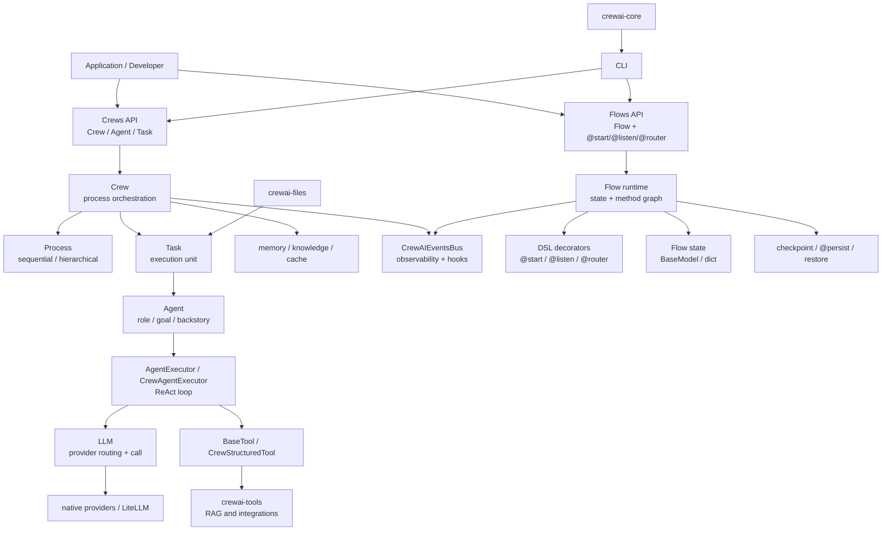

# CrewAI 源码架构分析

分析对象：`sources/crewai` 当前固定源码提交 `2b90117e887ef68a22ccf9552a58ffaf96de1fc4`。

本文参考 LangChain 源码分析的方式：先讲总体架构，再按源码分支展开，最后总结主流程和设计思想。

## 1. 总体结论

CrewAI 是一个面向生产级多 Agent 自动化的 Python 框架。它的源码主线不是单纯的“Agent 调 LLM”，而是两套互补抽象：

- **Crews**：用 `Crew + Agent + Task + Process` 表达角色化多 Agent 协作。
- **Flows**：用 `Flow + @start/@listen/@router` 表达事件驱动工作流。

一句话分享口径：

> CrewAI 的核心是把多 Agent 自动化拆成两层：需要自治协作时用 Crew，让角色化 Agent 执行 Task；需要确定性流程控制时用 Flow，用装饰器声明事件驱动的节点和路由。Crew 解决“谁来做任务”，Flow 解决“流程怎么走”。

## 2. 最高层分层

| 层级 | 目录/文件 | 主要职责 |
| --- | --- | --- |
| 工作区层 | `pyproject.toml`、`lib/*` | monorepo/workspace，包含主包、工具包、文件包、CLI、核心公共包 |
| Crew 编排层 | `lib/crewai/src/crewai/crew.py` | 管理 agents、tasks、process、memory、callbacks、kickoff |
| Agent 执行层 | `agent/core.py`、`agents/crew_agent_executor.py` | 组装 prompt、knowledge、tools，并通过 executor 驱动 LLM/tool loop |
| Task 单元层 | `task.py` | 描述任务、期望输出、上下文、结构化输出、guardrail、同步/异步执行 |
| Flow 工作流层 | `flow/runtime`、`flow/dsl` | 事件驱动流程、状态、start/listen/router 装饰器、恢复和持久化 |
| LLM 适配层 | `llm.py`、`llms/*` | provider 推断、native SDK/LiteLLM 路由、stream/tool call/response model |
| Tool 生态层 | `tools/*`、`lib/crewai-tools` | 工具基类、结构化工具、RAG 和外部集成 |
| 横切能力 | `events`、`memory`、`knowledge`、`telemetry`、`security` | 事件、可观测、记忆、知识、安全和钩子 |
| 工具链层 | `lib/cli`、`lib/crewai-core`、`lib/crewai-files` | 项目创建、运行、部署、文件输入、控制平面辅助能力 |

架构图见：[architecture.mmd](architecture.mmd)。



## 3. 源码分支分析

### 3.1 `lib/crewai`: 主框架包

`lib/crewai/src/crewai` 是主包，核心文件包括：

- `crew.py`：多 Agent 编排入口。
- `agent/core.py`：Agent 模型和任务执行。
- `task.py`：任务定义与输出封装。
- `flow/runtime/__init__.py`：Flow 运行时。
- `flow/dsl/*`：`@start`、`@listen`、`@router` 装饰器。
- `llm.py`：LLM provider 路由和调用。
- `events/event_bus.py`：事件总线。

### 3.2 Crew 主线：Crew -> Task -> Agent -> LLM/Tools

源码证据：

- `crew.py:159` 定义 `Crew`。
- `crew.py:966` 定义 `kickoff()`。
- `crew.py:1471`、`:1475` 分别进入 sequential 和 hierarchical process。
- `crew.py:1515` 定义 `_execute_tasks()`。
- `task.py:114` 定义 `Task`。
- `task.py:572` 定义 `execute_sync()`。
- `task.py:762` 定义 `_execute_core()`。
- `agent/core.py:170` 定义 `Agent`。
- `agent/core.py:740` 定义 `execute_task()`。
- `agent/core.py:846` 最终通过 `agent_executor.invoke(...)` 执行。

关键片段：

```python
class Crew(FlowTrackable, BaseModel):
    """
    Represents a group of agents, defining how they should collaborate and the
    tasks they should perform.
    """
```

```python
if self.process == Process.sequential:
    result = self._run_sequential_process()
elif self.process == Process.hierarchical:
    result = self._run_hierarchical_process()
```

```python
task_output = task.execute_sync(
    agent=exec_data.agent,
    context=context,
    tools=exec_data.tools,
)
```

```python
result = agent.execute_task(
    task=self,
    context=context,
    tools=tools,
)
```

Crew 主流程图见：[crew-flow.mmd](crew-flow.mmd)。

### 3.3 Process：顺序执行和层级管理

源码证据：

- `process.py:4` 定义 `Process`。
- `process.py` 当前包含 `sequential` 和 `hierarchical`。
- `crew.py:1480` 的 `_create_manager_agent()` 在 hierarchical 模式下创建 manager agent。

关键片段：

```python
class Process(str, Enum):
    sequential = "sequential"
    hierarchical = "hierarchical"
```

设计含义：

- sequential：按任务列表顺序执行，每个 task 输出可以成为后续 task context。
- hierarchical：创建或使用 manager agent，由 manager 负责协调任务和委派。

### 3.4 Task：任务是执行和输出的边界

`Task` 不是简单字符串，而是封装了任务描述、期望输出、agent、上下文、工具、结构化输出、guardrail、文件输出、human input 等。

源码证据：

- `task.py:114` 定义 `Task(BaseModel)`。
- `task.py:572` 同步执行入口。
- `task.py:612` 异步执行入口通过线程和 Future 包装。
- `task.py:762` `_execute_core()` 调用 agent，并生成 `TaskOutput`。

关键片段：

```python
class Task(BaseModel):
    """Class that represents a task to be executed.

    Each task must have a description, an expected output and an agent responsible for execution.
    """
```

```python
task_output = TaskOutput(
    name=self.name or self.description,
    description=self.description,
    expected_output=self.expected_output,
    raw=raw,
    pydantic=pydantic_output,
    json_dict=json_output,
    agent=agent.role,
)
```

### 3.5 Agent：角色化执行器

Agent 的核心字段是 role、goal、backstory、llm、tools、knowledge、planning、memory/context 等。执行时，它会把 task/context/tools 整理成 prompt，再交给 agent executor。

源码证据：

- `agent/core.py:170` 定义 `Agent(BaseAgent)`。
- `agent/core.py:740` `execute_task()` 负责准备 task prompt。
- `agent/core.py:846` `_execute_without_timeout()` 调用 `agent_executor.invoke(...)`。
- `agents/crew_agent_executor.py:98` 定义 `CrewAgentExecutor`。
- `agents/crew_agent_executor.py:208` 定义 `invoke()`。

关键片段：

```python
class Agent(BaseAgent):
    """Represents an agent in a system.

    Each agent has a role, a goal, a backstory, and an optional language model (llm).
    """
```

```python
invoke_result = self.agent_executor.invoke(
    {
        "input": task_prompt,
        "tool_names": self.agent_executor.tools_names,
        "tools": self.agent_executor.tools_description,
        "ask_for_human_input": task.human_input,
    }
)
```

### 3.6 Flow 主线：装饰器驱动的事件工作流

Flow 是 CrewAI 的另一条主线。它更像确定性流程引擎：方法用 `@start` 标记入口，用 `@listen` 监听上游结果，用 `@router` 根据返回值分支。

源码证据：

- `flow/runtime/__init__.py:375` 定义 `FlowMeta`。
- `flow/runtime/__init__.py:428` 定义 `Flow`。
- `flow/runtime/__init__.py:1896` 定义同步 `kickoff()`。
- `flow/runtime/__init__.py:1961` 定义 `kickoff_async()`。
- `flow/runtime/__init__.py:2410` 执行 start method。
- `flow/runtime/__init__.py:2695` 执行 listeners。
- `flow/dsl/_start.py:18` 定义 `start()`。
- `flow/dsl/_listen.py:18` 定义 `listen()`。
- `flow/dsl/_router.py:97` 定义 `router()`。

关键片段：

```python
class Flow(BaseModel, Generic[T], metaclass=FlowMeta):
    """Base class for all flows."""
```

```python
def start(condition: FlowTrigger | None = None) -> FlowMethodDecorator:
    """Marks a method as a flow's starting point."""
```

```python
def listen(condition: FlowTrigger) -> FlowMethodDecorator:
    """Creates a listener that executes when specified conditions are met."""
```

Flow 主流程图见：[flow-flow.mmd](flow-flow.mmd)。

### 3.7 LLM 和 Tool：统一接入外部能力

CrewAI 的 LLM 层负责 provider 推断和调用，Tool 层负责把函数/工具变成可供 Agent 使用的结构化工具。

源码证据：

- `llm.py:368` 定义 `LLM(BaseLLM)`。
- `llm.py:1780` 定义高层 `call()`。
- `tools/base_tool.py:103` 定义 `BaseTool`。
- `tools/base_tool.py:376` 定义工具 `_run()` 抽象。

关键片段：

```python
class LLM(BaseLLM):
    llm_type: Literal["litellm"] = "litellm"
```

```python
def call(
    self,
    messages: str | list[LLMMessage],
    tools: list[dict[str, BaseTool]] | None = None,
    ...
) -> str | Any:
    """High-level LLM call method."""
```

### 3.8 Events：可观测和扩展的横切层

CrewAI 的核心执行路径大量 emit event，例如 Crew kickoff、Task started/completed、Agent execution、LLM call、Flow started/finished。这让 tracing、streaming、telemetry、hooks 能作为横切层工作。

源码证据：

- `events/event_bus.py:95` 定义 `CrewAIEventsBus`。
- `events/event_bus.py:572` 定义 `emit()`。
- `events/types/*` 定义 Crew、Task、Agent、LLM、Flow 等事件类型。

## 4. 核心设计思想

### 4.1 面向业务语义建模

CrewAI 的顶层抽象直接是 `Agent`、`Task`、`Crew`、`Flow`，这比通用 Runnable/Graph 更贴近业务自动化表达。

### 4.2 双主线架构

Crews 偏自治协作，Flows 偏确定性控制。两者可以组合：Flow 里可以调用 Crew，Crew 的结果也能进入 Flow 的后续节点。

### 4.3 编排和执行分离

Crew 负责组织 task 顺序和 process，Task 负责执行边界，Agent 负责 prompt/tools/knowledge，Executor 负责 LLM/tool loop。

### 4.4 装饰器 DSL

Flow 用装饰器把 Python 方法转成 workflow 节点和路由。这种设计让普通 Python 类可以变成事件图。

### 4.5 事件总线横切

CrewAI 没有把 tracing、streaming、telemetry 写死在业务逻辑里，而是通过 event bus 把执行过程广播出去。

### 4.6 适配器和工具生态

LLM 层适配 native providers / LiteLLM，Tool 层通过 `BaseTool` / structured tool 把外部能力标准化。

## 5. 分享建议

建议分享顺序：

1. 先讲 CrewAI 的一句话定位：多 Agent 自动化框架，核心是 Crews + Flows。
2. 再讲目录：主包 `lib/crewai`，工具 `crewai-tools`，文件输入 `crewai-files`，CLI 和 core。
3. 再讲 Crews 主流程：`Crew.kickoff -> process -> _execute_tasks -> Task.execute -> Agent.execute_task -> agent_executor.invoke -> LLM/tools`。
4. 再讲 Flows 主流程：`@start/@listen/@router -> Flow.kickoff -> kickoff_async -> execute start -> execute listeners`。
5. 最后讲设计思想：业务语义建模、双主线、分层执行、装饰器 DSL、事件总线、适配器生态。

收束句：

> CrewAI 源码并不是围绕一个复杂 Agent 循环展开，而是围绕两个产品级抽象展开：Crew 把角色、任务和协作方式组织起来，Flow 把确定性流程和事件路由组织起来。理解这两条线，再看 LLM、tools、memory、events，就能看清整个框架。
