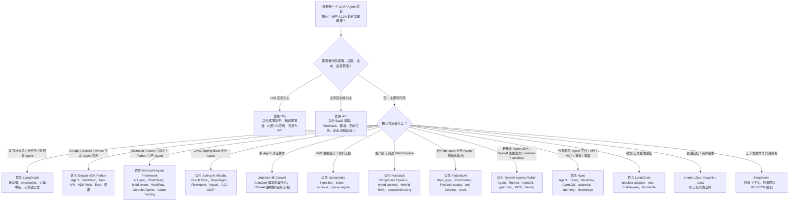
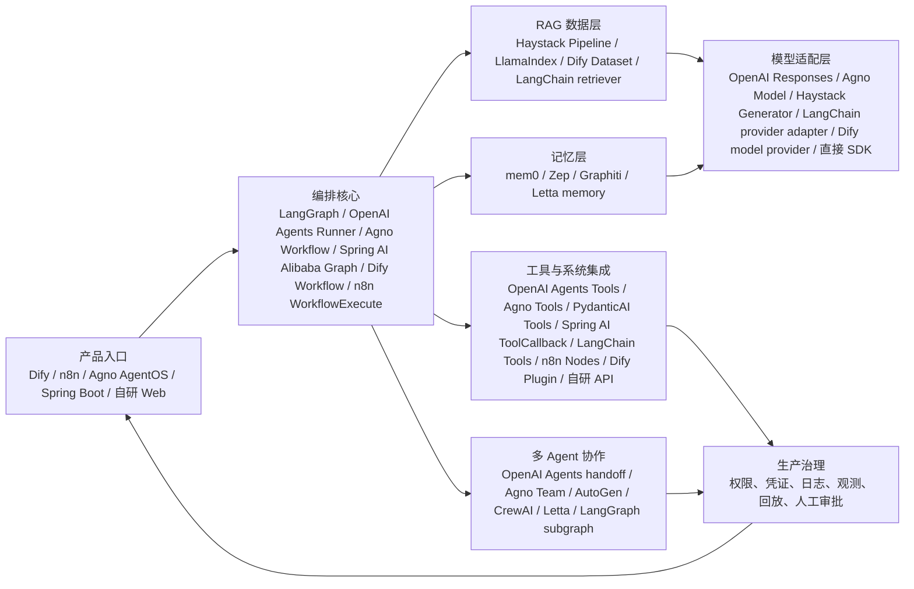

# LLM / Agent 开源框架源码横向分析与选型指南

本文是前面单框架源码分析的横向总览。目标不是再复述每个项目的文件结构，而是回答分享和方案设计中最常见的 5 个问题：

1. 这些框架分别解决什么问题？
2. 真实项目里应该怎么选型？
3. 多个框架如何组合，而不是互相替代？
4. 源码里体现了哪些核心设计范式？
5. 用真实案例解释时，应该怎么讲？

阅读建议：先看总览矩阵，再看选型指南，最后按场景看组合方式和案例。

## 1. 总览对比矩阵

横向地图见：[framework-landscape.mmd](framework-landscape.mmd)。

```mermaid
flowchart TB
    Goal["开源 LLM / Agent 框架源码横向地图<br/>先按解决的问题分类，而不是按 Star 或流行度分类"]
    Goal --> App["应用平台层<br/>把 AI 能力产品化、可配置、可运营"]
    App --> Dify["Dify<br/>LLM 应用平台：Workflow、RAG、Agent、Plugin、模型、观测"]
    App --> N8N["n8n<br/>通用自动化平台：触发器、节点、凭证、队列、可视化流程"]
    App --> Agno["Agno<br/>代码优先 Agent platform SDK：AgentOS、API、MCP、审批、调度、接口"]
    Goal --> Runtime["Agent / Workflow 运行时层<br/>解决复杂任务如何可靠推进"]
    Runtime --> LangGraph["LangGraph<br/>代码级状态图、checkpoint、中断恢复、Pregel 模型"]
    Runtime --> GoogleADK["Google ADK Python<br/>Agent + Workflow + Task API + ADK Web / Eval / Google Cloud"]
    Runtime --> MAF["Microsoft Agent Framework<br/>Python + .NET 生产级 Agent / Workflow、Durable Agents、Azure hosting"]
    Runtime --> SpringAIAlibaba["Spring AI Alibaba<br/>Java / Spring Boot Agentic AI：Graph Core、ReactAgent、FlowAgent、Nacos/A2A/MCP"]
    Runtime --> AutoGen["AutoGen<br/>多 Agent 消息运行时、GroupChat、团队协作"]
    Runtime --> CrewAI["CrewAI<br/>Crew / Agent / Task / Flow，角色分工式协作"]
    Runtime --> Letta["Letta<br/>状态化 Agent、core/archival memory、tool-first loop"]
    Goal --> Component["组件与数据层<br/>给应用提供 LLM/RAG/记忆基础能力"]
    Component --> LangChain["LangChain<br/>模型适配、Runnable、Agent middleware、工具和生态集成"]
    Component --> OpenAIAgents["OpenAI Agents Python<br/>轻量 Agent SDK：Runner、handoff、guardrail、MCP、tracing、realtime、sandbox"]
    Component --> PydanticAI["PydanticAI<br/>typed Agent、Pydantic schema、工具和结构化输出、evals"]
    Component --> LlamaIndex["LlamaIndex<br/>Ingestion、Index、Retriever、QueryEngine、RAG 数据框架"]
    Component --> Haystack["Haystack<br/>Component Pipeline、typed sockets、DocumentStore、Hybrid RAG、调试观测"]
    Component --> Memory["记忆 / 知识图谱"]
    Memory --> Mem0["mem0<br/>记忆抽取、向量/图谱存储、生命周期管理"]
    Memory --> Zep["Zep<br/>会话记忆、上下文组装、长期记忆服务化"]
    Memory --> Graphiti["Graphiti<br/>时序知识图谱、episode ingestion、实体关系搜索"]
    Goal --> Infra["上下文与代理基础设施"]
    Infra --> Headroom["Headroom<br/>上下文压缩、代理网关、MCP/CCR 适配、Rust 热路径"]
```

| 框架 | 一句话定位 | 核心抽象 | 强项 | 局限 | 最适合讲的源码主线 |
| --- | --- | --- | --- | --- | --- |
| LangChain | LLM 应用组件和集成生态 | Runnable、Tool、Agent middleware、Provider adapter | 模型/工具生态、组合式调用、迁移兼容 | 不是完整产品平台，复杂状态恢复要靠 LangGraph | provider adapter、middleware、classic 迁移 |
| OpenAI Agents Python | 轻量多 Agent SDK | Agent、Runner、Tool、Handoff、Guardrail、Session、Trace | OpenAI Responses / Chat Completions / WebSocket 原生，handoff、guardrail、MCP、tracing、realtime、sandbox 覆盖完整 | 不是低代码平台，也不是显式状态图 runtime；复杂 checkpoint-first 流程建议组合 LangGraph | Runner loop、ToolExecutionPlan、handoff tool、guardrail tripwire、MCP approval、RealtimeRunner、SandboxAgent |
| OpenAI Swarm | OpenAI experimental / educational 多 Agent 原型 | Agent、functions、Result、Response、handoff、context_variables | 源码极短，适合讲清 handoff、tool call、stateless loop 和可测试路由 | README 明确建议生产用例迁移到 OpenAI Agents SDK；缺少 session、tracing、guardrails、MCP、checkpoint | Swarm.run loop、function_to_json、handle_tool_calls、Agent return handoff、execute_tools=False evals |
| PydanticAI | Pydantic 风格 typed Agent framework | Agent、RunContext、Tool、OutputSchema、Model、Provider | typed deps、Pydantic 结构化输出、tool schema、evals、Logfire/OTel | 不是低代码平台，也不是完整 RAG 数据管线或 checkpoint-first runtime | Agent graph、tool/function schema、structured output、provider adapter、pydantic_evals |
| Agno | 代码优先 Agent platform SDK | Agent、Team、Workflow、AgentOS、Approval、Memory、Knowledge | 生产 API、WebSocket、MCP、HITL 审批、调度、接口、session/run 治理 | 不是低代码运营平台，复杂 checkpoint-first 状态图不如 LangGraph 专注，重 RAG ingestion 需组合 Haystack/LlamaIndex | Agent run、TeamMode、Workflow Step、AgentOS routers、approval decorator |
| LangGraph | 代码级 Agent 状态图运行时 | StateGraph、Pregel、checkpoint、interrupt | 复杂状态机、可恢复、人类中断、可测试 | 需要自己做 UI、权限、运营平台 | Pregel 执行、checkpoint、中断恢复 |
| Google ADK Python | Google 生态 Agent 应用开发框架 | Agent、Workflow、Runner、Event、Task API、Eval | Gemini / Vertex / Google Cloud 生态、ADK Web、API Server、Workflow、HITL、评测闭环 | checkpoint-first 状态图纯度不如 LangGraph，非 Google 生态场景优势会弱一些 | Runner、Workflow rehydration、RequestInput、AgentTool、Evaluation |
| Microsoft Agent Framework | Microsoft 生态生产级 Agent / Workflow 框架 | Python Agent、.NET AIAgent、ChatClient、Middleware、Workflow、Durable Agent | Python + .NET 双语、provider adapter、middleware 治理、durable hosting、Azure Functions、OTel / Eval | 比轻量 SDK 更重；纯 checkpoint-first 状态图和 LangGraph 相比不够专注 | AIAgent / AgentResponse、ChatClient、middleware、WorkflowBuilder、Durable Agents |
| Semantic Kernel | Microsoft 应用内 AI Kernel / 插件函数体系 | Kernel、KernelPlugin、KernelFunction、FunctionChoiceBehavior、AgentGroupChat、Process、Vector Search | 适合把存量业务方法、prompt、OpenAPI/MCP、RAG search 包装成统一工具协议，Python/.NET 双栈友好 | README 已明确 MAF 是 enterprise-ready successor；新生产级 Agent runtime 应优先评估 MAF | Kernel invoke、plugin/function metadata、auto function calling、ProcessBuilder、VectorSearch search function、MAF 迁移 |
| Spring AI Alibaba | Java / Spring Boot 生态 Agentic AI 框架 | StateGraph、CompiledGraph、ReactAgent、FlowAgent、Hook、ToolCallback | 企业 Java 服务落地、Nacos/A2A/MCP、checkpoint、Observation、多 Agent flow | Java/Spring 学习和部署门槛较高，低代码平台能力需 Admin/Studio 配合 | Graph Core、ReactAgent、AgentToolNode、FlowAgent、Nacos/A2A starters |
| Dify | LLM 应用开发与运营平台 | App、Workflow、Dataset、Plugin、dify-agent | 可视化配置、RAG、Agent、发布、观测、权限 | 超复杂代码状态机不适合全塞画布 | WorkflowAppGenerator、DifyNodeFactory、RAG、Agent v2 |
| n8n | 通用自动化和集成平台 | Workflow、Node、Credential、Execution | SaaS 集成、Webhook、触发器、队列、低代码自动化 | LLM/Agent 是能力之一，不是唯一核心 | WorkflowExecute、ActiveWorkflow、Webhook、Queue |
| LlamaIndex | RAG 数据框架 | Document、Node、Index、Retriever、QueryEngine | ingestion、索引、检索、数据连接器 | 产品化和 Agent 运行治理要另搭 | IngestionPipeline、VectorStoreIndex、RetrieverQueryEngine |
| Haystack | 生产级 RAG / Agent 组件编排框架 | Component、Pipeline、DocumentStore、Tool、Snapshot | typed pipeline、hybrid retrieval、debug、tracing、可序列化 | 没有内置低代码运营平台，复杂长期状态机可组合 LangGraph | Component socket、Pipeline run loop、RAG、Agent ToolInvoker、breakpoint |
| AutoGen | 多 Agent 消息协作框架 | AssistantAgent、Message、GroupChat、Runtime | 多 Agent 对话、团队协作、消息路由 | 生产 UI/权限/任务治理要另搭 | AssistantAgent、GroupChat、runtime |
| CrewAI | 角色任务式 Agent 编排 | Crew、Agent、Task、Flow | 角色分工清晰，适合业务任务拆解 | 状态恢复和底层运行控制不如 LangGraph 精细 | Crew/Task 执行、Flow、Tool |
| Letta | 状态化长期记忆 Agent 平台 | AgentState、Memory、Tool、Run/Step | core/archival memory、工具优先、状态持久化 | 生态通用性不如 LangChain，部署复杂度较高 | AgentState、memory、tool-first loop |
| mem0 | 记忆抽取与生命周期管理 | Memory extraction、vector/graph store、update | 用户偏好、长期记忆、记忆更新 | 不是完整 Agent runtime | add/search/update/delete memory |
| Zep | 长期记忆服务和上下文组装 | Session、Memory、Graph、Context | 会话记忆服务化、上下文 API | 更像服务层，不负责完整编排 | memory service、context assembly |
| Graphiti | 时序知识图谱记忆 | Episode、Entity、Edge、Temporal search | 时序事实、实体关系、图谱搜索 | 不负责 LLM 应用编排 | episode ingestion、实体关系抽取、search |
| Headroom | 上下文压缩和代理网关 | proxy、compression、MCP/CCR adapter | 降低上下文成本、网关式接入 | 不是 Agent/RAG 框架 | 代理路径、压缩核心、fail-open |

## 2. 框架选型指南

选型流程见：[selection-flow.mmd](selection-flow.mmd)。

### 2.1 如果要做客服助手

优先看 Dify。原因是客服助手通常不只是一次 LLM 调用，而是“知识库 + 应用配置 + API 发布 + 人审 + 运行记录 + 运营可维护”。Dify 的 Dataset、Workflow、KnowledgeRetrievalNode、Agent v2、Human Input 和 Plugin 都围绕这个场景形成产品闭环。

当客服助手里面有复杂状态机，比如跨多个系统查订单、风控、退款、升级审批，可以把复杂内核放到 LangGraph，Dify 负责产品入口和知识库治理。

### 2.2 如果要做复杂 Agent 状态机

优先看 LangGraph。原因是复杂 Agent 的核心不是“会不会调用工具”，而是状态如何推进、失败如何恢复、人类如何中断、分支如何测试。LangGraph 的 StateGraph、Pregel 模型和 checkpoint 是为这个问题设计的。

如果需要对外提供可配置界面，可以外面包 Dify 或自研 Web；如果需要连接大量 SaaS，可以外面接 n8n。

如果团队主栈是 Java / Spring Boot，优先看 Spring AI Alibaba。它在源码上也有 `StateGraph`、`CompiledGraph`、checkpoint、stream、human-in-the-loop 和多 Agent flow，但更贴近 Spring AI `ChatClient` / `ToolCallback`、Spring Boot starter、Nacos 配置、A2A 注册发现和企业观测体系。

如果团队在 Google Cloud / Vertex AI / Gemini 生态里，优先看 Google ADK Python。它把 `LlmAgent`、`Workflow`、`Runner`、`Event`、`Task API`、ADK Web、API Server、Evaluation 和部署路径放在同一套框架里，适合从本地调试一路走到 Vertex Agent Engine / Cloud Run。

如果团队在 Microsoft / Azure / .NET 生态里，优先看 Microsoft Agent Framework。它把 Python Agent 与 .NET `AIAgent` 放在同一套 Agent / Workflow 设计里，核心不是只调一次模型，而是把 ChatClient provider adapter、middleware/context/session、tool approval/security、Workflow/orchestration、Durable Agents、Azure Functions hosting、OpenTelemetry 和 Evaluation 组合成生产级 Agent runtime。

如果是存量 Semantic Kernel 项目，重点不要只问“要不要换框架”，而是先盘点哪些资产是 `KernelPlugin`、`KernelFunction`、prompt template、vector search function。它们仍然有迁移价值：轻量应用内 AI 能力可以继续用 SK，生产级多 Agent、Durable、A2A/MCP 互操作和更完整治理则逐步迁到 Microsoft Agent Framework。

### 2.3 如果要做企业自动化

优先看 n8n。原因是企业自动化的关键是触发器、Webhook、凭证、节点生态、执行历史、队列和失败重试。n8n 的 WorkflowExecute、ActiveWorkflowManager、WebhookService、Queue/Worker 更接近生产自动化问题。

如果某个自动化节点里需要复杂 AI 决策，再调用 LangGraph 或 Dify 应用。

### 2.4 如果要做高质量 RAG

优先在 LlamaIndex 和 Haystack 之间区分：如果项目重点在数据接入、切分、索引、检索、query engine、评估和不同向量库连接，LlamaIndex 更像“RAG 数据工程框架”；如果项目重点是把检索、融合、重排、prompt、生成、调试、序列化、观测做成一条生产级可复现 Pipeline，Haystack 更合适。Dify 的 RAG 更产品化，LangChain 的 RAG 更生态组件化。

### 2.5 如果要做 Python typed 业务 Agent

优先看 PydanticAI。它适合“业务依赖、工具调用和最终输出都需要类型约束”的 Agent：用 `deps_type` 管运行依赖，用 `RunContext[T]` 把依赖传给工具和动态 instructions，用 Pydantic `BaseModel` 或 dataclass 固定最终输出。它不负责完整产品平台，也不负责复杂 RAG ingestion；更像 typed Agent 控制层，可以组合 Haystack、LlamaIndex、LangGraph 或 Dify。

### 2.5.1 如果要做 OpenAI 原生轻量多 Agent SDK

优先看 OpenAI Agents Python。它适合“代码里快速搭多 Agent、工具、handoff、guardrail、MCP、tracing、realtime 或 sandbox”的场景。它比 LangGraph 更轻，比 Dify 更代码化，比 Agno 更像 SDK 内核；如果流程需要显式状态图、checkpoint 和复杂人审恢复，再把它放进 LangGraph 节点里。

OpenAI Swarm 更适合作为学习材料或迁移前的历史背景。它用 `Agent + Python functions + Result.agent` 把 handoff 的原理讲得很清楚，但 README 已明确生产用例应迁到 OpenAI Agents SDK。

### 2.6 如果要做长期记忆

按记忆形态选：

- 用户偏好、事实记忆、增删改查：mem0。
- 会话记忆服务化、上下文 API：Zep。
- 时序实体关系、事实演化：Graphiti。
- 状态化 Agent 自带长期记忆：Letta。

## 3. 组合架构专题

组合图见：[composition-patterns.mmd](composition-patterns.mmd)。

### 3.1 Dify + LangGraph

适合“需要业务人员配置和运营，同时核心决策很复杂”的项目。Dify 负责应用入口、知识库、模型配置、Human Input、人审和运行记录；LangGraph 负责复杂 Agent 状态机、checkpoint、中断恢复和代码级测试。

典型做法：Dify Workflow 通过 HTTP 节点调用 LangGraph 服务，LangGraph 返回结构化结果，Dify 保存会话、展示过程、触发后续节点。

### 3.2 n8n + LangGraph

适合“业务系统集成很多，AI 决策只是其中一段”的项目。n8n 负责 Webhook、SaaS 节点、凭证、定时任务、重试和队列；LangGraph 负责复杂推理、工具调用和状态恢复。

典型做法：n8n 接收 CRM 事件，调用 LangGraph 判断下一步动作，再由 n8n 写回 CRM、发邮件、建工单。

### 3.3 LangChain + LangGraph

适合代码项目。LangChain 提供模型适配、工具、middleware、retriever 等组件；LangGraph 负责把这些组件组织成可恢复的状态图。简单链路用 LangChain 就够，复杂状态推进用 LangGraph。

### 3.4 Spring AI Alibaba + Spring Boot / Nacos / A2A

适合企业 Java 团队把 Agent 作为后端服务落地。Spring AI Alibaba 负责 Graph Core、ReactAgent、FlowAgent、ToolCallback、checkpoint 和 stream；Spring Boot 负责服务生命周期、依赖注入、配置和部署；Nacos 负责 Prompt/模型/MCP/Agent 配置治理；A2A 负责跨服务 Agent 注册发现。

典型做法：一个 Spring Boot 服务内运行主 Agent，财务/IT/HR 等子 Agent 通过 A2A 注册到 Nacos；主 Agent 根据任务路由到本地 FlowAgent 或远程 Agent。

### 3.5 LlamaIndex + LangGraph

适合“RAG 很重，同时需要复杂 Agent”的项目。LlamaIndex 负责数据接入、索引和检索；LangGraph 负责查询规划、工具调用、多步推理和状态恢复。

### 3.6 Haystack + LangGraph

适合“RAG pipeline 很重，同时又有长期复杂状态机”的项目。Haystack 负责 typed component graph、DocumentStore、hybrid retrieval、ranker、generator、serialization、snapshot 和 tracing；LangGraph 负责跨多轮任务状态、checkpoint、人类中断和复杂分支。

典型做法：LangGraph 的某个节点调用 Haystack Pipeline 完成“检索 + 重排 + 生成 + 返回证据”，LangGraph 根据结构化结果决定是否继续查工具、升级人工、写回系统。

### 3.7 PydanticAI + LangGraph / Haystack

适合“单个业务 Agent 要强类型、强结构化输出，同时又需要复杂状态机或重 RAG”的项目。PydanticAI 负责 typed deps、tool schema、output schema 和 evals；LangGraph 负责 checkpoint、人类中断和长流程状态；Haystack 或 LlamaIndex 负责复杂 RAG 检索管线。

典型做法：LangGraph 的节点调用 PydanticAI Agent，Agent 内部工具再调用 Haystack Pipeline；PydanticAI 返回 Pydantic 结构化结果，LangGraph 根据结果决定下一步。

### 3.7.1 OpenAI Agents Python + LangGraph / Dify / Agno

适合“内层 Agent loop 要轻，且需要 OpenAI Responses、handoff、guardrail、tracing、realtime 或 sandbox；外层还需要产品入口或复杂状态机”的项目。OpenAI Agents Python 做单个任务单元，LangGraph 做外层状态图和 checkpoint，Dify/Agno 做产品化入口或平台治理。

典型做法：LangGraph 某个节点调用 OpenAI Agents Runner 完成客服分流、工具调用或语音实时交互；Runner 返回结构化结果和 trace，LangGraph 决定是否进入审批、退款、升级或人工节点。

### 3.7.2 Google ADK Python + LangGraph / Dify / n8n

适合“团队主场在 Google 生态，但外层还有跨系统状态机、产品入口或自动化集成”的项目。ADK 负责 Gemini / Vertex / Google API / ADK Web / Eval / API Server；LangGraph 负责跨框架强 checkpoint 状态机；Dify 负责低代码 LLM 应用入口；n8n 负责企业 SaaS 自动化和触发器。

典型做法：ADK Workflow 处理 Google 生态内的多 Agent 和 HITL，Dify 或 n8n 通过 HTTP 调用 ADK API Server；如果跨系统长流程需要更强 checkpoint，则外层 LangGraph 调用 ADK Runner 作为节点。

### 3.7.3 Microsoft Agent Framework + Azure / LangGraph / Dify

适合“团队主场在 Microsoft / Azure / .NET，同时需要 Python Agent 能力或外层产品入口”的项目。MAF 负责 AIAgent / Python Agent、provider adapter、middleware 治理、Workflow、Durable Agents 和 Azure Functions hosting；LangGraph 可以负责更专注的 checkpoint-first 状态图；Dify 可以负责业务人员可配置的应用入口。
典型做法：企业报销、IT 工单、合规审批这类长任务用 Durable Agent 保存会话和 pending approval；如果流程中有非常复杂的状态机，把这一段拆给 LangGraph；对业务用户暴露时，由 Dify 或自研 Web 调用 MAF 的 HTTP endpoint。

### 3.7.4 Semantic Kernel + Microsoft Agent Framework

适合“已经有 SK 插件函数、prompt、RAG search 资产，但要升级到生产级 Agent runtime”的项目。SK 里最有复用价值的是 `KernelFunction`、`KernelPlugin`、prompt template 和 search function；MAF 承担新的 Agent / Workflow / Durable / observability / evaluation 运行时。

典型做法：先把 SK 插件清单按“纯查询工具、带副作用工具、prompt 函数、RAG 检索函数”分组；纯工具迁移为 MAF tools，长任务迁移为 MAF Workflow / Durable Agents，外层入口继续用 Azure Functions、Dify 或自研 Web。

### 3.8 Haystack + Dify / n8n

适合“外层需要产品化或自动化入口，内层需要工程团队维护 RAG 内核”的项目。Dify 可以做应用入口、知识库运营、权限、人审和观测面；n8n 可以做 Webhook、CRM、IM、工单和审批流；Haystack 放在后端服务里承接可测试、可序列化、可追踪的 RAG Pipeline。

### 3.9 mem0 / Zep / Graphiti + Agent 框架

适合长期个性化助手或企业知识沉淀。Agent 框架负责当下任务，记忆系统负责跨会话事实、偏好、关系和历史上下文。记忆不要只塞 prompt，要有抽取、更新、冲突处理和检索策略。

## 4. 源码设计范式专题

设计范式图见：[design-patterns.mmd](design-patterns.mmd)。

```mermaid
flowchart TB
    Pattern["源码设计范式横向总结"]
    Pattern --> Graph["图运行时范式<br/>把任务变成节点、边、状态和事件"]
    Graph --> LG["LangGraph：StateGraph + Pregel + checkpoint"]
    Graph --> ADK["Google ADK：Workflow + Event rehydration + NodeRunner"]
    Graph --> MAF["Microsoft Agent Framework：WorkflowBuilder + WorkflowEvent + checkpoint + durable hosting"]
    Graph --> SAA["Spring AI Alibaba：StateGraph + CompiledGraph + CheckpointSaver"]
    Graph --> DifyG["Dify：Workflow.graph + graphon + DifyNodeFactory"]
    Graph --> N8NG["n8n：Workflow JSON + WorkflowExecute + runData"]
    Pattern --> AgentLoop["Agent Loop 范式<br/>模型输出动作，工具执行，状态回写"]
    AgentLoop --> PAI["PydanticAI：typed deps + tool schema + structured output"]
    AgentLoop --> OAI["OpenAI Agents：Runner + handoff + guardrail + tracing"]
    AgentLoop --> AgnoA["Agno：Agent + Team + Workflow + AgentOS 平台化运行"]
    AgentLoop --> Auto["AutoGen：消息驱动、多 Agent runtime"]
    AgentLoop --> Crew["CrewAI：角色、任务、流程、工具"]
    AgentLoop --> LettaP["Letta：AgentState、Memory、tool-first loop"]
    AgentLoop --> DifyA["Dify Agent v2：dify-agent + Agenton layers + pause"]
    Pattern --> RAG["RAG Pipeline 范式<br/>ingestion、index、retrieve、rerank、context injection"]
    RAG --> HS["Haystack：typed Component Pipeline + DocumentStore + debug/tracing"]
    RAG --> LI["LlamaIndex：数据管线最完整"]
    RAG --> DifyR["Dify：产品化 Dataset + 检索节点"]
    RAG --> LCR["LangChain：组件和集成生态"]
    Pattern --> MemoryP["记忆范式<br/>短期上下文、长期记忆、图谱记忆、时序事实"]
    MemoryP --> M0["mem0：抽取-存储-更新-检索"]
    MemoryP --> Z["Zep：会话级上下文服务"]
    MemoryP --> G["Graphiti：时序知识图谱"]
```

### 4.1 图运行时范式

代表项目：LangGraph、Spring AI Alibaba、Dify、n8n。

共同点是把复杂流程变成“节点 + 边 + 状态 + 事件”。差异在于：

- LangGraph 偏 Python/JS 代码级状态图，核心是可测试、可恢复、可中断。
- Google ADK Python 偏 Google 生态 Agent 应用开发，核心是 `Workflow + Event + Session + rehydration + ADK Web / Eval`。
- Microsoft Agent Framework 偏 Microsoft / Azure 生态生产级 Agent runtime，核心是 `Agent/AIAgent + ChatClient + Middleware + Workflow + Durable Agents`。
- Semantic Kernel 偏 Microsoft 生态应用内 AI Kernel，核心是 `Kernel + Plugin + KernelFunction + FunctionChoiceBehavior`；README 已明确生产级后继方向是 Microsoft Agent Framework。
- Spring AI Alibaba 偏 Java / Spring Boot 状态图和 Agent 服务化，核心是 `StateGraph + CompiledGraph + ReactAgent + CheckpointSaver`，并接入 Nacos/A2A/MCP。
- Dify 偏 LLM 应用画布，核心是产品配置、节点依赖注入、运行事件和人审。
- n8n 偏通用自动化图，核心是节点生态、凭证、触发器、执行历史和队列。

分享时可以这样讲：图运行时不是为了“画图好看”，而是为了让复杂任务可以被拆分、追踪、恢复和局部重跑。

### 4.2 Agent Loop 范式

代表项目：OpenAI Agents Python、OpenAI Swarm、PydanticAI、AutoGen、CrewAI、Letta、Dify Agent v2、LangGraph prebuilt Agent。

核心循环是：模型读取状态 -> 决定动作 -> 工具执行 -> 结果写回状态 -> 继续或结束。不同框架改变的是“状态放在哪里、谁来调度、如何多人协作、是否能暂停恢复”。

- AutoGen 把 Agent 协作建模成消息运行时。
- CrewAI 把任务拆成角色、任务和流程。
- Letta 把 Agent 状态和记忆持久化。
- Dify Agent v2 用 dify-agent 和 Agenton layers 处理工具、知识、人审和 session snapshot。
- LangGraph 用状态图让 Agent loop 可控、可恢复。
- PydanticAI 用 `deps_type`、`RunContext`、`ToolDefinition`、`OutputSchema` 把 Agent loop 的输入、动作和输出都类型化。
- OpenAI Agents Python 用 `Runner` 推进 Agent loop，把 handoff、guardrail、MCP、session 和 tracing 标准化，适合做轻量内层 Agent 执行单元。
- OpenAI Swarm 用 `Swarm.run` 演示最小 Agent loop：Chat Completions 返回 tool calls，Python 函数执行，函数返回 Agent 时切换 active agent。

### 4.3 RAG Pipeline 范式

代表项目：Haystack、LlamaIndex、Dify、LangChain。

RAG 不是“向量库搜一下”。完整管线至少包括：数据接入、切分、metadata、embedding、索引、检索、rerank、上下文注入、引用来源、评估和更新。

- Haystack 的强项是把 RAG 做成 typed Component Pipeline，天然包含连接校验、hybrid retrieval、ranker、序列化、snapshot 和 tracing。
- LlamaIndex 的强项是数据管线和索引/检索抽象。
- Dify 的强项是产品化知识库、检索节点、metadata filtering、rerank 和运营界面。
- LangChain 的强项是和模型、工具、retriever、agent 生态组合。

### 4.4 Memory 范式

代表项目：mem0、Zep、Graphiti、Letta。

记忆有四种常见形态：

- 短期上下文：当前对话窗口里能用的信息。
- 长期事实：用户偏好、稳定事实、历史事件摘要。
- 图谱关系：人、组织、项目、事件之间的关系。
- 时序事实：事实随时间变化，需要知道什么时候成立。

mem0 更关注记忆生命周期，Zep 更关注会话上下文服务化，Graphiti 更关注时序知识图谱，Letta 更关注状态化 Agent 内置记忆。

## 5. 真实案例合集

案例地图见：[case-map.mmd](case-map.mmd)。

```mermaid
flowchart TB
    Cases["真实案例选择框架组合"]
    Cases --> CS["企业客服助手<br/>Dify + Haystack/LlamaIndex/Dify Dataset + LangGraph 可选"]
    Cases --> KBRAG["企业知识库 RAG 内核<br/>Haystack Pipeline + DocumentStore + rerank/tracing"]
    Cases --> AgnoCase["代码优先 Agent 平台<br/>Agno AgentOS + Agent/Team/Workflow + 审批/MCP"]
    Cases --> OpenAICase["轻量多 Agent SDK<br/>OpenAI Agents Runner + handoff + guardrail + tracing"]
    Cases --> Sales["销售助理 / CRM 自动化<br/>n8n + LangGraph + LangChain Tools"]
    Cases --> Ticket["工单自动化<br/>n8n 触发器 + Dify 人审 + LangGraph 决策"]
    Cases --> Code["代码分析 Agent<br/>LangGraph + LangChain Tools + Headroom"]
    Cases --> Memory["个人长期记忆助手<br/>Letta 或 mem0/Zep/Graphiti + LangGraph"]
    Cases --> Research["研究型多 Agent<br/>AutoGen / CrewAI + LangGraph checkpoint"]
    Cases --> JavaAgent["企业 Java Agent 服务<br/>Spring AI Alibaba + Nacos/A2A/MCP + Spring Boot"]
```

### 5.1 企业客服助手

推荐组合：Dify + Dify Dataset / Haystack / LlamaIndex + LangGraph 可选。

为什么：

- 业务人员需要维护知识库、提示词、应用配置和人审节点，Dify 适合做产品入口。
- 知识库复杂时，LlamaIndex 可以承担更细的数据 ingestion 和检索策略；如果需要把检索、融合、重排、生成和调试做成可复现后端服务，Haystack 可以作为 RAG 内核。
- 如果涉及退款、风控、升级审批等复杂状态机，可以把决策内核放到 LangGraph。

分享叙述：用户提问进入 Dify App，Workflow 先做知识检索，再由 LLM 生成初答；如果触发高风险规则，进入 Human Input 或调用 LangGraph 服务处理复杂决策。

### 5.1.1 企业知识库 RAG 内核

推荐组合：Haystack Pipeline + DocumentStore + ranker / tracing。

为什么：

- Haystack 的 `Component + Pipeline + typed socket` 能把 converter、preprocessor、embedder、retriever、joiner、ranker、prompt builder、generator、writer 拆成可测试节点。
- `DocumentStore` 让 InMemory、Elasticsearch、Qdrant、Pinecone、Weaviate 等后端可以替换，避免业务代码直接绑死某个数据库。
- `Breakpoint / PipelineSnapshot / Tracer` 让生产问题可以定位到“召回少了、融合错了、重排错了、prompt 太长了、生成偏了”中的哪一步。

分享叙述：企业先把政策文档、产品手册、工单 FAQ 写入 Haystack indexing pipeline；用户提问时 query pipeline 同时走 BM25 和 embedding retriever，再用 joiner/ranker 合并排序，最后 prompt builder 注入上下文给 generator。外层可以是 Dify 页面、n8n 自动化触发器或自研 Web。

### 5.1.2 代码优先 Agent 平台

推荐组合：Agno AgentOS + Agent / Team / Workflow + 审批 / MCP。

为什么：

- Agno 适合工程团队用代码定义 Agent、Team、Workflow，同时直接暴露 REST、WebSocket、MCP 和接口入口。
- AgentOS 把 session/run、审批、调度、权限和数据库生命周期放进平台层，减少每个项目重复补服务化外壳。
- 如果内部状态机特别复杂，可以把 LangGraph 作为核心决策服务；如果 RAG 很重，可以让 Agno Agent 调用 Haystack 或 LlamaIndex 后端。

分享叙述：财务审批 Agent 用 Agno 定义工具、知识库和审批动作，AgentOS 对外提供 API 和 MCP；当付款工具触发 `@approval(type="required")` 时运行暂停，审批人处理后再 continue_run，最终把 run、session、approval 记录持久化。

### 5.1.3 轻量多 Agent SDK

推荐组合：OpenAI Agents Python + LangGraph 可选 + Dify/Agno 可选。

为什么：

- OpenAI Agents Python 适合快速写 Agent、handoff、guardrail、MCP tool、session 和 tracing。
- 如果流程是复杂状态机，用 LangGraph 包外层；如果要产品化入口，用 Dify 或 Agno 包外层。
- 如果要语音实时助手或代码长任务，可以直接用 RealtimeRunner 或 SandboxAgent。

分享叙述：客服请求先进入 Triage Agent，模型根据 handoff 工具转交 Billing Agent；敏感请求被 input guardrail 拦截；订单查询通过 function tool 或 MCP tool 执行；trace 记录 task、turn、agent、function 和 handoff，便于复盘。

### 5.2 销售助理 / CRM 自动化

推荐组合：n8n + LangGraph + LangChain Tools。

为什么：

- CRM、邮件、Slack、表格、Webhook 是 n8n 的强项。
- 判断客户意图、生成跟进计划、跨多步查询适合 LangGraph。
- 模型和工具适配可以用 LangChain。

分享叙述：n8n 监听 CRM 新线索，调用 LangGraph 判断客户等级和下一步动作，再由 n8n 写回 CRM、创建任务、通知销售。

### 5.3 工单自动化

推荐组合：n8n + Dify + LangGraph。

为什么：

- n8n 负责工单系统、邮件、IM、审批系统集成。
- Dify 负责客服/运营可配置的 AI 应用和人审界面。
- LangGraph 负责复杂决策和可恢复执行。

分享叙述：Webhook 触发 n8n，n8n 调 Dify 做知识问答和初步分类；复杂工单转 LangGraph，完成后再由 n8n 更新工单状态。

### 5.4 代码分析 Agent

推荐组合：LangGraph + LangChain Tools + Headroom。

为什么：

- 代码分析通常是多步状态机：检索文件、建立假设、运行测试、修复、复查。
- LangChain Tools 可封装 shell、搜索、代码检索等能力。
- Headroom 可做上下文压缩和代理网关，降低长上下文成本。

分享叙述：LangGraph 管理分析状态和检查点，工具层读取仓库和运行测试，Headroom 在上下文膨胀时压缩历史。

### 5.5 个人长期记忆助手

推荐组合：Letta 或 mem0/Zep/Graphiti + LangGraph。

为什么：

- 如果想要完整状态化 Agent，可以看 Letta。
- 如果只需要记忆服务，用户偏好选 mem0，会话上下文选 Zep，时序关系选 Graphiti。
- LangGraph 可以负责长期任务规划和工具调用。

分享叙述：对话进入 Agent 后，短期上下文解决当前问题；长期记忆系统负责召回用户偏好、历史事实和关系变化。

### 5.6 研究型多 Agent

推荐组合：AutoGen 或 CrewAI + LangGraph checkpoint。

为什么：

- AutoGen 更适合消息驱动的多 Agent 讨论。
- CrewAI 更适合角色、任务、交付物清晰的协作。
- LangGraph 可包住关键状态和 checkpoint，避免长任务失败后全部重跑。

分享叙述：多个 Agent 分别做检索、分析、批判、写作；LangGraph 管理阶段状态和恢复点。

### 5.7 企业 Java Agent 服务

推荐组合：Spring AI Alibaba + Spring Boot + Nacos / A2A / MCP。

为什么：

- Java 团队可以复用 Spring Boot 的服务生命周期、依赖注入、配置、日志和部署体系。
- Spring AI Alibaba 的 Graph Core 负责可恢复状态图，Agent Framework 负责 ReactAgent、多 Agent flow、Hook、Interceptor 和 ToolCallback。
- Nacos Config 负责 Prompt、模型、MCP 工具和 Agent 配置治理；A2A Nacos 负责远程 Agent 注册发现。

分享叙述：企业内部知识助理运行在 Spring Boot 服务中，本地 ReactAgent 处理常规问答，复杂审批进入 StateGraph，财务/IT/HR 子 Agent 通过 A2A 注册到 Nacos，主 Agent 按任务路由，checkpoint saver 保证人工中断后能恢复。

## 6. 分享顺序建议

如果要做一场完整分享，可以按下面顺序：

1. 先用“问题分类图”说明这些框架不是同一个赛道。
2. 再讲总览矩阵，告诉听众每个框架最该看什么源码。
3. 用选型流程回答“我该选哪个”。
4. 用组合架构说明真实项目通常是多框架组合。
5. 用设计范式把源码抽象升维：图运行时、Agent loop、RAG pipeline、Memory。
6. 最后用 2-3 个真实案例收束，帮助听众把概念落地。

一句话收尾：

> 选框架不是选“最强的那个”，而是先判断问题属于产品平台、状态图运行时、RAG 数据层、记忆系统还是自动化集成，再组合对应的源码范式。
