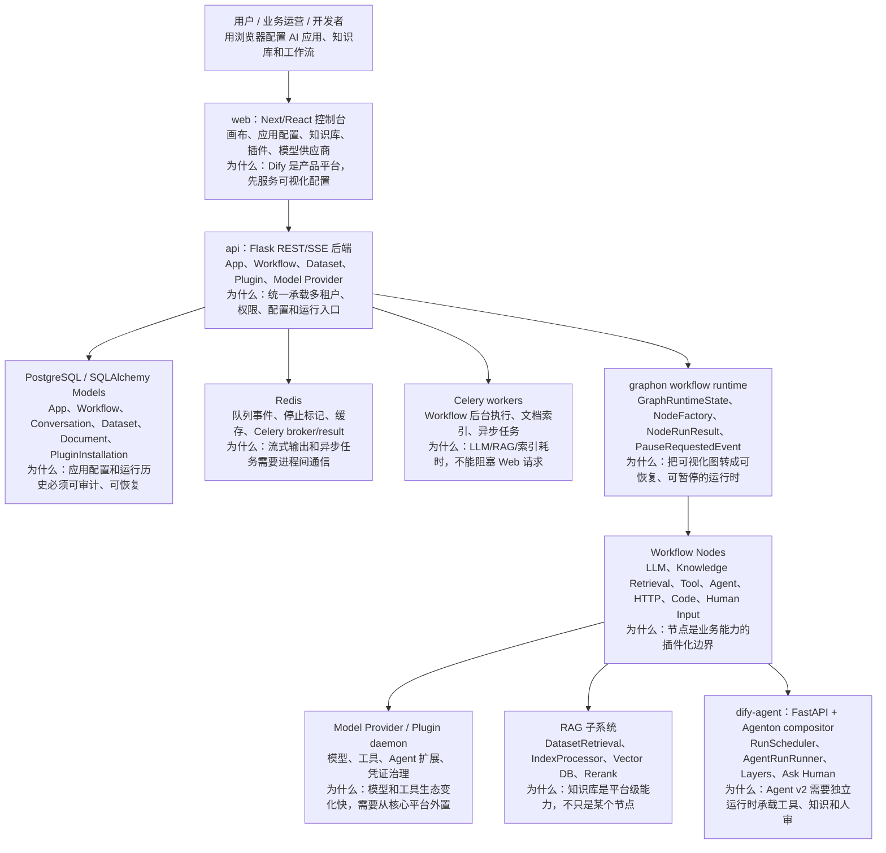
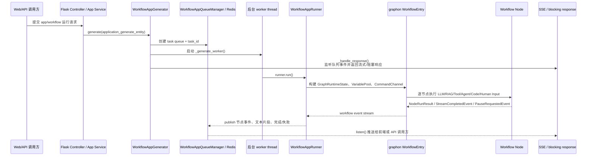
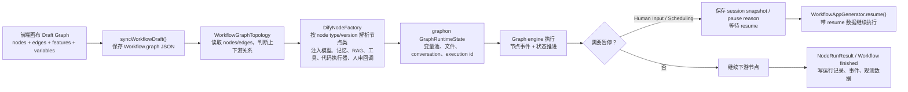
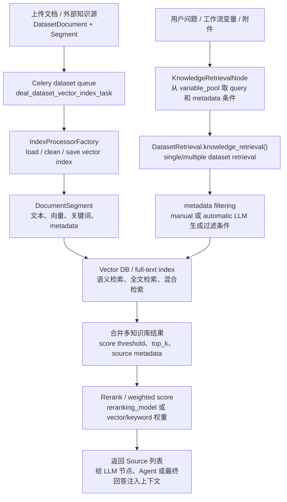
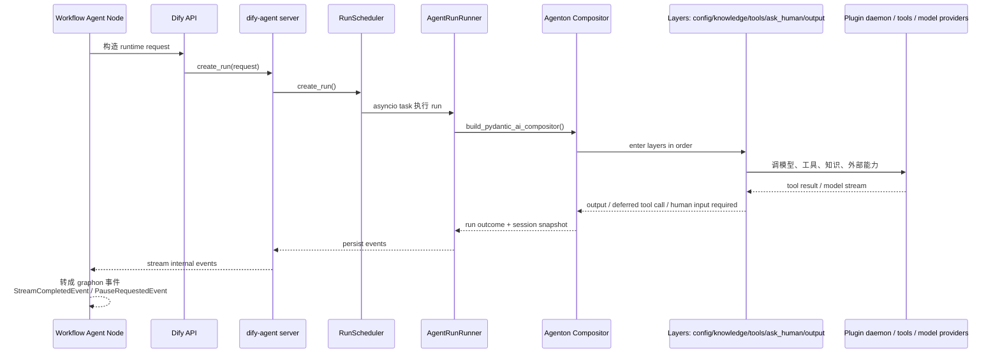
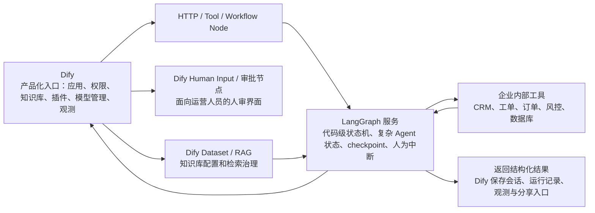

# Dify 源码架构精读

分析对象：`sources/dify`。源码来自 `langgenius/dify` 的 `main` 分支 codeload 快照；由于当前环境 GitHub Git TCP 与 API SHA 查询受限，本次未能取得精确 commit SHA。源码版本证据：`api/pyproject.toml` 为 `1.15.0`，`web/package.json` 为 `1.15.0`。

> 重要边界：Dify 不是 LangChain/LlamaIndex 这种“开发库”，也不是 n8n 这种通用自动化平台。它更像 **LLM 应用开发与运营平台**：把 AI Workflow、RAG Pipeline、Agent、模型供应商、插件、观测、API 发布和控制台配置组合成一个面向生产的产品。

## 1. 总体结论

Dify 的核心不是某一个 Agent loop，而是 **可产品化的 LLM 应用运行平台**。用户在 Web 控制台配置应用、工作流、知识库、模型和插件；Flask API 负责多租户、权限、配置、运行入口和 SSE；Celery/Redis 承担后台执行与事件流；`graphon` 承担 workflow graph runtime；RAG、Plugin、dify-agent 则是被平台托管的专业子系统。

一句话分享：

> LangGraph 解决“代码里复杂 Agent 状态机如何可靠运行”，n8n 解决“通用业务自动化如何可视化编排”，Dify 解决“企业如何把 LLM 应用、RAG、Agent、模型、插件、权限和观测封装成可配置、可发布、可运营的平台”。

最值得精读的主线：

1. Monorepo 分层：`api` 是平台后端，`web` 是产品控制台，`dify-agent` 是 Agent v2 运行时，`packages`/`sdks`/`docker` 承接前端包、客户端和部署。
2. App 运行主线：`WorkflowAppGenerator.generate()` 创建任务和队列，后台 worker 调 `WorkflowAppRunner.run()`，前台通过队列/SSE 接收事件。
3. Workflow graph：`Workflow.graph` JSON 被 `WorkflowGraphTopology` 和 `DifyNodeFactory` 转成 graphon runtime 中的节点对象。
4. RAG Pipeline：文档索引由 Celery 任务异步构建；查询时 `KnowledgeRetrievalNode` 调 `DatasetRetrieval.knowledge_retrieval()` 完成多知识库检索、metadata filter、rerank 和上下文注入。
5. Agent v2：Workflow 里的 Agent 节点调用 `dify-agent`，由 `RunScheduler`、`AgentRunRunner` 和 Agenton `Compositor` 管理层式运行、工具、知识、人审和 session snapshot。
6. Plugin / Model Provider：插件服务统一处理安装、卸载、权限、缓存失效和模型供应商发现，避免把快速变化的模型/工具生态写死在核心后端。

## 2. 最高层架构

架构图见：[architecture.mmd](architecture.mmd)。

源码证据：

| 主题 | 源码位置 | 说明 |
| --- | --- | --- |
| 项目定位 | `sources/dify/README.md` | README 明确说 Dify 是 open-source LLM app development platform，组合 AI workflow、RAG pipeline、agent capabilities、model management、observability。 |
| 后端版本和依赖 | `sources/dify/api/pyproject.toml:1`、`:2`、`:16`、`:56` | 后端名为 `dify-api`，版本 `1.15.0`，依赖 Flask、Celery、Redis、graphon、dify-agent。 |
| 前端版本 | `sources/dify/web/package.json:1`、`:3` | 前端包名 `dify-web`，版本 `1.15.0`。 |
| Flask 入口 | `sources/dify/api/app.py`、`sources/dify/api/app_factory.py` | `create_app()` 初始化 Flask app、extensions、Celery。 |
| Workflow runtime | `sources/dify/api/core/app/apps/workflow/app_runner.py:25`、`:70` | `WorkflowAppRunner` 引入 graphon，`run()` 构建并运行 workflow。 |
| Node factory | `sources/dify/api/core/workflow/node_factory.py:279`、`:377` | `DifyNodeFactory` 负责把 graph node config 解析为实际节点实例。 |
| Agent runtime | `sources/dify/dify-agent/src/dify_agent/runtime/run_scheduler.py:55`、`runner.py:111` | `RunScheduler` 和 `AgentRunRunner` 管理 agent run。 |

## 3. Monorepo 分层

| 目录 | 职责 | 分享时怎么讲 |
| --- | --- | --- |
| `api` | Flask API、Celery、App/Workflow/RAG/Plugin/Model Provider、SQLAlchemy models、任务队列 | “Dify 的平台后端和运行控制面”。 |
| `web` | Next/React 控制台、workflow canvas、dataset/plugin/model UI、SSE 事件处理 | “Dify 的产品入口，用户主要通过它编排 AI 应用”。 |
| `dify-agent` | Agent v2 独立运行时，FastAPI/SSE、RunScheduler、Agenton compositor、layers | “把复杂 Agent loop 从平台后端拆出去”。 |
| `packages` | 前端 UI/contracts 等 monorepo 包 | “给 Web 和 API contract 复用的横向包”。 |
| `sdks` | API client SDK | “把已发布的 Dify 应用给外部系统调用”。 |
| `docker` | Docker Compose、环境变量和部署配置 | “Dify 是可自部署平台，不只是源码库”。 |

设计含义：Dify 的分层是产品平台式的。`api` 负责业务资源和运行入口；`web` 负责低代码/可视化体验；`dify-agent` 专门承载 Agent v2；RAG 和 Plugin 作为平台能力被 workflow node 调用，而不是只属于某个 demo。

## 4. 主流程一：一次 Workflow App 运行

流程图见：[app-run-flow.mmd](app-run-flow.mmd)。

源码证据：

- `sources/dify/api/core/app/apps/workflow/app_generator.py:96` 到 `:257`：`generate()` 构建 `WorkflowAppGenerateEntity`，准备应用配置、trace、extras，然后进入 `_generate()`。
- `sources/dify/api/core/app/apps/workflow/app_generator.py:316` 到 `:397`：`_generate()` 创建 queue manager，启动 `_generate_worker`，并调用 `_handle_response()`。
- `sources/dify/api/core/app/apps/workflow/app_generator.py:582` 到 `:646`：`_generate_worker()` 重新加载 workflow，构建 runner，并执行 `runner.run()`。
- `sources/dify/api/core/app/apps/workflow/app_runner.py:70` 到 `:200`：`WorkflowAppRunner.run()` 创建 graph runtime state、变量池、command channel 和 workflow entry，再运行 `workflow_entry.run()`。
- `sources/dify/api/core/app/apps/base_app_queue_manager.py`：队列管理器封装 `listen()`、`publish()`、`set_stop_flag()` 等能力，用 Redis 支撑跨线程/进程事件。

设计解释：

| 设计点 | 为什么这么设计 |
| --- | --- |
| Generator 和 Runner 分开 | Generator 面向请求生命周期：鉴权、配置、trace、队列、响应；Runner 面向 workflow runtime：变量池、节点执行、事件流。这样 API 层和图执行层不会缠在一起。 |
| 后台 worker + 前台 SSE | LLM、RAG、工具调用时间不可控，前端需要实时看到节点进度、文本片段和失败原因；阻塞 HTTP 不适合产品体验。 |
| QueueManager 抽象 | 同一套事件可以服务 streaming response、blocking response、stop flag、调试面板和历史记录。 |
| task_id / active workflow task | 运行需要被停止、追踪、关联会话和审计，不能只是一段普通函数调用。 |

## 5. 主流程二：Workflow Graph 如何变成可执行节点

流程图见：[workflow-graph-flow.mmd](workflow-graph-flow.mmd)。

源码证据：

- `sources/dify/web/service/workflow.ts:18` 到 `:29`：前端有 `fetchWorkflowDraft()` 和 `syncWorkflowDraft()`，同步 `graph`、`features`、环境变量、会话变量。
- `sources/dify/web/app/components/workflow-app/hooks/use-workflow-run.ts:196` 到 `:319`：前端运行时会先同步 draft，再解析运行 URL、请求体，并注册 workflow started/finished/node started/node finished/human input/agent log/text chunk 等事件处理器。
- `sources/dify/api/core/workflow/graph_topology.py`：`WorkflowGraphTopology` 基于 `Workflow.graph` 中的 `nodes` 和 `edges` 判断上下游。
- `sources/dify/api/core/workflow/node_factory.py:113` 到 `:145`：注册 graphon 与 Dify workflow-local node，并按 type/version 解析节点类。
- `sources/dify/api/core/workflow/node_factory.py:377` 到 `:469`：`create_node()` 解析 node config，验证节点数据，创建具体 node。
- `sources/dify/api/core/workflow/node_factory.py:482` 到 `:660`：为 Agent、Human Input、LLM 兼容节点注入 agent backend、callback、model instance、memory、retriever attachment loader 等运行依赖。

设计解释：

| 设计点 | 为什么这么设计 |
| --- | --- |
| Graph JSON 是持久化协议 | 前端画布、后端校验、运行时和历史记录都围绕同一个 graph 结构，不需要把画布状态和运行状态各写一套。 |
| NodeFactory 做依赖注入 | 节点配置只描述“要做什么”，真实执行还需要模型凭证、内存、工具、代码沙箱、RAG loader、人审回调，这些必须在服务端按租户和上下文注入。 |
| node type + version | 低代码平台必须兼容旧 workflow，节点升级不能直接破坏用户已发布应用。 |
| PauseRequestedEvent | Agent/Human Input/调度暂停需要保存现场并 resume，不能靠普通异常或同步函数返回表达。 |

## 6. RAG Pipeline：知识库不是一个简单 Retriever

流程图见：[rag-pipeline-flow.mmd](rag-pipeline-flow.mmd)。

源码证据：

- `sources/dify/api/tasks/deal_dataset_vector_index_task.py:20` 到 `:201`：`deal_dataset_vector_index_task(dataset_id, action)` 在 dataset 队列里处理 add/update/clean/save vector index，并更新 `indexing_status`。
- `sources/dify/api/core/workflow/nodes/knowledge_retrieval/knowledge_retrieval_node.py:100` 到 `:173`：`KnowledgeRetrievalNode._run()` 从 variable pool 取 query，调用检索器，返回 `NodeRunResult` 和 token/cost metadata。
- `sources/dify/api/core/workflow/nodes/knowledge_retrieval/knowledge_retrieval_node.py:184` 到 `:282`：根据 single/multiple retrieval 组装 top_k、score_threshold、reranking_model、metadata filtering、vector/keyword 权重。
- `sources/dify/api/core/rag/retrieval/dataset_retrieval.py:119` 到 `:337`：`DatasetRetrieval.knowledge_retrieval()` 处理 metadata filtering、多知识库检索、source metadata 和排序。
- `sources/dify/api/core/rag/retrieval/dataset_retrieval.py:600` 以后：`single_retrieve()` 支持外部知识库、本地 dataset、metadata 条件、检索方法和 rerank。
- `sources/dify/api/core/rag/retrieval/retrieval_methods.py:4` 到 `:16`：检索方法包括 semantic、fulltext、hybrid，并提供能力判断。

设计解释：

| 设计点 | 为什么这么设计 |
| --- | --- |
| 索引异步化 | 文档切分、embedding、写向量库耗时且容易失败，用 Celery 能重试、隔离和更新状态。 |
| DatasetRetrieval 集中处理 | RAG 不是“向量库 search 一下”，还包含 metadata、外部知识源、多数据集、rerank、score threshold、source 展示和 LLM usage。 |
| KnowledgeRetrievalNode 薄封装 | Workflow 节点只负责从变量池取 query、把 node data 转成 retrieval request，复杂 RAG 策略留在 RAG 子系统。 |
| metadata filtering | 企业知识库经常要按产品线、地区、权限、文档类型过滤；如果只靠相似度，会召回错误范围。 |

## 7. Agent v2：为什么拆出 dify-agent

流程图见：[agent-plugin-flow.mmd](agent-plugin-flow.mmd)。

源码证据：

- `sources/dify/api/core/workflow/nodes/agent_v2/agent_node.py:75`：`DifyAgentNode` 是 workflow 中的 Agent 节点。
- `sources/dify/api/core/workflow/nodes/agent_v2/agent_node.py:129` 到 `:454`：`_run()` 构造 agent runtime request，调用 agent backend，消费 event stream，并把 human input / scheduling pause 转成 `PauseRequestedEvent`。
- `sources/dify/dify-agent/src/dify_agent/runtime/run_scheduler.py:55` 到 `:151`：`RunScheduler` 创建 run record、启动 asyncio task、维护 process-local active tasks，并在 shutdown/cancel 时处理未完成 run。
- `sources/dify/dify-agent/src/dify_agent/runtime/runner.py:111` 到 `:199`：`AgentRunRunner` 构建 compositor，校验 exit signals，进入 agent layers，返回 outcome 和 session snapshot。
- `sources/dify/dify-agent/src/agenton/compositor/core.py`：`LayerNode` 和 `Compositor` 描述 layer graph，按依赖顺序 enter，退出时逆序 exit。

设计解释：

| 设计点 | 为什么这么设计 |
| --- | --- |
| Agent 独立运行时 | Agent loop 涉及 streaming、工具、知识、人审、session snapshot、异步调度，复杂度高于普通 workflow node，拆出去能减少 Flask 后端负担。 |
| Compositor / Layer | Agent 能力不是单一 chain，而是配置层、知识层、工具层、人审层、输出层组合；layer 化便于插拔和校验依赖。 |
| Deferred tool call / Human Input | 企业 Agent 常常不能全自动执行，需要等人审批或补充信息，pause/resume 是核心能力。 |
| Workflow Agent Node 做适配 | Dify 工作流仍然通过 graphon 事件表达执行状态，Agent backend 的内部事件需要被翻译成 workflow 可理解的事件。 |

## 8. Plugin / Model Provider：生态变化快，所以不能写死

源码证据：

- `sources/dify/api/core/plugin/plugin_service.py:81` 定义 `PluginService`。
- `sources/dify/api/core/plugin/plugin_service.py:451`、`:464`：有插件模型供应商缓存失效和 `fetch_plugin_model_providers()`。
- `sources/dify/api/core/plugin/plugin_service.py:600` 到 `:632`：检查 marketplace only、official only、official and partners、none、all 等插件安装权限。
- `sources/dify/api/core/plugin/plugin_service.py:651` 以后：插件 list、list_with_total、按 category 列表、asset、installation 查询。
- `sources/dify/api/core/plugin/impl/model.py`、`impl/tool.py`、`impl/agent.py`：模型、工具、Agent 相关插件实现被拆到不同适配层。

设计解释：

| 设计点 | 为什么这么设计 |
| --- | --- |
| 插件安装权限 | 企业自部署场景会限制插件来源，避免任意第三方插件进入生产环境。 |
| 模型供应商缓存 generation | 模型 provider 来自插件 daemon，频繁远程读取会慢；安装/卸载/升级后必须失效缓存。 |
| model/tool/agent impl 分开 | 模型供应商、工具和 Agent 扩展生命周期不同，统一进 PluginService，但底层适配保持分治。 |
| 凭证和 provider association 清理 | 插件卸载不仅是删除包，还要清理租户凭证、供应商关联和缓存，否则会留下不可用配置。 |

## 9. 前端运行体验：画布不是静态配置页

源码证据：

- `sources/dify/web/service/workflow.ts:18` 到 `:49`：前端提供 fetch/sync draft、single node run、fetch published workflow、stop workflow run 等服务。
- `sources/dify/web/service/workflow.ts:133` 到 `:149`：支持 human input form 提交和查询。
- `sources/dify/web/app/components/workflow-app/hooks/use-workflow-run.ts:104` 到 `:194`：运行前从 workflow store、feature store、canvas 状态取数据，并同步 draft。
- `sources/dify/web/app/components/workflow-app/hooks/use-workflow-run.ts:196` 到 `:319`：`handleRun()` 解析运行 URL、构建请求体、校验请求，并绑定 workflow event handlers。

设计解释：Dify 前端不只是“保存配置”。它要在运行中实时渲染节点状态、文本增量、Agent log、人审表单、iteration/loop 进度和变量 inspect。也因此后端事件命名和前端 handler 的粒度都比较细。

## 10. 真实例子：企业客服知识库 + 工单处理 + 人审升级

假设一家 SaaS 公司要做“售后客服助手”：

1. 运营在 Dify Web 上传产品手册、FAQ、退费规则，形成 Dataset。
2. 后端 Celery `deal_dataset_vector_index_task` 异步切分文档、写向量索引，索引状态显示在控制台。
3. 运营在 Workflow 画布上放节点：Start -> Knowledge Retrieval -> LLM -> 条件判断 -> HTTP Request 创建工单 -> Agent 节点补查订单 -> Human Input 人审 -> End。
4. 用户从官网聊天窗口提问：“企业版能不能退费？我这个订单已经过了 20 天。”
5. `WorkflowAppGenerator.generate()` 创建 task，前端通过 SSE 看到每个节点运行。
6. Knowledge Retrieval 节点按问题和 metadata 找到“退费规则”和“企业版 SLA”片段。
7. LLM 节点生成解释，但条件节点发现“涉及退款 + 超过规则边界”，进入 Agent 节点。
8. Agent 通过插件工具查订单状态，如果需要主管确认，`DifyAgentNode` 产生 `PauseRequestedEvent`，前端显示 Human Input 表单。
9. 主管审核后 resume，workflow 继续创建工单并给用户返回结构化答复。

这个例子能说明 Dify 的设计价值：

- RAG 是平台知识能力，不是某段 prompt 的附属品。
- Workflow 负责把知识、模型、HTTP、Agent、人审串起来。
- Agent 处理不确定任务，但被 workflow 的可视化边界和暂停恢复机制约束。
- Plugin / Model Provider 让模型和工具可以按租户配置，不需要改源码。

## 11. 与 LangGraph / n8n / LangChain / LlamaIndex 的对比

| 维度 | Dify | LangGraph | n8n | LangChain | LlamaIndex |
| --- | --- | --- | --- | --- | --- |
| 核心定位 | LLM 应用开发与运营平台 | 代码级 Agent 状态图运行时 | 通用自动化 workflow 平台 | LLM 应用组件库/Agent 抽象 | RAG 数据框架 |
| 用户入口 | Web 控制台 + API 发布 | Python/JS 代码 | 可视化画布 + 节点生态 | 代码 | 代码 |
| 图执行 | graphon + Dify NodeFactory | StateGraph/Pregel/checkpoint | WorkflowExecute DAG | runnable/chain/agent | workflow/query engine |
| RAG | Dataset、索引任务、检索节点、rerank、metadata | 通常自行集成 | 通过节点/外部服务集成 | retriever 组件 | 强项，数据 ingestion/index/retriever |
| Agent | Agent v2 + dify-agent + workflow pause | 强项，状态机和人类中断 | AI 节点与自动化流程 | Agent/Tool 抽象 | AgentWorkflow 辅助 |
| 生产平台能力 | 强：多租户、权限、插件、观测、API 发布 | 需要自己搭平台 | 强：自动化、凭证、触发器、队列 | 需要自己搭平台 | 需要自己搭平台 |
| 适合场景 | 企业 LLM 应用、知识库、客服、内部助手、可配置 AI 工作流 | 复杂 Agent 状态机、代码可控编排 | SaaS/业务系统自动化、低代码集成 | 快速开发 LLM 功能 | 高质量 RAG 数据处理 |

## 12. Dify 与 LangGraph 组合图

组合图见：[dify-langgraph-combo.mmd](dify-langgraph-combo.mmd)。

组合建议：

- Dify 放在“产品化入口”：权限、应用配置、RAG、运营界面、API 发布、运行观测。
- LangGraph 放在“复杂 Agent 内核”：代码级状态机、长周期任务、强 checkpoint、复杂分支和测试。
- 两者通过 HTTP 节点、Tool 节点或自定义插件连接。
- 不建议把所有复杂逻辑都塞进 Dify 画布；一旦流程需要大量代码状态和精细测试，交给 LangGraph 服务更清晰。

## 13. 局限性与阅读注意事项

| 局限 / 风险 | 说明 | 建议 |
| --- | --- | --- |
| 源码体量大 | Dify 是产品平台，源码包含 API、Web、Agent、RAG、Plugin、部署、迁移，不适合按文件顺序读。 | 按“运行主线 + 子系统”读。 |
| graphon 是外部运行时 | 当前 Dify workflow 已明显依赖 graphon，很多执行细节在依赖包内。 | 分析 Dify 时重点看适配层：`WorkflowAppRunner`、`DifyNodeFactory`、workflow nodes。 |
| 可视化画布不等于所有复杂逻辑都适合画 | 超复杂状态机在画布上可能难测试、难 code review。 | 复杂 Agent 内核可用 LangGraph，Dify 负责产品入口和治理。 |
| 插件生态带来治理成本 | 模型和工具插件灵活，但也引入权限、来源、版本、缓存和凭证清理问题。 | 企业部署要明确插件安装范围和供应商治理策略。 |
| 本次源码为 codeload 快照 | 未能取得 commit SHA。 | README 中注明版本证据，不把它当作固定 commit。 |

## 14. 分享叙述建议

分享时不要从“Dify 有多少目录”开始，而是用问题链路打开：

1. 为什么 Dify 不是 LangChain：它要把 LLM 应用变成可配置、可发布、可运营的产品。
2. 一次请求怎么跑：Web/API -> Generator -> Queue/SSE -> Runner -> graphon -> Node -> 事件返回。
3. 工作流为什么能扩展：Graph JSON + NodeFactory + node type/version + 运行依赖注入。
4. RAG 为什么不是简单向量检索：索引、metadata、外部知识源、多知识库、rerank、source metadata。
5. Agent v2 为什么拆出去：Agent loop 需要异步、层式能力、人审、session snapshot，复杂度独立于普通 workflow。
6. 和 LangGraph/n8n 的关系：Dify 是 LLM 产品平台，LangGraph 是代码级 Agent 状态机，n8n 是通用自动化平台。

## 15. 精读路线

建议按这个顺序看源码：

1. `sources/dify/README.md`：先确认产品定位。
2. `sources/dify/api/app.py`、`api/app_factory.py`：看 Flask/Celery 后端启动。
3. `api/core/app/apps/workflow/app_generator.py`：看一次 workflow app 请求怎么进入运行。
4. `api/core/app/apps/workflow/app_runner.py`：看 graphon runtime 如何被构建。
5. `api/core/workflow/node_factory.py`：看节点类型如何解析、依赖如何注入。
6. `api/core/workflow/nodes/knowledge_retrieval/knowledge_retrieval_node.py` 与 `api/core/rag/retrieval/dataset_retrieval.py`：看 RAG 查询主线。
7. `api/tasks/deal_dataset_vector_index_task.py`：看知识库索引异步任务。
8. `api/core/workflow/nodes/agent_v2/agent_node.py`：看 Agent 节点如何桥接 dify-agent。
9. `dify-agent/src/dify_agent/runtime/run_scheduler.py`、`runner.py`、`agenton/compositor/core.py`：看 Agent v2 运行时。
10. `api/core/plugin/plugin_service.py`：看插件和模型供应商治理。
11. `web/service/workflow.ts`、`web/app/components/workflow-app/hooks/use-workflow-run.ts`：看前端画布运行和事件处理。
