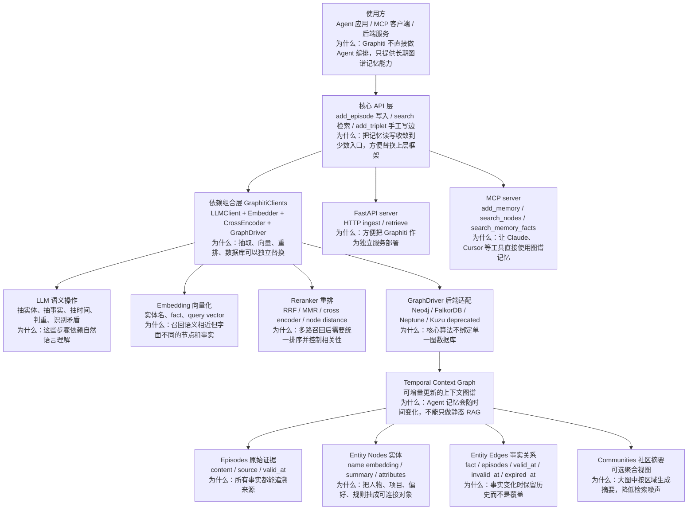
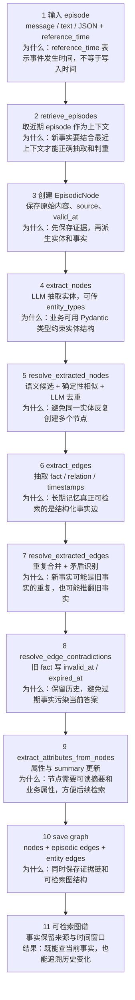
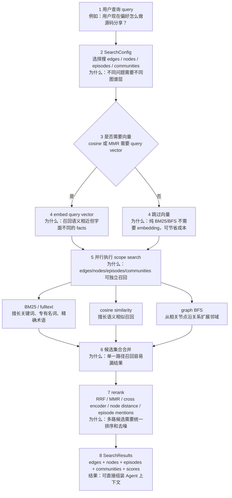

# Graphiti 源码架构精读

分析对象：`sources/graphiti`，源码固定提交 `62ff03ac5662d288ebd9f6aafb70d6ae4070c632`。这份分析参考 mem0 的源码分析方式，但 Graphiti 的主线不是“本地 Memory.add/search”，而是“从 episode 连续构建 temporal context graph，再用混合检索取回带时间和来源的事实”。

## 1. 总体结论

Graphiti 是 Zep README 指向的开源 temporal context graph engine。它把输入数据先保存为 `EpisodicNode`，再抽取 `EntityNode` 和 `EntityEdge`；边上保存 `episodes`、`valid_at`、`invalid_at`、`expired_at`，所以它不是只记“现在的事实”，而是保留事实从何而来、什么时候成立、什么时候被新事实替代。

和 mem0 对比：

| 维度 | Graphiti | mem0 |
| --- | --- | --- |
| 核心抽象 | temporal context graph | memory facts + vector/hybrid retrieval |
| 写入入口 | `Graphiti.add_episode()` / `add_triplet()` | `Memory.add()` |
| 读取入口 | `search()` / `search_()` | `Memory.search()` |
| 时间处理 | `valid_at` / `invalid_at` / `expired_at`，旧事实失效不删除 | 更偏事实抽取、去重、打分召回 |
| 溯源 | 每条 fact 关联 episode | 通常面向 memory item / fact |
| 适用 | 变化频繁、需要历史追踪、需要图关系推理的 Agent memory | 需要轻量长期记忆、快速接入应用 memory |

## 2. 最高层架构



读图说明：Graphiti 的核心不是 HTTP server 或 MCP server，而是 `graphiti_core`。`server/` 和 `mcp_server/` 是把核心能力包装成服务或工具；真正的抽取、去重、时间失效和检索都在 `graphiti_core`。这也是为什么架构图里把 Graphiti 拆成 API、clients、driver、graph model 四层：上层换 Agent 框架，底层换数据库或模型 provider，都不应该改动核心图谱流程。

源码证据：

- `README.md:42-49`：Graphiti 用于构建和查询 temporal context graphs，支持事实随时间变化、来源追踪和增量更新。
- `README.md:84-118`：Graphiti 是 Zep context infrastructure 的开源核心，Zep 是托管平台，Graphiti 是自托管 OSS engine。
- `graphiti_core/graphiti.py:137`：`Graphiti` 主类初始化 driver、LLM、embedder、cross_encoder。
- `graphiti_core/graphiti.py:570`：`build_indices_and_constraints()` 交给 driver 建索引和约束。

## 3. 核心数据模型

Graphiti 的图由三类最关键对象组成：

| 对象 | 文件 | 作用 |
| --- | --- | --- |
| `EpisodicNode` | `graphiti_core/nodes.py:318` | 原始输入，保存 `content`、`source`、`source_description`、`valid_at`。这是 provenance 根。 |
| `EntityNode` | `graphiti_core/nodes.py:499` | 实体节点，保存 `name_embedding`、`summary`、`attributes`。 |
| `EntityEdge` | `graphiti_core/edges.py:263` | fact / relationship，保存 `fact_embedding`、`episodes`、`valid_at`、`invalid_at`、`expired_at`。 |

关键代码片段：

```python
class EntityEdge(Edge):
    name: str
    fact: str
    fact_embedding: list[float] | None
    episodes: list[str]
    expired_at: datetime | None
    valid_at: datetime | None
    invalid_at: datetime | None
```

这个模型解释了 Graphiti 为什么比普通向量记忆更像“事件流上的知识图谱”：事实不是孤立文本，而是有来源 episode、有成立时间、有失效时间的边。

细节补充：

| 字段 | 为什么存在 | 源码线索 |
| --- | --- | --- |
| `EpisodicNode.valid_at` | 表示原始事件发生时间，不是系统写入时间。后续事实时间窗口会参考它。 | `nodes.py:318-349` |
| `EntityNode.name_embedding` | 让实体去重和搜索能处理“同义不同名”的情况。 | `nodes.py:499-516` |
| `EntityNode.summary` | 让实体带有局部上下文，不只是一个名字。 | `nodes.py:499-560` |
| `EntityEdge.episodes` | 记录哪些 episode 支撑这个 fact，便于 provenance 和 episode mention rerank。 | `edges.py:263-277` |
| `EntityEdge.valid_at/invalid_at` | 表达事实成立和失效时间，是 temporal memory 的核心。 | `edges.py:271-277` |

## 4. 主流程一：Episode 写入和图谱构建



`Graphiti.add_episode()` 是最值得精读的写入入口：

- `graphiti_core/graphiti.py:980`：方法签名包含 `episode_body`、`source_description`、`reference_time`、`entity_types`、`edge_types`、`custom_extraction_instructions`、`saga`。
- `graphiti_core/graphiti.py:1099-1138`：取 previous episodes，创建 `EpisodicNode`，抽取并 resolve nodes。
- `graphiti_core/graphiti.py:1138-1167`：抽取并 resolve edges，生成 invalidated edges，再抽取 node attributes。
- `graphiti_core/graphiti.py:1168-1221`：保存 episode、episodic edges、entity edges，并把数量写入 tracing span。

为什么要先 episode 后 fact：episode 是事实的证据来源。后续某条边被判重或失效，Graphiti 仍能保留“这条 fact 是由哪些原始输入产生的”。

写入细节补充：

| 步骤 | 细节 | 为什么需要 |
| --- | --- | --- |
| 取 previous episodes | 如果调用方没有传 `previous_episode_uuids`，`add_episode()` 会按 `reference_time` 拉近期 episode。 | 新输入经常省略主语或上下文，抽取实体/事实需要最近对话补全语义。 |
| `group_id` 分区 | `group_id` 为空时用 driver 默认分区；传入时会校验并 clone driver 到对应 database。 | 多用户、多租户或多业务图要隔离，避免事实串图。 |
| `entity_types` / `edge_types` | 业务可以传 Pydantic model 和 edge type map。 | 不把 schema 完全交给 LLM 自由发挥，降低抽取漂移。 |
| `saga` / `NEXT_EPISODE` | episode 可关联到 saga，并按时间串起来。 | 对连续任务、会话、故事线做时序追踪，方便按链路理解上下文。 |
| tracing span | 写入过程记录 episode、node、edge、invalidated_count、duration。 | 这条链路重且多 LLM 调用，生产上必须可观测。 |

## 5. 主流程二：实体和事实抽取

实体抽取在 `graphiti_core/utils/maintenance/node_operations.py`：

- `extract_nodes()` 读取当前 episode、previous episodes、自定义实体类型、排除类型和自定义抽取指令。
- 它会把多 episode 的 attribution 写进 prompt，让节点知道自己来自哪些 episode。
- `resolve_extracted_nodes()` 先用语义候选、确定性相似规则处理，再把 unresolved 的节点交给 LLM 判重。

事实抽取在 `graphiti_core/utils/maintenance/edge_operations.py`：

- `extract_edges()` 根据 `edge_type_map` 和 `edge_types` 约束允许的关系类型。
- `resolve_extracted_edges()` 会先对 exact fact 做快速去重，再查已有边作为 duplicate candidates 和 invalidation candidates。
- `resolve_extracted_edge()` 通过 LLM 判断重复事实和矛盾事实，并提取 edge attributes / timestamps。

这个设计的范式是“LLM 负责语义判断，系统负责边界和落库”：候选召回、索引、时间字段、图数据库写入都由工程代码控制，LLM 只在抽取/判重/矛盾识别处参与。

更细一点看，节点和边的去重策略并不完全一样：

| 类型 | 去重路径 | 设计原因 |
| --- | --- | --- |
| EntityNode | 先收集候选节点，再用确定性相似和 LLM resolve。 | 实体名容易同义、别名、大小写变化，先缩小候选再让 LLM 判断更稳。 |
| EntityEdge | 先 exact fact 快速去重，再查同端点 related edges 和全图 invalidation candidates。 | fact 既可能重复，也可能语义矛盾；只查同端点会漏掉潜在冲突，只查全图又太贵。 |
| Attributes | 只在匹配自定义 schema 时抽结构化属性。 | 避免 LLM 生成无约束属性污染实体/关系。 |
| Embeddings | 新节点和新边在 resolve 前生成 embedding。 | 后续候选召回、相似度排序和搜索都依赖向量。 |

## 6. 主流程三：Temporal Fact Invalidation

Graphiti 最核心的设计思想之一是旧事实“失效”而不是“删除”。关键字段在 `EntityEdge` 上：

- `valid_at`：事实开始成立的时间。
- `invalid_at`：事实停止成立的时间。
- `expired_at`：系统确认该事实被失效的处理时间。
- `episodes`：证明该事实来自哪些 episode。

关键代码证据在 `graphiti_core/utils/maintenance/edge_operations.py:545-573`：

```python
elif edge_valid_at_utc < resolved_edge_valid_at_utc:
    edge.invalid_at = resolved_edge.valid_at
    edge.expired_at = edge.expired_at if edge.expired_at is not None else utc_now()
    invalidated_edges.append(edge)
```

讲解口径：如果新事实比旧事实更新，并且语义上矛盾，Graphiti 不覆盖旧边，而是给旧边写入 `invalid_at`。这让它既能回答“现在用户喜欢什么”，也能回答“之前用户喜欢什么，什么时候变了”。

## 7. 主流程四：Search / Hybrid Retrieval



Graphiti 有两个公开搜索层：

- `Graphiti.search()`：基础搜索，返回 `EntityEdge` facts，默认走 `EDGE_HYBRID_SEARCH_RRF`；如果传 `center_node_uuid`，改用 node distance reranker。
- `Graphiti.search_()`：高级搜索，默认 `COMBINED_HYBRID_SEARCH_CROSS_ENCODER`，返回 `SearchResults`，包含 edges、nodes、episodes、communities。

源码证据：

- `graphiti_core/graphiti.py:1527`：基础 `search()` 构建 `EDGE_HYBRID_SEARCH_RRF` 或 `EDGE_HYBRID_SEARCH_NODE_DISTANCE`。
- `graphiti_core/graphiti.py:1584`：`search_()` 调底层 `search()`，支持不同 config recipes。
- `graphiti_core/search/search.py:98-244`：底层 search 根据 config 并行搜索 edges/nodes/episodes/communities。
- `graphiti_core/search/search.py:262-462`：edge search 同时支持 BM25、cosine similarity、BFS，并用 RRF/MMR/cross encoder/node distance rerank。
- `graphiti_core/search/search_config_recipes.py:33-109`：预置 combined hybrid recipes。

检索细节补充：

| 机制 | 适合解决什么 | 为什么不是只用向量 |
| --- | --- | --- |
| BM25 / fulltext | 代码名、产品名、人名、精确术语 | embedding 对专有名词和短查询不一定稳定。 |
| Cosine similarity | 语义相近但字面不同的问题 | 用户查询和 fact 表述常常不完全一致。 |
| BFS | 已有中心节点或候选节点附近的关系扩展 | 图谱记忆的价值在关系，不能只看文本相似度。 |
| RRF | 多路召回的轻量融合 | 不需要训练，能把不同召回列表合成稳定排序。 |
| MMR | 降低结果重复，保留多样性 | Agent 上下文窗口有限，重复 facts 会浪费 token。 |
| Cross encoder | 更贵但更准的语义重排 | 用于最终候选重排，避免对全库做昂贵 LLM 判断。 |
| Node distance | 围绕某个实体找近邻事实 | 个性化或局部上下文检索时比全局相似度更贴近问题。 |

## 8. Server 和 MCP

Graphiti 还提供两层外部入口：

| 入口 | 作用 | 源码证据 |
| --- | --- | --- |
| FastAPI server | HTTP ingest / retrieve | `server/graph_service/routers/ingest.py:51`、`retrieve.py:17` |
| MCP server | 给 Claude/Cursor 等 MCP client 暴露记忆工具 | `mcp_server/src/graphiti_mcp_server.py:341`、`:477`、`:555` |
| Queue service | 按 group_id 顺序处理 episode，避免同一图并发写乱序 | `mcp_server/src/services/queue_service.py:13-84` |

这里很适合和 Zep 当前仓库对比：Zep 仓库主要展示 Cloud SDK 如何接入 LangGraph/AutoGen/CrewAI；Graphiti 仓库则提供图谱构建和检索引擎本身。

## 9. 核心设计思想和设计范式

1. **Episode First / Provenance First**
   每次写入先落 episode，再抽取实体和边。这样 fact 永远能追溯到原始输入。

2. **Temporal Edge**
   事实存在于边上，并且有 `valid_at`、`invalid_at`、`expired_at`。这是一种 temporal graph modeling。

3. **LLM as Semantic Operator**
   LLM 用于实体抽取、关系抽取、判重、矛盾识别、属性抽取；但检索、候选生成、持久化和索引由确定性代码控制。

4. **Hybrid Retrieval**
   BM25、embedding、BFS、cross encoder、RRF、MMR、node distance 都是可组合 recipe，不把检索押宝在单一向量相似度上。

5. **Pluggable Infrastructure**
   `GraphDriver`、`LLMClient`、`EmbedderClient`、`CrossEncoderClient` 都可替换。默认是 Neo4j + OpenAI，但也支持 FalkorDB、Neptune、Gemini、Anthropic、OpenAI-compatible providers。

6. **Schema 可控**
   `entity_types` 和 `edge_types` 接收 Pydantic model，允许业务把实体/关系类型前置约束，而不是完全让 LLM 自由发挥。

## 10. 真实例子

假设用户先说：

> 我现在主要分析 LLM 框架源码，分享时希望先讲仓库边界，再讲主流程。

写入时：

```python
await graphiti.add_episode(
    name="user-preference-1",
    episode_body="用户希望源码分析先讲仓库边界，再讲主流程。",
    source_description="chat message",
    reference_time=now,
    group_id="caizw",
)
```

Graphiti 会保存 episode，抽取类似：

- Entity：用户、源码分析、仓库边界、主流程
- Fact：用户偏好“源码分析先讲仓库边界”
- Edge 时间：`valid_at = reference_time`

如果后面用户改口：

> 分享时别先讲边界了，先讲应用场景。

新 episode 会产生新 fact。旧 fact 不会被直接删掉，而是可能被写上 `invalid_at`。这就是 Graphiti 相对普通 memory fact store 的价值：它知道偏好发生过变化。

## 11. 局限性和使用边界

| 边界 | 说明 |
| --- | --- |
| 依赖 LLM structured output | README 明确说 Graphiti 对结构化 JSON 输出依赖较强，小模型或 schema 支持弱的模型可能导致抽取失败。 |
| 运维成本高于 mem0 | 需要图数据库、embedding、LLM、reranker，生产上还要考虑队列、索引和监控。 |
| 不是托管 Zep | Graphiti 是 OSS engine；用户、thread、dashboard、治理、SLA 等由 Zep 托管平台提供。 |
| 写入路径较重 | `add_episode()` 可能包含多次 LLM 调用、embedding、search、dedupe、落库，不适合阻塞在用户请求主线程里。 |
| Kuzu 已 deprecated | README 和 `pyproject.toml` 都标记 Kuzu 支持会移除，新项目优先 Neo4j/FalkorDB。 |

## 12. 和 Zep / mem0 / LangGraph 的组合关系

| 项目 | 最准确定位 | 和 Graphiti 的关系 |
| --- | --- | --- |
| Graphiti | 开源 temporal context graph engine | 负责图谱记忆内核：episode、entity、fact、temporal invalidation、hybrid search。 |
| Zep | 托管 context graph infrastructure | Graphiti 是开源核心，Zep 负责生产级托管、治理、低延迟上下文组装。 |
| mem0 | 应用侧 memory layer | 更轻量，适合快速引入长期记忆；Graphiti 更强调图结构、时间和 provenance。 |
| LangGraph | Agent workflow runtime | LangGraph 管 Agent 状态流转；Graphiti 管长期图谱记忆；两者可以组合。 |

组合图可以这样讲：

```text
LangGraph 负责：节点、边、checkpoint、工具调用编排
Graphiti 负责：长期事实图谱、时间变化、事实召回
Zep 负责：托管化、用户/线程、上下文块、生产治理
mem0 负责：轻量 memory 抽取、存储、检索
```

## 13. 分享建议

建议不要按目录逐个讲，而是按“为什么需要 temporal graph memory”开场：

1. 先用一个偏好变化例子说明普通 memory 的问题：用户偏好会变，旧事实不能简单覆盖。
2. 再讲 Graphiti 的三层模型：episode 是证据，entity 是对象，edge/fact 是带时间窗口的关系。
3. 然后走 `add_episode()` 主流程：取上下文、抽实体、抽边、去重、矛盾失效、保存。
4. 再走 `search_()`：BM25 + vector + BFS + rerank。
5. 最后对比 mem0、Zep、LangGraph，讲清楚选型边界。

推荐演讲时长可以放到 60-90 分钟，不需要压缩：Graphiti 的价值就在 ingestion 和 temporal invalidation 细节里，讲太快会变成泛泛的“知识图谱 + RAG”。
