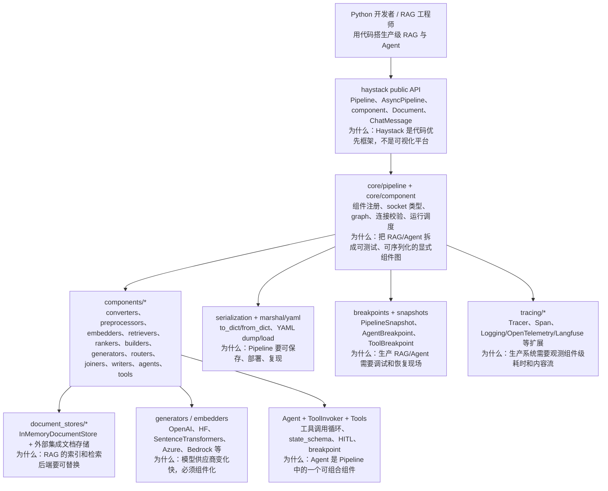
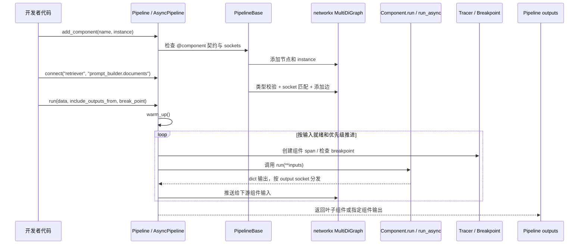
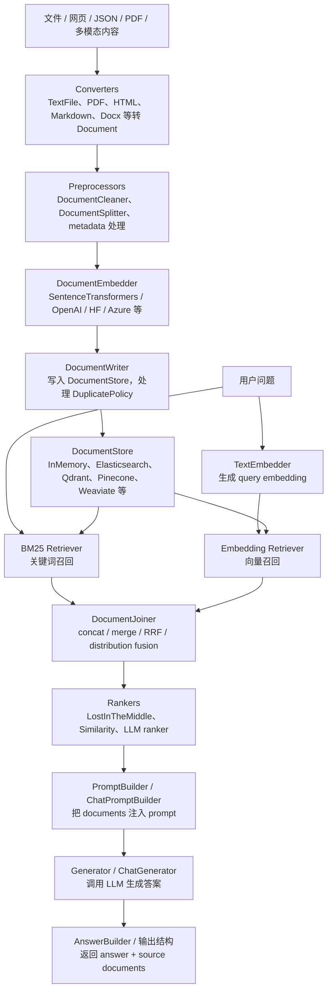
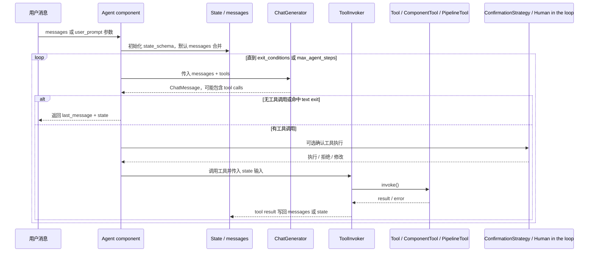
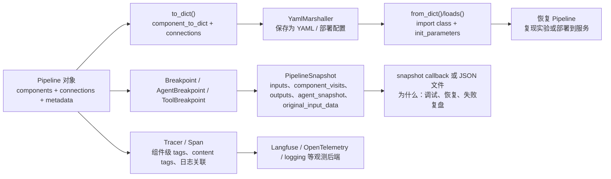
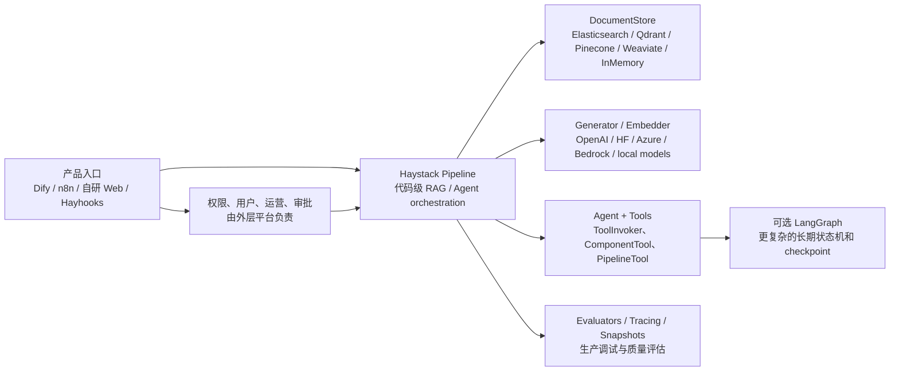

# Haystack 源码架构精读

分析对象：`sources/haystack`。源码来自 `deepset-ai/haystack`，固定提交为 `08e8885794687bd60ea5a59a672a428e7528b48a`，提交时间 `2026-07-07 16:47:58 +0000`，提交信息为 `docs: sync Core Integrations API reference (sentence_transformers) on Docusaurus (#11906)`。`VERSION.txt` 显示版本为 `2.32.0-rc0`，`pyproject.toml` 包名为 `haystack-ai`，要求 Python `>=3.10`。

> 重要边界：Haystack 不是 Dify 这种产品平台，也不是 n8n 这种通用自动化平台。它是 **代码优先的生产级 RAG / Agent orchestration framework**：用 typed component 和 Pipeline graph 显式控制检索、路由、记忆、工具、生成、调试和观测。

## 1. 总体结论

Haystack 的核心是 **组件化 Pipeline 图运行时**。开发者用 `@component` 定义节点，用 `Pipeline.add_component()` 注册组件，用 `Pipeline.connect()` 建立 typed socket 连接，再用 `Pipeline.run()` 或 `AsyncPipeline.run_async()` 运行。RAG、Agent、Tool、DocumentStore、Generator、Embedder、Router、Ranker、Writer 都是组件或组件周边协议。

一句话分享：

> LlamaIndex 更像 RAG 数据框架，LangChain 更像 LLM 组件生态，Dify 更像 LLM 应用平台，而 Haystack 更像“生产级 RAG/Agent 的显式组件编排框架”：它把每一步都做成可连接、可序列化、可调试、可观测的组件。

最值得精读的主线：

1. Component contract：`@component`、`run()`、`@component.output_types`、input/output sockets。
2. Pipeline graph：`PipelineBase.add_component()`、`connect()`、类型校验、networkx graph。
3. Run loop：`Pipeline.run()` / `AsyncPipeline.run_async_generator()` 根据输入就绪推进组件。
4. RAG components：converter、preprocessor、embedder、retriever、joiner、ranker、prompt builder、generator、writer。
5. Agent / Tool：`Agent`、`ToolInvoker`、`Tool`、`ComponentTool`、`PipelineTool`、HITL 与 breakpoint。
6. Production support：serialization、YAML marshal、PipelineSnapshot、tracing。

## 2. 最高层架构

架构图见：[architecture.mmd](architecture.mmd)。



源码证据：

| 主题 | 源码位置 | 说明 |
| --- | --- | --- |
| 项目定位 | `sources/haystack/README.md` | README 说明 Haystack 是 open-source AI orchestration framework，用于 production-ready LLM applications。 |
| 包与版本 | `sources/haystack/pyproject.toml`、`VERSION.txt` | 包名 `haystack-ai`，版本 `2.32.0-rc0`，依赖 `networkx`、`openai`、`pydantic`、`Jinja2`、`haystack-experimental` 等。 |
| Pipeline | `haystack/core/pipeline/pipeline.py:36` | `Pipeline` 继承 `PipelineBase`，实现同步运行。 |
| AsyncPipeline | `haystack/core/pipeline/async_pipeline.py:28` | `AsyncPipeline` 支持异步组件调度和异步生成结果。 |
| Component | `haystack/core/component/component.py:406`、`:572` | `_Component` 装饰器把普通类变成 Haystack component。 |
| DocumentStore | `haystack/document_stores/in_memory/document_store.py:59` | `InMemoryDocumentStore` 支持 BM25 与 embedding 检索。 |
| Agent | `haystack/components/agents/agent.py:103` | `Agent` 本身也是 `@component`，可以放进 Pipeline。 |

## 3. Monorepo / 包结构

| 目录 | 职责 | 分享时怎么讲 |
| --- | --- | --- |
| `haystack/core` | Pipeline、Component、serialization、errors、super component | “Haystack 的运行时内核”。 |
| `haystack/components` | retriever、generator、embedder、router、joiner、ranker、agent、tool、writer 等组件 | “RAG/Agent 每一步都是组件”。 |
| `haystack/document_stores` | 文档存储协议和 InMemory 实现 | “RAG 的后端可替换边界”。 |
| `haystack/dataclasses` | Document、ChatMessage、Answer、ToolCall、Breakpoint snapshot 等数据结构 | “组件之间传递的标准数据协议”。 |
| `haystack/tools` | Tool、Toolset、ComponentTool、PipelineTool、函数工具装饰器 | “把函数、组件或 Pipeline 暴露为 Agent 可调用工具”。 |
| `haystack/tracing` | Tracer、Span、logging/open telemetry 等观测接口 | “生产系统调试和监控入口”。 |
| `docs-website` | Docusaurus 文档站 | “文档很多，但不是运行时核心”。 |

## 4. 主流程一：Pipeline 如何运行

流程图见：[pipeline-flow.mmd](pipeline-flow.mmd)。



源码证据：

- `haystack/core/pipeline/base.py:150` 到 `:167`：`to_dict()` 序列化 components 和 connections。
- `haystack/core/pipeline/base.py:342` 到 `:388`：`add_component()` 把组件实例加入 graph。
- `haystack/core/pipeline/base.py:441` 到 `:573`：`connect()` 解析 `component.socket`，检查输入输出 socket 和类型。
- `haystack/core/pipeline/pipeline.py:44` 到 `:84`：`_run_component()` 检查 breakpoint 后调用 `instance.run(**inputs_copy)`。
- `haystack/core/pipeline/pipeline.py:114` 以后：`run()` 负责 warm up、snapshot、component input/output 推进。
- `haystack/core/pipeline/async_pipeline.py:37` 到 `:89`：异步组件执行，必要时用 executor 包装同步 `run()`。
- `haystack/core/pipeline/async_pipeline.py:106`、`:468`、`:585`：分别提供 `run_async_generator()`、`run_async()` 和同步兼容 `run()`。

设计解释：

| 设计点 | 为什么这么设计 |
| --- | --- |
| `@component` + sockets | 组件输入输出必须可被 Pipeline 检查和连接，避免运行到一半才发现类型不匹配。 |
| `networkx MultiDiGraph` | Pipeline 是有向组件图，不是简单 chain；支持分支、汇合、多输入、多输出。 |
| `warm_up()` | 模型、embedding backend、连接池等资源初始化成本高，单独 warm up 可控制生命周期。 |
| `include_outputs_from` | 调试 RAG 时常常要看中间文档、prompt、ranker 输出，不能只返回最终答案。 |
| `AsyncPipeline` | I/O 密集模型调用、检索、工具调用适合并发推进；同步 Pipeline 保留简单使用体验。 |

核心代码片段：

```python
@component
class MyComponent:
    @component.output_types(answer=str)
    def run(self, question: str) -> dict[str, str]:
        return {"answer": question.upper()}
```

这个片段能证明 Haystack 的核心设计范式：组件是带输入/输出契约的普通 Python 类，Pipeline 通过这些契约连接组件，而不是要求开发者继承复杂基类。

## 5. 主流程二：RAG Pipeline

流程图见：[rag-flow.mmd](rag-flow.mmd)。



源码证据：

- `haystack/components/retrievers/in_memory/bm25_retriever.py:12`、`:120`：`InMemoryBM25Retriever` 是 component，输出 `documents=list[Document]`。
- `haystack/components/retrievers/in_memory/bm25_retriever.py:146` 到 `:155`：按 `FilterPolicy` 合并/替换 filters，并调用 `document_store.bm25_retrieval()`。
- `haystack/components/retrievers/in_memory/embedding_retriever.py:12`、`:139`：`InMemoryEmbeddingRetriever` 接收 query embedding，输出 documents。
- `haystack/document_stores/in_memory/document_store.py:59` 到 `:124`：DocumentStore 支持 BM25 参数、embedding similarity、index 共享和 return embedding。
- `haystack/components/writers/document_writer.py:11`、`:79`、`:101`：`DocumentWriter` 支持同步/异步写入 DocumentStore 和 DuplicatePolicy。
- `haystack/components/joiners/document_joiner.py:45`、`:120` 到 `:139`：支持 concatenate、merge、reciprocal rank fusion、distribution based rank fusion。
- `haystack/components/rankers/lost_in_the_middle.py:10`、`:63`：把最相关文档放在上下文开头/结尾，缓解 LLM “lost in the middle”。

设计解释：

| 设计点 | 为什么这么设计 |
| --- | --- |
| Indexing pipeline 与 Query pipeline 分开 | 写入文档和查询答案的输入输出不同，分成两条 Pipeline 更清晰。 |
| DocumentStore 抽象 | 生产系统可能用 Elasticsearch、Qdrant、Pinecone、Weaviate，组件不应绑定某个数据库。 |
| BM25 + embedding + Joiner | 真实 RAG 常用 hybrid retrieval，Haystack 直接把融合策略做成组件。 |
| Ranker 独立 | 检索召回和上下文排序是两个问题，ranker 独立便于替换和组合。 |
| PromptBuilder 独立 | RAG 的 prompt 是可测试、可观察的中间产物，不应该藏在 generator 里。 |

## 6. Agent / Tool：Agent 是 Pipeline 里的组件

流程图见：[agent-tool-flow.mmd](agent-tool-flow.mmd)。



源码证据：

- `haystack/components/agents/agent.py:103`：`Agent` 使用 `@component`。
- `haystack/components/agents/agent.py:211` 到 `:306`：构造函数接收 `chat_generator`、`tools`、`system_prompt`、`exit_conditions`、`state_schema`、`max_agent_steps`、`confirmation_strategies` 等。
- `haystack/components/agents/agent.py:263` 到 `:270`：检查 chat generator 是否支持 tools 参数，并校验 exit conditions。
- `haystack/components/tools/tool_invoker.py`：负责解析 `ToolCall`、查找工具、执行工具、处理输出转换和错误。
- `haystack/tools/component_tool.py`：把 Component 包装成 Tool。
- `haystack/tools/pipeline_tool.py`：把 Pipeline 包装成 Tool。
- `haystack/human_in_the_loop`：提供工具调用确认策略和人类参与机制。

设计解释：

| 设计点 | 为什么这么设计 |
| --- | --- |
| Agent 是 component | Agent 可以作为 Pipeline 的一个节点，前后还能接 retriever、router、writer、validator。 |
| ToolInvoker 独立 | LLM 生成 tool call 和真正执行工具是两件事，拆开后更容易做错误处理、HITL 和复用。 |
| ComponentTool / PipelineTool | Haystack 自己的组件图可以反过来成为 Agent 工具，形成“Pipeline as Tool”。 |
| state_schema | Agent 不只传 messages，还能让工具读写结构化状态。 |
| confirmation_strategies | 生产 Agent 不能默认所有工具都自动执行，尤其涉及写系统、发邮件、删数据。 |

## 7. Debug / Serialization / Tracing

流程图见：[debug-serialization-flow.mmd](debug-serialization-flow.mmd)。



源码证据：

- `haystack/core/serialization.py:41`、`:139`、`:177`、`:250`：组件序列化/反序列化支持 `to_dict()`、`from_dict()`、默认 init parameters 和动态 import。
- `haystack/marshal/yaml.py:27`：`YamlMarshaller` 把 Pipeline dict 保存成 YAML。
- `haystack/dataclasses/breakpoints.py:229`、`:247`：`PipelineSnapshot` 支持 to/from dict。
- `haystack/core/pipeline/breakpoint.py:136`、`:166`：支持加载 snapshot、保存 snapshot 或使用 callback。
- `haystack/tracing/tracer.py:19`、`:82`、`:111`：定义 `Span`、`Tracer`、`ProxyTracer` 抽象。

设计解释：

| 设计点 | 为什么这么设计 |
| --- | --- |
| Pipeline 可序列化 | RAG/Agent 应用需要保存、部署、复现实验，不能只存在 Python 进程里。 |
| Snapshot 与 Breakpoint | 生产调试时要知道“停在哪个组件、输入是什么、已有输出是什么”。 |
| AgentBreakpoint / ToolBreakpoint | Agent 内部工具调用也要能中断和恢复，不能只在外层 Pipeline 停。 |
| Tracer 抽象 | Haystack 不绑定某个观测产品，但保留 Span、tag、content tag、日志关联能力。 |

## 8. 真实例子：企业知识库问答 + 混合检索 + 可调试 Agent

场景：一家制造企业要做“技术手册问答 + 维修建议助手”。

1. 索引阶段：把 PDF、Docx、网页手册通过 converters 转成 `Document`。
2. 清洗阶段：用 DocumentCleaner / DocumentSplitter 切分，保留产品线、设备型号、发布日期等 metadata。
3. 向量阶段：DocumentEmbedder 生成 embedding，DocumentWriter 写入 Qdrant 或 Elasticsearch。
4. 查询阶段：BM25Retriever 召回关键词匹配，EmbeddingRetriever 召回语义相似片段。
5. 融合阶段：DocumentJoiner 使用 reciprocal rank fusion，Ranker 重新排序。
6. 生成阶段：PromptBuilder 把 top documents 注入 prompt，ChatGenerator 生成回答。
7. Agent 阶段：如果问题涉及“是否停机维修”，Agent 调用工具查设备状态；高风险工具调用走 confirmation strategy。
8. 调试阶段：出现错误时用 breakpoint/snapshot 复盘是哪一步文档召回或工具调用出了问题。

这能体现 Haystack 的价值：它不把 RAG 封成黑盒，而是把每一步变成可插拔、可观察、可测试的组件。

## 9. 与 LlamaIndex / LangChain / Dify / LangGraph 对比

| 维度 | Haystack | LlamaIndex | LangChain | Dify | LangGraph |
| --- | --- | --- | --- | --- | --- |
| 核心定位 | 生产级 RAG/Agent 组件编排框架 | RAG 数据框架 | LLM 应用组件生态 | LLM 应用平台 | Agent 状态图运行时 |
| 用户入口 | Python 代码 / Pipeline YAML / Hayhooks | Python/TS 代码 | Python/JS 代码 | Web 控制台 + API | Python/JS 代码 |
| 核心抽象 | Component、Pipeline、DocumentStore、Tool | Document、Node、Index、Retriever、QueryEngine | Runnable、Tool、Agent、Provider Adapter | App、Workflow、Dataset、Plugin | StateGraph、Node、Edge、Checkpoint |
| RAG 强项 | 显式组件图、hybrid retrieval、debug、tracing | ingestion/index/retriever 数据工程 | 组件生态与模型/工具集成 | 产品化知识库和运营界面 | 可把 RAG 放进状态机 |
| Agent 强项 | Agent 作为 component，ToolInvoker、HITL、PipelineTool | 辅助型 AgentWorkflow | 工具和 provider 生态 | Agent v2 产品化节点 | 状态可恢复的复杂 Agent |
| 生产化能力 | serialization、snapshots、tracing、Hayhooks | 需要外部补平台 | 需要外部补平台 | 强平台能力 | 强运行时能力，平台自建 |
| 不适合 | 需要低代码运营平台的团队 | 只想要完整产品平台 | 复杂状态恢复 | 纯代码精细控制 | 可视化运营和权限平台 |

## 10. 和横向总览的关系

Haystack 应放在横向总览里的 **RAG / Agent orchestration 框架**位置：

- 比 LlamaIndex 更强调 pipeline component graph、调试、部署和生产运行。
- 比 LangChain 更强调 typed pipeline 和 RAG 应用结构，而不是广泛 provider/tool 生态。
- 比 Dify 更代码优先，缺少内置 Web 运营平台，但更适合工程团队做可测试 RAG 内核。
- 比 LangGraph 更 RAG pipeline 友好，但长期复杂状态机和 checkpoint 仍可组合 LangGraph。

组合图见：[haystack-combo.mmd](haystack-combo.mmd)。



## 11. 局限性

| 局限 | 说明 | 建议 |
| --- | --- | --- |
| 不是产品平台 | 没有 Dify 那样的内置应用控制台、知识库运营、人审 UI、权限系统。 | 用 Dify、自研 Web 或 Hayhooks 包一层。 |
| 复杂状态机不如 LangGraph 专门 | Pipeline 支持分支、循环、breakpoint，但长期复杂 Agent 状态机不是它唯一核心。 | 复杂状态机可组合 LangGraph。 |
| 集成生态分散 | 许多 document store / model integration 在外部集成或文档中。 | 读源码时分清 core repo 与 core integrations。 |
| 学习成本来自显式性 | typed socket、component、serialization、DocumentStore 抽象对初学者比简单 chain 更重。 | 从最小 RAG pipeline 开始，再看 Agent/Breakpoint。 |

## 12. 分享建议

分享 Haystack 时建议按这个顺序：

1. 先讲定位：代码优先、生产级 RAG/Agent orchestration，不是低代码平台。
2. 再讲核心抽象：Component + Pipeline + typed socket。
3. 用一次 RAG pipeline 讲组件如何连接。
4. 展开生产能力：serialization、breakpoint、snapshot、tracing。
5. 再讲 Agent：Agent 也是组件，ToolInvoker 和 PipelineTool 是关键。
6. 最后放进横向总览：和 LlamaIndex、LangChain、Dify、LangGraph 分工组合。
