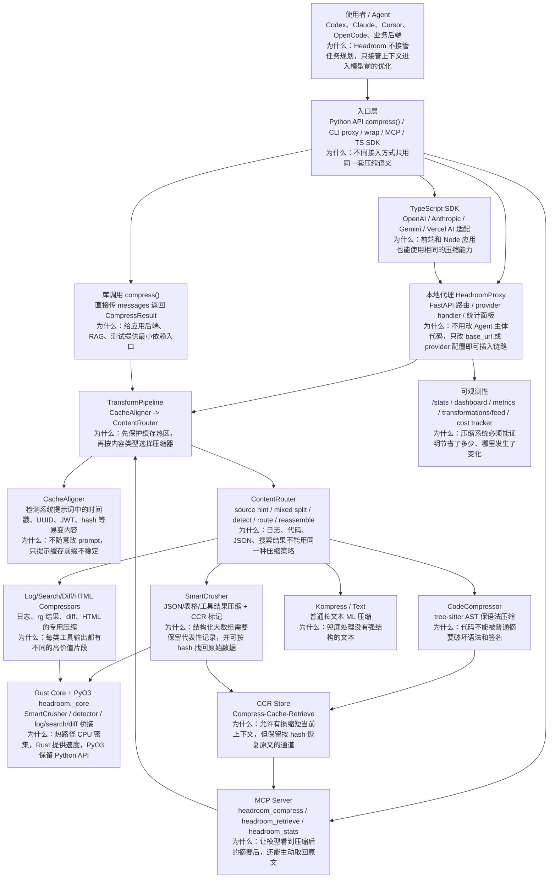
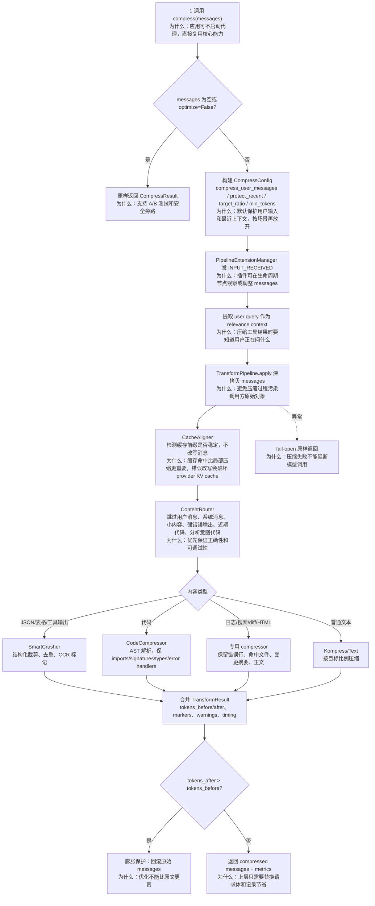
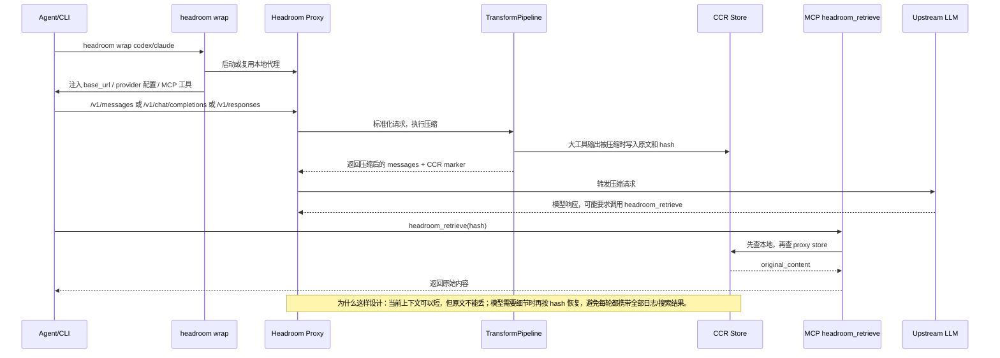
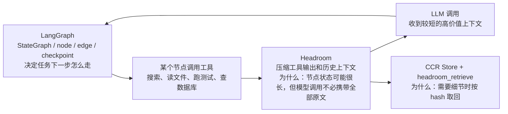

# Headroom 源码架构精读

分析对象：`sources/headroom`。当前源码版本为 `48201345be16a8b5aad74e8c390850dce0f34ec4`，分支 `main`，提交时间 `2026-07-06 20:05:34 -0400`，提交信息为 `fix(proxy): keep cache_control bounded + stable so the freeze overlay stops busting (#1852)`。

## 1. 总体结论

Headroom 不是 LangGraph、CrewAI、AutoGen 那类“多 Agent/工作流编排框架”，它更像一个本地优先的 **上下文压缩与可恢复层**。它站在 Agent 和 LLM API 之间，把工具输出、日志、搜索结果、RAG chunk、代码片段、历史消息在进入模型前压缩；如果压缩过程丢掉了细节，再通过 CCR（Compress-Cache-Retrieve）和 `headroom_retrieve` 工具按 hash 找回原文。

一句话定位：**LangGraph 决定下一步怎么走，Headroom 决定这一步送给模型的上下文如何变短、变稳、还能找回。**

这份源码里最值得分享的主线是：

1. 入口很多，但核心都收敛到 `TransformPipeline`。
2. 默认策略不是“删历史消息”，而是“只压缩 live zone 里的大块内容”。
3. `CacheAligner` 更像缓存安全检查器，不轻易改写系统提示词。
4. `ContentRouter` 是核心分发器：代码、JSON、日志、搜索结果、HTML、普通文本分开处理。
5. 有损压缩通过 CCR 留后路，压缩不是不可逆地丢数据。
6. 热路径逐步下沉到 Rust，通过 PyO3 暴露给 Python。

## 2. 最高层架构



读图说明：Headroom 的架构是“多入口、单核心、多策略、可恢复”。`wrap` 和 `proxy` 解决接入问题，`compress()` 解决库调用问题，MCP 解决“压缩后还能取回”的问题，Rust core 解决性能问题。它的抽象中心不是 Agent、节点或任务，而是 **一次模型调用前的上下文变换**。

源码证据：

| 主题 | 源码位置 | 说明 |
| --- | --- | --- |
| Python 包入口 | `pyproject.toml` | 包名 `headroom-ai`，CLI 为 `headroom = "headroom.cli:main"`，Rust 扩展模块为 `headroom._core`。 |
| Rust workspace | `Cargo.toml` | 包含 `headroom-core`、`headroom-proxy`、`headroom-py`、`headroom-parity`。 |
| 默认 pipeline | `headroom/compress.py:385-405` | 单例 `TransformPipeline`，注释写明默认顺序是 `CacheAligner -> ContentRouter`。 |
| Proxy 架构 | `headroom/proxy/server.py:623-775` | `HeadroomProxy` 初始化 provider runtime、metrics、router config、lossless/CCR/Kompress 等策略。 |
| MCP 工具 | `headroom/ccr/mcp_server.py:322-356` | MCP server 暴露 `headroom_compress`、`headroom_retrieve`、`headroom_stats`。 |

## 3. 核心入口矩阵

| 入口 | 适合场景 | 最终主线 | 分享时怎么讲 |
| --- | --- | --- | --- |
| `compress(messages)` | Python 应用、RAG 后端、测试中直接压缩 messages | `compress.py -> TransformPipeline` | “最小 API，像调用 tokenizer 一样调用压缩器。” |
| `headroom proxy` | 作为 OpenAI/Anthropic/Gemini/Codex 请求代理 | FastAPI app -> provider handler -> pipeline -> upstream | “不改 Agent 逻辑，只把请求先经过本地代理。” |
| `headroom wrap codex/claude/...` | 包装现有 AI 编码助手 | 启动 proxy + 注入 base_url + 注册 MCP | “帮你把 Agent 的模型入口换成 Headroom。” |
| MCP server | 让模型显式压缩或取回原文 | `headroom_compress` / `headroom_retrieve` | “压缩不是黑盒，模型可以自己拿回细节。” |
| TypeScript SDK | Node/前端/服务端 JS 接入 | SDK 调 `/v1/compress` 或适配 provider | “Python 核心能力通过代理给 JS 世界复用。” |

## 4. 主流程一：`compress()` 库调用



`compress()` 的几个设计点很关键：

| 设计点 | 源码证据 | 为什么这么设计 |
| --- | --- | --- |
| 默认不压缩 user message | `headroom/compress.py:100-116` | 编码 Agent 的用户输入通常是任务意图，误压缩会影响正确性；RAG/文档场景可显式打开。 |
| 保护最近消息 | `headroom/compress.py:111-116` | 最近几轮往往是活跃上下文，过度压缩会让模型失去局部连续性。 |
| 提取 user query 做相关性上下文 | `headroom/compress.py:237-247` | SmartCrusher 如果只看统计特征，可能丢掉和当前问题相关的行。 |
| 膨胀保护 | `headroom/compress.py:262-278` | 有些压缩器加了标记和摘要后可能比原文更长，必须回滚。 |
| fail-open | `headroom/compress.py:336-349` | 压缩是优化层，不应该因为失败阻断真正的 LLM 请求。 |

代码片段证据：

```python
if tokens_after > tokens_before:
    return CompressResult(
        messages=messages,
        tokens_after=tokens_before,
        tokens_saved=0,
        transforms_applied=["inflation_guard:reverted"],
    )
```

这段代码说明 Headroom 把“不能变差”写成了运行时保护，而不是只靠压缩器自觉。

## 5. 主流程二：`TransformPipeline` 与 `ContentRouter`

`TransformPipeline` 的源码注释直接说明了战略变化：旧的 “drop messages from history” 阶段被退休，现在主策略是 live-zone-only compression，不再在 pipeline 里删除消息列表。证据在 `headroom/transforms/pipeline.py:64-77`。

Pipeline 默认顺序：

1. 可选 `ToolResultInterceptorTransform`，先缩小特殊工具结果。
2. `CacheAligner`，关注 provider prefix cache 的稳定性。
3. `ContentRouter`，根据内容类型选择具体压缩器。

源码证据在 `headroom/transforms/pipeline.py:111-147`。同时 pipeline 有断路器：连续失败达到阈值后，在冷却窗口内直接透传，避免每个请求都重复失败，见 `headroom/transforms/pipeline.py:187-215`。

### ContentRouter 为什么是核心

`headroom/transforms/content_router.py:1-20` 写得很直白：它先看 source hint，再识别 mixed content，然后检测 JSON、code、search、logs、text，最后路由到对应压缩器并重组结果。

它不是“所有文本都摘要”，而是大量保护规则叠加：

| 保护规则 | 源码位置 | 目的 |
| --- | --- | --- |
| 默认跳过用户消息 | `content_router.py:3103-3109`、`3388-3391` | 保护任务意图。 |
| 默认跳过 system/developer | `content_router.py:3393-3400` | 保护缓存热区和系统指令。 |
| 小内容跳过 | `content_router.py:3402-3406` | 短文本压缩收益低，标记反而变贵。 |
| 强错误输出保护 | `content_router.py:3408-3424` | 小而关键的 traceback 要原样保留。 |
| 近期代码保护 | `content_router.py:3436-3442` | 最近代码通常正在被修改或分析。 |
| 分析/Review 意图保护代码 | `content_router.py:3444-3449` | 当用户要分析代码时，代码本身不能被过度摘要。 |
| 已压缩内容不重复压缩 | `content_router.py:3451-3459` | 避免 CCR marker 改变导致缓存破坏和不可控递归。 |

这个设计范式可以总结为：**先判定能不能动，再判断怎么压缩。**

## 6. 主流程三：Proxy + Wrap + MCP + CCR



代理链路最适合分享给别人，因为它直观解释了 Headroom 的产品价值：**不要求你重写 Agent，只要求把模型请求先经过本地优化层。**

源码证据：

| 功能 | 源码位置 | 说明 |
| --- | --- | --- |
| `wrap` 支持多 CLI | `headroom/cli/wrap.py:3517-3545` | 文档字符串列出 Claude、Codex、Copilot、Aider、Cursor、Goose、OpenHands、OpenCode 等。 |
| Codex 包装 | `headroom/cli/wrap.py:4393-4560` | 启动代理、注册 MCP、注入 Codex provider/base_url 配置。 |
| Codex provider 注入 | `headroom/cli/wrap.py:1724-1862` | 写入 `openai_base_url = "http://127.0.0.1:{port}/v1"` 等配置，并保留 unwrap 恢复能力。 |
| Proxy retrieve endpoint | `headroom/proxy/server.py:3711-3755` | `/v1/retrieve` 按 hash 返回 `original_content`。 |
| Provider tool call retrieve | `headroom/proxy/server.py:4070-4145` | `/v1/retrieve/tool_call` 兼容 Anthropic/OpenAI tool call 形态。 |
| MCP 工具注册 | `headroom/ccr/mcp_server.py:491-620` | `list_tools()` 暴露压缩、取回、统计工具。 |

CCR 的核心不是“缓存一下”，而是给有损压缩补一个可恢复通道。SmartCrusher 的注释里说明：当 lossy path 丢弃行时，会追加形如 `{"_ccr_dropped": "<<ccr:HASH N_rows_offloaded>>"}` 的 sentinel，模型看到 marker 后可以用 retrieval tool 取回原始数据，见 `headroom/transforms/smart_crusher.py:67-76`。

## 7. Rust Core 与 PyO3：为什么不是纯 Python

Headroom 是 Python 产品体验，但很多热路径下沉到 Rust：

| 模块 | 源码证据 | 设计原因 |
| --- | --- | --- |
| `SmartCrusher` | `headroom/transforms/smart_crusher.py:1-19` | Python 实现已退休，公开 API 保留，实际委托 `headroom._core.SmartCrusher`。 |
| PyO3 bridge | `crates/headroom-py/src/lib.rs:697-902` | 暴露 `SmartCrusher`、`ccr_get`、`ccr_len`。 |
| GIL 释放 | `crates/headroom-py/src/lib.rs:758-866` | JSON parse、crush、re-serialize 等重计算在 Rust 中执行，并释放 GIL。 |
| 检测器/日志/搜索/diff | `crates/headroom-py/src/lib.rs:985-1831` | 内容检测、search/log/diff compressor 也通过 Rust bridge 暴露。 |

为什么这么做：上下文压缩很容易出现在代理热路径里，如果每个模型请求都要解析大 JSON、长日志、巨型搜索结果，纯 Python 会拖慢代理。Rust 负责 CPU 密集处理，Python 保留生态入口、CLI、FastAPI、MCP 和 provider 适配，是典型的 **Python 产品层 + Rust 性能核** 范式。

## 8. CodeCompressor：代码为什么不能普通摘要

代码压缩器的设计说明在 `headroom/transforms/code_compressor.py:1-26`：使用 tree-sitter AST，保证输出语法有效，保留 import、签名、类型、错误处理，多语言通过 `LangConfig` 数据驱动。

关键范式：

| 范式 | 源码位置 | 说明 |
| --- | --- | --- |
| 数据驱动语言配置 | `code_compressor.py:236-312` | 每种语言声明 AST 节点类型和语法约定，避免每种语言写一套方法。 |
| 保留结构信息 | `code_compressor.py:396-440` | 配置项默认保留 imports、signatures、type annotations、decorators。 |
| 基于 AST 截断语句 | `code_compressor.py:1525-1555` | 遍历完整 statement，而不是按行硬切，保证压缩后还能 parse。 |

这也是 Headroom 和普通摘要器的差别：它不是只追求“短”，而是按内容形态追求“短且还能用”。

## 9. 真实例子：AI 编码助手调试 CI 失败

场景：你让 Codex 或 Claude 调试 CI 失败，Agent 跑了 `pytest`、`rg`、`git diff`，工具返回 6 万 token 的日志和代码片段。

没有 Headroom 时：

1. 全量日志进入下一次模型调用。
2. 模型上下文被重复工具输出占满。
3. 如果日志里有很多重复 warning，真正的 failure traceback 被噪声淹没。
4. 下一轮再查一次日志，又重复消耗。

有 Headroom 时：

1. `headroom wrap codex` 启动本地 proxy，注入 Codex base_url，并注册 `headroom_retrieve`。
2. Codex 的 `/v1/responses` 或 `/v1/chat/completions` 请求进入 Headroom proxy。
3. `ContentRouter` 识别日志、搜索结果、diff、代码片段。
4. 小而强的错误输出原样保留，大日志交给 `LogCompressor`，`rg` 结果交给 `SearchCompressor`，代码片段交给 `CodeCompressor`。
5. 如果某个大 JSON/表格/工具输出需要丢弃部分行，SmartCrusher 写 CCR marker 和原始内容。
6. 模型看到压缩后的高价值信息；如果需要完整日志某段，可以调用 `headroom_retrieve(hash)`。
7. `/stats` 和 dashboard 记录节省 token、成本和压缩策略。

对应源码证据：

| 行为 | 源码证据 |
| --- | --- |
| Proxy + MCP 同时跑的 e2e 测试 | `tests/e2e_cortex_proxy_mcp.py:1-15` |
| Proxy-only 自动压缩路径 | `tests/e2e_cortex_proxy_mcp.py:225-237` |
| MCP 显式压缩再走 proxy | `tests/e2e_cortex_proxy_mcp.py:239-292` |
| CCR retrieve round-trip | `tests/e2e_cortex_proxy_mcp.py:294-305` |
| 验证 proxy、MCP、compress、retrieve、stats 同时工作 | `tests/e2e_cortex_proxy_mcp.py:333-339` |

## 10. 应用场景

| 场景 | Headroom 价值 | 注意点 |
| --- | --- | --- |
| AI 编码助手 | 压缩 `rg`、日志、diff、文件片段，减少上下文浪费 | 分析代码时要保护近期代码，避免摘要破坏细节。 |
| RAG 应用 | 压缩大量 chunk 或检索结果，让模型先看高价值摘要 | 如果用户问题需要逐字引用，要保留 retrieve 通道。 |
| 数据分析 Agent | 压缩大 JSON、CSV、表格和查询结果 | 结构化数据有损压缩时要解释 CCR marker。 |
| 长会话 Agent | 压缩旧工具输出，不删除消息列表 | 它不是完整 memory 系统，长期记忆仍需要 mem0/Zep/Graphiti。 |
| 企业代理网关 | 统一接入 OpenAI/Anthropic/Gemini/Codex 并统计节省 | 多 worker 需要关注 CCR store 分裂，源码里已有警告。 |

多 worker 局限源码证据在 `headroom/proxy/server.py:4334-4359`：如果没有跨 worker 的 CCR backend，多进程会导致 in-memory CCR store、prefix tracker、TOIN、CostTracker 分裂，可能出现 retrieval failure 或 dashboard 不稳定。

## 11. 和 LangGraph / mem0 / Zep / Graphiti / CrewAI / AutoGen 的对比

| 框架 | 核心问题 | Headroom 的位置 |
| --- | --- | --- |
| LangGraph | 状态图、节点、边、checkpoint、可控工作流 | Headroom 可放在 LangGraph 的模型调用或工具结果进入模型前，降低每个节点调用的 token 成本。 |
| mem0 | 用户/Agent 的长期记忆事实写入与检索 | mem0 决定“记什么”，Headroom 决定“当前请求怎么缩短”。 |
| Zep | 托管记忆平台、session/thread/user memory | Zep 是记忆服务，Headroom 是本地上下文优化层。 |
| Graphiti | temporal context graph，带时间和来源的事实图 | Graphiti 存知识图谱，Headroom 压缩当前上下文；二者可组合。 |
| CrewAI | Role + Task + Crew 多 Agent 协作 | CrewAI 负责角色和任务协作，Headroom 可减少各 Agent 工具输出的上下文浪费。 |
| AutoGen | 多 Agent 对话、工具调用、群聊协作 | AutoGen 负责编排对话，Headroom 可作为 proxy/MCP 插入上下文压缩。 |

### 和 LangGraph 组合图



组合建议：LangGraph 管状态和控制流，Headroom 做模型调用前的上下文预算控制。不要让 Headroom 替代 LangGraph 的 checkpoint，也不要让 LangGraph 自己手写日志压缩逻辑。

## 12. 核心设计思想与设计范式

| 设计思想 | 源码证据 | 可分享表述 |
| --- | --- | --- |
| 优化层必须 fail-open | `compress.py:336-349` | “压缩失败时宁愿多花 token，也不能让 Agent 请求失败。” |
| 不可让优化变贵 | `compress.py:262-278` | “token 变多就回滚，优化不是信仰，是可验证收益。” |
| 先保护再压缩 | `content_router.py:3388-3459` | “用户意图、系统指令、错误输出、近期代码都是保护对象。” |
| 内容感知路由 | `content_router.py:1-20` | “日志、代码、JSON、搜索结果有不同的信息密度和风险。” |
| 可恢复有损压缩 | `smart_crusher.py:67-76`、`proxy/server.py:3711-3755` | “当前上下文短，原文仍然可按 hash 找回。” |
| 热路径 Rust 化 | `smart_crusher.py:1-19`、`crates/headroom-py/src/lib.rs:758-866` | “Python 做集成体验，Rust 做 CPU 密集压缩。” |
| 代理模式低侵入 | `cli/wrap.py:1724-1862`、`4393-4560` | “不重写 Agent，只把模型 endpoint 改到本地代理。” |
| 可观测性内建 | `proxy/server.py:3492-3663` | “压缩系统必须向使用者证明节省和风险。” |

代码片段证据：

```python
# headroom/compress.py
except Exception as e:
    logger.warning("Compression failed, returning original messages: %s", e)
    return CompressResult(messages=messages, tokens_saved=0)
```

```python
# headroom/transforms/pipeline.py
self._breaker_threshold = _breaker_env("HEADROOM_PIPELINE_BREAKER_THRESHOLD", 3, int)
self._breaker_cooldown_s = _breaker_env("HEADROOM_PIPELINE_BREAKER_COOLDOWN_S", 60.0, float)
```

```python
# headroom/transforms/smart_crusher.py
CCR_SENTINEL_KEY = "_ccr_dropped"
```

这些片段共同说明：Headroom 的工程哲学是防守型的。它不是为了极限压缩牺牲正确性，而是在“节省 token”和“保留可恢复性”之间做平衡。

## 13. 局限性与使用边界

| 局限 | 为什么 | 建议 |
| --- | --- | --- |
| 不是 Agent 编排框架 | 没有 LangGraph 那种图状态和边控制 | 需要复杂流程时和 LangGraph/AutoGen/CrewAI 组合。 |
| 不是长期记忆系统 | CCR 主要服务当前压缩恢复，不等价于用户长期 memory | 长期记忆用 mem0/Zep/Graphiti，Headroom 做上下文预算。 |
| 有损压缩需要 retrieve 兜底 | SmartCrusher/Kompress 可能丢细节 | 分享时一定讲清 CCR marker 和 `headroom_retrieve`。 |
| 多 worker 有状态分裂风险 | in-memory store 分散在不同进程 | 配置 `HEADROOM_CCR_BACKEND=sqlite`、单 worker 或 sticky session。 |
| 过度压缩会影响代码分析 | 代码语义细节很脆弱 | 保持默认保护近期代码和分析意图代码。 |
| 接入依赖代理/配置注入 | wrap 要修改 CLI 配置或 env | 生产环境先从显式 `compress()` 或测试代理开始。 |

## 14. 分享时建议怎么讲

推荐叙述顺序：

1. 先讲痛点：Agent 工具输出越来越长，模型真正需要的是高价值上下文，不是所有原文。
2. 再讲定位：Headroom 是上下文压缩层，不是工作流框架，也不是长期记忆数据库。
3. 展示架构图：多入口收敛到 `TransformPipeline`，再由 `ContentRouter` 分发到专用压缩器。
4. 展示主流程：压缩前保护规则、内容路由、膨胀回滚、fail-open。
5. 讲 CCR：为什么有损压缩仍然可恢复。
6. 用真实例子收束：调试 CI 大日志、`rg` 搜索结果、RAG 大 chunk。
7. 最后讲组合：LangGraph 管流程，mem0/Zep/Graphiti 管长期记忆，Headroom 管当前上下文成本。

可以直接这样开场：

> “Headroom 解决的不是 Agent 下一步做什么，而是 Agent 每次问模型时，不要把 6 万 token 的日志、搜索结果、重复 JSON 原封不动塞进去。它会先判断哪些内容不能动，再按内容类型压缩；如果压缩丢了细节，还能通过 CCR 和 `headroom_retrieve` 按 hash 找回。”

## 15. 源码证据清单

| 模块 | 文件 |
| --- | --- |
| Python API | `headroom/compress.py` |
| Pipeline | `headroom/transforms/pipeline.py` |
| 内容路由 | `headroom/transforms/content_router.py` |
| JSON/CCR | `headroom/transforms/smart_crusher.py` |
| 代码压缩 | `headroom/transforms/code_compressor.py` |
| Proxy | `headroom/proxy/server.py`、`headroom/proxy/handlers/openai.py`、`headroom/proxy/handlers/anthropic.py` |
| Wrap | `headroom/cli/wrap.py` |
| MCP | `headroom/ccr/mcp_server.py`、`headroom/ccr/tool_injection.py` |
| Rust bridge | `crates/headroom-py/src/lib.rs` |
| TypeScript SDK | `sdk/typescript/src/client.ts`、`sdk/typescript/src/compress.ts` |
| E2E 验证 | `tests/e2e_cortex_proxy_mcp.py` |
