# Hermes Agent 源码分析

> 分析对象：`NousResearch/hermes-agent`。当前本地浅克隆版本为 `f64e4f4`，提交信息 `feat(gateway): generic OIDC client-credentials relay provisioning (NAS-free) (#60730)`。
> 定位说明：本文把 Hermes Agent 作为“项目工程/产品工程”分析，不纳入 LLM 框架横向总览。

## 一句话结论

Hermes Agent 不是 LangGraph、Dify、Haystack 那类“给开发者搭 Agent/RAG/Workflow 的框架”，而是一个完整的个人 AI Agent 产品工程：同一套 Agent Core 被 CLI、TUI、Messaging Gateway、ACP、Desktop、Cron 等入口复用，围绕长期会话、工具执行、状态恢复、记忆技能、平台投递和运维安全做了大量工程化设计。

## 总体架构

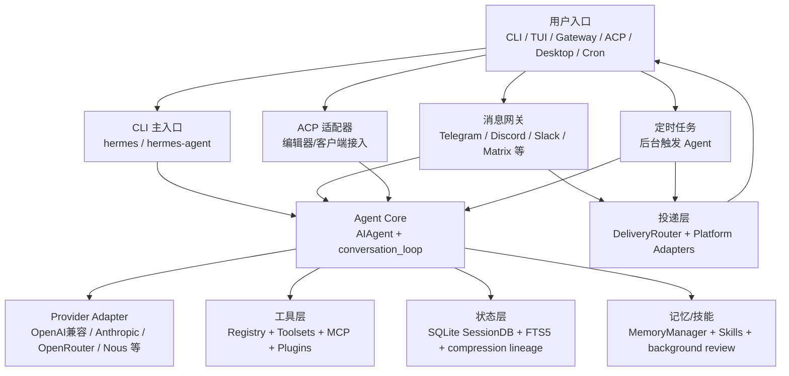

### 为什么这样设计

Hermes 的核心约束可以概括成两句话：

1. **同一个 Agent Core 复用到多个产品入口**：CLI、Gateway、ACP、桌面都不各自实现一套 Agent，它们负责入口差异、会话身份和投递差异，核心执行仍回到 `AIAgent + conversation_loop`。
2. **核心保持窄腰，能力长在边缘**：工具、技能、插件、MCP、平台适配器都放在边缘扩展，避免每增加一个能力就污染核心工具 schema。

源码证据：

- `sources/hermes-agent/AGENTS.md:9-14` 说明 Hermes 是 personal AI agent，同一个 agent core 运行在 CLI、messaging gateway、TUI、Electron desktop，并具备 memory、skills、subagents、scheduled jobs、terminal/browser。
- `sources/hermes-agent/AGENTS.md:19-27` 明确提出 prompt caching 和 narrow waist 是两个核心设计约束。
- `sources/hermes-agent/pyproject.toml:307-310` 暴露了 `hermes`、`hermes-agent`、`hermes-acp` 三个脚本入口。

## 入口矩阵

| 入口 | 主要文件 | 适合场景 | 最终落点 |
|---|---|---|---|
| CLI/TUI | `cli.py`, `hermes_cli/main.py` | 本地交互、一次性 query、代码任务、worktree 隔离 | `AIAgent.run_conversation` |
| Agent runner | `run_agent.py` | 直接运行 Agent、核心类封装 | `agent.conversation_loop.run_conversation` |
| Messaging Gateway | `gateway/run.py` | Telegram/Discord/Slack 等长期在线 Bot | `GatewayRunner` 缓存并调用 `AIAgent` |
| Cron | `cron/scheduler.py` | 定时总结、监控、周期性任务 | 临时 AIAgent 执行 job prompt |
| ACP | `acp_adapter/server.py` | 编辑器/客户端按 Agent Client Protocol 调用 | `HermesACPAgent` 包装 `AIAgent` |

## 主流程一：CLI 一轮对话

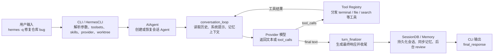

源码证据：

- `sources/hermes-agent/cli.py:15669-15726` 的 `main()` 参数覆盖 query、image、toolsets、skills、model、provider、gateway、resume、worktree 等入口能力。
- `sources/hermes-agent/cli.py:15750-15770` 在非列表命令下支持 worktree 隔离，适合代码任务并行运行。
- `sources/hermes-agent/run_agent.py:393-399` 定义 `AIAgent`，负责 conversation flow、tool execution、response handling。
- `sources/hermes-agent/run_agent.py:5745-5768` 的 `run_conversation()` 是薄转发，实际逻辑在 `agent.conversation_loop`。
- `sources/hermes-agent/agent/conversation_loop.py:1-10` 说明该模块从 `run_agent.AIAgent` 抽出约 3900 行主循环，覆盖 model call、tool dispatch、retry、fallback、compression、post-turn hooks、memory/skill review。

## 主流程二：Gateway 消息


为什么要这样做：

- Gateway 是长期进程，如果每条消息都重建 Agent，会反复重建系统提示、工具 schema、记忆上下文，破坏 prompt cache。
- `session_key` 把不同平台的 chat/thread/user 转成统一会话身份，投递、恢复、审批、队列都可以围绕统一 key 做。
- `DeliveryRouter` 把 Agent 输出翻译成平台可发送的文本、图片、文件、语音，避免 Agent Core 理解每个平台 API。

源码证据：

- `sources/hermes-agent/gateway/run.py:63-68` 定义每会话 AIAgent 缓存上限 128 和 idle TTL 1 小时。
- `sources/hermes-agent/gateway/run.py:2492-2510` 说明 session key 格式是 `agent:main:{platform}:{chat_type}:{chat_id}[:extra]`。
- `sources/hermes-agent/gateway/run.py:2774-2779` `GatewayRunner` 管理所有平台适配器并在平台和 Agent 间路由。
- `sources/hermes-agent/gateway/run.py:2950-2959` 说明缓存 AIAgent 是为了保护 prompt caching。

## 工具系统

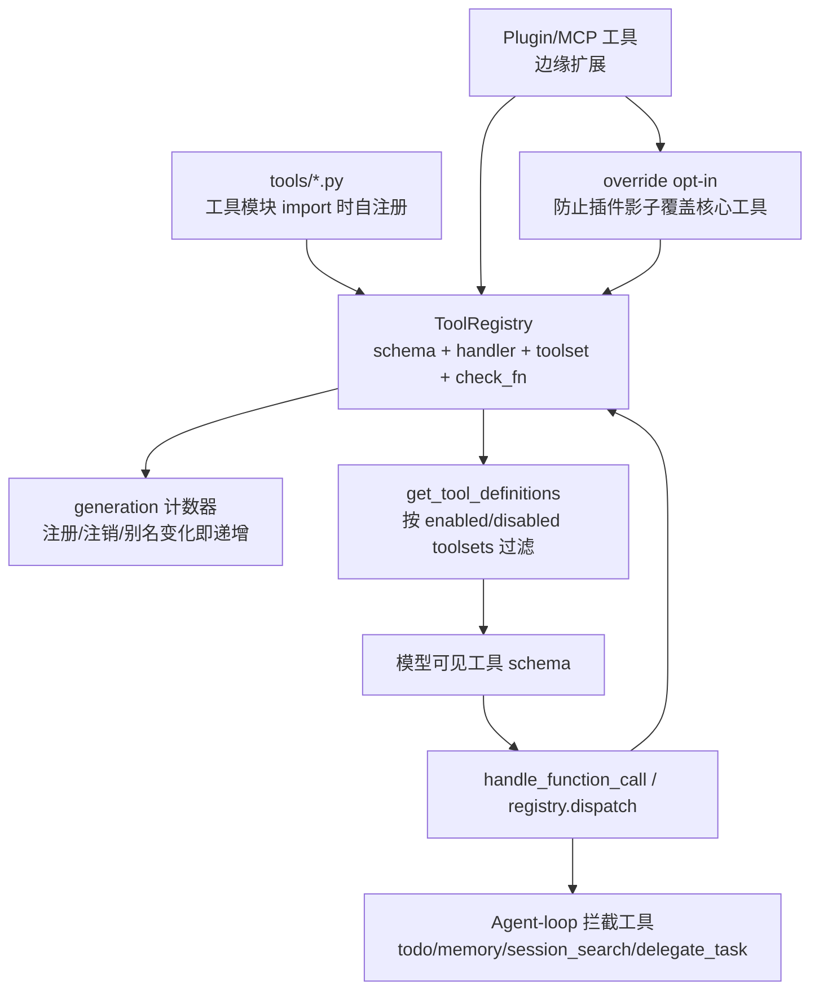

核心设计思想：

- **注册表模式**：工具文件自注册 schema、handler、toolset，`model_tools.py` 只做薄编排，避免平行结构漂移。
- **工具集分组**：不同入口可以启用不同 toolsets，例如 CLI 给代码工具，Cron 禁用交互工具，Gateway 按平台配置工具。
- **动态缓存失效**：Gateway 是长进程，工具 schema 可以缓存；MCP/插件变更时通过 registry generation 失效。
- **边缘扩展但核心保守**：插件可以扩展工具，但覆盖核心工具需要显式 opt-in。

关键代码片段：

```python
# sources/hermes-agent/model_tools.py:5-12
# Thin orchestration layer over the tool registry.
# Each tool file in tools/ self-registers its schema, handler, and metadata.
```

```python
# sources/hermes-agent/model_tools.py:596-600
_AGENT_LOOP_TOOLS = {"todo", "memory", "session_search", "delegate_task"}
```

源码证据：

- `sources/hermes-agent/tools/registry.py:58-64` `discover_builtin_tools()` 扫描内置工具模块，import 后触发自注册。
- `sources/hermes-agent/tools/registry.py:208-230` `ToolRegistry` 使用 RLock 和 generation 计数器，支持动态变更和缓存失效。
- `sources/hermes-agent/tools/registry.py:356-448` `register()` 处理 override、shadow reject、generation bump。
- `sources/hermes-agent/model_tools.py:247-261` `get_tool_definitions()` 是主 schema provider，并按 enabled/disabled toolsets 与 registry generation 缓存。
- `sources/hermes-agent/model_tools.py:596-600` todo、memory、session_search、delegate_task 是 agent-loop 特殊工具，需要 Agent 级状态。

## 状态、记忆和技能

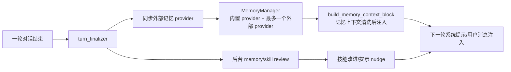

为什么这样设计：

- 长期个人 Agent 必须能恢复历史、搜索历史、压缩长会话，并把跨会话经验沉淀为记忆和技能。
- 记忆/技能复盘放在响应之后，避免当前用户任务被后台学习抢走上下文和注意力。
- 外部 memory provider 只允许一个，是为了减少工具 schema 膨胀和后端冲突。

源码证据：

- `sources/hermes-agent/hermes_state.py:3-15` 说明 SQLite State Store 负责 session metadata、full message history、model config、WAL、FTS5、compression parent_session_id chains、source tagging。
- `sources/hermes-agent/hermes_state.py:10-12` 点出 WAL、FTS5、compression lineage 的设计动机。
- `sources/hermes-agent/agent/memory_manager.py:3-8` 说明 MemoryManager 是单一集成点，且只允许一个外部 memory provider。
- `sources/hermes-agent/agent/memory_manager.py:353-357` `MemoryManager` 编排 built-in provider 和最多一个 external provider。
- `sources/hermes-agent/agent/turn_finalizer.py:462-480` 每轮结束同步 external memory，并在响应交付后执行 background memory/skill review。

## Cron 与 ACP

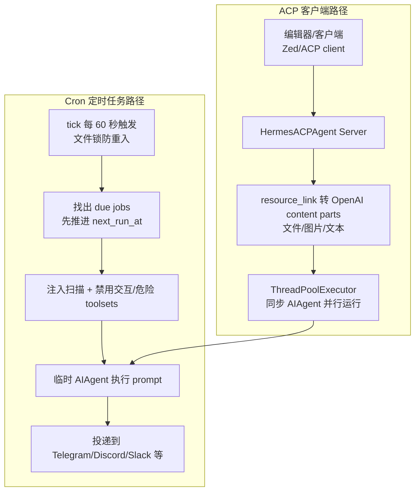

源码证据：

- `sources/hermes-agent/cron/scheduler.py:4-8` scheduler 提供 `tick()`，Gateway 每 60 秒调用，并使用文件锁防止多进程重叠。
- `sources/hermes-agent/cron/scheduler.py:103-112` 运行前扫描组装后的 prompt，包括 runtime 加载的 skill 内容，防 prompt injection。
- `sources/hermes-agent/cron/scheduler.py:116-136` Cron 自动禁用 `cronjob`、`messaging`、`clarify` 等交互/危险 toolsets。
- `sources/hermes-agent/cron/scheduler.py:170-181` Cron toolset 优先级为 per-job、platform config、fallback full default。
- `sources/hermes-agent/acp_adapter/server.py:1` 说明 ACP server 把 Hermes Agent 暴露为 Agent Client Protocol。
- `sources/hermes-agent/acp_adapter/server.py:89-90` ACP 用 `ThreadPoolExecutor(max_workers=4)` 并行运行同步 AIAgent。
- `sources/hermes-agent/acp_adapter/server.py:154-159` 处理 Zed/WSL/Windows 文件路径转换。
- `sources/hermes-agent/acp_adapter/server.py:216-220` 将 ACP resource_link 转成 OpenAI content parts。

## 核心设计范式

| 设计思想 | 源码表现 | 为什么重要 |
|---|---|---|
| Narrow Waist | `AIAgent + conversation_loop` 作为核心，入口与能力放边缘 | 多入口复用核心，减少重复实现 |
| Edge Extensibility | Tool Registry、Toolsets、MCP、Plugins、Skills | 新能力不直接膨胀核心 schema |
| Prompt Cache First | Gateway 缓存每会话 AIAgent，系统提示保持稳定 | 长会话成本更低，模型调用更稳定 |
| Stateful Product Agent | SQLite SessionDB、FTS5、parent_session_id chains | 支持恢复、搜索、压缩、跨平台会话 |
| Background Self-improvement | turn_finalizer 后台 memory/skill review | 当前任务优先，长期学习滞后执行 |
| Defense in Depth | 插件 override opt-in、Cron prompt scanning、toolset denylist | 长期在线 Agent 不能只依赖模型自觉 |
| Operational Resilience | WAL fallback、Gateway cache cap、Cron file lock、ThreadPoolExecutor | 产品工程要处理重启、并发、长进程资源泄漏 |

## 真实例子

### 例子 1：CLI 里让 Hermes 修复仓库 bug

用户运行：

```bash
hermes -w -q "检查当前仓库测试失败原因并修复"
```

脉络：

1. `cli.py` 解析 `-w`，创建隔离 git worktree。
2. 根据当前代码目录选择合适 toolsets，例如 file、terminal、search。
3. `HermesCLI` 创建 `AIAgent`，调用 `run_conversation()`。
4. 模型提出工具调用，工具系统分发到 `read_file`、`search_files`、terminal 等。
5. 一轮结束后，`turn_finalizer` 持久化会话，并可能触发后台记忆/技能复盘。

理解重点：这更像“产品化 Coding Agent”，不是只给你一个 graph API。

### 例子 2：Telegram 用户发“每天早上总结 GitHub issue”

脉络：

1. Gateway adapter 把 Telegram 消息转成统一 `MessageEvent`。
2. `GatewayRunner` 用 `session_key` 找到或创建该聊天对应的 AIAgent。
3. Agent 识别需要创建 cron job，工具层调用 cronjob 相关工具。
4. 后续 `cron.scheduler.tick()` 每 60 秒检查 due jobs。
5. Cron 执行时禁用 `messaging/clarify/cronjob` 等 toolsets，避免定时任务等待用户或递归创建任务。
6. 执行结果通过 `DeliveryRouter` 投递回 Telegram。

理解重点：Gateway + Cron + DeliveryRouter 是产品工程复杂度的来源。

### 例子 3：ACP/Zed 客户端带文件资源提问

脉络：

1. ACP 客户端发送 message，其中包含 resource_link。
2. `acp_adapter/server.py` 解析 file URI，兼容 WSL/Windows 路径。
3. 非图片资源转成文本 content part，图片资源转成 image_url content part。
4. 同步 `AIAgent` 运行在线程池中，不阻塞 ACP server 的异步协议处理。

理解重点：ACP 不是另一个 Agent，而是把已有 Agent Core 包装成编辑器可调用协议。

## 补充一：Provider Adapter 细节

Hermes 的 Provider Adapter 不是完整 Agent 抽象，而是 provider-specific data path：负责把 Hermes 内部消息和工具 schema 转成不同模型 API 能接受的格式，再把返回值归一成统一的 `NormalizedResponse`。这样做的关键收益是：模型协议变化留在 adapter，Agent 生命周期、streaming、重试、fallback、压缩、interrupt、prompt cache 仍由 `AIAgent` 统一控制。

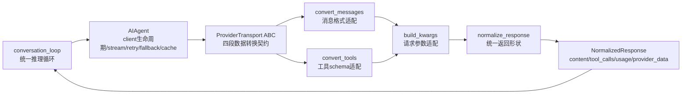

为什么这样设计：

- 如果每个 provider 的消息格式、工具格式、stop reason、usage 字段都散落在主循环里，`conversation_loop` 会越来越像兼容性垃圾桶。
- `ProviderTransport` 把协议差异收束为 `convert_messages -> convert_tools -> build_kwargs -> normalize_response` 四段，主循环只认统一响应。
- provider 特有数据不丢弃，而是放在 `provider_data`，便于保留 cache stats、stop reason 等细节。

关键代码片段：

```python
# sources/hermes-agent/agent/transports/base.py:1-8
# Transport owns the provider-specific data path:
# convert_messages -> convert_tools -> build_kwargs -> normalize_response
```

源码证据：

- `sources/hermes-agent/agent/transports/base.py:16-86`：`ProviderTransport` 定义 provider adapter 的抽象契约。
- `sources/hermes-agent/agent/transports/types.py:91-109`：`NormalizedResponse` 统一 content、tool_calls、finish_reason、usage、provider_data。
- `sources/hermes-agent/agent/transports/anthropic.py:13-17`：Anthropic transport 包装已有 adapter 函数，避免复制旧逻辑。
- `sources/hermes-agent/agent/transports/anthropic.py:222-244`：adapter 抽取 cache stats 并映射 stop reason。

## 补充二：工具执行安全边界

工具层既是 Hermes 的能力扩展点，也是最大风险入口。Hermes 的安全边界不是单点开关，而是多层防御：toolset scope 限制工具暴露面，dangerous command approval 管危险命令，hardline blocklist 永久禁止高危操作，Gateway 审批前做 secret redaction，`session_key` 通过 contextvars 隔离并发会话。

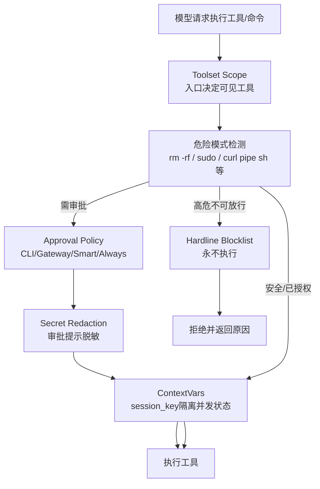

为什么这样设计：

- Hermes 是长期在线 Agent，既可能在 CLI 里改代码，也可能在 Gateway 里响应聊天平台消息。
- 只靠模型“不要做危险事”不够，危险命令识别、审批状态、会话隔离、平台提示脱敏都必须进入工具执行路径。
- Cron/Gateway/CLI 的上下文不同，所以工具安全也不能只做全局开关，要结合入口、会话和审批模式。

源码证据：

- `sources/hermes-agent/tools/approval.py:1-8`：dangerous command approval 是危险模式检测、每会话审批状态、CLI/Gateway 提示、smart approval、永久允许列表的单一事实源。
- `sources/hermes-agent/tools/approval.py:32-58`：冻结 yolo 状态与 contextvars，避免 prompt injection 或并发绕过。
- `sources/hermes-agent/tools/approval.py:289-305`：hardline blocklist 中的命令即使 yolo/approval off/cron approve mode 也不执行。
- `sources/hermes-agent/tools/approval.py:3016-3151`：Gateway/ask 场景会对整段脚本做审批，并支持 smart approval、session/always 持久化。
- `sources/hermes-agent/gateway/run.py:340-346`：Gateway 审批提示发送到聊天平台前会脱敏凭据。

## 补充三：SessionDB 表结构与检索细节

`SessionDB` 是长期个人 Agent 的底座，不只是聊天记录表。`sessions` 存会话身份、模型配置、system prompt、父会话、token/cost 统计；`messages` 存消息、工具调用、reasoning、active/compacted 状态；FTS 和 trigram 索引支持英文全文检索和中文子串检索；压缩后的历史仍可参与搜索。

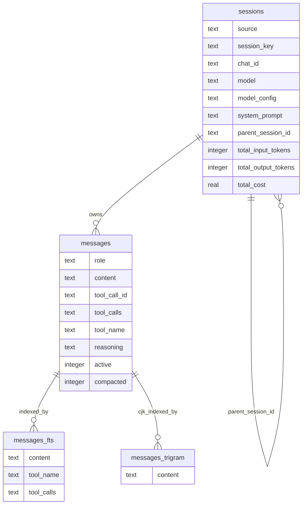

为什么这样设计：

- 英文/代码场景适合 FTS，中文短语和部分匹配需要 trigram。
- 长会话压缩后不能把旧事实直接丢掉，所以查询默认覆盖 active 行和 compaction-archived 行。
- `parent_session_id` 让压缩会话保留 lineage，后续可以追溯上下文来源。

源码证据：

- `sources/hermes-agent/hermes_state.py:701-745`：`sessions` 表包含 source、session_key、chat_id、model、model_config、system_prompt、parent_session_id、token/cost 字段。
- `sources/hermes-agent/hermes_state.py:748-768`：`messages` 表包含 role、content、tool_call_id、tool_calls、tool_name、reasoning、active、compacted。
- `sources/hermes-agent/hermes_state.py:820-838`：FTS triggers 索引 content、tool_name、tool_calls。
- `sources/hermes-agent/hermes_state.py:840-848`：trigram FTS 表支持 CJK 子串搜索。
- `sources/hermes-agent/hermes_state.py:4493-4499`：搜索默认包含 active rows 和 compaction-archived rows。
- `sources/hermes-agent/hermes_state.py:4971-5017`：通过 parent_session_id 维护压缩后的 lineage。

## 补充四：Gateway 复杂场景

Gateway 的复杂性不在“收一条消息，回一句话”，而在聊天平台是异步、长连接、多人、多消息、多媒体、多审批的环境：用户可能连续追问，Agent 可能正在跑工具，平台可能发来图片或文件，管理员可能在审批危险命令，进程也可能重启。Hermes 用 running agents、pending messages、overflow queue、resume_pending、media auto-append 和 DeliveryRouter 去兜住这些边界。

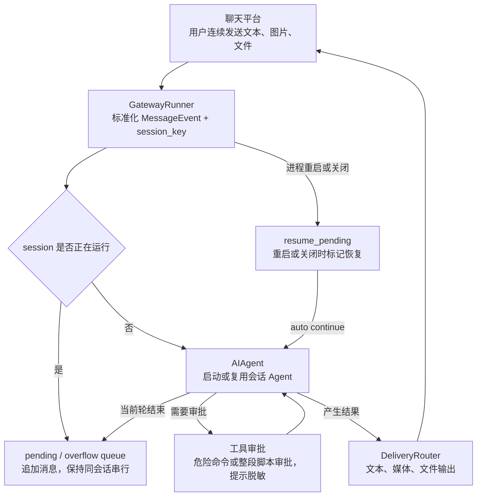

为什么这样设计：

- 聊天平台不会等 Agent 完成才让用户继续输入，Gateway 必须保证同一会话串行执行，同时不能丢消息。
- 媒体自动追加只应绑定当前轮 producer-tool 结果，避免把旧媒体或示例误发给用户。
- 重启/关闭时要标记可恢复状态，避免长任务半路消失。

源码证据：

- `sources/hermes-agent/gateway/run.py:2909-2928`：维护 `_running_agents`、`_pending_messages`、overflow queue 和 session state。
- `sources/hermes-agent/gateway/run.py:991-1148`：media auto-append 只追加当前轮 producer-tool 生成的媒体，避免复用旧 MEDIA 示例。
- `sources/hermes-agent/gateway/run.py:7227-7229`：fresh session 会自动继续此前因 Gateway 重启/关闭被打断的任务。
- `sources/hermes-agent/gateway/run.py:8044-8126`：shutdown/restart 会 drain timeout、标记 resume_pending，并 interrupt 剩余工作。

## 补充五：Plugin / Skill / MCP 的边界

这三者都扩展 Agent，但边界不同：Plugin 改运行时能力和接入面，可以注册工具、hook、middleware；Skill 更像经验/流程/上下文沉淀，帮助 Agent 在特定任务里按既定方式工作；MCP 把外部服务暴露为工具。最终它们要么进入 Tool Registry，要么作为 user message context 注入，而不是随意改系统提示和核心循环。

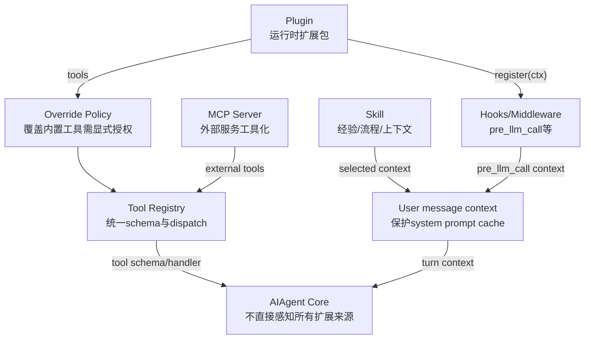

为什么这样设计：

- Plugin 是运行时代码扩展，风险更高，所以覆盖内置工具需要 operator opt-in。
- Skill 更适合沉淀流程、偏好、上下文，不能等同于工具实现。
- MCP 是外部服务工具化入口，最终仍要进入统一 Tool Registry。
- `pre_llm_call` 注入 user message 而不是 system prompt，是为了保护 system prompt 前缀缓存。

源码证据：

- `sources/hermes-agent/hermes_cli/plugins.py:5-31`：plugin 来源包括 bundled/user/project/pip，并可注册 hooks/tools。
- `sources/hermes-agent/hermes_cli/plugins.py:241-252`：插件默认通过 `plugins.enabled` opt-in。
- `sources/hermes-agent/hermes_cli/plugins.py:1746-1795`：加载 plugin 后调用 `register(ctx)`，记录 tools/hooks/middleware。
- `sources/hermes-agent/hermes_cli/plugins.py:1890-1908`：`pre_llm_call` context 注入 user message，而不是 system prompt，以保护 prompt cache。
- `sources/hermes-agent/tools/registry.py:393-407`：plugin 覆盖内置工具需要 operator opt-in，否则抛 `PermissionError`。

## 补充六：源码阅读路线

Hermes 不能按目录从上到下读，文件会显得很散。建议按“产品入口 -> Agent 核心 -> 工具/状态 -> 长期运行入口 -> 扩展机制”的顺序读，这样每个大文件都有上下文。

1. `AGENTS.md`：先读项目自述式工程约束，抓住 prompt cache、narrow waist、多入口复用。
2. `pyproject.toml`：看脚本入口和可选依赖，确认 CLI、ACP、Gateway、desktop 的产品边界。
3. `cli.py:main()`：从最常用入口看参数如何转成 Agent 配置。
4. `run_agent.py:AIAgent`：看核心对象持有什么状态，哪些逻辑已下沉到 `agent/`。
5. `agent/conversation_loop.py`：看模型调用、工具分发、retry/fallback、compression、post-turn hooks 的主脉络。
6. `agent/transports/base.py`、`agent/transports/types.py`：看 provider adapter 的最小契约和归一化返回形状。
7. `model_tools.py`、`tools/registry.py`、`toolsets.py`：看工具 schema 从哪里来、如何过滤、如何分发。
8. `tools/approval.py`：单独读工具安全，因为它解释了长期 Agent 为什么不能直接执行所有命令。
9. `hermes_state.py`：看 SessionDB、FTS、压缩 lineage、会话恢复。
10. `gateway/run.py`：带着 session_key、pending queue、delivery、approval 的问题去读，不要试图一次性背完整文件。
11. `cron/scheduler.py`：看非交互定时任务如何复用 Agent Core，又如何收紧工具边界。
12. `acp_adapter/server.py`：看编辑器/客户端协议如何包装同步 AIAgent。
13. `hermes_cli/plugins.py`、`agent/memory_manager.py`：最后看扩展机制和长期记忆，理解“能力在边缘”的落地方式。

分享时可这样说：

> 我不是按文件讲 Hermes，而是按一个长期 Agent 产品的生命周期讲：请求怎么进来、模型怎么跑、工具怎么控风险、状态怎么留下、平台怎么投递、后台任务怎么恢复、扩展能力怎么不污染核心。

## 分享总览大图

这张图适合放在分享开头或结尾：开头用它建立全局地图，结尾用它回收重点。讲的时候按 1 到 5 的顺序走，不需要逐个文件背诵。

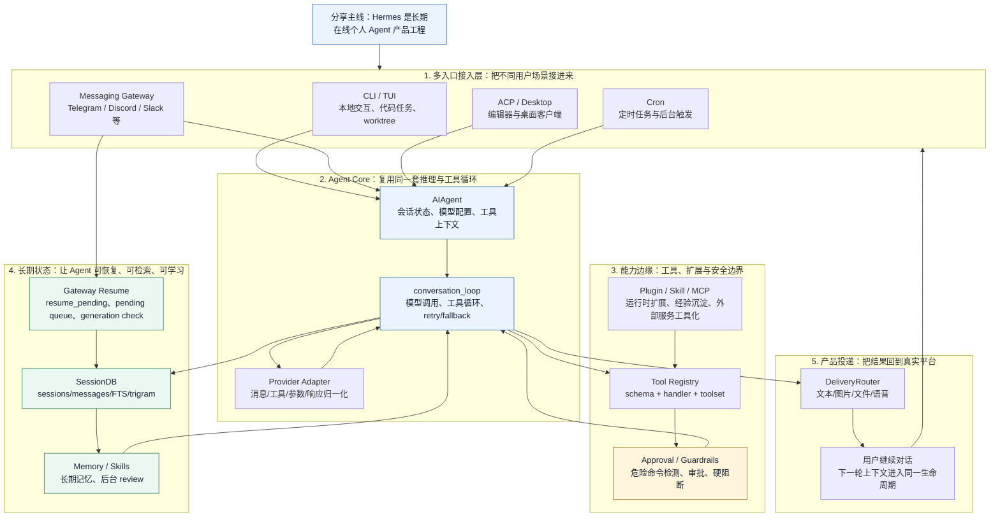

为什么这张图这样画：

- 它不是目录结构图，而是分享叙事图。
- 先说明多入口，再说明核心复用，然后强调工具安全和长期状态，最后落到产品投递和继续对话。
- 听众可以从这张图理解 Hermes 的工程复杂度来自“长期运行的产品生命周期”。

独立图文件：`docs/hermes-agent-source-analysis/share-overview.mmd`。

## 源码阅读 Checklist

这份 checklist 适合分享后给团队自查。读完 Hermes 后，不一定要记住所有文件，但应该能回答下面这些问题。

| 检查项 | 能回答的问题 | 主要源码锚点 |
|---|---|---|
| 入口识别 | CLI、Gateway、ACP、Cron 分别负责什么，哪里回到同一个 Agent Core？ | `cli.py`、`gateway/run.py`、`acp_adapter/server.py`、`cron/scheduler.py` |
| 核心循环 | `AIAgent` 和 `conversation_loop` 的边界是什么？谁负责模型调用、工具循环和收尾？ | `run_agent.py`、`agent/conversation_loop.py`、`agent/turn_finalizer.py` |
| Provider 适配 | 不同模型 API 的消息、工具、usage、stop reason 如何被归一化？ | `agent/transports/base.py`、`agent/transports/types.py` |
| 工具系统 | 模型看到的工具 schema 从哪里来？工具 handler 如何注册和分发？toolset 如何收窄暴露面？ | `model_tools.py`、`tools/registry.py`、`toolsets.py` |
| 安全边界 | 危险命令如何检测、审批、硬阻断？Gateway 审批如何避免跨会话污染？ | `tools/approval.py`、`gateway/run.py` |
| 状态与检索 | 会话、消息、工具调用、FTS/trigram、压缩 lineage 分别解决什么问题？ | `hermes_state.py` |
| Gateway 复杂性 | 连续消息、pending queue、长任务重启、resume_pending、投递路由如何协作？ | `gateway/run.py`、`gateway/delivery.py` |
| 扩展机制 | Plugin、Skill、MCP 分别改什么边界，为什么动态上下文尽量不写 system prompt？ | `hermes_cli/plugins.py`、`agent/memory_manager.py` |
| 分享判断 | 能否用一句话说明 Hermes 和 LangGraph/CrewAI/AutoGen 的差异？ | 本页“和 LangGraph / CrewAI / AutoGen 的差异总结” |

自查标准：

> 如果能把“一个请求如何进入、如何调用模型、如何执行工具、如何被审批、如何写状态、如何恢复、如何投递”讲成一条线，就说明 Hermes 的源码主干已经读通了。

## 四类深度分析：从“能看懂”到“能讲清楚”

### 1. 一次完整调用链的源码级串联

这条线适合做分享主线：从入口接收用户请求开始，逐步穿过 Agent Core、Provider Adapter、Tool Registry、SessionDB 和 turn finalizer。它能把 Hermes 的大文件拆成一个可讲的生命周期。

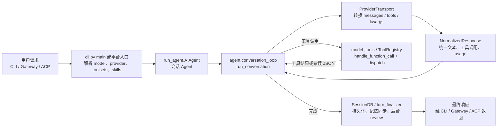

分享抓手：

- 不要先讲目录，而是讲“用户一句话进入系统后经过哪些闸门”。
- CLI/Gateway/ACP 的入口差异只发生在前后两端，中间都尽量回到同一个 `AIAgent + conversation_loop`。
- 这条线最适合串起 Provider Adapter、工具系统、SessionDB、记忆收尾。

源码证据：

- `sources/hermes-agent/cli.py:15669-15684`：CLI `main()` 接收 query、image、toolsets、skills、model、provider、compact、list_tools 等入口参数。
- `sources/hermes-agent/run_agent.py:393-399`：`AIAgent` 的职责是 conversation flow、tool execution、response handling。
- `sources/hermes-agent/run_agent.py:5745-5758`：`AIAgent.run_conversation()` 转发到 `agent.conversation_loop.run_conversation`。
- `sources/hermes-agent/agent/conversation_loop.py:523-536`：主循环负责一整轮带工具调用的 conversation。
- `sources/hermes-agent/agent/transports/base.py:16-86`、`agent/transports/types.py:91-109`：provider 差异通过 transport 和 normalized response 收口。
- `sources/hermes-agent/model_tools.py:1019-1034` 与 `sources/hermes-agent/tools/registry.py:574-589`：工具调用先进入 `handle_function_call`，再由 registry 分发 handler。

### 2. 工具执行真实案例：让 Hermes 修改代码

例子：用户在 CLI 里执行：

```bash
hermes -w -q "检查当前仓库测试失败原因并修复"
```

这时 Hermes 的关键不是“模型会写代码”，而是把代码任务拆成可控工具链：开启 worktree、暴露 file/search/terminal 类工具、执行前走 approval、执行后把工具事实写入会话。

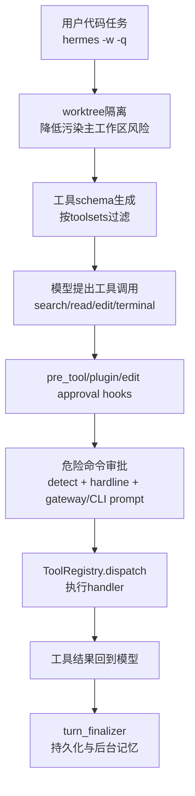

这个案例最能说明 Hermes 的工具设计范式：

- 能力通过工具扩展，但所有工具必须经过统一 schema、统一分发和统一安全闸门。
- 长期运行场景下，危险命令审批比“工具能不能跑”更重要。
- Gateway 和 CLI 的审批体验不同，但底层审批状态和检测逻辑尽量复用。

源码证据：

- `sources/hermes-agent/model_tools.py:279-308`：`get_tool_definitions()` 根据工具集和动态状态生成模型可见 schema。
- `sources/hermes-agent/model_tools.py:1164-1222`：工具执行前会检查 plugin hooks、approve/block directive 和 ACP/Zed edit approval。
- `sources/hermes-agent/tools/approval.py:1-8`：危险命令系统统一负责检测、每会话审批、CLI/Gateway 提示、smart approval、永久 allowlist。
- `sources/hermes-agent/tools/approval.py:289-305`：hardline blocklist 是 yolo 也不能绕过的底线。
- `sources/hermes-agent/tools/approval.py:1386-1398`：`detect_dangerous_command()` 遍历命令变体并匹配危险模式。
- `sources/hermes-agent/tools/approval.py:1402-1417`：审批状态按 session_key 维护，并支持 Gateway 多个 pending approval 排队。

### 3. Gateway 长任务恢复案例：聊天平台任务跑一半时重启

例子：用户在 Telegram/Discord 发了一个长任务，Agent 正在执行工具；此时 Gateway 因部署或异常重启。Hermes 的处理重点是“不要丢会话，也不要把旧结果投错会话”：先标记 `resume_pending`，重启后 synthesize 一个空事件触发恢复路径，同一 session 继续串行处理。

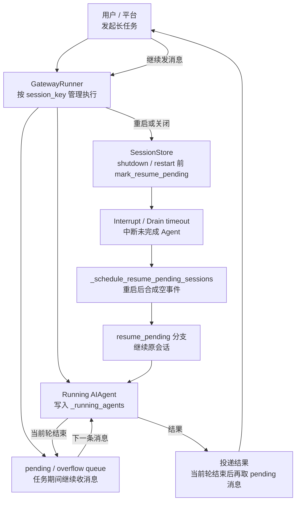

为什么这块值得讲：

- 这是 Hermes 和普通 demo Agent 的分水岭。
- 真实聊天平台里，用户会连续发消息，Agent 会长时间运行，部署会重启。
- Hermes 用 session_key、running_agents、pending queue、resume_pending、generation check 去守住会话一致性。

源码证据：

- `sources/hermes-agent/gateway/run.py:2908-2923`：Gateway 维护每 session 的 running agents、启动时间、pending messages 和 overflow buffer。
- `sources/hermes-agent/gateway/run.py:6454-6473`：`_schedule_resume_pending_sessions()` 会在重启后合成下一轮，复用已有 resume_pending 注入路径。
- `sources/hermes-agent/gateway/run.py:8047-8066`：shutdown/restart drain 前先写入 resume_pending，避免服务管理器 kill 时丢恢复信号。
- `sources/hermes-agent/gateway/run.py:18950-18966`：Agent 创建完成后只在 run generation 仍当前时才提升为 running agent，避免 stale run 覆盖新会话。
- `sources/hermes-agent/gateway/run.py:19408-19420`：当前轮结束后按 session_key 消费 pending event，并把 overflow 事件提升，保持 FIFO。

### 4. 和 LangGraph / CrewAI / AutoGen 的差异总结

Hermes 可以和这些项目对照讲，但不要把它强行归类为“框架”。它更像一个产品型个人 Agent：重点是长期在线、多入口接入、会话恢复、工具审批、平台投递和用户记忆。LangGraph/CrewAI/AutoGen 更适合讨论开发者如何定义 agent/graph/team/workflow。

| 维度 | Hermes Agent | LangGraph | CrewAI | AutoGen |
|---|---|---|---|---|
| 核心抽象 | 长期个人 Agent 产品 | 状态图、节点、边、checkpoint | Role Agent、Task、Crew、Process | 多 Agent 对话、消息路由、工具调用 |
| 最值得读的主线 | 入口 -> AIAgent -> 工具安全 -> 状态恢复 -> 投递 | graph compile/run/checkpoint | 任务分派与 agent 协作 | agent chat loop 与 runtime |
| 复杂性来源 | 产品运行时复杂性 | 可控编排与状态持久化 | 角色协作和任务过程 | 多 Agent 通信和执行环境 |
| 分享定位 | 如何把 Agent 做成长期可用产品 | 如何用图表达 Agent 工作流 | 如何组织多角色协作 | 如何构建多 Agent 会话系统 |

推荐讲法：

> 如果 LangGraph 讲的是“怎么编排 Agent”，CrewAI 讲的是“怎么分配角色和任务”，AutoGen 讲的是“怎么让多个 Agent 对话协作”，那么 Hermes 讲的是“一个 Agent 真正长期在线以后，产品工程要补哪些层”。

源码证据：

- `sources/hermes-agent/AGENTS.md:9-14`：Hermes 自身定位为 personal AI agent，并强调同一 core 跨 CLI、Gateway、TUI、Desktop 运行。
- `sources/hermes-agent/AGENTS.md:19-27`：项目级约束强调 prompt caching 和 narrow waist，说明它首先在优化长期会话产品运行时。
- 本页“为什么不纳入横向总览”章节：将 Hermes 定位为项目工程专题，而非 LangGraph/Dify/Haystack 一类框架横向比较对象。

## 和框架型项目的区别

| 对比点 | Hermes Agent | LangGraph / Dify / Haystack 等 |
|---|---|---|
| 目标用户 | 终端用户/个人 Agent 用户/运维一个 Agent 产品的人 | 开发者/企业应用构建者 |
| 核心对象 | 长期运行的个人 Agent 产品 | 编排图、工作流、Pipeline、RAG 组件 |
| 复杂性来源 | 多入口、长期状态、平台投递、工具安全、记忆技能 | 抽象 API、节点编排、组件组合、部署平台 |
| 分享方式 | 按“一个请求生命周期”讲 | 按“框架抽象和扩展点”讲 |
| 是否纳入横向总览 | 不纳入 | 可纳入 |

## 局限性与阅读注意事项

1. 源码仍有 god-file 痕迹：`cli.py`、`run_agent.py`、`gateway/run.py` 都很大，虽然部分逻辑已拆到 `agent/conversation_loop.py`、`agent/turn_finalizer.py` 等模块。
2. 阅读不要从目录背诵开始，要按入口和生命周期切：CLI 一轮、Gateway 消息、Cron job、ACP 请求、工具注册、记忆收尾。
3. 本地是浅克隆，适合当前架构分析；如果要研究历史演进，需要完整 clone 历史。
4. 它不是标准“框架源码”，所以不要强行对齐 LangGraph 的 graph/node/state reducer，也不要强行对齐 Dify 的 workflow/app/runtime。

## 分享叙述建议

可直接演讲版本：

- HTML：[`share-script.html`](share-script.html)
- Markdown：[`share-script.md`](share-script.md)

推荐讲法：

1. 先定性：Hermes Agent 是完整个人 Agent 产品工程，不是横向框架比较对象。
2. 再讲两个设计约束：prompt cache 优先、core narrow waist。
3. 然后讲三条主流程：CLI 一轮对话、Gateway 消息、Cron/ACP 扩展入口。
4. 中间穿插工具系统：Registry、Toolsets、MCP、Plugins 说明为什么能力放边缘。
5. 再讲状态和长期学习：SQLite/FTS5、compression lineage、MemoryManager、background review。
6. 最后用真实例子收束：代码修复、Telegram 定时总结、ACP 文件资源请求。

一句话收尾：

> Hermes Agent 的源码价值，不在于它抽象出一个漂亮的 Agent 框架，而在于它展示了一个长期运行、跨入口、可扩展、可恢复、要控制成本和风险的个人 Agent 产品，工程上到底需要补齐哪些层。
