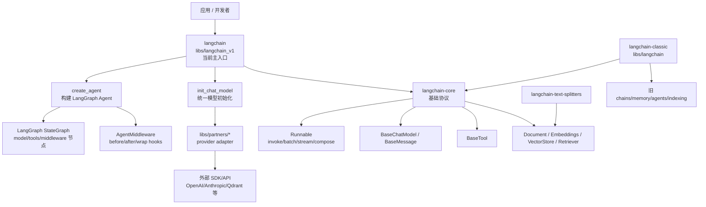
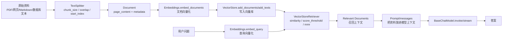

# LangChain 源码架构与专题精读

分析对象：`sources/langchain`，当前本地源码为 `master` 分支，提交 `eb2dabb8b7102fbedb33016dcf10fe475efde88e`，提交时间 `2026-06-02 16:02:36 -0400`，提交信息 `release(langchain): 1.3.4 (#37861)`。

这版在原有“先架构后分支”的基础上，重点补充四个专题：

1. Agent middleware：新 Agent 如何用 hook/wrapper 扩展主流程。
2. Provider adapter：`init_chat_model` 与 `libs/partners/*` 如何把外部 SDK 翻译成统一接口。
3. RAG 细节：Document、TextSplitter、Embeddings、VectorStore、Retriever 的真实拼接关系。
4. Classic 迁移关系：`langchain` 与 `langchain-classic` 的包边界和阅读顺序。

## 1. 总体结论

LangChain 当前 Python 仓库不是一个单体包，而是一个多包 monorepo。它的核心分层是：

| 层级 | 目录 | 包名 | 主要职责 |
| --- | --- | --- | --- |
| 应用入口层 | `libs/langchain_v1` | `langchain` | 当前主包，提供 `create_agent`、`init_chat_model`、轻量应用入口，并基于 LangGraph 构建 Agent。 |
| 核心协议层 | `libs/core` | `langchain-core` | 定义 Runnable、ChatModel、Message、Tool、Retriever、VectorStore、Embeddings、Document、Callback 等基础抽象。 |
| 经典兼容层 | `libs/langchain` | `langchain-classic` | 保留旧 chains、memory、classic agents、indexing API、community re-export 和 deprecated functionality。 |
| 供应商适配层 | `libs/partners/*` | `langchain-openai` 等 | 把 OpenAI、Anthropic、向量库、工具等外部 SDK 适配为 core 协议。 |
| 文本切分层 | `libs/text-splitters` | `langchain-text-splitters` | RAG 前处理，负责把文本或 Document 切成 chunk。 |
| 标准测试层 | `libs/standard-tests` | `langchain-tests` | 给 partner integrations 提供统一行为测试。 |

一句话概括：**`langchain-core` 定协议，`langchain` 组装 Agent 和模型入口，`partners` 接外部 provider，`langchain-classic` 承接旧 API。**



## 2. 专题一：Agent middleware

### 2.1 源码定位

新 Agent 的入口在 `libs/langchain_v1/langchain/agents/factory.py:create_agent`。它不是直接运行一个函数链，而是创建并编译一个 LangGraph `StateGraph`。

核心证据：

| 证据 | 说明 |
| --- | --- |
| `factory.py:697-718` | `create_agent` 接收 `model`、`tools`、`middleware`、`response_format`、`checkpointer`、`store`、interrupt 等参数，并声明创建“调用工具直到停止条件满足”的 agent graph。 |
| `factory.py:823-829` | 文档说明模型输出 `tool_calls` 后进入 tools 节点，工具结果以 `ToolMessage` 回到消息列表，再次调用模型直到没有 tool call。 |
| `factory.py:1047-1055` | 创建 `StateGraph`，state/input/output/context schema 都在这里确定。 |
| `factory.py:1386-1390` | 添加 `model` 节点；有工具时添加 `tools` 节点。 |
| `factory.py:1392-1474` | middleware 的 before/after hook 被编译为独立图节点。 |
| `factory.py:1516-1551` | 添加 tools -> model、model -> tools 的条件边，形成 Agent 循环。 |
| `factory.py:1671-1680` | 最终 `graph.compile(...)`，并把 stream transformers 一起注册。 |

### 2.2 Middleware 不是一个点，而是一组扩展面

`AgentMiddleware` 定义在 `libs/langchain_v1/langchain/agents/middleware/types.py:383`。它提供两类扩展：

| 类型 | 方法 | 运行方式 | 适合做什么 |
| --- | --- | --- | --- |
| 生命周期节点 | `before_agent`、`before_model`、`after_model`、`after_agent` | 被 `create_agent` 编译成 LangGraph 节点 | 注入系统状态、裁剪消息、人工确认、结构化校验、结束前整理结果。 |
| 调用包装器 | `wrap_model_call`、`wrap_tool_call` | 包住 handler，可调用一次、多次或短路 | 重试、限流、缓存、动态路由模型、工具错误处理、审计。 |
| 附加工具 | `tools` 属性 | middleware 自带工具会并入 Agent 可用工具 | 把某个扩展能力连工具一起安装。 |
| 流式转换 | `transformers` 属性 | graph compile 时注册 stream transformer | 对流式输出做观察、改写、结构化事件转换。 |

关键代码片段：

```python
class AgentMiddleware(Generic[StateT, ContextT, ResponseT]):
    """Base middleware class for an agent.

    Subclass this and implement any of the defined methods to customize agent behavior
    between steps in the main agent loop.
    """
```

`wrap_model_call` 的设计很像 Web middleware：

```python
def wrap_model_call(self, request, handler):
    # 可以修改 request
    # 可以 handler(request) 调一次
    # 可以为了重试调多次
    # 也可以不调用 handler 直接返回
```

源码文档在 `types.py:491-503` 明确说明：middleware 可以多次调用 handler 做 retry，可以跳过 handler 做 short-circuit，也可以修改 request/response；多个 middleware 按列表顺序组合，第一个是最外层。

`wrap_tool_call` 同样支持请求改写和重试，见 `types.py:662-730`。这说明 LangChain 把“工具调用可靠性”放在 middleware 层，而不是塞进每个 Tool。

### 2.3 为什么这样设计

Agent 的主循环很容易变复杂：模型调用前要改消息，模型失败要重试，工具调用要审计，工具结果可能要人工确认，结构化输出失败要回到模型重试。如果这些都写进 `create_agent` 主函数，Agent 会变成不可维护的大型 if/else。

LangChain 的设计是：

1. 主循环保持稳定：model 节点、tools 节点、条件边。
2. 变化逻辑放进 middleware：before/after/wrap。
3. 复杂控制交给 LangGraph：状态、节点、边、checkpoint、interrupt。

这个范式可以概括为：**Agent 主干图稳定，扩展能力用 middleware 注入。**

### 2.4 真实例子：动态模型路由和工具重试

```python
from langchain.agents.middleware import wrap_model_call, wrap_tool_call

@wrap_model_call
def route_model(request, handler):
    if len(request.messages) > 20:
        request = request.override(model=large_context_model)
    return handler(request)

@wrap_tool_call
def retry_tool(request, handler):
    last_error = None
    for _ in range(3):
        try:
            return handler(request)
        except Exception as exc:
            last_error = exc
    raise last_error
```

这类能力不需要改 `create_agent`，因为 `ModelRequest` 已经携带 `model`、`messages`、`system_message`、`tools`、`state`、`runtime`、`model_settings` 等上下文，见 `types.py:90-107`。

## 3. 专题二：Provider adapter

### 3.1 `init_chat_model` 是统一模型入口

`init_chat_model` 定义在 `libs/langchain_v1/langchain/chat_models/base.py:210`。它的职责不是调用模型，而是把用户传入的 `model` 字符串和 provider 参数解析成具体 `BaseChatModel` 实例。

关键证据：

| 证据 | 说明 |
| --- | --- |
| `base.py:210-218` | `init_chat_model` 返回 `BaseChatModel` 或 `_ConfigurableModel`。 |
| `base.py:239-266` | 支持 `openai:gpt-5.5` 这种 provider 前缀，也支持根据模型名前缀推断 provider。 |
| `base.py:282-309` | 列出 provider 到 integration package 的映射，例如 `openai -> langchain-openai`、`anthropic -> langchain-anthropic`。 |
| `base.py:324-330` | `configurable_fields="any"` 有安全警告，因为 `api_key`、`base_url` 等可能被运行时配置改写。 |
| `base.py:493-518` | 固定模型直接 `_init_chat_model_helper`，后者 `_parse_model` 后找 provider creator。 |
| `base.py:597-625` | `_parse_model` 处理 `provider:model`、自动推断 provider、规范化 provider 名称。 |
| `base.py:640-705` | `_ConfigurableModel` 延迟实例化模型，并把 `bind_tools`、`with_structured_output` 这类声明式操作排队。 |

读源码时要注意：`init_chat_model("openai:gpt-5.5")` 并不会把 OpenAI SDK 逻辑写在主包里，它只是选择 provider creator。真正的 OpenAI 请求转换在 `libs/partners/openai`。

### 3.2 OpenAI adapter 如何翻译协议

OpenAI 集成包的核心类是：

```python
class BaseChatOpenAI(BaseChatModel):
    """Base wrapper around OpenAI large language models for chat."""

class ChatOpenAI(BaseChatOpenAI):
    r"""Interface to OpenAI chat model APIs."""
```

源码位置：

| 文件 | 证据 | 说明 |
| --- | --- | --- |
| `libs/partners/openai/langchain_openai/chat_models/base.py:581-612` | `BaseChatOpenAI` 继承 `BaseChatModel`，声明 client、async_client、model、temperature、model_kwargs、api_key 等字段。 |
| `base.py:1549-1608` | `_stream` 构建 payload，调用 OpenAI SDK stream，并把 chunk 转成 `ChatGenerationChunk`。 |
| `base.py:1624-1678` | `_generate` 构建 payload，根据 responses API / chat completions API 选择调用，并返回 LangChain `ChatResult`。 |
| `base.py:1695-1724` | `_get_request_payload` 把 LangChain messages 转成 OpenAI payload。 |
| `base.py:1771-1795` | `_create_chat_result` 把 OpenAI response 转成 `AIMessage`、usage metadata、llm_output。 |
| `base.py:2131-2148` | `bind_tools` 把工具定义转换为 OpenAI tool-calling 兼容格式。 |
| `base.py:2534-2585` | `ChatOpenAI` 文档明确只面向官方 OpenAI API；OpenRouter、vLLM、DeepSeek 等应使用对应 provider 包。 |

Provider adapter 的职责可以拆成 6 件事：

1. 参数适配：`model`、`temperature`、`api_key`、`base_url`、`timeout`、`max_retries`。
2. 消息适配：LangChain `BaseMessage` <-> provider request dict。
3. 工具适配：`BaseTool` / callable / schema -> provider tool schema。
4. 响应适配：provider response -> `AIMessage` / `ChatGeneration` / `ChatResult`。
5. 流式适配：provider chunk -> `AIMessageChunk` / callback token。
6. 元数据适配：token usage、finish reason、model name、system fingerprint。

### 3.3 为什么 provider adapter 要独立成 partner 包

如果 OpenAI、Anthropic、Qdrant、Pinecone、Cohere 全放在主包里，主包会被 SDK 版本、鉴权方式、响应格式和可选依赖拖垮。LangChain 现在的模式是：

```text
应用代码
  -> BaseChatModel / Embeddings / VectorStore / Retriever
  -> partner package
  -> provider SDK/API
```

这样上层只面向 core 协议，底层 provider 可以独立发版、独立测试、独立处理 SDK 变化。

## 4. 专题三：RAG 细节

LangChain 的 RAG 不是一个单一大类，而是一组 core 协议组合：



### 4.1 Document 和 TextSplitter

`TextSplitter` 在 `libs/text-splitters/langchain_text_splitters/base.py:44` 定义。构造参数包括：

| 参数 | 作用 | 细节 |
| --- | --- | --- |
| `chunk_size` | 每个 chunk 最大长度 | 默认 4000。 |
| `chunk_overlap` | 相邻 chunk 重叠 | 默认 200，且不能大于 `chunk_size`。 |
| `length_function` | 如何计算长度 | 默认 `len`，可换成 token 长度函数。 |
| `add_start_index` | 是否把 chunk 起点写入 metadata | 便于追溯原文位置。 |
| `strip_whitespace` | 是否去除首尾空白 | 默认 True。 |

源码证据：

- `base.py:73-84`：校验 `chunk_size`、`chunk_overlap`。
- `base.py:92-96`：子类必须实现 `split_text`。
- `base.py:103-129`：`create_documents` 把文本切成 `Document(page_content=chunk, metadata=metadata)`。
- `base.py:131-144`：`split_documents` 保留原 Document metadata 后继续切分。

设计含义：RAG 的第一步不是“向量化”，而是把资料变成可以检索、可追溯、大小合适的 Document chunk。

### 4.2 Embeddings

`Embeddings` 在 `libs/core/langchain_core/embeddings/embeddings.py:8` 定义，它明确区分两类方法：

```python
def embed_documents(self, texts: list[str]) -> list[list[float]]:
    ...

def embed_query(self, text: str) -> list[float]:
    ...
```

源码注释在 `embeddings.py:20-26` 说明：文档 embedding 是向量列表，query embedding 是单个向量；通常两者一样，但抽象允许它们独立。这一点很重要，因为有些 embedding 模型会区分 document encoder 和 query encoder。

### 4.3 VectorStore

`VectorStore` 在 `libs/core/langchain_core/vectorstores/base.py:43` 定义，核心方法包括：

| 方法 | 源码位置 | 作用 |
| --- | --- | --- |
| `add_texts` | `base.py:46-75` | 把字符串和 metadata 写入向量库。 |
| `add_documents` | `base.py:234-258` | 把 `Document.page_content` 和 `Document.metadata` 转成 `add_texts`。 |
| `similarity_search` | `base.py:361-388` | 按 query 返回最相似的 Document。 |
| `similarity_search_with_score` | `base.py:417` | 返回 Document 和原始相似度/距离分数。 |
| `similarity_search_with_relevance_scores` | `base.py:506` | 返回归一化 relevance score。 |
| `max_marginal_relevance_search` | `base.py` 相关方法 | 用 MMR 在相关性和多样性之间平衡。 |

这里的设计是 provider-neutral：Qdrant、Chroma、Pinecone 等只要实现 VectorStore 协议，就可以被上层 Retriever 使用。

### 4.4 Retriever

`BaseRetriever` 在 `libs/core/langchain_core/retrievers.py:55` 定义。它继承 Runnable，官方注释写明 retriever 应该通过 `invoke`、`ainvoke`、`batch`、`abatch` 使用。

关键证据：

| 源码位置 | 说明 |
| --- | --- |
| `retrievers.py:55-72` | Retriever 是“字符串查询 -> 相关 Document 列表”的抽象，实现者重写 `_get_relevant_documents`。 |
| `retrievers.py:179-236` | `invoke` 配置 callback、metadata、run_manager，并调用 `_get_relevant_documents`。 |
| `retrievers.py:298-320` | `_get_relevant_documents` 是同步检索核心方法。 |
| `vectorstores/base.py:964-980` | `VectorStoreRetriever` 包装 VectorStore，支持 `similarity`、`similarity_score_threshold`、`mmr` 三种搜索类型。 |
| `vectorstores/base.py:1040-1058` | 根据 `search_type` 分派到 `similarity_search`、`similarity_search_with_relevance_scores` 或 `max_marginal_relevance_search`。 |

### 4.5 RAG 最小代码与源码映射

```python
splitter = RecursiveCharacterTextSplitter(chunk_size=800, chunk_overlap=120)
docs = splitter.create_documents([raw_text], metadatas=[{"source": "handbook.md"}])

vectorstore.add_documents(docs)
retriever = vectorstore.as_retriever(search_type="mmr", search_kwargs={"k": 5})

context_docs = retriever.invoke("Graphiti 和 mem0 的区别是什么？")
answer = model.invoke([
    ("system", "只基于检索资料回答。"),
    ("human", f"资料：{context_docs}\n问题：Graphiti 和 mem0 的区别是什么？"),
])
```

源码映射：

| 业务动作 | LangChain 抽象 | 源码 |
| --- | --- | --- |
| 切块 | `TextSplitter.create_documents` | `text_splitters/base.py:103-129` |
| 文档向量化 | `Embeddings.embed_documents` | `embeddings.py:37-45` |
| 查询向量化 | `Embeddings.embed_query` | `embeddings.py:47-56` |
| 写向量库 | `VectorStore.add_documents` | `vectorstores/base.py:234-258` |
| 召回 | `VectorStoreRetriever._get_relevant_documents` | `vectorstores/base.py:1040-1058` |
| 进入模型 | `BaseChatModel.invoke` | `core/language_models/chat_models.py` |

## 5. 专题四：classic 迁移关系

### 5.1 包边界

源码证据很明确：

| 包 | 目录 | 证据 | 含义 |
| --- | --- | --- | --- |
| `langchain` | `libs/langchain_v1` | `pyproject.toml:6` 包名是 `langchain`，`pyproject.toml:24` 版本是 `1.3.4`。 | 当前主包。 |
| `langchain-classic` | `libs/langchain` | `pyproject.toml:6` 包名是 `langchain-classic`，`README.md:1` 标题是 LangChain Classic。 | 经典兼容包。 |
| `langchain-core` | `libs/core` | `README.md:29` 说明生态建立在 `langchain-core` 之上。 | 共享协议层。 |

`libs/langchain/README.md:21-23` 写明 classic 包包含 legacy chains、`langchain-community` re-exports、indexing API、deprecated functionality，并建议多数情况下使用主 `langchain` 包。

### 5.2 迁移关系怎么理解

不是“旧 LangChain 没了”，而是拆成了两个角色：

```text
新项目 / 新 Agent
  -> langchain (libs/langchain_v1)
  -> create_agent + init_chat_model + LangGraph runtime

旧项目 / 旧 chains / legacy memory / classic agents
  -> langchain-classic (libs/langchain)
  -> 保留兼容和迁移缓冲

共用基础协议
  -> langchain-core
```

### 5.3 迁移建议

| 如果你现在用的是 | 建议迁移方向 | 原因 |
| --- | --- | --- |
| classic chains | 优先看是否能改成 LCEL/Runnable 或显式函数组合 | 新主包更强调 Runnable 与图编排。 |
| classic agents | 迁到 `create_agent` | 当前 Agent 基于 LangGraph，支持 middleware、checkpoint、interrupt、store。 |
| old memory | 迁到 LangGraph checkpointer/store 或外部 memory 系统 | `create_agent` 参数里已经有 `checkpointer` 和 `store`。 |
| 旧 provider import | 使用 partner 包，如 `langchain-openai` | provider 适配已拆到独立包。 |
| 旧 RAG helper chain | 拆成 TextSplitter、Embeddings、VectorStore、Retriever、Prompt、Model | 更透明，也更容易替换每个环节。 |

分享时可以这样说：

> `langchain-classic` 是迁移缓冲区，不是新项目的主入口。新项目优先从 `langchain`、`langchain-core` 和 provider 包开始读；遇到旧 chains、旧 memory、旧 agents，再回到 classic 包找兼容实现。

## 6. 真实例子：企业知识库 Agent

假设我们要做一个“源码分析知识库助手”：

1. 用 text splitter 把已有源码分析 Markdown 切成 Document。
2. 用 embedding provider 生成向量。
3. 写入 Qdrant/Chroma/Pinecone。
4. 用 retriever 根据用户问题取回相关片段。
5. 用 `create_agent` 创建 Agent，把 retriever 包成工具。
6. 用 middleware 做两件事：模型调用前裁剪历史消息，工具调用失败时重试。
7. 模型用 `init_chat_model("openai:gpt-5.5")` 或可配置模型入口创建。

这个例子能串起四个专题：

| 部分 | 对应源码主线 |
| --- | --- |
| 模型可替换 | `init_chat_model` + provider adapter |
| RAG 可替换 | `TextSplitter` / `Embeddings` / `VectorStore` / `Retriever` |
| Agent 可扩展 | `create_agent` + `AgentMiddleware` |
| 旧代码迁移 | classic chains 拆成新协议组合 |

## 7. 分享建议

推荐讲法：

1. 先讲包边界：`core -> langchain_v1 -> partners -> classic`。
2. 再讲一条主线：`create_agent` 编译 LangGraph，不是传统 chain。
3. 然后讲 middleware：生命周期 hook 变节点，wrap hook 包调用。
4. 再讲 provider adapter：主包不直接绑 SDK，partner 包负责翻译。
5. 接着讲 RAG：它不是一个大模块，而是多个 core 协议组合。
6. 最后讲 classic：旧 API 仍在，但新项目不应从 classic 开始。

一句开场白：

> 现在读 LangChain 源码，最重要的是别把它当成一个大包。它已经分成协议层、应用入口层、供应商适配层和 classic 兼容层。当前 Agent 是基于 LangGraph 编译出来的状态图，middleware 是扩展点；RAG 则是 Document、Embedding、VectorStore、Retriever 和 ChatModel 的组合。

## 8. 推荐阅读路线

1. `libs/core/langchain_core/runnables/base.py`
2. `libs/core/langchain_core/language_models/chat_models.py`
3. `libs/langchain_v1/langchain/chat_models/base.py`
4. `libs/langchain_v1/langchain/agents/factory.py`
5. `libs/langchain_v1/langchain/agents/middleware/types.py`
6. `libs/core/langchain_core/tools/base.py`
7. `libs/text-splitters/langchain_text_splitters/base.py`
8. `libs/core/langchain_core/embeddings/embeddings.py`
9. `libs/core/langchain_core/vectorstores/base.py`
10. `libs/core/langchain_core/retrievers.py`
11. `libs/partners/openai/langchain_openai/chat_models/base.py`
12. `libs/langchain/langchain_classic/*`

## 9. 局限

- 本文是静态源码分析，未运行 LangChain 测试套件。
- 本文以 OpenAI partner 包作为 provider adapter 样例，没有逐个展开所有 provider。
- 本文强调当前 `langchain` 1.3.4 源码结构；历史版本的 import 路径和 API 可能不同。
