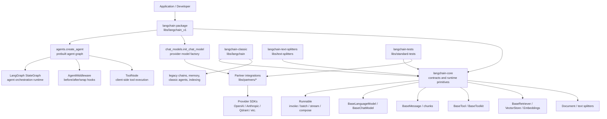
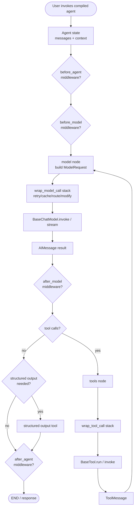

# LangChain 源码架构分析

分析对象：`langchain-src` 当前检出的 `master` 快照，提交 `dfca7f4`。

本报告面向源码阅读，先给出总架构，再按源码分支展开。结论分为两类：

- **源码证据**：来自仓库中的 README、`pyproject.toml`、Python 类定义和函数实现。
- **架构推断**：基于多处源码证据归纳出的职责边界和执行链路。

## 1. 总体结论

LangChain 当前 Python 仓库是一个多包 monorepo。核心不是单个巨型包，而是以 `langchain-core` 定义协议和运行时抽象，以 `langchain` 包提供当前 v1 应用入口，以 `langchain-classic` 保留旧式 chains/memory/agents，以 `libs/partners/*` 提供供应商集成。

### 1.1 最高层分层

| 层级 | 目录 | 包名 | 主要职责 |
| --- | --- | --- | --- |
| 应用入口层 | `libs/langchain_v1` | `langchain` | 当前主包，提供 `create_agent`、`init_chat_model`、轻量入口和 LangGraph agent 编排 |
| 核心协议层 | `libs/core` | `langchain-core` | 定义 Runnable、模型、消息、工具、检索器、向量库、嵌入、回调等基础接口 |
| 经典兼容层 | `libs/langchain` | `langchain-classic` | 旧 chains、memory、classic agents、legacy indexing 等 |
| 集成层 | `libs/partners/*` | `langchain-openai` 等 | 各模型、嵌入、向量库、工具供应商实现 |
| 文本切分层 | `libs/text-splitters` | `langchain-text-splitters` | 文本切块和 Document 转换工具 |
| 标准测试层 | `libs/standard-tests` | `langchain-tests` | 为集成包提供标准接口测试基类 |

架构图见：[architecture.mmd](architecture.mmd)。

## 2. 源码分支分析

### 2.1 `libs/core`: 抽象与组合内核

**定位**：`langchain-core` 是整个生态的底座。它不绑定某个模型供应商，而是定义可互换接口。

源码证据：

- `libs/core/README.md:21` 明确说 LangChain Core 包含支撑生态的基础抽象。
- `libs/core/README.md:25` 说明任何 provider 实现接口后即可被生态其余部分使用。
- `libs/core/pyproject.toml:6` 包名是 `langchain-core`。
- `libs/core/pyproject.toml:27` 依赖 `langsmith`，说明 tracing/observability 是 core 级能力。

关键抽象：

| 抽象 | 源码位置 | 作用 |
| --- | --- | --- |
| `Runnable` | `libs/core/langchain_core/runnables/base.py:125` | 统一“可调用、批量、流式、可组合”的运行单元 |
| `BaseLanguageModel` | `libs/core/langchain_core/language_models/base.py:141` | 语言模型基类 |
| `BaseChatModel` | `libs/core/langchain_core/language_models/chat_models.py:270` | Chat 模型基类，暴露 invoke/stream 和工具绑定 |
| `BaseMessage` | `libs/core/langchain_core/messages/base.py:93` | Chat 模型输入输出消息基础类型 |
| `BaseTool` | `libs/core/langchain_core/tools/base.py:405` | 所有工具的基础接口，也继承 Runnable 能力 |
| `BaseRetriever` | `libs/core/langchain_core/retrievers.py:55` | 查询字符串到 Document 列表的检索接口 |
| `VectorStore` | `libs/core/langchain_core/vectorstores/base.py:43` | 向量库接口 |
| `Embeddings` | `libs/core/langchain_core/embeddings/embeddings.py:8` | 文本到向量的嵌入接口 |

架构推断：

`Runnable` 是横向运行协议，模型、工具、检索器等通过它进入同一组合体系。`BaseChatModel`、`BaseTool`、`BaseRetriever` 则是面向 LLM 应用常见部件的纵向协议。

### 2.2 `libs/langchain_v1`: 当前主包与 Agent 编排

**定位**：当前 `pip install langchain` 对应 `libs/langchain_v1`，它把 core 抽象、provider 集成和 LangGraph 编排组合成面向应用的入口。

源码证据：

- `libs/langchain_v1/pyproject.toml:6` 包名是 `langchain`。
- `libs/langchain_v1/pyproject.toml:27` 依赖 `langchain-core>=1.4.0,<2.0.0`。
- `libs/langchain_v1/pyproject.toml:28` 依赖 `langgraph>=1.2.3,<1.3.0`。
- `libs/langchain_v1/README.md:21` 描述 LangChain 用于快速构建 agents 和 LLM 应用。
- `libs/langchain_v1/README.md:25` 明确说明 LangChain agents 建在 LangGraph 之上。

#### Agent 入口

`create_agent` 是当前主包最重要的高级入口之一。

源码证据：

- `libs/langchain_v1/langchain/agents/factory.py:697` 定义 `create_agent`。
- `libs/langchain_v1/langchain/agents/factory.py:717` 文档说明它创建一个调用工具直到停止条件满足的 agent graph。
- `libs/langchain_v1/langchain/agents/factory.py:818` 返回编译后的 `StateGraph`。
- `libs/langchain_v1/langchain/agents/factory.py:24` 从 LangGraph 导入 `StateGraph`。
- `libs/langchain_v1/langchain/agents/factory.py:26` 从 LangGraph 预构建模块导入 `ToolNode`。
- `libs/langchain_v1/langchain/agents/factory.py:1671` 最终 `graph.compile(...)`。

Agent 流程图见：[agent-flow.mmd](agent-flow.mmd)。

#### Middleware 机制

Agent 的可扩展性主要通过 middleware 注入。

源码证据：

- `libs/langchain_v1/langchain/agents/middleware/types.py:383` 定义 `AgentMiddleware`。
- `libs/langchain_v1/langchain/agents/middleware/types.py:443` 定义 `before_model`。
- `libs/langchain_v1/langchain/agents/middleware/types.py:467` 定义 `after_model`。
- `libs/langchain_v1/langchain/agents/middleware/types.py:491` 定义 `wrap_model_call`。
- `libs/langchain_v1/langchain/agents/middleware/types.py:662` 定义 `wrap_tool_call`。
- `libs/langchain_v1/langchain/agents/factory.py:1386` 添加 `model` 节点。
- `libs/langchain_v1/langchain/agents/factory.py:1390` 在存在工具时添加 `tools` 节点。
- `libs/langchain_v1/langchain/agents/factory.py:1411`、`:1432`、`:1453`、`:1472` 为 middleware hook 添加节点。

架构推断：

`create_agent` 不是普通函数链，而是 graph builder。它把模型调用、工具调用和 middleware hook 编译成 LangGraph 节点/边，因此天然支持循环、持久化、流式和中间状态控制。

#### 模型初始化

源码证据：

- `libs/langchain_v1/langchain/chat_models/base.py:210` 定义 `init_chat_model`。
- `libs/langchain_v1/langchain/chat_models/base.py:494` 当模型确定时调用 `_init_chat_model_helper`。
- `libs/langchain_v1/langchain/agents/factory.py:853` 当 `create_agent` 收到字符串模型时调用 `init_chat_model(model)`。

架构推断：

`init_chat_model` 是 provider 选择层，`create_agent` 是 orchestration 层。应用代码传 `"openai:gpt-5.5"` 这类字符串时，先解析成具体 `BaseChatModel` 实例，再放进 agent graph。

### 2.3 `libs/langchain`: classic 兼容分支

**定位**：`libs/langchain` 当前发布为 `langchain-classic`，保留旧 chains、memory、classic agents 和 legacy API。

源码证据：

- `libs/langchain/pyproject.toml:6` 包名是 `langchain-classic`。
- `libs/langchain/README.md:1` 标题是 LangChain Classic。
- `libs/langchain/README.md:21` 说明包含 legacy chains、`langchain-community` re-exports、indexing API、deprecated functionality 等。
- `libs/langchain/README.md:23` 建议多数情况下使用主 `langchain` 包。

架构推断：

Classic 分支是迁移缓冲区。它依赖 `langchain-core`，但主要服务旧式链式 API 和兼容场景。新项目源码阅读应优先从 `libs/langchain_v1` 和 `libs/core` 开始。

### 2.4 `libs/partners`: provider 实现分支

**定位**：供应商集成包把外部 SDK 适配到 `langchain-core` 定义的接口。

源码证据：

- `libs/partners/README.md:3` 指向 integrations provider 文档。
- `libs/partners/openai/pyproject.toml:6` 包名是 `langchain-openai`。
- `libs/partners/openai/pyproject.toml:26` 依赖 `langchain-core`。
- `libs/partners/openai/pyproject.toml:27` 依赖 `openai` SDK。
- `libs/partners/openai/langchain_openai/chat_models/base.py:581` `BaseChatOpenAI` 继承 `BaseChatModel`。
- `libs/partners/openai/langchain_openai/chat_models/base.py:2534` 定义 `ChatOpenAI`。
- `libs/partners/openai/langchain_openai/embeddings/base.py:86` `OpenAIEmbeddings` 实现 `Embeddings`。

架构推断：

供应商包的核心价值不是重新定义 LangChain 协议，而是做“协议到 SDK”的适配：认证参数、客户端构造、请求/响应转换、token 统计、流式处理、结构化输出和工具调用兼容。

### 2.5 `libs/text-splitters`: 文档切块分支

源码证据：

- `libs/text-splitters/pyproject.toml:6` 包名是 `langchain-text-splitters`。
- `libs/text-splitters/pyproject.toml:28` 依赖 `langchain-core`。
- `libs/text-splitters/README.md:18` 说明它提供多种文本文档切块工具。
- `libs/text-splitters/langchain_text_splitters/base.py:44` 定义 `TextSplitter`。
- `libs/text-splitters/langchain_text_splitters/base.py:93` 子类需要实现 `split_text`。
- `libs/text-splitters/langchain_text_splitters/base.py:103` `create_documents` 把文本切块转成 `Document`。
- `libs/text-splitters/langchain_text_splitters/base.py:131` `split_documents` 支持 Document 到 Document 的切分。

### 2.6 `libs/standard-tests`: 集成质量分支

源码证据：

- `libs/standard-tests/pyproject.toml:6` 包名是 `langchain-tests`。
- `libs/standard-tests/README.md:18` 说明它为 LangChain integrations 提供标准测试基类。
- `libs/standard-tests/README.md:42` 和 `:43` 要求实现 unit test class 与 integration test class。
- `libs/standard-tests/README.md:53` 示例从 `langchain_core.language_models` 导入 `BaseChatModel`。

架构推断：

标准测试包是生态治理工具。它把 core 的抽象契约变成可执行测试，降低 partner integrations 行为漂移的风险。

## 3. 核心运行流程

### 3.1 普通模型调用

1. 应用调用 `init_chat_model("provider:model")` 或直接构造 provider 模型。
2. `init_chat_model` 根据 provider 创建具体 `BaseChatModel` 实现。
3. 应用调用 `.invoke()` / `.stream()`。
4. `BaseChatModel` 将输入转换为消息，进入 provider 实现的生成逻辑。
5. provider 包调用外部 SDK 并把响应转换为 `AIMessage` / message chunks。

证据：

- `BaseChatModel` 定义在 `libs/core/langchain_core/language_models/chat_models.py:270`。
- `BaseChatModel.invoke` 在 `libs/core/langchain_core/language_models/chat_models.py:461`。
- `BaseChatModel.stream` 在 `libs/core/langchain_core/language_models/chat_models.py:713`。
- OpenAI chat 模型继承关系见 `libs/partners/openai/langchain_openai/chat_models/base.py:581` 和 `:2534`。

### 3.2 Agent + Tool 循环

1. 应用调用 `create_agent(model, tools, middleware, ...)`。
2. 字符串模型先通过 `init_chat_model` 转为模型实例。
3. `create_agent` 构造 `StateGraph`。
4. 图中至少有 model 节点；有工具时添加 tools 节点。
5. middleware hook 被编译成 before/after/wrap 节点或包装栈。
6. 模型输出含 tool calls 时流向 tools 节点。
7. 工具结果以 `ToolMessage` 回到模型节点。
8. 没有工具调用或满足停止条件时结束。

证据：

- `create_agent` 定义：`libs/langchain_v1/langchain/agents/factory.py:697`。
- 创建 agent graph 的说明：`libs/langchain_v1/langchain/agents/factory.py:717`。
- 添加 model 节点：`libs/langchain_v1/langchain/agents/factory.py:1386`。
- 添加 tools 节点：`libs/langchain_v1/langchain/agents/factory.py:1390`。
- 添加条件边：`libs/langchain_v1/langchain/agents/factory.py:1516`、`:1540`、`:1553`。
- 编译图：`libs/langchain_v1/langchain/agents/factory.py:1671`。

### 3.3 RAG / 检索增强流程

RAG 流程图见：[rag-flow.mmd](rag-flow.mmd)。

```mermaid
flowchart LR
    Raw["Raw text / files"] --> Splitter["TextSplitter\nsplit_text / create_documents"]
    Splitter --> Documents["Document chunks\npage_content + metadata"]
    Documents --> EmbedDocs["Embeddings.embed_documents"]
    EmbedDocs --> Store["VectorStore.add_texts / add_documents"]
    Store --> Retriever["VectorStoreRetriever / BaseRetriever"]
    Query["User query"] --> EmbedQuery["Embeddings.embed_query"]
    EmbedQuery --> Search["VectorStore.similarity_search"]
    Retriever --> Search
    Search --> RelevantDocs["Relevant documents"]
    RelevantDocs --> Prompt["Prompt / messages"]
    Prompt --> ChatModel["BaseChatModel"]
    ChatModel --> Answer["Generated answer"]
```

证据：

- `TextSplitter.create_documents`：`libs/text-splitters/langchain_text_splitters/base.py:103`。
- `Embeddings.embed_documents`：`libs/core/langchain_core/embeddings/embeddings.py:37`。
- `VectorStore.similarity_search`：`libs/core/langchain_core/vectorstores/base.py:361`。
- `VectorStoreRetriever`：`libs/core/langchain_core/vectorstores/base.py:964`。
- `BaseRetriever.invoke`：`libs/core/langchain_core/retrievers.py:179`。

架构推断：

RAG 不是一个单独巨型模块，而是多个 core 协议的组合：Document -> TextSplitter -> Embeddings -> VectorStore -> Retriever -> Prompt/Model。不同供应商只替换某个协议实现。

## 4. 阅读路线建议

如果你主要做源码分析，建议按这个顺序看：

1. `libs/core/langchain_core/runnables/base.py`
   先理解 LangChain 的统一执行协议。
2. `libs/core/langchain_core/language_models/chat_models.py`
   理解 chat model 的输入输出、流式和工具绑定。
3. `libs/langchain_v1/langchain/chat_models/base.py`
   理解模型字符串如何解析成 provider 模型。
4. `libs/langchain_v1/langchain/agents/factory.py`
   理解新 agent 如何编译为 LangGraph。
5. `libs/langchain_v1/langchain/agents/middleware/types.py`
   理解 agent 可扩展点。
6. `libs/core/langchain_core/tools/base.py`
   理解工具如何作为 Runnable 参与执行。
7. `libs/core/langchain_core/retrievers.py` 和 `libs/core/langchain_core/vectorstores/base.py`
   理解检索/RAG 抽象。
8. `libs/partners/openai/langchain_openai/*`
   以 OpenAI 包作为 provider 适配样例。
9. `libs/langchain/langchain_classic/*`
   最后再看 classic，主要用于理解旧 API 和迁移背景。

## 5. 高置信结论与限制

### 高置信结论

- 当前主包是 `libs/langchain_v1`，包名为 `langchain`。
- `langchain-core` 是生态核心抽象层。
- 当前 agent 体系依赖 LangGraph，并由 `create_agent` 生成/编译 `StateGraph`。
- partner integrations 通过实现 core 接口接入生态。
- `langchain-classic` 是 legacy/compatibility 分支，不是新项目优先入口。

### 限制

- 本次分析基于浅克隆的最新源码快照，不覆盖历史演进。
- 本次未运行 LangChain 测试套件；结论来自静态源码、README 和包元数据。
- 未展开每个 provider 包的差异，只以 OpenAI/Qdrant 等代表验证集成模式。
