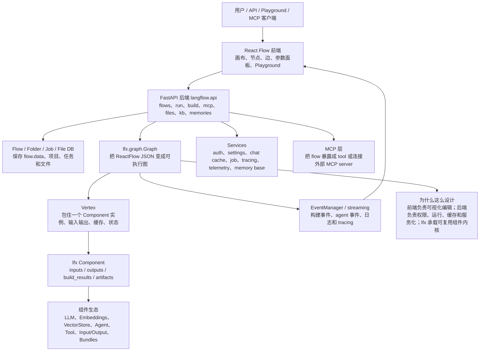
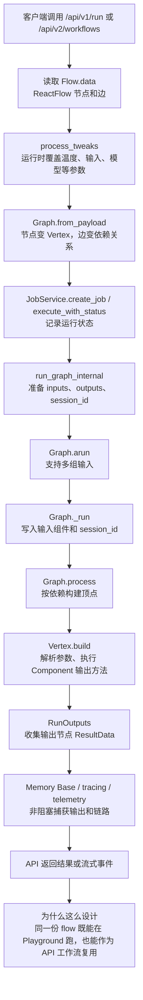
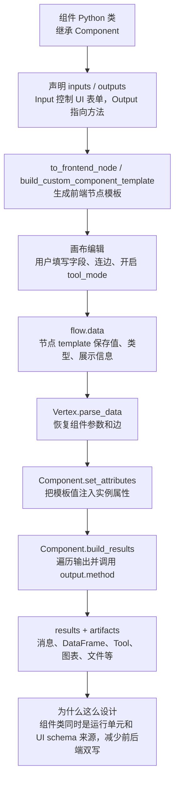
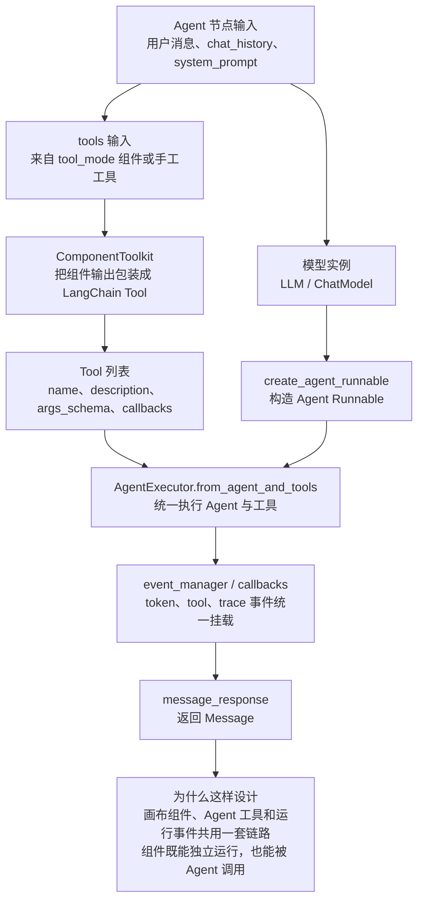
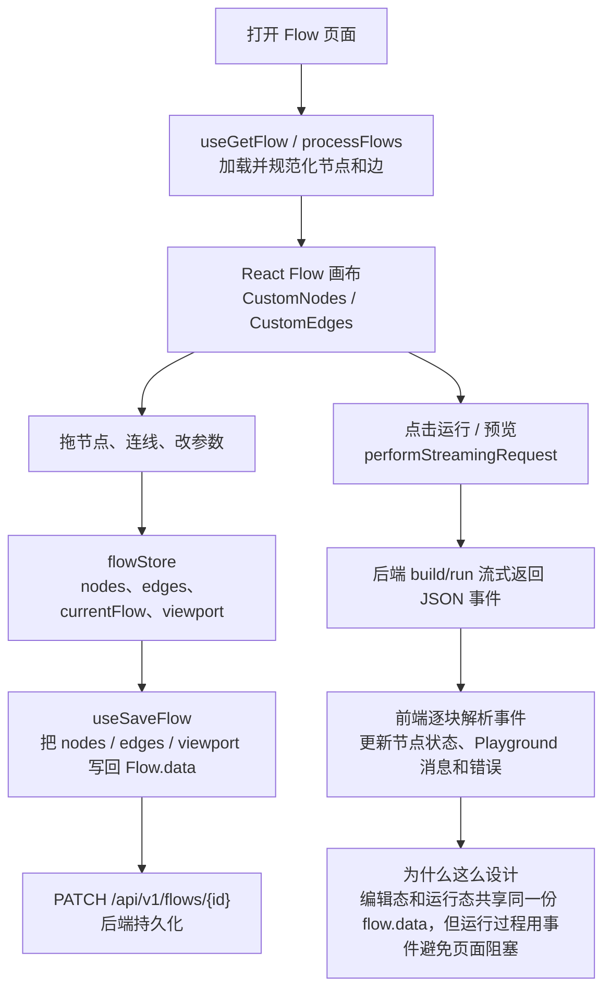
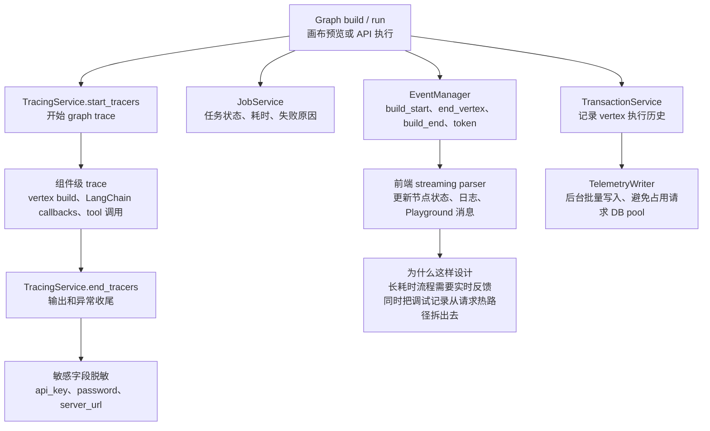
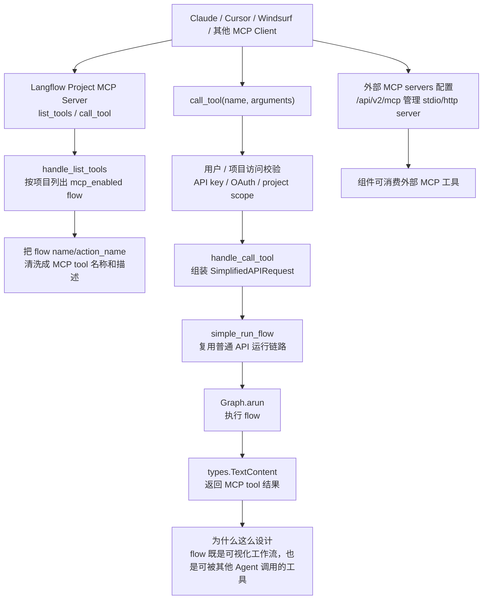
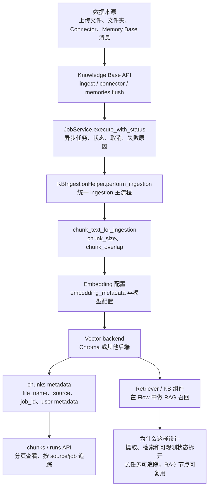
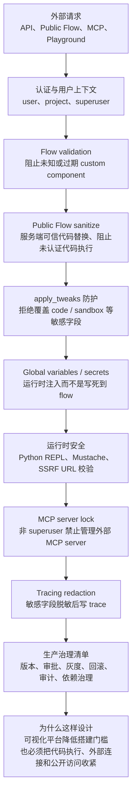
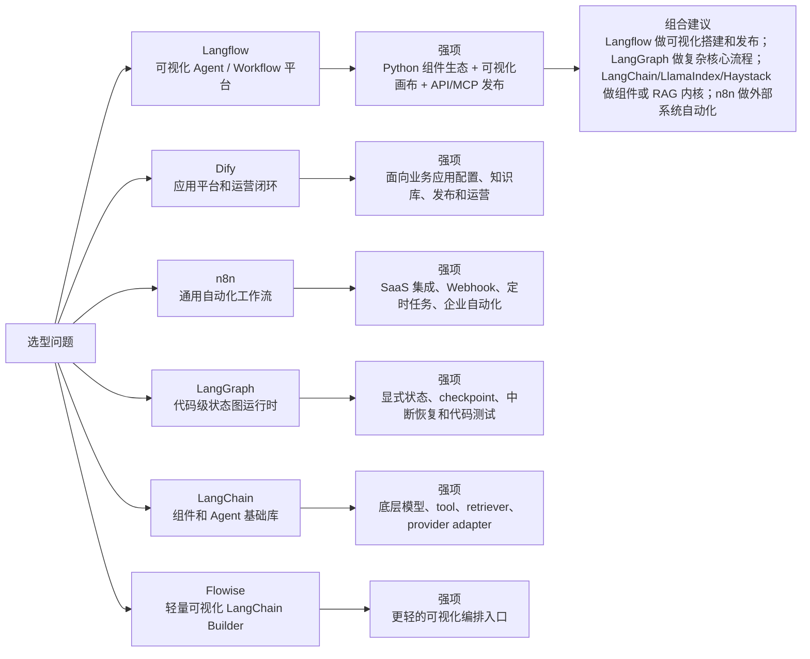

# Langflow 源码分析

> 源码位置：`sources/langflow-main`
> 版本依据：GitHub main zip 快照，`pyproject.toml` 中 `version = "1.10.2"`，commit SHA 未从 zip 快照取得。
> 阅读重点：可视化画布、Flow 数据模型、Graph/Vertex 执行、Component/Template、API/Playground、MCP 发布、与 Dify/n8n/LangGraph 的边界。

## 1. 一句话定位

Langflow 是一个面向 AI Agent / Workflow 的可视化构建与运行平台。它的核心不是“再封装一个 LangChain 调用”，而是把一份可视化 `flow.data` 同时变成：

- 前端 React Flow 画布上的节点、边、参数表单；
- 后端 `Graph` / `Vertex` / `Component` 执行图；
- 可通过 API 调用的工作流；
- 可通过 MCP 暴露给其他 Agent 的 tool；
- 可被 bundles / custom components 扩展的组件生态。

推荐分享口径：Langflow 解决的是“让 AI workflow 从代码片段变成可编辑、可运行、可发布、可复用的产品化资产”。

## 2. 总体架构



源码分层：

| 层级 | 关键路径 | 说明 |
| --- | --- | --- |
| 包装入口 | `src/backend/langflow`、`langflow.langflow_launcher:main` | CLI / 启动入口。 |
| 后端平台 | `src/backend/base/langflow` | API、services、schema、graph 兼容入口、files、MCP、memory、tracing。 |
| 组件内核 | `src/lfx/src/lfx` | Graph、Vertex、Component、Template、Inputs/Outputs、组件库、MCP helper。 |
| 前端画布 | `src/frontend/src` | React Flow、CustomNodes、CustomEdges、API controllers、flow hooks、Playground。 |
| 扩展包 | `src/bundles/*` | duckduckgo、arxiv、ibm、docling 等 bundle。 |
| SDK / Stepflow | `src/sdk`、`src/langflow-stepflow` | 外部调用和实验性 stepflow/worker 能力。 |

关键证据：

- `pyproject.toml:1-27`：主项目版本 `1.10.2`，依赖 `langflow-base[complete]>=0.10.2`，并把多个 `lfx-*` bundle 作为依赖。
- `pyproject.toml:77-87`：workspace 成员包括 `langflow-base`、`lfx`、`langflow-sdk` 和 bundles。
- `src/backend/base/langflow/template/*.py` 多数只是 `from lfx.template import *` 兼容层，说明模板/组件核心已下沉到 `lfx`。
- `src/lfx/src/lfx/graph/graph/base.py:65` 定义 `Graph`，`src/lfx/src/lfx/graph/vertex/base.py:49` 定义 `Vertex`。

## 3. 主流程：一次 Flow 如何运行



主流程可以按 5 步讲：

1. API 读取 `Flow.data`，这份数据就是前端画布保存的 React Flow JSON。
2. `process_tweaks` 把运行时参数覆盖到节点 template 中。
3. `Graph.from_payload` 把节点/边恢复成后端图。
4. `run_graph_internal` 调用 `graph.arun`，将输入、输出、session、stream、event manager 传入。
5. `Graph._run` 写入输入组件，调用 `process` 构建依赖顶点，再收集输出节点。

源码证据：

- `src/backend/base/langflow/api/v1/endpoints.py:226-311`：`simple_run_flow` 读取 flow、处理 tweaks、构建 Graph、创建 job，并通过 `execute_with_status` 调用 `run_graph_internal`。
- `src/backend/base/langflow/processing/process.py:26-62`：`run_graph_internal` 组装 inputs/types/outputs/session，并调用 `graph.arun`。
- `src/lfx/src/lfx/graph/graph/base.py:869-930`：`Graph.arun` 支持多组 inputs，逐组调用 `_run`，包装成 `RunOutputs`。
- `src/lfx/src/lfx/graph/graph/base.py:785-867`：`Graph._run` 写入输入、设置 session、调用 `process`，最后从输出 vertex 收集结果。

## 4. 编辑/预览流程：为什么有 build_vertex

Langflow 不是只有“整图运行”。画布编辑时，用户经常需要单节点预览、动态字段刷新、检查上游节点是否可运行，所以后端提供了增量构建路径。

关键链路：

- `src/backend/base/langflow/api/build.py:353-377`：构建 Graph，排序第一层节点，把 graph 放入 chat cache。
- `src/backend/base/langflow/api/build.py:453-472`：`_build_vertex` 从 graph 取 vertex，并调用 `graph.build_vertex`。
- `src/backend/base/langflow/api/build.py:586-610`：`build_vertices` 包装单个 vertex 的构建事件、耗时和错误。
- `src/lfx/src/lfx/graph/graph/base.py:1679-1735`：`Graph.build_vertex` 处理 frozen/cache/loop/component 是否需要重新构建。
- `src/lfx/src/lfx/graph/vertex/base.py:791-872`：`Vertex.build` 负责 lazy load component、写入 chat input、运行构建步骤、finalize、记录 transaction。

为什么这么设计：可视化编辑器必须支持“边改边验”。如果每次都跑完整 workflow，体验会慢，也很难定位某个节点的错误。`build_vertex` 把“编辑态预览”和“运行态全图执行”拆开，但底层仍复用 `Graph` / `Vertex` / `Component`。

## 5. Component / Template：组件为什么既是运行单元又是 UI schema



Langflow 的组件设计很有代表性：一个组件类不只定义运行逻辑，还声明它在前端应该长什么样。

典型代码片段：

```python
class ChatInput(ChatComponent):
    inputs = [
        MultilineInput(name="input_value", display_name="Input Text"),
        FileInput(name="files", display_name="Files", file_types=CHAT_INPUT_FILE_TYPES),
    ]
    outputs = [
        Output(display_name="Chat Message", name="message", method="message_response"),
    ]
```

这个片段对应 `src/lfx/src/lfx/components/input_output/chat.py:19-81`。它能证明两个点：

- `inputs` 不是普通函数参数，而是 UI 表单、运行参数、tool schema 的共同来源；
- `outputs` 通过 `method` 指向组件运行时真正要调用的方法。

更多证据：

- `src/lfx/src/lfx/custom/custom_component/component.py:150-207`：`Component` 初始化时复制类上的 `inputs` / `outputs`，并把 kwargs 分成运行输入和配置。
- `src/lfx/src/lfx/custom/custom_component/component.py:1132-1175`：`to_frontend_node` 根据 template config 生成前端节点，并自动加入 code field、输出类型和 base classes。
- `src/lfx/src/lfx/custom/custom_component/component.py:1265-1308`：`build_results` / `_build_results` 遍历输出，调用输出方法，产出 result 和 artifact。

设计范式：

- Schema as code：组件类声明就是 UI schema 和运行 schema。
- Template Method：`Component._run -> build_results -> _build_results -> _get_output_result` 固定生命周期，子类只提供输出方法。
- Adapter：`Input` / `Output` 把 Python 方法、前端字段、LangChain Tool schema 连接起来。

## 6. Tool Mode：组件如何变成 Agent 可调用工具

Langflow 里组件输出可以开启 `tool_mode`，然后被包装成 LangChain `BaseTool`，供 Agent 节点调用。

关键证据：

- `src/lfx/src/lfx/base/tools/component_tool.py:261-307`：`ComponentToolkit` 接收一个 `Component`。
- `component_tool.py:300-357`：`get_tools` 会筛选 `tool_mode` 输出，按输入字段创建 args schema，并派生 tool name。
- `component_tool.py:384-407`：支持覆盖 tool name / description，并把 display metadata 附到 tool 上。
- `src/lfx/src/lfx/custom/custom_component/component.py:1314-1318`：组件运行时如果存在 tool mode 输入，会把 tool 输出追加到 outputs map。

为什么这么设计：这让“可视化组件”和“Agent tool”不是两套生态。一个组件既能在画布里作为节点运行，也能在 Agent 中作为工具被调用。

## 7. Agent 节点内部链路



Agent 节点不是“直接调用一次模型”。源码里先把用户输入、`system_prompt`、历史消息和工具整理成 LangChain Agent 可接受的结构，再由 `AgentExecutor` 驱动模型与工具循环。这样做的好处是：可视化组件、tool mode、LangChain callback、Langflow event manager 可以接在同一条链上。

关键链路：

1. `LCAgentComponent.message_response` 调用 `build_agent`，再把执行结果包装成 Langflow `Message`。
2. `run_agent` 会把 `input_value`、`system_prompt`、`chat_history` 合成 `input_dict`。
3. 如果子类返回的不是 `AgentExecutor`，基类会用 `AgentExecutor.from_agent_and_tools` 兜底包装。
4. `LCToolsAgentComponent.build_agent` 先创建 agent runnable，再把 `self.tools` 注入 `AgentExecutor`。
5. `_get_tools` 复用 `ComponentToolkit(component=self).get_tools(...)`，把组件输出变成工具。
6. `set_tools_callbacks` 会把共享 callbacks 传给工具，保证 Agent 调工具时仍能进入 trace/event 链路。

源码证据：

- `src/lfx/src/lfx/base/agents/agent.py:39` 定义 `LCAgentComponent`，`95-101` 定义 `build_agent` / `message_response`。
- `agent.py:161-174` 在需要时用 `AgentExecutor.from_agent_and_tools(... tools=self.tools or [])` 包装 agent。
- `agent.py:204-206` 把 `system_prompt` 注入运行输入。
- `agent.py:273-285` 在有 `event_manager` 时创建 token callback，并接入 usage callback。
- `agent.py:357-367` 的 `LCToolsAgentComponent.build_agent` 把 `create_agent_runnable` 和 tools 合成 `AgentExecutor`。
- `agent.py:392-422` 设置工具 callbacks，并通过 `ComponentToolkit` 生成 tool。

为什么这么设计：Langflow 的 Agent 节点要服务两类人。业务侧希望在画布里拖一个 Agent 节点就能挂工具；工程侧希望这些工具仍然是可追踪、可复用、可发布的组件。把 Agent 运行时压到 `AgentExecutor + ComponentToolkit + callbacks` 这条链上，就能同时满足可视化和工程化。

真实例子：客服 Agent 可以挂 3 个工具：查询订单、创建工单、检索知识库。查询订单和创建工单本质是自定义组件输出开启 `tool_mode`；Agent 节点只负责把它们作为工具暴露给模型，工具内部仍走组件自己的输入、输出、日志和权限边界。

## 8. 前端画布和后端的关系



前端的核心不是“展示节点”，而是维护一份可执行的 `flow.data`。

源码证据：

- `src/frontend/src/hooks/flows/use-apply-flow-to-canvas.ts:21-41`：加载 flow 时 clone、`processFlows`、`setCurrentFlow`、`fitView`、刷新模型输入。
- `src/frontend/src/hooks/flows/use-save-flow.ts:21-84`：保存时把当前 `nodes`、`edges`、`viewport` 放回 `flow.data`，再 patch 到后端。
- `src/frontend/src/controllers/API/api.tsx:313-405`：`performStreamingRequest` 用 fetch 读取 response body，按 `\n\n` 切分 JSON 事件，支持 batch callback 和 abort。

为什么这么设计：画布编辑、API 运行、MCP 发布都依赖同一份 flow JSON。这样用户在 UI 上调好的流程，不需要重新写代码就能被 API 或 MCP 复用。

## 9. Streaming / Event / Tracing 细节



Langflow 的运行过程是长耗时、分节点、可能失败的，所以它不能只返回一个最终 JSON。源码里有三层观测链路：

- UI 反馈：`EventManager` 把 `build_start`、`end_vertex`、`build_end`、token/log 等事件推给前端。
- 任务状态：`JobService.execute_with_status` 负责把异步 job 标记为运行中、成功、失败或取消。
- 调试留痕：`TracingService`、`TransactionService` 和 `TelemetryWriter` 记录 graph/vertex 级执行历史。

源码证据：

- `src/lfx/src/lfx/events/event_manager.py:30` 定义 `EventManager`，`132-134` 注册 `on_end_vertex`、`on_build_start`、`on_build_end`。
- `src/backend/base/langflow/services/event_manager.py:204-208` 用 `_emit_async` 异步广播事件，`223-246` 说明 build 事件会推给已连接 UI client。
- `src/backend/base/langflow/api/build.py:618` 发送 `on_end_vertex`，`670` 发送 `on_build_start`。
- `src/backend/base/langflow/services/tracing/service.py:276` / `351` 分别启动和结束 tracer，`377-382` 对 `api_key`、`password`、`server_url` 做脱敏。
- `src/backend/base/langflow/services/telemetry_writer/service.py:3-10` 明确把 transaction / vertex_build 写入从请求 DB pool 中解耦。
- `src/backend/base/langflow/services/transaction/service.py:77-93` 在 telemetry writer 启用时把记录交给后台 writer。

为什么这么设计：可视化编排平台最怕“点了运行以后不知道卡在哪里”。事件流解决实时反馈，job 解决状态查询，trace/transaction 解决事后定位。Telemetry writer 再把写库从请求热路径拆开，避免大量节点日志拖慢用户请求。

真实例子：一个 RAG flow 卡住时，前端可以看到是 Embedding 节点、Retriever 节点还是 Agent 工具调用慢；后台可以从 transaction 和 trace 里看每个 vertex 的耗时、输入输出和错误，而不是只能看一个笼统的 500。

## 10. MCP：Flow 如何变成外部 Agent 的 Tool



Langflow 的 MCP 有两面：

- 对外：把项目里的 flow 暴露成 MCP tools。
- 对内：管理外部 MCP server 配置，让组件/Agent 能消费外部工具。

源码证据：

- `src/backend/base/langflow/api/v1/mcp_utils.py:256-353`：`handle_call_tool` 解析 MCP 参数，创建 `SimplifiedAPIRequest`，最后调用 `simple_run_flow`。
- `src/backend/base/langflow/api/v1/mcp_utils.py:385-453`：`handle_list_tools` 根据项目/用户列出 flow，并清洗出 MCP tool 名称。
- `src/backend/base/langflow/api/v1/mcp_projects.py:1289-1326`：`ProjectMCPServer` 注册 `list_tools` 和 `call_tool` handler。
- `src/backend/base/langflow/api/v2/mcp.py:26-33`：`/mcp` 路由管理外部 MCP server 配置，并有锁定开关。
- `src/lfx/LFX_MCP.md:1-20`：`lfx-mcp` 是 stdio MCP server，给 MCP 客户端控制 Langflow 实例的能力。

设计思想：Langflow 把 flow 当成平台资产，而不是只当 UI 草稿。MCP 让这些资产能被 Claude、Cursor、Windsurf 或其他 Agent 作为工具调用。

## 11. RAG / Knowledge Base 细节



Langflow 的 RAG 不只是画布上放几个 loader/splitter/vector store 节点。它还在后端提供了 Knowledge Base 与 Memory Base 两条数据摄取路径：文件、文件夹、Connector 和会话消息最终都会进入统一的 ingestion/job/chunk/vector backend 体系。

关键链路：

1. 上传文件、目录或 Connector 请求进入 Knowledge Base API。
2. API 创建 `JobType.INGESTION`，再通过 `JobService.execute_with_status` 异步执行。
3. `KBIngestionHelper.perform_ingestion` 统一处理文件读取、切块、embedding 和写入 backend。
4. `chunk_text_for_ingestion` 统一 `chunk_size` / `chunk_overlap` 规则。
5. 每个 chunk 写入 `file_name`、`source`、`job_id` 等 metadata，方便从 UI 按运行批次追踪。
6. Memory Base 则把会话消息按 threshold/手动 flush/重新生成等路径同步到 KB。

源码证据：

- `src/backend/base/langflow/api/utils/kb_helpers.py:74-103` 定义 `chunk_text_for_ingestion`，并把切块规则作为 KB 和 Memory Base 的共用逻辑。
- `kb_helpers.py:103`、`298`、`578-582` 分别定义 `KBStorageHelper`、`KBAnalysisHelper`、`KBIngestionHelper.perform_ingestion`。
- `src/backend/base/langflow/api/v1/knowledge_bases.py:1100-1105` 上传文件后通过 `execute_with_status` 调 `KBIngestionHelper.perform_ingestion`。
- `knowledge_bases.py:1475-1501` 提供 `/chunks` 分页查询，并说明 `source_type`、`file_name`、`job_id` 映射到 ingestion metadata。
- `knowledge_bases.py:1801-1808` 把 Connector ingestion 也交给同一套异步 ingestion machinery。
- `knowledge_bases.py:1909-1969` 提供 ingestion runs 列表和详情，`2245-2316` 支持取消 ingestion。
- `src/backend/base/langflow/api/v1/memories.py:95-113` 创建 Memory Base 时初始化 KB 目录和 embedding metadata，`306-312` 手动触发 ingestion，`337-356` 检测向量库与 metadata 不一致并支持 regenerate。

为什么这么设计：RAG 的难点不只是“召回”，而是数据从哪里来、长任务怎么跑、失败怎么查、重复摄取怎么避免、向量库坏了怎么恢复。Langflow 把 ingestion 做成 job 化和可追踪的后台能力，画布里的 Retriever/KB 组件只消费结果。

真实例子：客服 SOP 更新后，运维同学上传新 PDF 或通过 Connector 拉取文档，Langflow 创建 ingestion job；如果中途失败，可以在 runs 里看到失败文件和原因；成功后 Flow 里的 Retriever 节点立即能按同一个 KB 召回新片段。

## 12. 部署与生产治理



Langflow 允许自定义组件、代码执行、外部 MCP server、Public Flow 和运行时 tweaks，这些能力一旦进入生产环境，就必须有防护边界。源码里可以看到它已经把一些高风险入口放到验证层、运行时安全层和配置锁里。

治理点：

- Public Flow：未认证公开构建路径会被额外限制，避免公开 flow 变成服务端代码执行入口。
- Custom Component：构建时检查未知或过期组件，必要时用服务端可信模板代码替换。
- Tweaks：运行时参数覆盖不能改 `code`、code 类型字段、代码执行组件的敏感字段。
- MCP：外部 MCP server 管理可被 settings 锁住，非 superuser 不允许修改。
- Runtime safety：Python REPL、Mustache 模板、SSRF URL 都有单独校验。
- Trace：写入 trace 前对 `api_key`、`password`、`server_url` 等字段脱敏。

源码证据：

- `src/lfx/src/lfx/utils/flow_validation.py:36-40` 明确 public flow 可能成为未认证 server-side code execution surface，因此公开路径要限制代码执行。
- `flow_validation.py:340-354` 阻止未知或过期 custom components，`500-570` 的 `sanitize_public_flow_for_build` 用服务端可信代码替换并阻止未知 custom component。
- `flow_validation.py:661-724` 的 `validate_public_flow_no_code_execution` 拒绝 public flow 中的代码执行组件和 flow-invoking 组件。
- `src/backend/base/langflow/processing/process.py:140-167` 的 `apply_tweaks` 拒绝通过 tweaks 覆盖 `code` 等敏感字段。
- `src/backend/base/langflow/api/v2/mcp.py:33-40` 定义 `is_mcp_servers_locked`，`388-443` 在锁定时禁止非 superuser 管理外部 MCP server。
- `src/lfx/src/lfx/utils/python_repl_security.py:254-274` 校验 Python 代码安全，`mustache_security.py:38` 校验 Mustache 模板，`ssrf_httpx.py:24-27` 校验 SSRF URL。
- `src/backend/base/langflow/services/tracing/service.py:377-382` 对 trace 输入中的敏感字段做掩码。

为什么这么设计：Langflow 的产品价值来自“让更多人能搭 AI workflow”，但风险也来自这里。生产环境不是只看 flow 能不能跑，还要看谁能改、能不能公开访问、能不能执行代码、外部连接是否受控、日志里有没有泄漏 secret。

落地建议：如果把 Langflow 用作企业内部 AI flow 平台，建议至少补齐 flow 版本管理、发布审批、环境隔离、secret 托管、MCP server 白名单、组件依赖扫描、运行审计和回滚策略。源码已经提供部分基础防线，但组织级治理仍需要平台侧制度和部署侧配置配合。

## 13. 真实例子：客服 RAG + 工单 Agent

场景：企业想做一个客服助手，能查知识库、判断是否需要转人工、必要时创建工单，并通过 API 或 MCP 给其他系统调用。

可以在 Langflow 里这样搭：

1. `Chat Input` 接收用户问题。
2. 文档加载 / splitter / embeddings / vector store 节点构建知识库。
3. Retriever 节点召回相关 FAQ 或 SOP。
4. Prompt 节点把用户问题、召回片段、回复规范拼成提示词。
5. LLM 节点生成回答。
6. Agent 节点挂上“创建工单”“查询订单”等 tool mode 组件。
7. `Chat Output` 返回最终消息。
8. 保存 flow 后，用 `/api/v1/run/{flow_id}` 或项目 MCP server 把它发布给外部系统。

这个例子能解释 Langflow 的核心价值：

- 业务/解决方案同学可以在画布上组合 RAG 与 Agent；
- 工程同学可以把同一份 flow 通过 API/MCP 接入真实系统；
- 自定义组件把内部系统能力封装成节点或工具；
- 运行时仍由后端 `Graph` 保证依赖顺序、缓存、事件、tracing 和权限上下文。

## 14. 横向对比



| 对比对象 | Langflow 更强的点 | 对方更强的点 |
| --- | --- | --- |
| Dify | Python 组件/自定义节点更贴近开发者，可视化 flow 到 API/MCP 的工程闭环更灵活。 | 应用运营、数据集管理、权限 UI、发布和业务侧体验更完整。 |
| n8n | AI 节点、LLM/RAG/Agent 组件更原生，适合 AI workflow 原型和发布。 | SaaS 集成、触发器、定时任务、企业自动化生态更强。 |
| LangGraph | 可视化搭建和分享成本低，适合非纯代码团队协作。 | 复杂状态机、checkpoint、中断恢复、节点级测试更强。 |
| LangChain | 有 UI、服务、API、MCP 和持久化平台能力。 | 底层抽象更通用，provider/tool/retriever 生态更基础。 |
| Flowise | 后端 Python / lfx 组件和 Langflow 平台能力更重。 | 更轻量，入门和部署心智更简单。 |

组合建议：

- Langflow 做可视化编排、调试、演示和发布入口。
- LangGraph 做复杂、可恢复、需要强状态控制的核心流程。
- LangChain / LlamaIndex / Haystack 做底层模型、工具、RAG 数据层。
- n8n 做外部 SaaS、Webhook、定时任务和企业系统自动化。
- Dify 做面向业务人员的应用运营入口。

## 15. 核心设计思想和设计范式

| 思想 / 范式 | 源码体现 | 为什么重要 |
| --- | --- | --- |
| Visual DSL | `flow.data` 保存 nodes / edges / viewport / template | 让 workflow 成为可编辑、可持久化、可发布的资产。 |
| Graph Runtime | `Graph` / `Vertex` / `Edge` | 把画布结构变成后端依赖执行。 |
| Schema as Code | `Component.inputs` / `Component.outputs` | 组件类同时驱动 UI 表单、运行参数和工具 schema。 |
| Template Method | `Component._run -> build_results -> _build_results` | 框架固定运行生命周期，组件作者只写业务方法。 |
| Adapter | MCP、LangChain Tool、provider components、Run Flow component | 同一组件能力可适配 API、Agent tool、MCP、子 flow。 |
| Event-driven UI | `performStreamingRequest`、build/run event | 长耗时构建和运行不会阻塞 UI，节点状态可实时更新。 |
| Job 化 RAG | `KBIngestionHelper`、`JobService.execute_with_status`、`/chunks`、`/runs` | 把数据摄取这种长任务变成可追踪、可取消、可排错的平台能力。 |
| Defense in Depth | public flow validation、tweaks 防护、MCP lock、SSRF/Python/Mustache 校验 | 可视化平台降低搭建门槛，也必须把公开访问、代码执行和外部连接收紧。 |
| Compatibility Layer | `langflow.template` re-export `lfx.template` | 保留旧导入路径，同时把核心组件内核独立出去。 |

可以用这一段代码作证：

```python
class Component(CustomComponent):
    inputs: list[InputTypes] = []
    outputs: list[Output] = []

    async def _run(self):
        for key, _input in self._inputs.items():
            if asyncio.iscoroutinefunction(_input.value):
                self._inputs[key].value = await _input.value()
        self.set_attributes({})
        return await self.build_results()
```

证据路径：`src/lfx/src/lfx/custom/custom_component/component.py:150-152` 和 `1021-1031`。

## 16. 局限性

- 复杂确定性流程：如果核心需求是强 checkpoint、中断恢复、状态迁移和节点级测试，LangGraph 更合适。
- 企业自动化：如果重点是几百个 SaaS connector、触发器、队列和运营自动化，n8n 更合适。
- 业务应用运营：如果主要用户是业务人员，且需要数据集、应用发布、权限、监控运营闭环，Dify 更完整。
- 运行治理：可视化 flow 易用，但大规模生产环境仍要补充版本治理、发布审批、灰度、回滚和测试策略。
- 自定义组件安全：组件/代码能力很灵活，也意味着需要更严格的代码审核、依赖治理和 secret 管理。

## 17. 推荐源码阅读顺序

1. `pyproject.toml`：先理解包结构、版本和 workspace 拆分。
2. `src/frontend/src/hooks/flows/use-save-flow.ts` 和 `use-apply-flow-to-canvas.ts`：看 flow.data 如何在前端保存和恢复。
3. `src/backend/base/langflow/api/v1/endpoints.py`：看 `/run` 如何从 Flow 进入 Graph。
4. `src/backend/base/langflow/processing/process.py`：看 `run_graph_internal` 如何调用 `Graph.arun`。
5. `src/lfx/src/lfx/graph/graph/base.py`：看 `Graph.arun`、`_run`、`build_vertex`。
6. `src/lfx/src/lfx/graph/vertex/base.py`：看 `Vertex.build`。
7. `src/lfx/src/lfx/custom/custom_component/component.py`：看 Component 生命周期。
8. `src/lfx/src/lfx/base/tools/component_tool.py`：看组件如何变成 tool。
9. `src/lfx/src/lfx/base/agents/agent.py`：看 Agent 节点如何包装 `AgentExecutor` 和 tools。
10. `src/backend/base/langflow/api/v1/mcp_utils.py` 和 `mcp_projects.py`：看 flow 如何暴露成 MCP tool。
11. `src/backend/base/langflow/api/utils/kb_helpers.py` 和 `api/v1/knowledge_bases.py`：看 KB ingestion、chunks 和 runs。
12. `src/frontend/src/controllers/API/api.tsx`：看前端如何消费流式事件。
13. `src/backend/base/langflow/services/tracing/service.py` 和 `telemetry_writer/service.py`：看 trace、脱敏和后台写入。
14. `src/lfx/src/lfx/utils/flow_validation.py` 和 `processing/process.py`：看 public flow、custom component 和 tweaks 防护。

## 18. 分享口径

开场可以这样讲：

> Langflow 的源码重点不是某个 LLM 调用，而是“可视化 workflow 如何变成真实可运行、可发布、可被其他 Agent 调用的平台资产”。它把前端画布、后端 Graph runtime、Python 组件生态、API 运行和 MCP 发布串成了一条链。

三条主线：

1. 架构主线：React Flow 画布保存 `flow.data`，后端 FastAPI 读取 Flow，`lfx.graph.Graph` 把节点和边恢复成可执行图。
2. 执行主线：`run_graph_internal -> Graph.arun -> Graph._run -> Vertex.build -> Component.build_results`，最后收集输出节点。
3. 扩展主线：`Component.inputs/outputs` 生成 UI schema，`ComponentToolkit` 把组件变 tool，MCP 把 flow 变外部 Agent tool。
4. 生产主线：Agent callbacks、KB ingestion job、Event/Tracing、Public Flow 防护共同决定它能否从演示走向平台化。

结尾可以强调：

Langflow 更像“AI workflow 的可视化产品化层”。它适合快速搭建、调试、分享和发布 AI flow；如果需要强状态恢复，用 LangGraph；如果需要业务应用运营，用 Dify；如果需要外部系统自动化，用 n8n；如果需要重 RAG 数据处理，用 LlamaIndex/Haystack。
