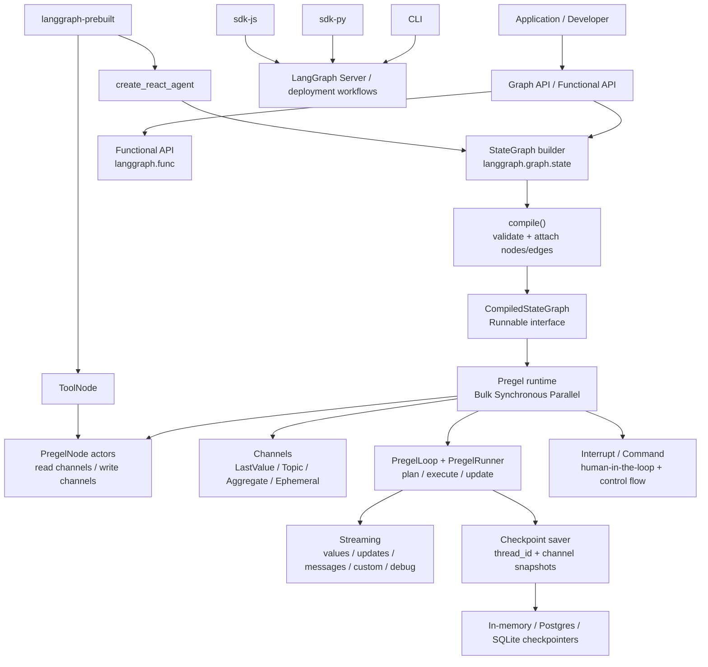
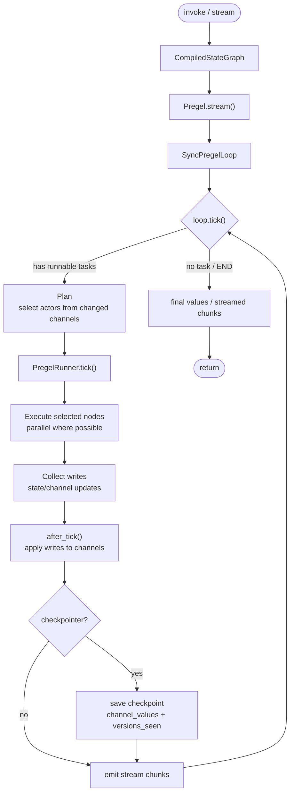

# LangGraph 源码架构分析

分析对象：`sources/langgraph` 当前固定源码提交 `d57a74f950b87bfb9cb51240cc8dccf34b5edfaa`。

这份文档参考 LangChain 源码分析的组织方式：先讲总架构，再按源码分支展开，最后整理适合分享的主流程和设计思想。

## 1. 总体结论

LangGraph 是一个面向长时间运行、可恢复、有状态 Agent/Workflow 的低层编排框架。它不是 LangChain 那种“模型、工具、检索、供应商集成”的组件生态，而更像一个图执行运行时：用户用 `StateGraph` 描述节点、边和状态更新规则，`compile()` 把图编译成可执行的 `CompiledStateGraph`，底层由 `Pregel` 运行时按 step 驱动节点执行，并通过 checkpoint 支持恢复、中断、回放和长期状态。

一句话分享口径：

> LangGraph 的核心不是“写一个 Agent 类”，而是“把 Agent 或工作流建模成状态图”。图里的节点读写共享状态，边决定下一步去哪，运行时按 Pregel/BSP 的 step 模型调度节点，checkpoint 把每一步状态保存下来，所以它天然适合长流程、可中断、可恢复的人机协同 Agent。

## 2. 最高层分层

| 层级 | 目录 | 包名/模块 | 主要职责 |
| --- | --- | --- | --- |
| 图构建层 | `libs/langgraph/langgraph/graph` | `StateGraph` | 定义状态 schema、节点、普通边、条件边，并编译成可执行图 |
| 执行运行时 | `libs/langgraph/langgraph/pregel` | `Pregel` | 按 Pregel/BSP 模型执行图，负责 step、任务调度、流式输出、重试和缓存等 |
| 状态通道层 | `libs/langgraph/langgraph/channels` | channels | 表达状态 key 如何接收更新，例如 last value、topic、聚合等 |
| 持久化层 | `libs/checkpoint` | `langgraph-checkpoint` | 定义 checkpoint 数据结构和 saver 接口 |
| 存储实现层 | `libs/checkpoint-postgres` / `libs/checkpoint-sqlite` | checkpointer implementations | Postgres、SQLite 等 checkpoint 后端 |
| 预构建能力 | `libs/prebuilt` | `langgraph-prebuilt` | `create_react_agent`、`ToolNode` 等常用 Agent 入口和节点 |
| 工具链/服务层 | `libs/cli`、`libs/sdk-py`、`libs/sdk-js` | CLI / SDK | 面向 LangGraph Server/API 的命令行和 SDK |

架构图见：[architecture.mmd](architecture.mmd)。



## 3. 源码分支分析

### 3.1 `libs/langgraph`: 核心框架

`libs/langgraph` 是 LangGraph 的核心包。最重要的两条线是：

- `graph/state.py`：面向用户的图构建 API。
- `pregel/main.py`：面向运行时的执行引擎。

源码证据：

- `libs/langgraph/langgraph/graph/state.py:130` 定义 `StateGraph`。
- `libs/langgraph/langgraph/graph/state.py:1164` 定义 `StateGraph.compile()`。
- `libs/langgraph/langgraph/graph/state.py:1333` 在 compile 中创建 `CompiledStateGraph`。
- `libs/langgraph/langgraph/pregel/main.py:449` 定义 `Pregel`。
- `libs/langgraph/langgraph/pregel/main.py:2631` 定义 `stream()`。
- `libs/langgraph/langgraph/pregel/main.py:3798` 定义 `invoke()`。

关键片段：

```python
class StateGraph(Generic[StateT, ContextT, InputT, OutputT]):
    """A graph whose nodes communicate by reading and writing to a shared state.

    The signature of each node is `State -> Partial<State>`.
    """
```

```python
def compile(...) -> CompiledStateGraph[StateT, ContextT, InputT, OutputT]:
    """Compiles the `StateGraph` into a `CompiledStateGraph` object.

    The compiled graph implements the `Runnable` interface and can be invoked,
    streamed, batched, and run asynchronously.
    """
```

架构推断：

`StateGraph` 是 builder，不直接执行。它的职责是收集 schema、节点、边、条件边、interrupt 配置和 checkpointer 配置。真正执行发生在 compile 之后的 `CompiledStateGraph` / `Pregel` 运行时。

### 3.2 `pregel`: 执行模型

LangGraph 的运行时借鉴 Pregel/Bulk Synchronous Parallel 模型。每一步大致分为：

1. Plan：根据上一步更新过的 channel 选择本轮要执行的节点。
2. Execute：并发执行被选中的节点。
3. Update：把本轮写入应用到 channel，进入下一步。

源码证据：

- `libs/langgraph/langgraph/pregel/main.py:449` 的 `Pregel` 类文档直接描述 actors 和 channels。
- `libs/langgraph/langgraph/pregel/main.py:2979` 使用 `while loop.tick():` 驱动 step。
- `libs/langgraph/langgraph/pregel/main.py:2982` 调用 `runner.tick(...)` 执行任务。
- `libs/langgraph/langgraph/pregel/main.py:3004` 调用 `loop.after_tick()` 完成 step 后处理。

关键片段：

```python
while loop.tick():
    for task in loop.match_cached_writes():
        loop.output_writes(task.id, task.writes, cached=True)
    for _ in runner.tick(
        [t for t in loop.tasks.values() if not t.writes],
        timeout=self.step_timeout,
        get_waiter=get_waiter,
        schedule_task=loop.accept_push,
    ):
        yield from _output(...)
    loop.after_tick()
```

流程图见：[execution-flow.mmd](execution-flow.mmd)。



### 3.3 `libs/checkpoint`: 可恢复状态

Checkpoint 是 LangGraph 支持长流程和中断恢复的关键。它保存的不是简单日志，而是每个 channel 的值、版本，以及每个节点看过哪些版本。

源码证据：

- `libs/checkpoint/langgraph/checkpoint/base/__init__.py:92` 定义 `Checkpoint`。
- `libs/checkpoint/langgraph/checkpoint/base/__init__.py:104` 保存 `channel_values`。
- `libs/checkpoint/langgraph/checkpoint/base/__init__.py:109` 保存 `channel_versions`。
- `libs/checkpoint/langgraph/checkpoint/base/__init__.py:115` 保存 `versions_seen`。
- `libs/checkpoint/langgraph/checkpoint/base/__init__.py:176` 定义 `BaseCheckpointSaver`。
- `libs/checkpoint/langgraph/checkpoint/base/__init__.py:239`、`:277`、`:300` 分别定义读取、写入 checkpoint 和写入中间 writes 的接口。

关键片段：

```python
class Checkpoint(TypedDict):
    """State snapshot at a given point in time."""

    channel_values: dict[str, Any]
    channel_versions: ChannelVersions
    versions_seen: dict[str, ChannelVersions]
```

设计含义：

- `channel_values` 让图可以恢复到某个状态。
- `channel_versions` 让运行时知道哪些状态发生了变化。
- `versions_seen` 让运行时知道哪些节点已经消费过哪些状态版本，从而决定下一步该运行谁。

这就是 LangGraph 能做恢复、回放、time travel、人类介入后继续执行的底层原因。

### 3.4 `libs/prebuilt`: 预构建 Agent 入口

`prebuilt` 不是核心运行时，而是把常见 Agent 模式预先拼好。最典型的是 `create_react_agent` 和 `ToolNode`。

源码证据：

- `libs/prebuilt/langgraph/prebuilt/chat_agent_executor.py:278` 定义 `create_react_agent`。
- `libs/prebuilt/langgraph/prebuilt/chat_agent_executor.py:862` 创建 `StateGraph`。
- `libs/prebuilt/langgraph/prebuilt/chat_agent_executor.py:867` 添加 `agent` 节点。
- `libs/prebuilt/langgraph/prebuilt/chat_agent_executor.py:872` 添加 `tools` 节点。
- `libs/prebuilt/langgraph/prebuilt/chat_agent_executor.py:964` 从 `agent` 添加条件边。
- `libs/prebuilt/langgraph/prebuilt/chat_agent_executor.py:995` 最后 `workflow.compile(...)`。
- `libs/prebuilt/langgraph/prebuilt/tool_node.py:622` 定义 `ToolNode`。

关键片段：

```python
workflow = StateGraph(
    state_schema=state_schema or AgentState, context_schema=context_schema
)

workflow.add_node("agent", RunnableCallable(call_model, acall_model))
workflow.add_node("tools", tool_node)
workflow.add_conditional_edges("agent", should_continue, path_map=agent_paths)
workflow.add_edge("tools", entrypoint)

return workflow.compile(...)
```

Agent 流程图见：[agent-flow.mmd](agent-flow.mmd)。

## 4. 核心设计思想

### 4.1 状态图范式

LangGraph 把复杂 Agent 建模为“状态 + 节点 + 边”。节点不是互相直接调用，而是读取状态、返回部分状态更新，再由运行时决定下一步。

讲解口径：

> LangGraph 的第一个设计思想是状态图。你写的不是一个 while 循环，而是一张图。每个节点只关心输入状态和输出更新，控制流交给边和条件边。

### 4.2 编译器/运行时分离

`StateGraph` 负责构建，`CompiledStateGraph` / `Pregel` 负责执行。这个分离让 API 保持简单，也让底层可以统一处理 stream、checkpoint、interrupt、cache、retry。

讲解口径：

> `compile()` 是源码里很重要的分界线：compile 之前是声明图，compile 之后才是可运行对象。

### 4.3 Channel 作为状态传播协议

节点之间不是直接传参，而是通过 channel 传播状态更新。不同 channel 可以有不同更新语义，例如保存最后一个值、累积多个值或做聚合。

讲解口径：

> LangGraph 的状态不是一个普通 dict 那么简单。它背后是 channel 系统，channel 决定“多个节点同时写同一个状态 key 时怎么合并”。

### 4.4 Pregel/BSP Step 执行

运行时按 step 推进：本轮节点看不到本轮其他节点刚写入的值，更新只在 step 边界统一应用。这种模型让并发、重试和可恢复更可控。

讲解口径：

> Pregel 模型让 LangGraph 的执行像“回合制”：先决定本回合谁跑，再让它们跑，最后统一结算状态。

### 4.5 Checkpoint 持久化

Checkpoint 保存 channel 快照和版本关系，所以图可以按 `thread_id` 继续运行。它不是附加功能，而是和运行时调度强相关。

讲解口径：

> LangGraph 的 memory 本质上不是聊天记录，而是图状态的版本化快照。

### 4.6 Prebuilt 是组合示例，不是核心边界

`create_react_agent` 自己也是用 `StateGraph` 拼出来的。这说明 prebuilt agent 不是特殊运行时，只是把常见模式封装成快捷入口。

讲解口径：

> 如果要理解 LangGraph，不要从 prebuilt 停住。prebuilt 只是示范“如何用 StateGraph 搭一个 Agent 循环”。

## 5. 分享建议

建议分享时按这个顺序讲：

1. 先定位：LangGraph 是状态图运行框架，不是模型组件库。
2. 再看目录：`graph` 负责建图，`pregel` 负责执行，`checkpoint` 负责恢复，`prebuilt` 负责常见 Agent 模板。
3. 再讲主流程：`StateGraph -> compile -> Pregel.stream/invoke -> loop.tick -> runner.tick -> checkpoint/stream output`。
4. 最后讲设计思想：状态图、编译和运行分离、channel、Pregel step、checkpoint、prebuilt 组合。

一句话收束：

> LangGraph 的源码主线其实很清楚：上层用 `StateGraph` 声明状态图，中间 compile 成可运行图，底层 Pregel 按 step 调度节点，checkpoint 把每一步状态固化下来。Agent 只是这个运行框架上的一种图。
