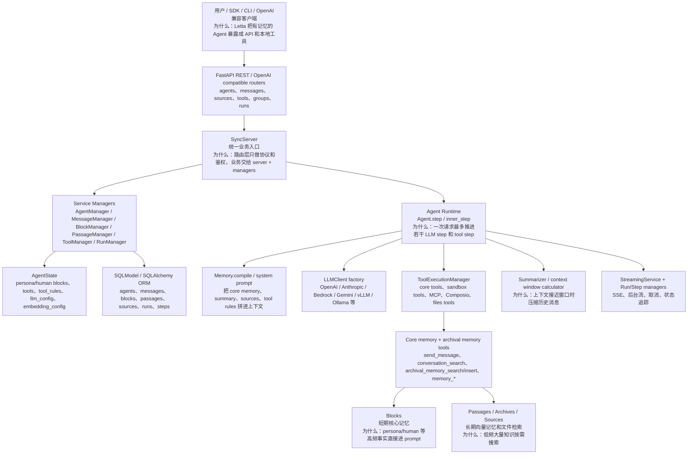
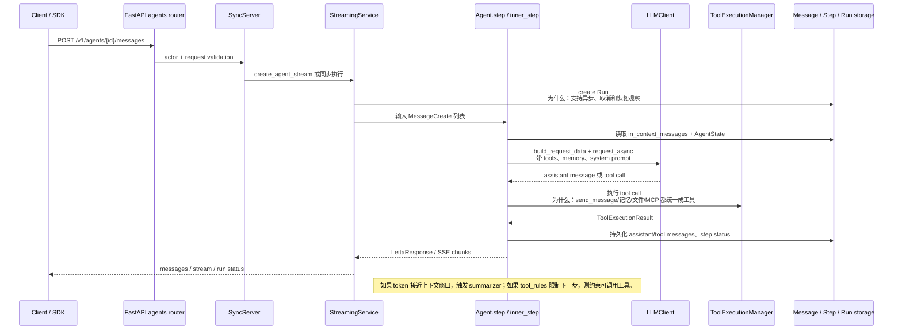
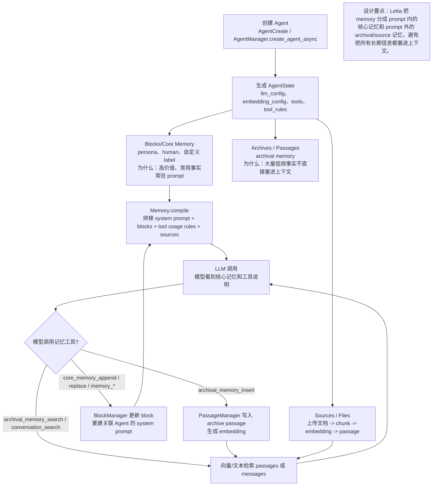
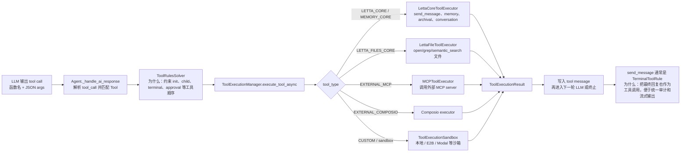

# Letta 源码架构精读

分析对象：`sources/letta`。源码来自 `letta-ai/letta` 的 `main` 快照，远端 HEAD 为 `b76da9092518cbaa2d09042e52fdcbde69243e18`。本机 Git HTTPS 在 clone 阶段出现 `SSL_ERROR_SYSCALL`，因此这次使用 GitHub codeload 快照落地源码；版本号见 `pyproject.toml`：`letta 0.16.8`。

> 重要背景：`README.md` 明确说明该仓库包含 legacy Letta server，也就是 Letta V1 API 和 SDK 背后的 API server；活跃开发迁往 `letta-code`。所以分析这个仓库时，应把它看成“有长期记忆的 Agent Server / Runtime”，而不是最新 Letta Agent CLI 的全部源码。

## 1. 总体结论

Letta 的核心定位是 **stateful agent server**：它把 Agent 的 persona、人类画像、工具、消息、长期记忆、文件知识、运行状态都放进服务端数据模型，再通过 REST / OpenAI-compatible API / streaming 暴露出去。

一句话分享：

> LangGraph 强在“流程状态图怎么流转”，mem0 强在“记忆事实怎么抽取和检索”，Letta 强在“把一个有身份、有核心记忆、有工具、有长期档案的 Agent 做成服务端对象，并让它可以持续对话和自我维护记忆”。

最值得精读的主线：

1. `FastAPI router -> SyncServer -> Service Managers`：API 层不直接操作数据库，业务集中到 server 和 managers。
2. `AgentState`：Agent 不是一次 prompt，而是由 `llm_config`、`embedding_config`、`blocks`、`tools`、`tool_rules`、messages、archives 等组成的状态对象。
3. `Agent.step / inner_step`：一次用户消息进入后，Letta 构造上下文、调用 LLM、解析 tool call、执行工具、持久化消息和 step。
4. Memory 分层：`Blocks/Core Memory` 常驻 prompt，`Passages/Archives/Sources` 作为外部长期记忆按需检索。
5. Tool-first Agent：`send_message`、`core_memory_append`、`archival_memory_search`、文件搜索、MCP 都被统一建模为工具。
6. Provider Adapter：`LLMClient.create()` 根据 `ProviderType` 创建 OpenAI、Anthropic、Gemini、Bedrock、vLLM、Ollama 等客户端。
7. Run/Step/Streaming：服务端把一次 Agent 执行拆成 run 和 step，并支持 SSE、后台流、取消与状态追踪。

## 2. 最高层架构

架构图见：[architecture.mmd](architecture.mmd)。



读图说明：

- 上半层是产品入口：REST API、OpenAI-compatible endpoint、SDK/CLI 都会进入 FastAPI 路由。
- 中间是服务端业务层：`SyncServer` 负责串联 `AgentManager`、`MessageManager`、`BlockManager`、`PassageManager`、`ToolManager` 等服务。
- 下半层是 Agent Runtime：真正的一次 Agent 推理发生在 `Agent.step()` 和 `inner_step()`，它会调用 LLM、执行工具、写消息、必要时总结上下文。
- Letta 的记忆不是单一向量库。高频身份/偏好在 core memory blocks 里，长期知识在 archival/source passages 里，历史对话在 messages 里。

源码证据：

| 主题 | 源码位置 | 说明 |
| --- | --- | --- |
| 项目定位 | `sources/letta/README.md` | README 说明该仓库是 legacy Letta server，活跃开发迁到 `letta-code`。 |
| 包入口 | `sources/letta/pyproject.toml` | 包名 `letta`，版本 `0.16.8`，CLI 入口为 `letta.main:app`。 |
| FastAPI app | `letta/server/rest_api/app.py:294`、`:411`、`:853` | 创建 FastAPI app 并批量挂载 API router。 |
| Agent API | `letta/server/rest_api/routers/v1/agents.py:73`、`:613`、`:1662` | `/agents` 路由，创建 Agent 和发送消息。 |
| Agent runtime | `letta/agent.py:96`、`:753`、`:857` | `Agent`、`step()`、`inner_step()` 是同步 Agent 主路径。 |
| Service layer | `letta/services/agent_manager.py:121`、`:332` | `AgentManager` 负责 Agent 创建和状态管理。 |
| Provider factory | `letta/llm_api/llm_client.py:10`、`:14` | `LLMClient.create()` 根据 provider type 创建具体客户端。 |

## 3. 入口层：FastAPI + SyncServer + Managers

Letta 的 API 层很厚，但模式比较统一：

```text
HTTP route
  -> 解析 headers / actor / request body
  -> 调 SyncServer
  -> SyncServer 调 manager
  -> manager 操作 ORM / Agent runtime / external service
```

源码证据：

- `letta/server/rest_api/app.py:176` 定义 lifespan，启动时初始化 readiness、数据库、后台服务。
- `letta/server/rest_api/app.py:294` 定义 `create_application()`。
- `letta/server/rest_api/app.py:411` 创建 `FastAPI(...)`。
- `letta/server/rest_api/app.py:853-864` 挂载 v1/latest/admin/auth 路由。
- `letta/server/server.py:532` 定义 `create_agent_async()`，路由创建 Agent 最终会走这里。
- `letta/server/server.py:626` 调 `self.agent_manager.create_agent_async(...)`。
- `letta/server/rest_api/routers/v1/agents.py:613-626` `/agents` 创建接口把 `AgentCreate` 交给 server。
- `letta/server/rest_api/routers/v1/agents.py:1662` 定义同步发送消息接口。
- `letta/server/rest_api/routers/v1/agents.py:1844` 定义 streaming 发送消息接口。
- `letta/server/rest_api/routers/v1/agents.py:2200` 定义 async/background 消息接口。

设计含义：这是典型 Service Layer + Repository/Manager 风格。路由层避免直接写业务规则；Manager 负责可复用业务动作；ORM 层负责持久化。好处是 REST、OpenAI-compatible、后台任务可以复用同一套业务逻辑。

## 4. AgentState：Letta 的核心对象

Letta 源码里最关键的 schema 是 `AgentState`。它说明 Letta 的 Agent 不是“一次 prompt + 一组 tools”，而是服务端长期保存的状态对象。

源码证据：

- `letta/schemas/agent.py:67` 定义 `AgentState`。
- `letta/schemas/agent.py:76` 包含 `tool_rules`。
- `letta/schemas/agent.py:87-90` 包含 `llm_config` 和 `embedding_config`。
- `letta/schemas/agent.py:110` 仍保留 `memory` 字段，但标注 deprecated，建议使用 `blocks`。
- `letta/schemas/agent.py:112` 包含 `tools`。
- `letta/schemas/agent.py:139` 包含 `message_buffer_autoclear`。
- `letta/schemas/agent.py:143` 包含 `enable_sleeptime`，表示可把记忆管理移动到后台 Agent thread。
- `letta/schemas/agent.py:232-236` 在 `AgentCreate` 中提供 `include_base_tools`、`include_multi_agent_tools`、`include_base_tool_rules`。

可以这样理解：

| 字段 | 作用 | 为什么重要 |
| --- | --- | --- |
| `llm_config` | 当前 Agent 使用什么模型、endpoint、context window | Provider adapter 和上下文预算都依赖它。 |
| `embedding_config` | 长期记忆和文件 passage 的 embedding 配置 | 决定 archival/source 检索能力。 |
| `blocks` / `memory` | persona、human、自定义核心记忆块 | 高频事实常驻 system prompt。 |
| `tools` | Agent 可调用的工具列表 | Letta 把回复、记忆编辑、文件检索都工具化。 |
| `tool_rules` | 工具调用顺序和终止规则 | 约束 Agent 行为，降低乱调工具风险。 |
| `enable_sleeptime` | 后台记忆维护模式 | 将主对话和记忆整理分离。 |

设计范式：**Agent-as-stateful-resource**。LangChain 的很多 Agent 是运行时组合；Letta 则把 Agent 做成数据库里的资源，有 ID、有配置、有记忆、有工具、有运行记录。

## 5. 主流程一：发送消息到 Agent

流程图见：[agent-flow.mmd](agent-flow.mmd)。



源码主线：

- `letta/server/rest_api/routers/v1/agents.py:1662` 是普通 `send_message` 入口。
- `letta/server/rest_api/routers/v1/agents.py:1718-1722` 创建 stream/run，`run_type="send_message"`。
- `letta/server/rest_api/routers/v1/agents.py:1844` 是 streaming 入口。
- `letta/services/streaming_service.py:180` 定义 `StreamingService`。
- `letta/services/streaming_service.py:196` 定义 `create_agent_stream()`。
- `letta/services/streaming_service.py:336-353` 创建 run，并创建 agent loop stream。
- `letta/agent.py:753` 定义 `step()`，把输入 messages 转成内部 Message。
- `letta/agent.py:857` 定义 `inner_step()`，注释说明“一次 step 至多生成一次 LLM call”。
- `letta/agent.py:901-923` 先发 LLM，再检查是否要调用函数。
- `letta/agent.py:1001` 持久化消息。

关键代码片段：

```python
class Agent(BaseAgent):
    def step(...):
        step_response = self.inner_step(...)

    def inner_step(...):
        """Runs a single step in the agent loop (generates at most one LLM call)"""
```

分享时要强调：Letta 的主循环不是自由奔跑的无限 agent loop，而是服务端控制的 step。API 可以选择同步、streaming、background；每一步都有 run/step/message 记录，这更适合做产品化 Agent 服务。

## 6. 主流程二：Memory 分层

流程图见：[memory-flow.mmd](memory-flow.mmd)。



Letta 的 memory 和 mem0 不一样。mem0 的核心是从对话中抽取 facts 并写入 memory layer；Letta 更强调 **Agent 自己通过工具维护记忆**。

源码证据：

- `letta/schemas/memory.py:688` 定义 `compile()`，把 memory 编译成 prompt 字符串。
- `letta/schemas/memory.py:735` 定义 `compile_async()`。
- `letta/services/block_manager.py:61` 当 block 更新后，会重建所有关联 Agent 的 system prompt。
- `letta/services/block_manager.py:134` 创建或更新 block。
- `letta/services/block_manager.py:211` 更新 block。
- `letta/services/passage_manager.py:543` 定义 `insert_passage()`。
- `letta/services/passage_manager.py:573-579` 有 embedding_config 时通过 `LLMClient.create()` 生成 embeddings。
- `letta/services/passage_manager.py:607-620` 对 Turbopuffer archive 会把 passages 同步写入外部向量库。
- `letta/orm/passage.py:34-40` passage ORM 包含向量 embedding 字段。
- `letta/server/rest_api/routers/v1/sources.py:212` 上传文件到 source。
- `letta/server/rest_api/routers/v1/sources.py:337-340` 文件上传后走 cloud processing / load_file_to_source。

设计含义：

| 记忆类型 | 源码对象 | 适合放什么 | 为什么这么分 |
| --- | --- | --- | --- |
| Core memory | `Block` / `Memory.compile()` | persona、human、长期偏好、少量关键事实 | 每轮都需要看到，直接进 prompt。 |
| Recall memory | `MessageManager` / conversation search | 对话历史、send_message、tool result | 历史很多，按需搜索或总结。 |
| Archival memory | `Passage` / `Archive` | 长期知识、笔记、事实档案 | 数量大，不应常驻上下文。 |
| Source/file memory | `Source` / `File` / `Passage` | 上传文档、代码、知识库 | 用 RAG 方式检索。 |
| Summary memory | `Summarizer` | 被压缩的旧对话 | 上下文快满时保留摘要。 |

## 7. 主流程三：工具调用和 ToolRules

流程图见：[tool-flow.mmd](tool-flow.mmd)。



源码证据：

- `letta/agent.py:445` 定义 `_handle_ai_response()`，解析 LLM 响应。
- `letta/agent.py:527` 通过 `ToolManager().get_tool_by_name()` 找目标工具。
- `letta/agent.py:736` 更新 `ToolRulesSolver` 状态。
- `letta/agent.py:1598` 定义 `execute_tool_and_persist_state()`。
- `letta/services/tool_executor/tool_execution_manager.py:68` 定义 `ToolExecutionManager`。
- `letta/services/tool_executor/tool_execution_manager.py:95` 定义 `execute_tool_async()`。
- `letta/services/tool_executor/core_tool_executor.py:26` 定义 `LettaCoreToolExecutor`。
- `letta/services/tool_executor/core_tool_executor.py:78` 定义 `send_message()`。
- `letta/services/tool_executor/core_tool_executor.py:278` 定义 `archival_memory_search()`。
- `letta/services/tool_executor/core_tool_executor.py:307` 定义 `archival_memory_insert()`。
- `letta/services/tool_executor/core_tool_executor.py:319` 定义 `core_memory_append()`。
- `letta/services/tool_executor/core_tool_executor.py:328` 定义 `core_memory_replace()`。
- `letta/services/tool_executor/files_tool_executor.py:71` 定义文件工具执行入口。
- `letta/services/tool_executor/mcp_tool_executor.py:26` 定义 MCP 工具执行入口。
- `letta/services/tool_executor/tool_execution_sandbox.py` 负责 sandbox 执行。
- `letta/schemas/tool_rule.py:64`、`:254`、`:275` 定义 `ChildToolRule`、`InitToolRule`、`TerminalToolRule`。

设计含义：Letta 把 Agent 的对外回复也做成 `send_message` 工具，而不是普通 assistant text。这会让“回复用户、编辑记忆、搜索档案、调用外部工具”都进入同一个 tool call 审计模型，也方便 ToolRules 控制流程。

## 8. Provider Adapter：LLMClient 工厂

Letta 的 provider 适配分两层：

1. `schemas/providers/*`：描述 provider、列模型、列 embedding 模型。
2. `llm_api/*_client.py`：真正构造请求、发请求、解析 usage、处理 embedding。

源码证据：

- `letta/llm_api/llm_client.py:10` 定义 `LLMClient`。
- `letta/llm_api/llm_client.py:14-132` 使用 `match ProviderType` 创建不同 provider client。
- `letta/llm_api/llm_client_base.py:200` 定义 `send_llm_request()`。
- `letta/llm_api/llm_client_base.py:246` 定义 `send_llm_request_async()`。
- `letta/llm_api/llm_client_base.py:293` 定义默认 `build_request_data()`。
- `letta/llm_api/openai_client.py:502` 定义 OpenAI chat completions 请求构造。
- `letta/llm_api/openai_client.py:767` 定义 OpenAI request。
- `letta/llm_api/openai_client.py:1084` 定义 OpenAI embeddings。
- `letta/llm_api/anthropic_client.py:500` 定义 Anthropic 请求构造。
- `letta/adapters/letta_llm_stream_adapter.py:23` 定义 streaming LLM adapter。
- `letta/adapters/letta_llm_request_adapter.py:15` 定义 blocking LLM adapter。
- `letta/schemas/providers/openai.py:21` 定义 `OpenAIProvider`。
- `letta/schemas/providers/__init__.py:3-25` 汇总 Anthropic、Azure、Bedrock、Gemini、Ollama、OpenRouter、vLLM、xAI、ZAI 等 provider。

设计范式：**Factory + Adapter + Provider Registry**。Agent runtime 不直接依赖 OpenAI/Anthropic SDK，而是依赖统一的 `LLMClientBase` 行为。这样同一个 AgentState 可以换 provider，但保留 tool call、usage、streaming、embedding 等统一语义。

## 9. Summarizer 和上下文窗口

Letta 的上下文管理有两个层次：

- Agent 运行时检测 usage/context window，必要时触发 summarizer。
- Summarizer 服务提供 partial eviction、sliding window、fallback 等策略。

源码证据：

- `letta/agent.py:945-987` 根据 LLM response usage 和 `memory_warning_threshold` 判断是否发出 memory warning。
- `letta/agent.py:1039` context overflow 后尝试 summarize。
- `letta/agent.py:1204` 定义 `get_context_window()`。
- `letta/agent.py:1268-1276` 计算 system、tools、core memory、external memory summary、summary、messages 的 token 占用。
- `letta/services/summarizer/summarizer.py:36` 定义 `Summarizer`。
- `letta/services/summarizer/summarizer.py:75` 定义 `summarize()`。
- `letta/services/summarizer/summarizer.py:136` 定义 partial evict buffer summarization。
- `letta/services/summarizer/summarizer_sliding_window.py:99` 定义 `summarize_via_sliding_window()`。
- `letta/services/summarizer/summarizer_sliding_window.py:152-163` 根据 context window 和 sliding window percentage 逐步提高 eviction。
- `letta/services/summarizer/compact.py:311` 调 sliding window summarize。
- `letta/services/summarizer/compact.py:350-363` 总结后重新计算 token，若仍超过阈值则进入 fallback/错误处理。

这和 Headroom 的区别很明显：Headroom 是模型调用前的上下文压缩代理；Letta 的 summarizer 是 Agent 自身状态管理的一部分，压缩的是长期对话历史，让 Agent 可以持续运行。

## 10. Streaming、Run 和 Step

Letta 是服务端产品，所以它不仅要“让 Agent 回答”，还要处理运行状态、流式输出、后台任务、取消和错误收束。

源码证据：

- `letta/services/run_manager.py:38` 定义 `RunManager`。
- `letta/services/run_manager.py:48` 创建 run。
- `letta/services/run_manager.py:320` 更新 run 状态。
- `letta/services/run_manager.py:336-370` 处理 terminal status 的更新约束。
- `letta/services/step_manager.py:40` 定义 `StepManager`。
- `letta/services/step_manager.py:402`、`:447`、`:545` 分别记录 failed/success/cancelled step。
- `letta/services/streaming_service.py:196` 创建 agent stream。
- `letta/services/streaming_service.py:383-412` 支持 Redis-backed background streaming。
- `letta/server/rest_api/streaming_response.py:153` 定义 cancellation-aware stream wrapper。
- `letta/server/rest_api/streaming_response.py:51` 定义 keepalive wrapper。

设计含义：Letta 的运行时带明显的“后端服务”气质。它关心的不只是 LLM 输出，还包括请求幂等、stream 恢复、后台流、取消、状态机和可观测性。这一点比很多纯库型 Agent 框架更重。

## 11. Multi-agent / Groups

Letta 也有多 Agent 能力，但不是它最容易讲清楚的第一主线。源码里 groups 支持 round-robin、supervisor、dynamic、sleeptime、voice_sleeptime 等 manager type。

源码证据：

- `letta/schemas/group.py:21-28` 定义 group 基础 schema。
- `letta/schemas/group.py:60-79` 根据 `manager_type` 返回不同 manager config。
- `letta/schemas/group.py:173` 定义 `GroupCreate`。
- `letta/services/group_manager.py:25` 定义 `GroupManager`。
- `letta/services/group_manager.py:76-103` 创建 group 时按 manager_config 写入不同字段。
- `letta/server/rest_api/routers/v1/groups.py:14` 定义 `/groups` 路由。
- `letta/server/rest_api/routers/v1/groups.py:81-94` 创建 group。
- `letta/groups/dynamic_multi_agent.py:236` 定义选择下一位 speaker 的工具。
- `letta/groups/sleeptime_multi_agent_v3.py:135-145` 根据频率触发 sleeptime agent。

分享建议：多 Agent 部分可以放在后半段讲。Letta 的主价值不是“像 AutoGen 一样组织群聊”，而是让每个 Agent 都有持久身份、记忆和服务端生命周期；groups 是在这个 Agent resource 基础上的组合能力。

## 12. 真实例子：做一个会长期记住项目偏好的源码分析助手

假设我们要做一个“源码分析助手”，用户长期偏好是：

- 文档必须中文。
- 先讲架构，再讲主流程，再讲设计思想。
- HTML 是主要阅读入口。
- 图里要写中文说明和“为什么这么设计”。
- 背景不要黑色。

在 Letta 中，这个助手可以被建模成一个 Agent：

```python
agent = AgentCreate(
    name="source-analysis-assistant",
    memory_blocks=[
        {"label": "persona", "value": "我是一个擅长开源 LLM 框架源码精读的中文助手。"},
        {"label": "human", "value": "用户主要看 HTML，偏好浅色背景、中文说明、先架构后主流程。"},
    ],
    include_base_tools=True,
)
```

一次用户说“分析 letta-ai/letta，参考其他工程”时，Letta 的运行方式可以解释成：

1. Router 接收 `/agents/{id}/messages`。
2. Server 读取 AgentState。
3. `Memory.compile()` 把 persona/human blocks 编进 system prompt。
4. `Agent.inner_step()` 把当前用户消息、历史摘要、工具列表发给 LLM。
5. LLM 可以调用 `archival_memory_search` 找以前 mem0/headroom 的分析风格，也可以调用文件工具读源码。
6. 如果用户又补充“图里要写为什么”，模型可以调用 `core_memory_append` 或 `memory_*` 更新偏好 block。
7. 下一次分析别的框架时，这个偏好仍然在 AgentState 里，不需要用户重复说。

这个例子能帮助听众理解 Letta 和 mem0 的差别：

- mem0 更像应用外部的 memory layer。
- Letta 更像把 memory、tools、messages、LLM provider 和 execution lifecycle 都封装进 Agent server。

## 13. 核心设计思想与范式

| 设计思想 | 源码证据 | 可分享表述 |
| --- | --- | --- |
| Agent 资源化 | `AgentState`、`AgentManager`、`RunManager` | Agent 是服务端对象，不是一次性 prompt。 |
| Memory 分层 | `Block`、`Memory.compile()`、`Passage`、`Source` | 高频核心记忆进 prompt，低频大量知识走检索。 |
| Tool-first loop | `Agent._handle_ai_response()`、`ToolExecutionManager` | 回复用户和修改记忆都工具化，便于审计和规则约束。 |
| Provider Adapter | `LLMClient.create()`、`LLMClientBase` | 模型供应商差异封装在 adapter 后面。 |
| Service Layer | `SyncServer` + managers | API、后台、OpenAI-compatible endpoint 复用业务逻辑。 |
| Context self-management | `Summarizer`、`get_context_window()` | Agent 会主动总结旧上下文，以维持长期对话。 |
| Runtime observability | `RunManager`、`StepManager`、`StreamingService` | 服务端 Agent 需要状态、取消、流式和错误收束。 |
| Multi-agent as resource composition | `GroupManager`、`groups/*` | 多 Agent 是多个持久 Agent 的组合，而不是纯消息列表。 |

代码片段证据：

```python
# letta/llm_api/llm_client.py
class LLMClient:
    @staticmethod
    def create(provider_type: ProviderType, actor: User) -> LLMClientBase:
        match provider_type:
            case ProviderType.openai:
                return OpenAIClient(...)
            case ProviderType.anthropic:
                return AnthropicClient(...)
```

```python
# letta/agent.py
def inner_step(...):
    """Runs a single step in the agent loop (generates at most one LLM call)"""
```

```python
# letta/services/tool_executor/core_tool_executor.py
async def archival_memory_search(...)
async def archival_memory_insert(...)
async def core_memory_append(...)
async def core_memory_replace(...)
```

这三组片段分别证明了 provider adapter、step 型 Agent loop、memory-as-tools 三个核心范式。

## 14. 应用场景

| 场景 | Letta 价值 | 注意点 |
| --- | --- | --- |
| 长期个人助手 | persona/human/core memory 常驻，偏好可被工具更新 | 需要治理记忆权限和错误记忆修正。 |
| 客服 / 销售 Agent | 每个 Agent 有身份、工具、知识源、运行记录 | 多租户隔离和审计要重点设计。 |
| 代码/文档助手 | 文件 source、semantic search、conversation search、工具沙箱 | 最新 Letta Code 在独立 repo，当前仓库偏 legacy server。 |
| 企业 Agent API 平台 | FastAPI、OpenAI-compatible、streaming、run/step 管理 | 架构重，部署复杂度高于纯库。 |
| 多 Agent 协作 | groups 支持 round-robin、supervisor、dynamic、sleeptime | 多 Agent 不是主线，复杂流程编排可结合 LangGraph。 |
| 记忆研究 / MemGPT 思路学习 | core/archival/summary memory 分层清晰 | 源码有历史兼容和 deprecated 字段，阅读时要避开旧路径干扰。 |

## 15. 和其他框架对比

| 维度 | Letta | LangGraph | mem0 | Zep / Graphiti | AutoGen / CrewAI |
| --- | --- | --- | --- | --- | --- |
| 核心问题 | 有记忆的 Agent 如何服务端持久运行 | 状态图流程如何可控执行 | 长期 facts 怎么抽取和检索 | 会话/图谱记忆如何服务化 | 多 Agent 如何对话协作 |
| 状态模型 | AgentState + DB resources | 显式 graph state + checkpoint | user/agent/run scoped memories | thread/user/session/graph | Agent/team runtime state |
| 记忆方式 | core blocks + archival passages + summary | 由应用自己定义 state/memory | Memory.add/search | context assembly / temporal graph | 通常依赖外部 memory |
| 工具模型 | send_message、memory、file、MCP 都是 tool | node/tool 可自定义 | 不是工具编排核心 | 记忆 API 为主 | 工具调用和团队协作 |
| 适合分享切入 | Agent-as-service | StateGraph/Pregel | Memory layer | Memory platform/graph | Multi-agent runtime |

### 和 LangGraph 怎么组合

推荐组合方式：

- LangGraph 管复杂业务流程：审批、分支、回滚、checkpoint。
- Letta 管某个节点里的“有记忆 Agent”：身份、长期偏好、工具、历史消息。
- LangGraph 节点调用 Letta Agent API，让 Letta 处理对话和记忆。
- 不建议让 Letta groups 替代 LangGraph 的显式业务流程图；Letta 的 groups 更适合 Agent 之间的对话协作。

组合示例：

```text
LangGraph workflow
  -> collect_requirements node
  -> call Letta source-analysis-agent
  -> review_result node
  -> if needs_more_source: call Letta again
  -> save_report node
```

## 16. 局限性和阅读注意点

| 局限 / 注意点 | 为什么 | 建议 |
| --- | --- | --- |
| 当前仓库是 legacy server | README 已说明活跃开发迁到 `letta-code` | 分享时先讲清版本边界，避免误解为最新 CLI 全部实现。 |
| 历史包袱较重 | 有 deprecated `memory` 字段、V1 API、OpenAI-compatible、旧 MemGPT 概念 | 精读主线放在 AgentState、Agent loop、Blocks/Passages、ToolExecution。 |
| 架构比纯库复杂 | 服务端要处理数据库、stream、run、step、auth、jobs | 对产品平台有价值，对轻量 app 可能过重。 |
| 记忆由 Agent 工具维护，可能误写 | LLM 调用 `core_memory_*` 或 `archival_memory_insert` 可能出错 | 关键业务记忆要加 approval、审计和回滚。 |
| 多 Agent 不是最清晰主线 | groups 里有多个 manager 版本和历史实现 | 分享时放在扩展章节，避免一开始陷入细节。 |
| Git clone 网络不稳定 | 本次用 codeload 快照，非 git submodule | 后续网络稳定后可重新登记为 submodule。 |

## 17. 分享建议

推荐讲法：

1. 先讲背景：Letta 前身 MemGPT，这个仓库是 legacy server，核心是有长期记忆的 Agent API。
2. 讲架构：FastAPI router、SyncServer、Managers、Agent Runtime、Storage、Provider、Tool Executor。
3. 讲 AgentState：为什么 Letta 的 Agent 是服务端资源，不是一次 prompt。
4. 讲主流程：用户消息进入 `Agent.step/inner_step`，LLM 输出 tool call，工具执行并持久化消息。
5. 讲 memory 分层：core blocks、archival passages、sources/files、summary memory。
6. 讲 provider adapter 和 streaming/run/step，说明它为什么像一个 Agent 后端平台。
7. 用真实例子收束：源码分析助手如何长期记住用户偏好。
8. 最后对比 LangGraph/mem0/Zep/AutoGen/CrewAI，明确选型边界。

可以直接这样开场：

> “Letta 读源码时不要先从路由列表讲起，而要先抓住 AgentState。Letta 的核心是把 Agent 做成服务端资源：它有身份、有记忆块、有工具、有长期档案、有模型配置、有运行记录。一次消息进来后，服务端把这些状态编译成上下文，调用模型，再把工具调用、记忆修改和回复都持久化。”

## 18. 源码证据清单

| 模块 | 文件 |
| --- | --- |
| 项目入口 | `pyproject.toml`、`README.md` |
| FastAPI app | `letta/server/rest_api/app.py` |
| Agents API | `letta/server/rest_api/routers/v1/agents.py` |
| Server facade | `letta/server/server.py` |
| Agent runtime | `letta/agent.py` |
| Agent schema | `letta/schemas/agent.py` |
| Memory schema | `letta/schemas/memory.py`、`letta/schemas/block.py` |
| Managers | `letta/services/agent_manager.py`、`block_manager.py`、`message_manager.py`、`passage_manager.py` |
| Tool execution | `letta/services/tool_executor/*`、`letta/schemas/tool_rule.py` |
| Provider adapter | `letta/llm_api/*`、`letta/adapters/*`、`letta/schemas/providers/*` |
| Sources/files/RAG | `letta/server/rest_api/routers/v1/sources.py`、`letta/services/source_manager.py`、`file_manager.py` |
| Summarizer | `letta/services/summarizer/*` |
| Streaming/runs/steps | `letta/services/streaming_service.py`、`run_manager.py`、`step_manager.py` |
| Groups | `letta/schemas/group.py`、`letta/services/group_manager.py`、`letta/groups/*` |
