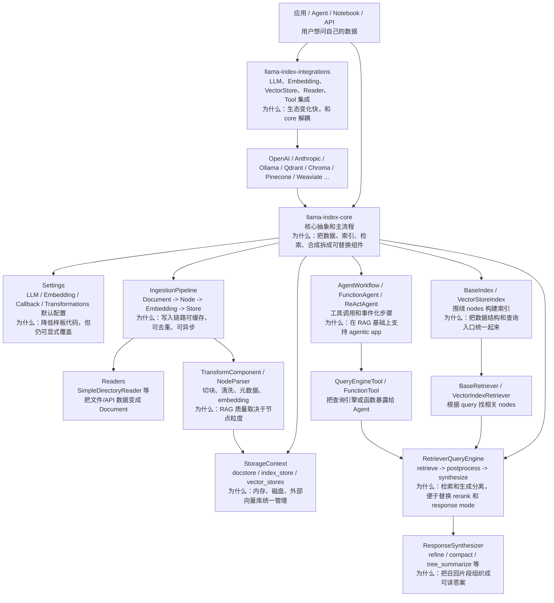
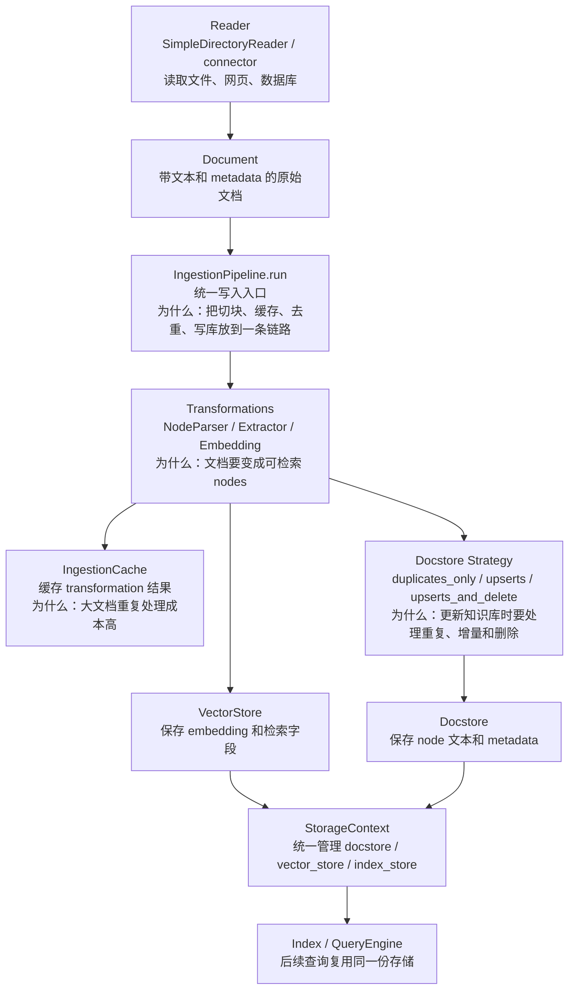
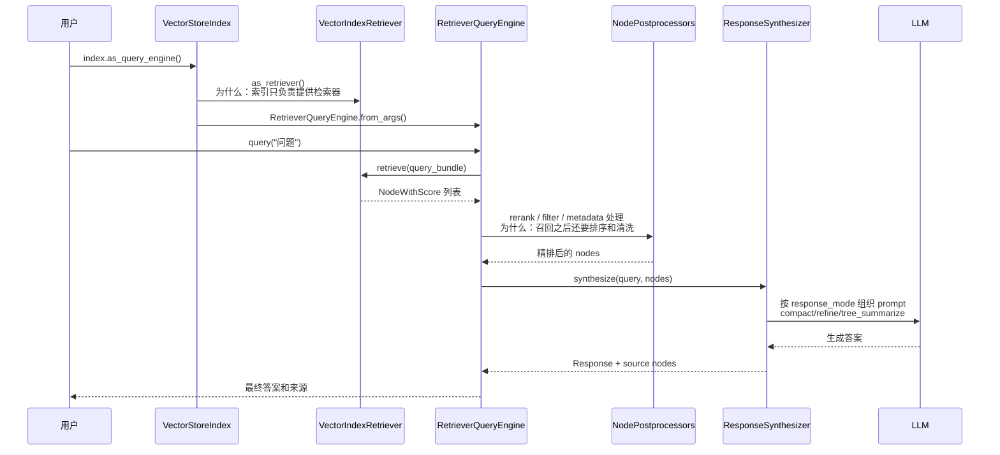
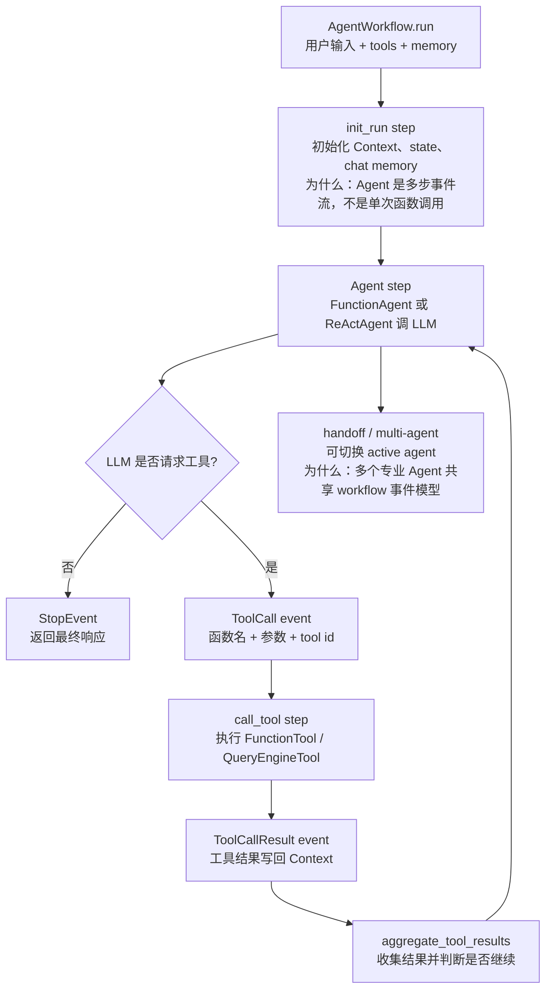

# LlamaIndex 源码架构精读

分析对象：`sources/llama_index`。源码来自 `run-llama/llama_index`，固定提交为 `7fd33e00a8947183327e75aef14687c499d5c150`，提交时间 `2026-07-02T11:54:19-06:00`，提交信息为 `Fix MemosReader default endpoint and metadata (#22199)`。核心包 `llama-index-core` 版本为 `0.14.23`。

## 1. 总体结论

LlamaIndex 的核心定位是 **data framework for LLM / agentic applications**。它不是只提供一个 Agent loop，也不是只封装模型 API；它最强的主线是把“私有数据如何进入 LLM 应用”拆成一组稳定抽象：

```text
Reader -> Document -> Node/Transformation -> Index/Storage -> Retriever -> QueryEngine -> ResponseSynthesizer
```

一句话分享：

> LangChain 更像通用 LLM 应用组件库，LangGraph 强在显式状态图和 checkpoint，LlamaIndex 强在数据/RAG 管线：怎么把文件、数据库、网页、向量库、检索器和答案合成组织成一条可扩展链路。

最值得精读的主线：

1. `llama-index-core` 与 `llama-index-integrations` 的拆分：core 稳定抽象，integrations 承接快速变化的模型、向量库和 reader。
2. `IngestionPipeline`：从 Document 到 Node，再到 embedding、docstore、vector store。
3. `BaseIndex / VectorStoreIndex`：索引不是简单向量库对象，而是索引结构、存储上下文和查询入口的组合。
4. `index.as_query_engine()`：把 retriever 包装成 `RetrieverQueryEngine`，再进入 retrieve/postprocess/synthesize。
5. `StorageContext`：统一管理 docstore、index_store、vector_stores 和持久化。
6. `Settings`：全局默认 LLM、embedding、callback、transformations，降低样板代码。
7. `AgentWorkflow`：在 RAG 和 tools 之上增加事件化的 Agent 执行模型。

## 2. 最高层架构

架构图见：[architecture.mmd](architecture.mmd)。



读图说明：

- 上层是使用入口，应用通常从 reader、index 或 query engine 开始。
- 中层是 core：数据进入、索引构建、检索、答案合成、存储上下文、Agent workflow。
- 下层是 integrations：模型、embedding、向量库、数据库、文件系统、API reader 都是可插拔适配。

源码证据：

| 主题 | 源码位置 | 说明 |
| --- | --- | --- |
| Monorepo 拆分 | `sources/llama_index/README.md` | README 说明 `llama-index-core` 是核心抽象，integrations 在 `llama-index-integrations`。 |
| Core 模块 | `sources/llama_index/llama-index-core/llama_index/core` | 包含 `indices`、`ingestion`、`retrievers`、`query_engine`、`response_synthesizers`、`storage`、`agent`、`workflow`。 |
| Index 基类 | `llama_index/core/indices/base.py:25` | `BaseIndex` 是索引抽象基类。 |
| Vector 索引 | `llama_index/core/indices/vector_store/base.py:36` | `VectorStoreIndex` 是最常用的向量索引实现。 |
| Query Engine | `llama_index/core/query_engine/retriever_query_engine.py:25` | `RetrieverQueryEngine` 把检索器和答案合成器组合起来。 |

## 3. Monorepo 边界：core 稳定，integrations 扩展

LlamaIndex 的仓库很大，但边界并不乱。可以按三层理解：

| 层级 | 目录 | 作用 | 为什么这么拆 |
| --- | --- | --- | --- |
| Core | `llama-index-core` | 基础 schema、索引、检索、查询引擎、存储、ingestion、workflow | 把稳定抽象集中起来，避免每个 provider 改动影响主链路。 |
| Integrations | `llama-index-integrations` | LLM、embedding、vector store、reader、tools 等实现 | 外部生态变化快，用独立 package 承接版本差异。 |
| Instrumentation / utils | `llama-index-instrumentation`、`llama-index-utils` | callback、事件、辅助能力 | 将观测和工具能力从业务抽象里拆出。 |

这体现的是 **Ports and Adapters**：core 定义端口，integrations 实现适配器。举例说，`VectorStoreIndex` 不应该知道 Qdrant、Chroma、Pinecone 的全部细节；它只依赖统一的 vector store 接口和 storage context。

README 里的典型 import 也体现了这个边界：

```python
from llama_index.core.llms import LLM
from llama_index.llms.openai import OpenAI
```

前者来自 core 抽象，后者来自具体 integration。

## 4. 主流程一：数据进入与 IngestionPipeline

流程图见：[ingestion-flow.mmd](ingestion-flow.mmd)。



源码主线：

- `llama_index/core/ingestion/pipeline.py:72` 定义 `run_transformations()`。
- `llama_index/core/ingestion/pipeline.py:115` 定义异步版 `arun_transformations()`。
- `llama_index/core/ingestion/pipeline.py:262` 定义 `IngestionPipeline`。
- `llama_index/core/ingestion/pipeline.py:321-343` 定义 `transformations`、`vector_store`、`cache`、`docstore`、`docstore_strategy`。
- `llama_index/core/ingestion/pipeline.py:423` 定义默认 transformations。
- `llama_index/core/ingestion/pipeline.py:455`、`:473`、`:495`、`:518` 处理 duplicate、upsert、delete 等策略。
- `llama_index/core/ingestion/pipeline.py:539` 定义同步 `run()`。
- `llama_index/core/ingestion/pipeline.py:650-656` 将 nodes 写入 vector store 和 docstore。
- `llama_index/core/ingestion/pipeline.py:746` 定义异步 `arun()`。

设计含义：

| 设计点 | 为什么重要 |
| --- | --- |
| Document 和 Node 分离 | Document 是原始输入，Node 是检索单元；RAG 的检索质量通常取决于 node 粒度。 |
| transformations 链 | 切块、元数据抽取、embedding 都可插拔，便于按业务调整。 |
| cache | 文档大、embedding 贵，重复 ingestion 需要缓存。 |
| docstore_strategy | 知识库不是一次性构建，增量更新和删除是生产系统必须处理的问题。 |
| vector_store + docstore | 向量库负责召回，docstore 保存文本和 metadata，避免把所有存储职责压给向量库。 |

## 5. 主流程二：构建索引

`BaseIndex` 是核心抽象。它接收 nodes，维护 index struct，并提供插入、删除、查询入口。

源码证据：

- `llama_index/core/indices/base.py:25` 定义 `BaseIndex`。
- `llama_index/core/indices/base.py:89` 定义 `from_documents()`。
- `llama_index/core/indices/base.py:179` 定义 `_build_index_from_nodes()`。
- `llama_index/core/indices/base.py:491` 定义 `as_query_engine()`。
- `llama_index/core/indices/vector_store/base.py:36` 定义 `VectorStoreIndex`。
- `llama_index/core/indices/vector_store/base.py:112` 定义 `as_retriever()`。
- `llama_index/core/indices/vector_store/base.py:260` 定义 `_build_index_from_nodes()`。
- `llama_index/core/indices/vector_store/base.py:343` 定义 `insert_nodes()`。

典型 README 示例：

```python
documents = SimpleDirectoryReader("YOUR_DATA_DIRECTORY").load_data()
index = VectorStoreIndex.from_documents(documents)
query_engine = index.as_query_engine()
query_engine.query("YOUR_QUESTION")
index.storage_context.persist()
```

这段代码背后对应的不是“读取文件后直接问模型”，而是：

1. reader 把文件变成 `Document`。
2. `from_documents()` 把 document 转为 nodes。
3. `VectorStoreIndex` 为 nodes 生成 embedding 并写入 vector store。
4. `as_query_engine()` 创建查询入口。
5. 查询时 retriever 找回 nodes，synthesizer 再组织答案。

## 6. 主流程三：QueryEngine 的 RAG 查询链路

流程图见：[rag-flow.mmd](rag-flow.mmd)。



源码证据：

- `llama_index/core/indices/base.py:491` 的 `as_query_engine()` 会把 `as_retriever()` 的结果交给 `RetrieverQueryEngine`。
- `llama_index/core/query_engine/retriever_query_engine.py:25` 定义 `RetrieverQueryEngine`。
- `llama_index/core/query_engine/retriever_query_engine.py:39-50` 构造函数接收 `retriever`、`response_synthesizer`、`node_postprocessors`。
- `llama_index/core/query_engine/retriever_query_engine.py:65-117` 的 `from_args()` 根据参数创建 response synthesizer。
- `llama_index/core/query_engine/retriever_query_engine.py:142` 定义 `_apply_node_postprocessors()`。
- `llama_index/core/query_engine/retriever_query_engine.py:160` 定义 `retrieve()`。
- `llama_index/core/query_engine/retriever_query_engine.py:178` 定义 `synthesize()`。
- `llama_index/core/query_engine/retriever_query_engine.py:203` 定义 `_query()`。
- `llama_index/core/response_synthesizers/factory.py:38` 定义 `get_response_synthesizer()`，支持 `refine`、`compact`、`tree_summarize`、`simple_summarize`、`accumulate`、`generation`、`no_text` 等模式。

关键设计：**Retriever / QueryEngine / Synthesizer 分离**。

| 组件 | 负责什么 | 为什么分开 |
| --- | --- | --- |
| Retriever | 找相关 nodes | 可以替换成向量检索、融合检索、路由检索、递归检索。 |
| NodePostprocessor | 对召回结果过滤、rerank、压缩 | 检索召回和最终上下文质量不是一回事。 |
| ResponseSynthesizer | 把 nodes 变成答案 | 不同答案策略适合不同上下文长度和任务。 |
| QueryEngine | 编排一次 query | 让应用只调用 `query()`，内部可替换组件。 |

## 7. StorageContext：存储上下文

LlamaIndex 不把存储简化成一个 vector DB。`StorageContext` 负责统一管理多种存储：

- `docstore`：保存 node 文本和 metadata。
- `index_store`：保存 index struct。
- `vector_stores`：保存向量和检索字段，可有多个 namespace。
- `graph_store` / property graph：用于图相关能力。

源码证据：

- `llama_index/core/storage/storage_context.py:53` 定义 `StorageContext`。
- `llama_index/core/storage/storage_context.py:59-69` 定义 docstore、index_store、vector_stores 等字段。
- `llama_index/core/storage/storage_context.py:74` 定义 `from_defaults()`。
- `llama_index/core/storage/storage_context.py:97-111` 创建内存默认存储。
- `llama_index/core/storage/storage_context.py:113-141` 从 `persist_dir` 加载存储。
- `llama_index/core/storage/storage_context.py:151-202` 定义 `persist()`。
- `llama_index/core/storage/storage_context.py:221-263` 定义 `to_dict()` / `from_dict()`。

设计含义：RAG 系统里“索引结构”“节点文本”“向量召回字段”并不总在同一个地方。`StorageContext` 把这些存储组合成一个上下文，索引和查询引擎就不用关心每个后端的细节。

## 8. Settings：默认配置和全局便利

`Settings` 是 LlamaIndex 的全局默认配置入口。它包含 LLM、embedding、callback manager、node parser、transformations 等。

源码证据：

- `llama_index/core/settings.py:35-48` 的 `llm` 属性会懒加载 `resolve_llm("default")`。
- `llama_index/core/settings.py:63-76` 的 `embed_model` 会懒加载 `resolve_embed_model("default")`。
- `llama_index/core/settings.py:97-106` 定义 `callback_manager`。
- `llama_index/core/settings.py:278-287` 的 `transformations` 默认返回 `[self.node_parser]`。

设计好处：

- 新手可以少写很多样板代码。
- 组件内部能拿到默认 LLM / embedding。
- callback 和 transformations 有统一默认入口。

局限也很明显：全局默认会隐藏依赖。工程化项目里建议在关键路径显式传 `llm`、`embed_model`、`storage_context` 或 `transformations`，这样测试和多租户隔离更清晰。

## 9. AgentWorkflow：在 RAG 之上的事件化 Agent

流程图见：[agent-workflow-flow.mmd](agent-workflow-flow.mmd)。



源码证据：

- `llama_index/core/workflow/__init__.py` 导出 `Workflow`、`Context`、`StartEvent`、`StopEvent`、`step`。
- `llama_index/core/agent/workflow/base_agent.py:383` 附近是 `init_run` step。
- `llama_index/core/agent/workflow/base_agent.py:523-624` 是 agent step 和 tool call event 主路径。
- `llama_index/core/agent/workflow/base_agent.py:625` 定义 `call_tool`。
- `llama_index/core/agent/workflow/base_agent.py:663` 定义 `aggregate_tool_results`。
- `llama_index/core/agent/workflow/base_agent.py:729-802` 的 `run()` 包装 `Workflow.run()`。
- `llama_index/core/agent/workflow/multi_agent_workflow.py:99` 定义 `AgentWorkflow`。
- `llama_index/core/agent/workflow/function_agent.py:19` 定义 `FunctionAgent`。
- `llama_index/core/agent/workflow/react_agent.py:38` 定义 `ReActAgent`。

设计含义：LlamaIndex 的 Agent 能力不是完全独立于 RAG 的另一套框架。它可以把 `QueryEngineTool`、`FunctionTool` 等作为工具，让 Agent 在需要时调用索引查询。也就是说，LlamaIndex 的 Agent 适合服务“围绕数据查询和工具调用的 agentic app”。

## 10. 检索扩展：Fusion、Router、Recursive

LlamaIndex 的检索不是只有 `VectorIndexRetriever`。core 里还有几类常用扩展：

| Retriever | 源码 | 适合场景 |
| --- | --- | --- |
| `QueryFusionRetriever` | `llama_index/core/retrievers/fusion_retriever.py:33` | 多 query、多 retriever 召回融合，适合提升复杂问题召回率。 |
| `RouterRetriever` | `llama_index/core/retrievers/router_retriever.py:20` | 根据 query 选择合适 retriever，适合多知识源。 |
| `RecursiveRetriever` | `llama_index/core/retrievers/recursive_retriever.py:22` | 节点之间有引用或层级关系时递归检索。 |

这说明 LlamaIndex 的 RAG 设计不是“向量库搜一下再 prompt”。它把 retriever 作为一等抽象，允许组合、路由、递归和后处理。

## 11. 核心设计思想和范式

| 设计思想 | 源码证据 | 可分享表述 |
| --- | --- | --- |
| Data-first / RAG-first | `IngestionPipeline`、`VectorStoreIndex`、`RetrieverQueryEngine` | LlamaIndex 的中心是数据进入和数据查询，而不是单纯 agent loop。 |
| Ports and Adapters | `llama-index-core` + `llama-index-integrations` | core 定义抽象，provider/vector store/reader 在 integrations 里适配。 |
| Pipeline 架构 | `run_transformations()`、`IngestionPipeline.run()` | 写入链路按 transformation、cache、docstore、vector store 分阶段。 |
| Retriever / Synthesizer 分离 | `RetrieverQueryEngine`、`get_response_synthesizer()` | 检索质量和答案合成策略可以分别优化。 |
| StorageContext | `StorageContext.from_defaults()`、`persist()` | 统一管理 docstore、index_store、vector_stores，支持内存和持久化。 |
| Lazy Settings | `Settings.llm`、`Settings.embed_model` | 新手易用，但大型项目要注意显式依赖。 |
| Event Workflow | `AgentWorkflow`、`@step` | Agent 执行通过 workflow event 组织，工具调用可观察、可扩展。 |
| Progressive complexity | README 示例从三四行开始，源码内部支持复杂 retriever、pipeline、storage | API 入门简单，架构上保留生产系统扩展点。 |

代码片段证据：

```python
# llama_index/core/indices/base.py
def as_query_engine(self, llm=None, **kwargs):
    retriever = self.as_retriever(**kwargs)
    return RetrieverQueryEngine.from_args(retriever, llm=llm, **kwargs)
```

```python
# llama_index/core/query_engine/retriever_query_engine.py
class RetrieverQueryEngine(BaseQueryEngine):
    def __init__(self, retriever, response_synthesizer=None, node_postprocessors=None, ...):
        self._retriever = retriever
        self._response_synthesizer = response_synthesizer
        self._node_postprocessors = node_postprocessors or []
```

```python
# llama_index/core/storage/storage_context.py
class StorageContext:
    docstore: BaseDocumentStore
    index_store: BaseIndexStore
    vector_stores: Dict[str, SerializeAsAny[BasePydanticVectorStore]]
```

这三段分别证明了 query engine 组合方式、retriever/synthesizer/postprocessor 分离，以及 storage context 的多存储抽象。

## 12. 真实例子：做一个“源码分析问答助手”

假设我们想把这个仓库里的源码分析文档做成一个问答助手，让它回答：

> “Letta 的 AgentState 是怎么设计的？和 mem0 的 memory layer 有什么差别？”

在 LlamaIndex 中可以这样理解：

```python
from llama_index.core import SimpleDirectoryReader, VectorStoreIndex

documents = SimpleDirectoryReader("docs").load_data()
index = VectorStoreIndex.from_documents(documents)
query_engine = index.as_query_engine(similarity_top_k=6)
response = query_engine.query("Letta 的 AgentState 是怎么设计的？和 mem0 有什么差别？")
print(response)
```

源码链路解释：

1. `SimpleDirectoryReader` 把 `docs` 目录下的 Markdown/HTML 读成 `Document`。
2. `VectorStoreIndex.from_documents()` 把 Document 切成 nodes，并写入 vector store。
3. `index.as_query_engine()` 调 `as_retriever()`，再创建 `RetrieverQueryEngine`。
4. 用户 query 进入 `RetrieverQueryEngine._query()`。
5. retriever 找到 Letta 和 mem0 分析文档里的相关 nodes。
6. node postprocessor 可以做 rerank 或过滤。
7. response synthesizer 用 `compact` 或 `refine` 把多个片段合成答案。
8. 返回答案时保留 source nodes，方便追溯到具体文档片段。

这个例子能帮助听众理解 LlamaIndex 的价值：它不是帮你“写一个聊天机器人”这么简单，而是把私有知识库从 ingestion 到 query 的每个环节都抽象出来，方便替换和调优。

## 13. 应用场景

| 场景 | LlamaIndex 价值 | 注意点 |
| --- | --- | --- |
| 企业知识库问答 | reader + ingestion + vector index + query engine 完整覆盖 | 需要治理权限、更新策略和答案来源。 |
| 源码 / 文档分析助手 | 适合把代码、Markdown、HTML、设计文档做成可检索 nodes | 代码结构化理解可能需要 AST、符号索引或专门 parser。 |
| 数据库 / SaaS 数据问答 | integrations 可连接多种数据源 | 生产环境要处理权限和敏感字段。 |
| Agent 工具化 RAG | QueryEngineTool 可被 Agent 调用 | 复杂状态流建议和 LangGraph 组合。 |
| 多知识源路由 | RouterRetriever / fusion retriever | 需要设计清楚每个 retriever 的职责和评估集。 |
| 快速原型 | README 式 API 简单 | 原型到生产要补 ingestion 增量、持久化、监控和评估。 |

## 14. 和其他框架对比

| 维度 | LlamaIndex | LangChain | LangGraph | mem0 | Zep / Graphiti | Letta / AutoGen / CrewAI |
| --- | --- | --- | --- | --- | --- | --- |
| 核心问题 | 私有数据如何进入 LLM 应用并被查询 | LLM 应用组件怎么组合 | 状态图流程如何可控执行 | 长期事实怎么抽取和检索 | 记忆/图谱如何服务化 | Agent 如何运行、协作或持久化 |
| 主抽象 | Document、Node、Index、Retriever、QueryEngine、StorageContext | Runnable、Tool、Model、Prompt、Retriever | StateGraph、Node、Edge、Checkpoint | Memory.add/search | Session、Graph、Episode、Fact | Agent、Task、Team、Memory、Tool |
| 状态模型 | storage/index/query 上下文 | 组件自带或外部状态 | 显式 state + checkpoint | user/agent/run scoped memories | 服务端 session/graph | Agent runtime state |
| 最强场景 | RAG、数据连接、索引和检索 | 通用 LLM app glue | 可恢复流程编排 | 长期偏好和事实记忆 | 会话记忆/时序图谱 | 多 Agent / Stateful Agent |
| 组合方式 | 可作为 LangGraph 节点里的 RAG 工具 | 可和 LlamaIndex 互补 | 调 LlamaIndex query engine | 为 LlamaIndex app 补长期记忆 | 为 RAG 提供记忆服务 | Agent 调用 LlamaIndex tool |

### 和 LangGraph 怎么组合

推荐组合方式：

```text
LangGraph workflow
  -> load_user_memory node
  -> call LlamaIndex query engine node
  -> evaluate_answer node
  -> if insufficient: expand query / route retriever
  -> save_result node
```

边界建议：

- LangGraph 管流程状态、分支、checkpoint、人审和恢复。
- LlamaIndex 管知识库 ingestion、索引、检索和答案合成。
- mem0/Zep 管长期用户偏好和会话记忆。
- 不建议用 LlamaIndex 的 AgentWorkflow 替代所有复杂业务流程；如果流程需要强状态图、回放和中断恢复，LangGraph 更清晰。

## 15. 局限性和阅读注意点

| 局限 / 注意点 | 为什么 | 建议 |
| --- | --- | --- |
| 抽象面很大 | core + integrations 覆盖 reader、index、retriever、agent、workflow | 分享时先讲 RAG 主链路，再扩展 Agent。 |
| integrations 版本面广 | 外部 provider 和向量库变化快 | 精读 core 抽象，integration 只选典型 provider。 |
| `Settings` 便利但可能隐藏依赖 | 全局默认 LLM/embedding 让代码短，但测试和多租户不直观 | 生产代码显式传关键依赖。 |
| RAG 质量不是框架自动保证 | chunk、metadata、embedding、top_k、rerank、prompt 都会影响答案 | 建立评估集，分阶段调 ingestion 和 retrieval。 |
| 不是长期记忆治理系统 | 它能做 RAG 和 storage，但不是 mem0/Zep 那类 memory governance | 用户偏好、事实冲突、删除审计可交给记忆系统。 |
| Workflow 不等同 LangGraph checkpoint runtime | AgentWorkflow 是事件化 Agent 执行，复杂流程持久化不是主定位 | 复杂业务编排建议组合 LangGraph。 |

## 16. 分享建议

推荐讲法：

1. 开场先定边界：LlamaIndex 是 data/RAG 框架，不只是 agent 框架。
2. 讲 monorepo：core 稳定抽象，integrations 承接外部生态。
3. 讲主流程：Reader -> Document -> Node -> Index -> Retriever -> QueryEngine -> Synthesizer。
4. 讲源码证据：`BaseIndex.from_documents()`、`VectorStoreIndex.as_retriever()`、`RetrieverQueryEngine._query()`。
5. 讲 storage：为什么有 docstore、index_store、vector_stores，而不是只有向量库。
6. 讲设计范式：Ports and Adapters、Pipeline、Retriever/Synthesizer 分离、StorageContext。
7. 用真实例子收束：源码分析问答助手如何使用 LlamaIndex。
8. 最后和 LangChain、LangGraph、mem0/Zep/Letta 对比，明确组合边界。

可以直接这样开场：

> “LlamaIndex 读源码不要先陷入 integrations 列表，而要抓住一条 RAG 主链路：数据先被 reader 读成 Document，再切成 Node，构建 Index，查询时 Retriever 找回 Node，ResponseSynthesizer 把片段合成答案。它的核心价值，是把私有数据进入 LLM 应用这件事拆成了可替换、可持久化、可调优的组件。”

## 17. 源码证据清单

| 模块 | 文件 |
| --- | --- |
| 项目入口 | `README.md`、`pyproject.toml` |
| Core 包 | `llama-index-core/llama_index/core` |
| Settings | `llama_index/core/settings.py` |
| Ingestion | `llama_index/core/ingestion/pipeline.py`、`ingestion/cache.py` |
| Index | `llama_index/core/indices/base.py`、`indices/vector_store/base.py` |
| Retriever | `llama_index/core/retrievers/*`、`indices/vector_store/retrievers/*` |
| Query Engine | `llama_index/core/query_engine/retriever_query_engine.py` |
| Response Synthesizer | `llama_index/core/response_synthesizers/factory.py` |
| Storage | `llama_index/core/storage/storage_context.py` |
| Agent Workflow | `llama_index/core/agent/workflow/*`、`llama_index/core/workflow/*` |
| Integrations | `llama-index-integrations/*` |
