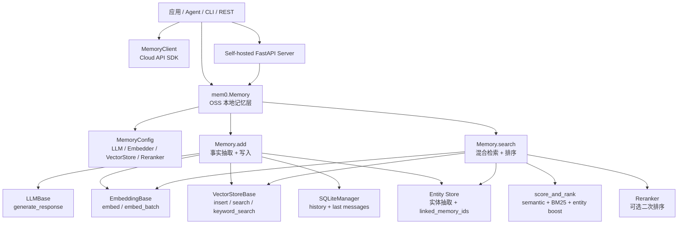
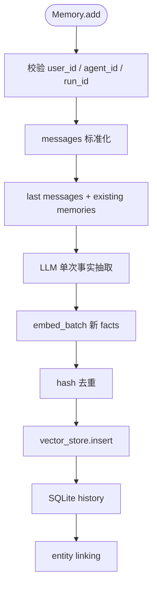
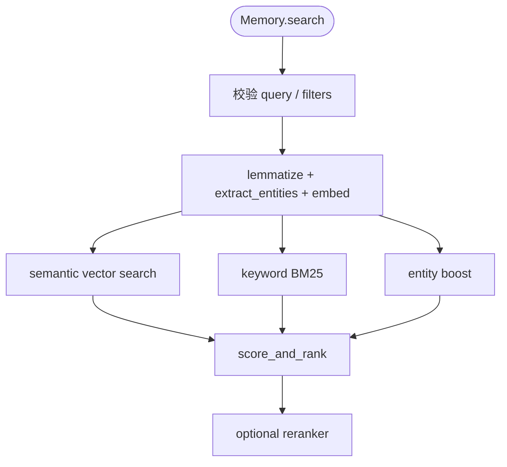

# mem0 源码架构精读

分析对象：`sources/mem0`，固定源码提交 `cd79fa8914b5b1cf66daacc957d826065df57df8`。

本文参考 AutoGen 精读方式，但 mem0 的核心不在 Agent 协作运行时，而在“长期记忆层”：如何从对话中抽取事实，如何写入向量存储，如何用语义、关键词、实体和 reranker 找回相关记忆。

## 1. 总体结论

mem0 是一个面向 AI 应用和 Agent 的长期记忆框架。它的主线是：

- **Memory Core**：`Memory.add/search/update/delete`，负责记忆生命周期。
- **Provider Abstraction**：LLM、Embedding、VectorStore、Reranker 都通过抽象基类和 Factory 接入。
- **Storage / Retrieval**：向量库保存 memory，SQLite 保存 history 和最近消息，entity store 负责实体链接增强。
- **Product Entrypoints**：Python library、Cloud `MemoryClient`、Self-hosted FastAPI server、CLI、Vercel AI SDK integration。

分享口径：

> AutoGen 解决“多个 Agent 怎么协作”，mem0 解决“Agent 和应用应该记住什么、怎么检索回来”。

## 2. 最高层架构

| 层级 | 源码位置 | 精读重点 |
| --- | --- | --- |
| Memory Core | `mem0/memory/main.py` | `Memory.add`、`_add_to_vector_store`、`Memory.search`、`_search_vector_store` |
| Config / Factory | `mem0/configs`、`mem0/utils/factory.py` | 通过 `MemoryConfig` 和 Factory 装配 provider |
| LLM / Embedding | `mem0/llms`、`mem0/embeddings` | LLM 事实抽取、embedding 写入/搜索/update |
| Vector Store / Reranker | `mem0/vector_stores`、`mem0/reranker` | 向量检索、keyword search、可选 rerank |
| Entity / Scoring | `mem0/utils/entity_extraction.py`、`mem0/utils/scoring.py` | 实体抽取、实体增强、混合评分 |
| Product Entrypoints | `server`、`mem0/client`、`cli`、`integrations` | REST、自托管、Cloud SDK、命令行和前端生态 |

架构图见：[architecture.mmd](architecture.mmd)。



## 3. 源码精读一：Memory 初始化和装配

`Memory` 是组合器。它不直接绑定某个模型或向量库，而是从 `MemoryConfig` 读取 provider，然后通过 Factory 创建实例。

源码证据：

- `mem0/memory/main.py:444` 定义 `class Memory(MemoryBase)`。
- `mem0/memory/main.py:445-489` 初始化 embedder、vector_store、llm、SQLite history、collection、reranker。
- `mem0/configs/base.py:29` 定义 `MemoryConfig`。
- `mem0/utils/factory.py` 定义 `LlmFactory`、`EmbedderFactory`、`VectorStoreFactory`、`RerankerFactory`。
- `mem0/__init__.py:6` 导出 `AsyncMemory` 和 `Memory`。

关键片段：

```python
class Memory(MemoryBase):
    def __init__(self, config: MemoryConfig = MemoryConfig()):
        self.embedding_model = EmbedderFactory.create(...)
        self.vector_store = VectorStoreFactory.create(...)
        self.llm = LlmFactory.create(...)
        self.db = SQLiteManager(...)
```

设计含义：这是典型 Ports and Adapters。Memory core 只依赖 LLM、Embedding、VectorStore、Reranker 的抽象协议，具体 OpenAI、Qdrant、PGVector、Cohere 等通过 Factory 接入。

## 4. 源码精读二：Memory.add 写入流程

`Memory.add` 是 mem0 最核心的写入路径。新版 README 提到的 ADD-only extraction，在源码里对应 `_add_to_vector_store()` 的 phased batch pipeline。

主线：

```text
Memory.add
  -> 校验 user_id / agent_id / run_id
  -> 标准化 messages
  -> _add_to_vector_store
  -> 读取 last messages + 检索 existing memories
  -> LLM 单次抽取 facts
  -> embed_batch
  -> hash 去重
  -> vector_store.insert
  -> SQLite history
  -> entity linking
```

源码证据：

- `mem0/memory/main.py:717` 定义 `Memory.add()`。
- `mem0/memory/main.py:759-776` 校验并构造 metadata/filters。
- `mem0/memory/main.py:789-807` 标准化 messages。
- `mem0/memory/main.py:831` 定义 `_add_to_vector_store()`。
- `mem0/memory/main.py:870-885` 查询最近消息和已有 memory。
- `mem0/memory/main.py:895-907` 生成 additive extraction prompt 并调用 LLM。
- `mem0/memory/main.py:932-944` 批量 embedding 抽取出的 facts。
- `mem0/memory/main.py:947-981` hash 去重并组装 payload。
- `mem0/memory/main.py:991-999` 批量写入 vector store。
- `mem0/memory/main.py:1012-1028` 批量写 history。
- `mem0/memory/main.py:1031-1145` 批量实体抽取和 entity store 链接。
- `mem0/configs/prompts.py:468` 定义 `ADDITIVE_EXTRACTION_PROMPT`。
- `mem0/configs/prompts.py:1016` 定义 `generate_additive_extraction_prompt()`。

流程图见：[add-flow.mmd](add-flow.mmd)。



设计含义：mem0 的写入不是简单“把文本 embed 后存起来”。它先让 LLM 抽取可长期保存的事实，再做去重、历史记录、实体链接。这让 memory 更像知识沉淀层，而不是普通聊天日志。

## 5. 源码精读三：Memory.search 混合检索

`Memory.search` 是读取主路径。它先校验作用域，再进入 `_search_vector_store()`。检索不是单纯 vector search，而是 semantic + BM25 keyword + entity boost 的融合。

主线：

```text
Memory.search
  -> 校验 query / filters / top_k / threshold
  -> 处理高级 metadata filters
  -> lemmatize query + extract entities
  -> embedding semantic search
  -> keyword_search 取 BM25 分
  -> entity store 计算 entity_boost
  -> score_and_rank
  -> 可选 reranker
```

源码证据：

- `mem0/memory/main.py:1331` 定义 `Memory.search()`。
- `mem0/memory/main.py:1413-1431` 校验 filters，要求至少有 `user_id`、`agent_id`、`run_id` 之一。
- `mem0/memory/main.py:1438-1454` 处理高级 metadata filters。
- `mem0/memory/main.py:1456-1465` 调 `_search_vector_store()`。
- `mem0/memory/main.py:1469-1474` 可选 reranker。
- `mem0/memory/main.py:1580` 定义 `_search_vector_store()`。
- `mem0/memory/main.py:1586-1600` lemmatize query、extract entities、生成 query embedding。
- `mem0/memory/main.py:1602-1612` semantic search 和 keyword search。
- `mem0/memory/main.py:1622-1624` 计算 entity boosts。
- `mem0/memory/main.py:1638-1645` 调 `score_and_rank()`。
- `mem0/utils/scoring.py:60` 定义 `score_and_rank()`。

流程图见：[search-flow.mmd](search-flow.mmd)。



设计含义：长期记忆检索比普通 RAG 更强调“人和事的一致性”。semantic 负责语义召回，BM25 负责精确关键词，entity boost 负责实体关联，reranker 负责最后排序增强。

## 6. 源码精读四：Entity linking 和二级向量集合

mem0 维护一个 entity store。写入 memory 时抽取实体，把实体和 memory_id 建立链接；查询时抽取 query entities，搜索 entity store，再给 linked memories 加分。

源码证据：

- `mem0/utils/entity_extraction.py:751` 定义 `extract_entities()`。
- `mem0/utils/entity_extraction.py:761` 定义 `extract_entities_batch()`。
- `mem0/memory/main.py:540` 规范化 entity text。
- `mem0/memory/main.py:562` 定义 `_upsert_entity()`。
- `mem0/memory/main.py:664` 定义 `_link_entities_for_memory()`。
- `mem0/memory/main.py:1685` 定义 `_compute_entity_boosts()`。
- `mem0/utils/scoring.py:57` 定义 `ENTITY_BOOST_WEIGHT = 0.5`。

关键片段：

```python
ENTITY_BOOST_WEIGHT = 0.5

def score_and_rank(...):
    raw_combined = semantic_score + bm25_score + entity_boost
```

设计含义：实体不是直接替代向量检索，而是作为 boost 信号参与最终排序。这是更稳的方式：语义仍是召回主线，实体负责把“同一个人/地点/主题”的记忆推上来。

## 7. 源码精读五：产品入口

mem0 同时提供本地库、Cloud SDK、自托管 REST 和 CLI。

源码证据：

- `mem0/client/main.py:71` 定义 `MemoryClient`。
- `mem0/client/main.py:173` 定义 Cloud SDK 的 `add()`。
- `mem0/client/main.py:289` 定义 Cloud SDK 的 `search()`。
- `mem0/client/main.py:964` 定义 `AsyncMemoryClient`。
- `server/main.py:366` 定义自托管 `/memories` 创建接口。
- `server/main.py:451` 定义自托管 `/search` 检索接口。
- `server/main.py:321-331` 定义配置查询和配置更新接口。

设计含义：`mem0.Memory` 是 OSS 内核，`server` 把它包成 REST，`MemoryClient` 面向 Cloud API，CLI 和 integrations 是使用层。分析源码时应先看 Memory core，再看产品入口。

## 8. 核心设计思想和范式

| 设计思想 | 源码证据 | 解释 |
| --- | --- | --- |
| Memory Layer 优先 | `Memory.add/search` | 框架核心是记忆生命周期，不是 Agent 流程编排 |
| Pipeline 架构 | `_add_to_vector_store`、`_search_vector_store` | 写入和检索拆成阶段，便于优化和替换 |
| Ports and Adapters | `LLMBase`、`EmbeddingBase`、`VectorStoreBase` | Core 依赖抽象端口，provider 是适配器 |
| Factory Method | `LlmFactory`、`EmbedderFactory`、`VectorStoreFactory` | 通过 provider name 动态创建实现 |
| Hybrid Retrieval | `score_and_rank` | semantic、BM25、entity boost 融合 |
| Session-scoped Memory | `_build_filters_and_metadata` | user/agent/run 作用域隔离，避免记忆串线 |
| Audit Trail | `SQLiteManager.add_history/batch_add_history` | 写入、更新、删除有历史记录 |

## 9. 应用场景和框架对比

mem0 更适合：

- **个性化 AI 助手**：记住用户偏好、长期目标、习惯。
- **客服和销售助手**：记住历史问题、客户背景、沟通偏好。
- **Agent 长期任务**：跨 session 保留任务上下文和执行偏好。
- **学习 / 健康 / 生产力应用**：长期积累用户状态和进展。
- **已有 Agent 框架补能力**：给 LangGraph、AutoGen、CrewAI、LangChain 应用补长期记忆层。

| 维度 | mem0 | AutoGen | LangGraph | LangChain |
| --- | --- | --- | --- | --- |
| 核心定位 | 长期记忆层 | 多 Agent 消息运行时 | 状态图 Agent Runtime | LLM 应用组件库 |
| 主流程 | add/search memory | send/publish + Team chat | node/edge/checkpoint | runnable/tool/retriever |
| 状态模型 | user/agent/run scoped memories | Agent/Team runtime state | 显式全局 state | 组件自带状态或外部状态 |
| 适用场景 | 个性化、偏好、长期上下文 | 多 Agent 对话协作 | 可恢复、可审计复杂流程 | RAG、工具调用、集成组合 |
| 选型判断 | 问“要记住什么” | 问“谁和谁协作” | 问“状态怎么流转” | 问“LLM 组件怎么搭” |

## 10. 分享建议

建议分享顺序：

1. 先讲定位：mem0 是 memory layer，不是 Agent 编排框架。
2. 再讲架构：Memory core、provider 抽象、存储检索、产品入口。
3. 精读写入：`Memory.add -> _add_to_vector_store -> LLM extraction -> vector insert -> entity linking`。
4. 精读检索：`Memory.search -> _search_vector_store -> semantic/BM25/entity -> score_and_rank`。
5. 最后讲设计范式和框架对比。

收束口：

> mem0 源码最值得看的不是某个 provider，而是它如何把“长期记忆”拆成事实抽取、向量写入、历史记录、实体链接、混合检索和可选 rerank。读懂 `Memory.add` 和 `Memory.search` 两条主线，就读懂了 mem0 的核心设计。
