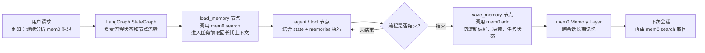

# mem0 源码分享讲稿

这份讲稿用于分享 `mem0ai/mem0` 源码。建议按“项目定位 -> 四层架构 -> add 写入精读 -> search 检索精读 -> 抽象边界 -> 和 AutoGen/LangGraph 对比”的顺序讲。

## 1. 开场定位

可以这样开场：

> mem0 不是 Agent 编排框架，而是给 AI 应用和 Agent 提供长期记忆层。它的主线不是“谁来发言”，而是“如何从对话里抽取事实、存成可检索记忆，并在后续查询里用语义、关键词、实体等多信号找回来”。

## 2. 目录怎么讲

| 目录 | 分享口径 | 精读入口 |
| --- | --- | --- |
| `mem0/memory` | OSS 本地记忆核心 | `main.py`、`storage.py`、`base.py` |
| `mem0/llms` | LLM provider 抽象和实现 | `base.py`、`openai.py`、`*_structured.py` |
| `mem0/embeddings` | embedding provider 抽象和实现 | `base.py`、`openai.py`、`huggingface.py` |
| `mem0/vector_stores` | 向量库适配层 | `base.py`、`qdrant.py`、`pgvector.py` 等 |
| `mem0/reranker` | 可选 rerank 层 | `base.py`、`llm_reranker.py` 等 |
| `server` / `client` / `cli` | 产品入口 | FastAPI 自托管、Cloud SDK、命令行 |

## 3. 主流程一句话

```text
Memory.add:
messages -> LLM 单次事实抽取 -> embed_batch -> vector_store.insert -> history/entity linking

Memory.search:
query -> embedding semantic search + keyword BM25 + entity boost -> score_and_rank -> optional reranker

产品入口:
Library Memory / FastAPI Server / MemoryClient Cloud SDK / CLI
```

## 4. 源码精读口径

### 4.0 图怎么讲，为什么这么设计

架构图不要只按节点念一遍。推荐这样讲：

> 先看入口：应用、Agent、CLI、REST 都可以用 mem0。再看核心：这些入口最终都会落到 Memory core。Memory core 不是模型调用器，而是长期记忆编排器，负责把 add 写入和 search 检索两条链路组织起来。底部的 LLM、Embedding、VectorStore、Reranker 是可替换 provider，所以源码用 Factory 和抽象基类隔离它们。

add 图可以这样讲：

> 这条链路回答“什么内容值得长期保存”。mem0 不直接存聊天原文，而是先结合最近消息和已有记忆，让 LLM 抽取事实，再做 embedding、hash 去重、vector insert、history 和 entity linking。这样做是为了把聊天噪音变成稳定 facts。

search 图可以这样讲：

> 这条链路回答“如何把长期记忆找回来”。mem0 不只做向量检索，而是融合 semantic、BM25 keyword、entity boost。原因是长期记忆里具体的人、地点、项目、偏好很重要，只靠 embedding 可能语义相近但实体不准。

如果听众只看图，不看讲稿，也应该能读出“为什么这么干”。所以图里的节点建议按“动作 + 目的”讲，例如：

- `Memory.add`：不是“保存消息”，而是“把对话提炼成长期 facts”。
- `LLM 事实抽取`：目的不是炫技，而是过滤聊天噪音。
- `hash 去重`：目的不是优化性能，而是避免重复 facts 污染长期记忆。
- `score_and_rank`：目的不是简单排序，而是融合 semantic、BM25、entity 三类信号。
- `optional reranker`：目的不是默认加复杂度，而是在高质量排序场景里用额外成本换精度。

### 4.1 Memory 初始化

证据链：

- `mem0/memory/main.py:444` 定义 `class Memory`。
- `mem0/memory/main.py:445-489` 初始化 embedder、vector_store、llm、SQLite history、reranker。
- `mem0/configs/base.py:29` 定义 `MemoryConfig`。
- `mem0/utils/factory.py` 定义 `LlmFactory`、`EmbedderFactory`、`VectorStoreFactory`、`RerankerFactory`。

讲法：

> Memory 是组合器。它不自己实现模型、向量库和 rerank，而是通过配置和 Factory 创建 provider，然后把这些能力组织成 add/search 两条主流程。

### 4.2 add 写入流程

证据链：

- `mem0/memory/main.py:717` 定义 `Memory.add()`。
- `mem0/memory/main.py:831` 进入 `_add_to_vector_store()`。
- `mem0/memory/main.py:870-885` 查询已有 memory，给 LLM 抽取提供上下文。
- `mem0/memory/main.py:895-907` 组装 additive extraction prompt 并调用 LLM。
- `mem0/memory/main.py:932-944` 批量 embedding 新事实。
- `mem0/memory/main.py:947-981` hash 去重并组装 payload。
- `mem0/memory/main.py:991-999` 批量写入 vector store。
- `mem0/memory/main.py:1012-1028` 写 history。
- `mem0/memory/main.py:1031-1145` 批量实体抽取和 entity store 链接。

讲法：

> 新版 mem0 是 ADD-only 事实抽取：LLM 一次性抽出应该新增的 facts，然后用 embedding 批量写入向量库。它不在主流程里让 LLM 决定 UPDATE/DELETE，而是通过 hash、上下文检索和实体链接减少重复，提高检索质量。

### 4.3 search 检索流程

证据链：

- `mem0/memory/main.py:1331` 定义 `Memory.search()`。
- `mem0/memory/main.py:1413-1431` 校验 filters 和参数，要求至少有 `user_id`、`agent_id`、`run_id` 之一。
- `mem0/memory/main.py:1456-1465` 调 `_search_vector_store()`。
- `mem0/memory/main.py:1580` 定义 `_search_vector_store()`。
- `mem0/memory/main.py:1586-1600` lemmatize query、extract entities、生成 query embedding。
- `mem0/memory/main.py:1602-1612` semantic search 和 keyword search。
- `mem0/memory/main.py:1622-1624` 计算 entity boost。
- `mem0/memory/main.py:1638-1645` 调 `score_and_rank()`。
- `mem0/utils/scoring.py:60` 定义 `score_and_rank()`。

讲法：

> mem0 的 search 不是单纯向量相似度。它先用向量库召回语义候选，再叠加 BM25 keyword 分数和实体链接增强，最后可选 reranker。这个设计服务于“长期记忆”：同义表达、关键词精确匹配、实体一致性都要兼顾。

### 4.4 Entity linking

证据链：

- `mem0/utils/entity_extraction.py:751` 定义 `extract_entities()`。
- `mem0/utils/entity_extraction.py:761` 定义 `extract_entities_batch()`。
- `mem0/memory/main.py:562` 定义 `_upsert_entity()`。
- `mem0/memory/main.py:664` 定义 `_link_entities_for_memory()`。
- `mem0/memory/main.py:1685` 定义 `_compute_entity_boosts()`。

讲法：

> Entity store 是第二个向量集合，用实体文本关联 memory_id。写入时把 facts 中的实体抽出来，检索时从 query 抽实体并查 entity store，找到相关实体后给 linked memories 加分。

## 5. 设计思想怎么讲

| 设计思想 | 源码证据 | 一句话解释 |
| --- | --- | --- |
| Memory Layer 优先 | `Memory.add/search` | 框架核心是记忆写入和检索，不是 Agent 编排 |
| Pipeline 架构 | `_add_to_vector_store`、`_search_vector_store` | 写入和检索都被拆成稳定阶段 |
| Ports and Adapters | `LLMBase`、`EmbeddingBase`、`VectorStoreBase` | Core 依赖抽象，provider 通过 Factory 接入 |
| Hybrid Retrieval | `score_and_rank` | semantic、BM25、entity boost 多信号融合 |
| Session-scoped Memory | `_build_filters_and_metadata` | 记忆必须按 user/agent/run 作用域隔离 |
| History / Audit | `SQLiteManager` | 写入、更新、删除都有 history 记录 |

## 6. 和 AutoGen / LangGraph 对比

| 维度 | mem0 | AutoGen | LangGraph |
| --- | --- | --- | --- |
| 核心定位 | 长期记忆层 | 多 Agent 消息运行时 | 状态图 Agent Runtime |
| 主流程 | add/search memory | send/publish + Team chat | node/edge/checkpoint |
| 状态模型 | user/agent/run scoped memories | Agent/Team runtime state | 显式全局 state |
| 适用场景 | 个性化助手、客服历史、偏好记忆、长期上下文 | 多 Agent 对话协作 | 可恢复、可审计、复杂分支流程 |
| 工程价值 | 给任何 Agent/App 补长期记忆 | 学 actor/message multi-agent | 学状态机式 Agent 工作流 |

一句话选型：

> 如果问题是“Agent 要记住什么”，看 mem0；如果问题是“多个 Agent 怎么协作”，看 AutoGen；如果问题是“流程状态怎么可控流转”，看 LangGraph。

## 7. 真实例子怎么讲

可以用一个非常贴近源码分享的例子：

> 用户说：“以后帮我分析源码时，尽量用中文说明，先讲架构再讲主流程。我最近在准备 mem0 和 LangGraph 的源码分享。”

讲解顺序：

1. 如果直接存原文，会把临时表达、语气词、上下文噪音一起存进去。
2. mem0 的 `Memory.add` 会让 LLM 抽取长期 facts。
3. 这句话可能被抽成三条 memory：
   - 用户偏好用中文解释源码。
   - 用户偏好源码分享先讲架构，再讲主流程。
   - 用户正在准备 mem0 和 LangGraph 的源码分享。
4. 后续用户问“我上次准备的框架分享讲到哪了？”，`Memory.search` 会用 semantic、BM25、entity boost 找回相关 memory。

这一段的作用是把源码链路讲活：听众会明白 mem0 不是保存聊天记录，而是把聊天里的长期事实变成可检索状态。

## 8. 局限性和使用边界

这部分建议主动讲，不要等听众问。可以这样说：

> 长期记忆不是“把所有聊天都存进去”。它是一层状态系统，所以要考虑质量、隐私、隔离和过期。

重点讲五个边界：

1. LLM 抽取可能误抽或漏抽，所以关键业务记忆要能审计和回滚。
2. 临时上下文、寒暄、敏感信息不应该默认进入长期 memory。
3. 必须按 `user_id`、`agent_id`、`run_id` 做作用域隔离，否则容易记忆串线。
4. 长期 memory 可能包含隐私，需要删除、导出、脱敏和保留周期策略。
5. semantic、BM25、entity、reranker 都有成本，生产落地应按场景逐步开启。

收束句：

> mem0 的价值不是让系统“记得更多”，而是让系统“记得更值得记住的东西”。

## 9. 和 LangGraph 怎么组合

这张组合图可以作为框架串讲的亮点：

Mermaid 源文件：[langgraph-combo.mmd](langgraph-combo.mmd)。



讲法：

> LangGraph 的 state 解决“这次流程怎么走”，mem0 的 memory 解决“下次还要记住什么”。组合时，在图入口先 `mem0.search` 取回长期上下文，在图结束或关键节点后 `mem0.add` 沉淀新的长期 facts。不要把所有 state 都写入 mem0，只保存下次会话仍然有价值的事实。

## 10. 详细演讲结构

不需要强行压缩到 15 分钟，可以按 35 到 60 分钟展开。

### 10.1 为什么需要 mem0

先从问题出发：LLM 本身没有长期记忆，聊天历史又太吵、太长、太贵；普通 RAG 更适合静态文档，不适合持续变化的用户偏好、任务状态、客户历史。mem0 的价值是把这些动态信息沉淀成可检索 memory。

可以举例：

- 用户偏好：“以后代码解释用中文，少讲概念，多讲源码路径。”
- 客服历史：“这个客户上次反馈过登录失败，偏好邮件沟通。”
- Agent 任务：“当前项目在分析 LLM 框架源码，已完成 AutoGen 和 mem0。”

### 10.2 整体架构

这部分慢一点讲图：

1. 入口层：Library、Server、Client、CLI。
2. Memory core：`Memory.add` 和 `Memory.search`。
3. Provider 抽象：LLM、Embedding、VectorStore、Reranker。
4. 辅助存储：SQLite history、entity store。

过渡句：

> 接下来不要继续看目录，我们直接沿两条最重要的源码路径走：写入路径和检索路径。

### 10.3 写入链路精读

讲解顺序：

1. `Memory.add` 负责参数校验和作用域构造。
2. `_build_filters_and_metadata` 要求至少有 `user_id`、`agent_id`、`run_id` 之一，避免记忆串线。
3. `_add_to_vector_store` 读取最近消息和已有 memory。
4. `generate_additive_extraction_prompt` 构造事实抽取 prompt。
5. LLM 返回 JSON memories。
6. `embed_batch` 批量向量化 facts。
7. hash 去重，避免重复写入。
8. `vector_store.insert` 持久化。
9. `SQLiteManager.batch_add_history` 记录审计。
10. `extract_entities_batch` 建立 entity -> memory_id 链接。

为什么这么设计：

> 写入链路的目标不是“保存全部聊天”，而是“提炼长期 facts”。所以它要先抽取，再存储；要先去重，再写入；要写 history，方便审计；要做 entity linking，方便未来检索。

### 10.4 检索链路精读

讲解顺序：

1. `Memory.search` 校验 query、filters、top_k、threshold。
2. `_process_metadata_filters` 支持高级过滤条件。
3. `_search_vector_store` 做 query lemmatize 和 entity extraction。
4. `embedding_model.embed(query, "search")` 生成查询向量。
5. `vector_store.search` 做 semantic over-fetch。
6. `vector_store.keyword_search` 做 BM25 关键词匹配。
7. `_compute_entity_boosts` 根据实体链接给相关 memory 加分。
8. `score_and_rank` 融合 semantic、BM25、entity boost。
9. 可选 reranker 做二次排序。

为什么这么设计：

> 长期记忆检索不是文档 RAG。它经常问“我之前说过什么偏好”“某个客户上次怎么了”“这个项目现在到哪一步了”。这些问题既需要语义，也需要实体和关键词，因此 mem0 采用多信号融合。

### 10.5 设计思想

可以重点展开六个点：

1. Memory Layer 优先：它不是 Agent 框架，而是 Agent 的记忆层。
2. Pipeline 架构：写入和检索都拆成稳定阶段，便于优化。
3. Ports and Adapters：provider 可替换。
4. Factory Method：按配置创建具体实现。
5. Hybrid Retrieval：多信号融合比单向量检索更适合长期记忆。
6. Session-scoped Memory：按 user/agent/run 隔离，避免跨用户污染。

### 10.6 真实例子、边界和其他框架的关系

建议把真实例子放在设计思想之后。因为前面已经讲完 add/search，此时再用一句用户输入串起来，听众更容易理解“为什么要事实抽取、去重、实体增强”。

然后主动讲局限性：

> 这套设计不是免费午餐。事实抽取有误差，长期记忆有隐私和过期问题，混合检索有成本。所以生产落地时，要先选高价值 memory，而不是把所有聊天都存进去。

最后再放到框架关系里收束：

可以这样收束：

> mem0、AutoGen、LangGraph 不是同一类东西。mem0 是记忆层，AutoGen 是多 Agent 消息运行时，LangGraph 是状态图运行时。它们可以组合：LangGraph 负责流程，AutoGen 负责多 Agent 协作，mem0 负责长期记忆。

### 10.7 落地建议

落地时不要一开始就把所有聊天都塞进 mem0。建议先选高价值 memory：

- 用户长期偏好。
- 项目当前状态。
- 客户历史和约束。
- Agent 执行中的关键决策。
- 需要跨 session 保留的信息。

## 11. 收束口

> mem0 源码最值得看的不是某个 provider，而是它如何把“长期记忆”拆成事实抽取、向量写入、历史记录、实体链接、混合检索和可选 rerank。读懂 `Memory.add` 和 `Memory.search` 两条主线，就读懂了 mem0 的核心设计。
