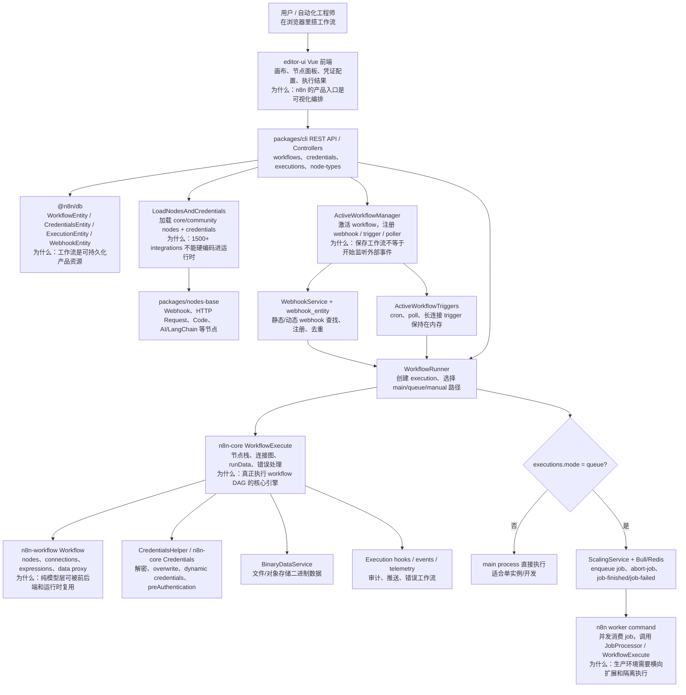
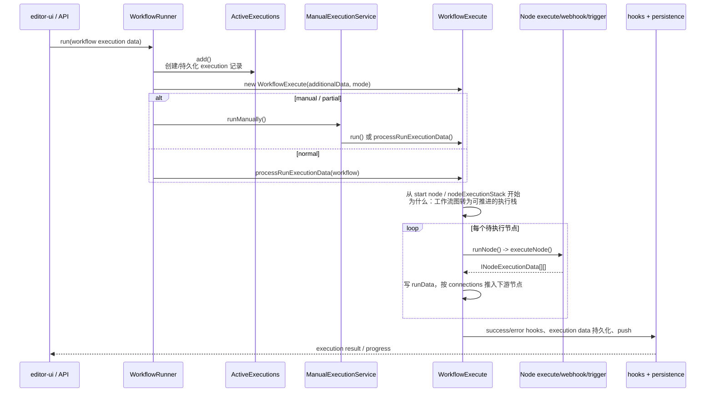
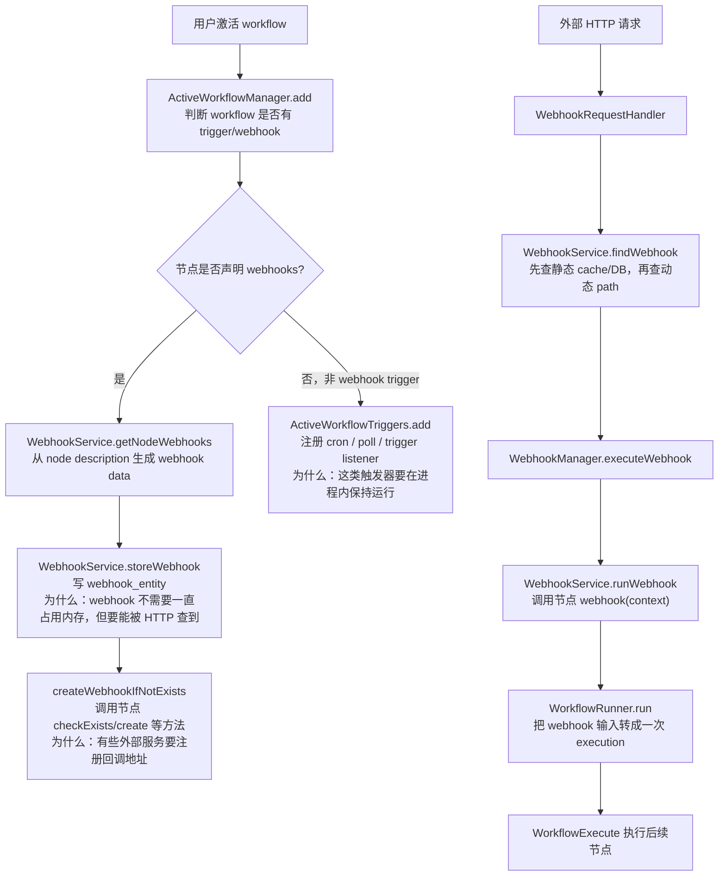
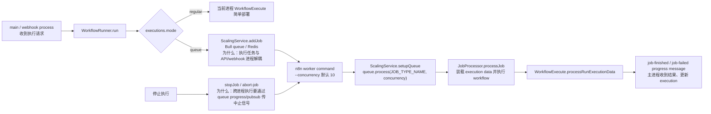
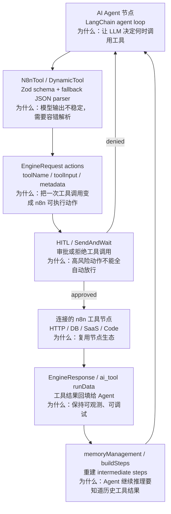
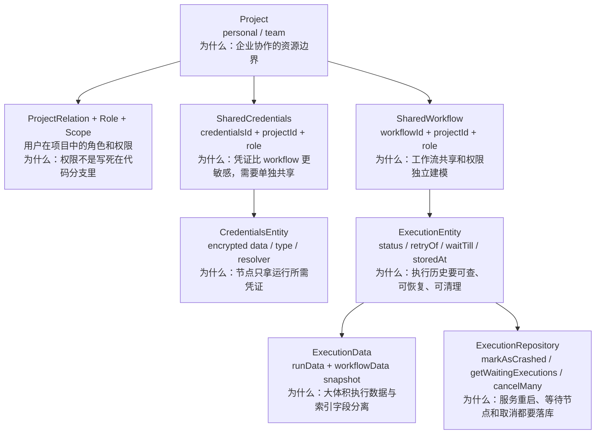
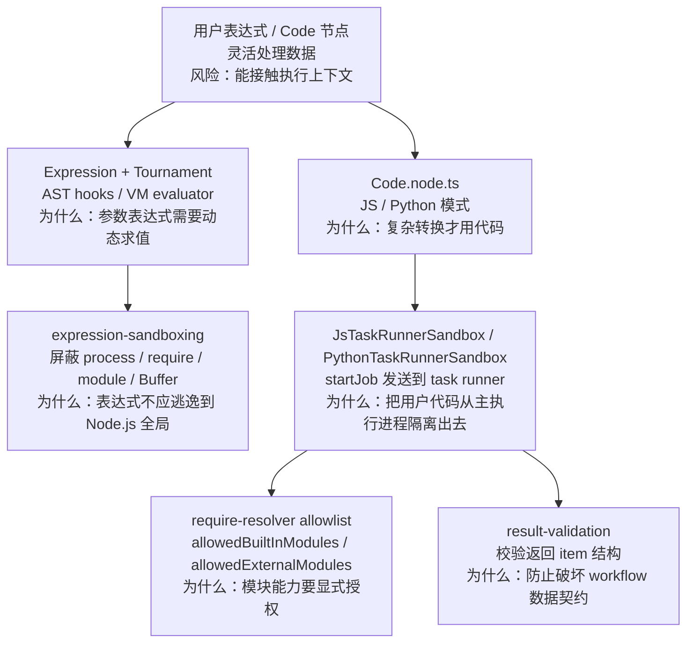

# n8n 源码架构精读

分析对象：`sources/n8n`。源码来自 `n8n-io/n8n`，固定提交为 `b000bbd2773d402ce879434b42a5b9fb8f7f106a`，提交时间 `2026-07-07T07:54:35+00:00`，提交信息为 `feat(editor): Rename private credentials to end-user credentials (#33629)`。根 `package.json` 版本为 `2.30.0`，Node 要求 `>=22.22`，包管理器为 `pnpm@10.32.1`。

> 重要边界：n8n 不是 LangChain/LlamaIndex 这种“LLM 组件库”，它是 **AI agents and workflow automation platform**。读源码时不要只看 AI/LangChain 节点，而要抓住“可视化工作流产品 + 后端执行引擎 + 节点生态 + 凭证/权限/队列/执行历史”的整体架构。

## 1. 总体结论

n8n 的核心是 **可视化工作流运行时平台**：用户在前端画布上编排节点，后端把 workflow JSON 持久化，激活时注册 webhook/trigger/poller，执行时由 `WorkflowRunner` 创建 execution，再由 `WorkflowExecute` 按节点连接图推进每个节点。

一句话分享：

> LangGraph 解决“代码里的状态图怎么可靠运行”，n8n 解决“业务用户和工程师如何在可视化画布上把 SaaS、数据库、HTTP、代码、AI Agent、人工审批和定时/事件触发串成可运维自动化流程”。

最值得精读的主线：

1. Monorepo 分层：`workflow` 是模型和表达式层，`core` 是执行引擎和 node runtime，`cli` 是服务端/API/队列，`nodes-base` 是节点生态，`frontend/editor-ui` 是产品入口。
2. Workflow model：`Workflow` 保存 nodes、connections、expression、data proxy，前后端和执行引擎共享。
3. Node contract：每个节点通过 `INodeTypeDescription` 暴露配置，通过 `execute()`、`webhook()`、`trigger()`、`poll()` 参与运行。
4. Execution engine：`WorkflowExecute.processRunExecutionData()` 是 DAG 执行主循环，`runNode()` 和 `executeNode()` 是节点执行核心。
5. Active workflow：激活 workflow 时注册 webhook、cron、poller、长连接 trigger；保存 workflow 不等于开始监听。
6. Queue mode：`ScalingService` 用 Bull/Redis 把 execution 分发给 worker，支持生产环境横向扩展和中止信号。
7. Credentials / expressions：凭证解密、overwrite、dynamic credentials、表达式 data proxy 是 n8n 低代码体验的基础。

## 2. 最高层架构

架构图见：[architecture.mmd](architecture.mmd)。



读图说明：

- 上层是产品入口：前端画布和 REST API 处理 workflow、credentials、executions、node-types。
- 中层是运行时资源：workflow 存数据库，active workflow 注册外部触发入口，node loader 加载节点和凭证类型。
- 下层是执行引擎：`WorkflowRunner` 管 execution 生命周期，`WorkflowExecute` 真正按连接图跑节点。
- 生产部署时，main/webhook 进程可以只负责 API 和入队，worker 进程负责执行。

源码证据：

| 主题 | 源码位置 | 说明 |
| --- | --- | --- |
| 项目定位 | `sources/n8n/README.md` | README 说明 n8n 是 AI agents and workflow automation platform，连接 1500+ integrations。 |
| Monorepo 包 | `sources/n8n/packages` | 包含 `cli`、`core`、`workflow`、`nodes-base`、`frontend`、`@n8n/*` 等。 |
| 前端入口 | `packages/frontend/editor-ui/src/main.ts:1`、`:42`、`:48` | Vue app 创建并注册 module routes。 |
| Workflow 模型 | `packages/workflow/src/workflow.ts:58` | `Workflow` 类持有 nodes、connections、expression。 |
| 执行引擎 | `packages/core/src/execution-engine/workflow-execute.ts:106` | `WorkflowExecute` 是 workflow 执行主类。 |
| 服务端 runner | `packages/cli/src/workflow-runner.ts:73` | `WorkflowRunner` 管 execution 创建和运行路径。 |
| 节点加载 | `packages/cli/src/load-nodes-and-credentials.ts:42` | `LoadNodesAndCredentials` 加载 nodes 和 credentials。 |

## 3. Monorepo 分层

| 包 / 目录 | 职责 | 分享时怎么讲 |
| --- | --- | --- |
| `packages/workflow` | 纯 workflow 模型、节点接口、表达式、data proxy、错误类型 | “n8n 的协议层和模型层”，前后端都需要理解 workflow JSON。 |
| `packages/core` | 执行引擎、node execution context、credentials、binary data、node loader 基类 | “真正跑节点的 runtime”。 |
| `packages/cli` | REST API、commands、WorkflowRunner、ActiveWorkflowManager、webhooks、queue、credentials service | “n8n server，不只是 CLI”。 |
| `packages/nodes-base` | 官方节点和凭证类型：Webhook、HTTP Request、Code、SaaS 节点、AI 节点 | “节点生态的主体”。 |
| `packages/frontend/editor-ui` | Vue 前端、画布、节点面板、workflow 编辑和执行结果 | “用户真正接触到的低代码产品”。 |
| `packages/@n8n/*` | DB、DI、config、permissions、task runner、rest-api-client 等内部包 | “平台化后的横向基础设施”。 |

设计含义：n8n 不是一个单包库，而是产品型 monorepo。`workflow` 尽量保持可共享模型，`core` 负责执行，`cli` 负责服务端和部署形态，`nodes-base` 承接大量 integration。

## 4. Workflow 模型：工作流是图，不是脚本

`Workflow` 类是理解 n8n 的第一入口。它把 workflow JSON 变成可查询、可改名、可找上下游、可做表达式求值的运行时对象。

源码证据：

- `packages/workflow/src/workflow.ts:58` 定义 `Workflow`。
- `packages/workflow/src/workflow.ts:65-67` 保存 source/destination 两个方向的 connections。
- `packages/workflow/src/workflow.ts:87` 构造函数接收 workflow 参数。
- `packages/workflow/src/workflow.ts:121` 调 `setConnections()`。
- `packages/workflow/src/workflow.ts:133` 创建 `WorkflowExpression`。
- `packages/workflow/src/workflow.ts:300` 定义 `getNode()`。
- `packages/workflow/src/workflow.ts:390` 定义 `renameNode()`，并在 `:421` 更新引用该节点的 expressions。
- `packages/workflow/src/workflow.ts:871` 定义 `getStartNode()`。

设计含义：

| 设计点 | 为什么重要 |
| --- | --- |
| nodes + connections | 可视化画布天然是图结构，不能按线性脚本理解。 |
| connectionsBySource / connectionsByDestination | 执行时既要找下游，也要给表达式和部分执行找上游。 |
| expression 绑定 workflow | 节点参数可以引用其他节点输出，表达式必须知道当前 workflow 上下文。 |
| renameNode 更新表达式 | 低代码产品要求“改节点名不破坏引用”。 |

## 5. Node contract：节点生态为什么能扩展

n8n 的每个节点本质上是一个 TypeScript class。它用 `description` 描述 UI、输入输出、凭证和 webhook；用 `execute()`、`webhook()`、`trigger()`、`poll()` 等方法参与运行。

源码证据：

- `packages/workflow/src/interfaces.ts:2165` 定义 `INodeType`，其中有 `description`、`execute`、`webhook`、`trigger`、`poll` 等能力。
- `packages/workflow/src/interfaces.ts:2705` 定义 `INodeTypeDescription`。
- `packages/workflow/src/interfaces.ts:372` 定义 `ICredentialType`。
- `packages/nodes-base/nodes/Code/Code.node.ts:31` 定义 `Code` 节点，`:192` 定义 `execute()`。
- `packages/nodes-base/nodes/HttpRequest/V3/HttpRequestV3.node.ts:68` 定义 `HttpRequestV3`，`:106` 定义 `execute()`。
- `packages/nodes-base/nodes/Webhook/Webhook.node.ts:42` 定义 `Webhook` 节点，`:216` 定义 `webhook()`。

关键代码片段：

```ts
export interface INodeType {
  description: INodeTypeDescription;
  execute?(this: IExecuteFunctions): Promise<INodeExecutionData[][]>;
  webhook?(this: IWebhookFunctions): Promise<IWebhookResponseData>;
}
```

分享时可以这样说：n8n 的“集成能力”不是在引擎里写一堆 if/else，而是通过统一节点契约把 UI 元数据、凭证需求和运行方法交给 node package。

## 6. 主流程一：一次手动/普通执行

流程图见：[execution-flow.mmd](execution-flow.mmd)。



源码主线：

- `packages/cli/src/workflow-runner.ts:184` 定义 `WorkflowRunner.run()`。
- `packages/cli/src/workflow-runner.ts:236` 调 `activeExecutions.add()` 创建/登记 execution。
- `packages/cli/src/workflow-runner.ts:327` 定义 `runMainProcess()`。
- `packages/cli/src/workflow-runner.ts:424` 调 `workflowExecute.processRunExecutionData(workflow)`。
- `packages/cli/src/workflow-runner.ts:435` 调 `activeExecutions.attachWorkflowExecution()`。
- `packages/cli/src/manual-execution.service.ts:26` 定义 `ManualExecutionService`。
- `packages/cli/src/manual-execution.service.ts:105` 手动执行也可走 `processRunExecutionData()`。
- `packages/core/src/execution-engine/workflow-execute.ts:1575` 定义 `processRunExecutionData()`。
- `packages/core/src/execution-engine/workflow-execute.ts:1300` 定义 `runNode()`。
- `packages/core/src/execution-engine/workflow-execute.ts:1039` 定义 `executeNode()`。
- `packages/core/src/execution-engine/workflow-execute.ts:428` 定义 `addNodeToBeExecuted()`。

设计含义：`WorkflowRunner` 管“这次执行作为产品资源怎么创建、持久化、超时、取消、推送”，`WorkflowExecute` 管“图里的节点怎么按连接推进”。这是产品生命周期和执行算法分离。

## 7. 主流程二：Active workflow 和 Webhook

流程图见：[webhook-flow.mmd](webhook-flow.mmd)。



源码证据：

- `packages/cli/src/active-workflow-manager.ts:67` 定义 `ActiveWorkflowManager`。
- `packages/cli/src/active-workflow-manager.ts:513-526` 注释解释 webhook trigger、poll trigger、active trigger 的区别；webhook 进入 `webhook_entity` 表，非 webhook trigger 保持在内存。
- `packages/cli/src/active-workflow-manager.ts:528` 定义 `add()`。
- `packages/cli/src/active-workflow-manager.ts:623-647` 分别添加 webhooks 和 non-webhook triggers。
- `packages/cli/src/active-workflow-manager.ts:969` 定义 `addNonWebhookTriggers()`。
- `packages/cli/src/webhooks/webhook.service.ts:32` 定义 `WebhookService`。
- `packages/cli/src/webhooks/webhook.service.ts:53-57` 先查静态 webhook，再查动态 webhook。
- `packages/cli/src/webhooks/webhook.service.ts:152-181` `storeWebhook()` 写 DB 并缓存。
- `packages/cli/src/webhooks/webhook.service.ts:255` `getNodeWebhooks()` 根据节点生成 webhook data。

设计含义：n8n 把 webhook trigger 和内存 trigger 区分开，是为了让 HTTP 请求可以通过 DB/cache 找到 workflow，而 cron/poll/长连接这类触发器需要在 leader/main 进程内保持活跃。

## 8. 主流程三：Queue mode 和 Worker

流程图见：[queue-flow.mmd](queue-flow.mmd)。



源码证据：

- `packages/cli/src/commands/worker.ts:37` 定义 `Worker` command。
- `packages/cli/src/commands/worker.ts:28` worker concurrency 默认 10。
- `packages/cli/src/commands/worker.ts:76-77` worker 强制/确认 `executions.mode = queue`。
- `packages/cli/src/commands/worker.ts:184` 调 `scalingService.setupQueue()`。
- `packages/cli/src/scaling/scaling.service.ts:35` 定义 `ScalingService`。
- `packages/cli/src/scaling/scaling.service.ts:56` 定义 `setupQueue()`。
- `packages/cli/src/scaling/scaling.service.ts:67` 创建 Bull queue。
- `packages/cli/src/scaling/scaling.service.ts:111-126` 注册 job processor，消费 job 并调用 `jobProcessor.processJob(job)`。
- `packages/cli/src/scaling/scaling.service.ts:222-246` `addJob()` 入队 execution。
- `packages/cli/src/scaling/scaling.service.ts:259-270` `stopJob()` 通过 `abort-job` 或 remove 停止 job。
- `packages/cli/src/scaling/scaling.service.ts:358-398` main/webhook 进程处理 `job-finished`、`job-failed`。

设计含义：queue mode 不是“多一个 worker 命令”这么简单，而是将 API/webhook 与执行计算解耦。这样 webhook 响应、前端 API、执行任务可以独立扩容，也能在 worker 层控制并发、隔离长任务和处理中止。

## 9. Node 和 Credential 加载

节点生态是 n8n 的护城河，因此源码里专门有 loader 层。

源码证据：

- `packages/cli/src/load-nodes-and-credentials.ts:42` 定义 `LoadNodesAndCredentials`。
- `packages/cli/src/load-nodes-and-credentials.ts:46` 保存 loaded nodes/credentials。
- `packages/cli/src/load-nodes-and-credentials.ts:108-117` 加载自定义目录和 module registry 里的 node loaders。
- `packages/cli/src/load-nodes-and-credentials.ts:169-174` 暴露 `loadedCredentials` 和 `loadedNodes`。
- `packages/cli/src/load-nodes-and-credentials.ts:289` 加载 custom directories。
- `packages/core/src/nodes-loader/directory-loader.ts:106` 定义抽象 `loadAll()`。
- `packages/core/src/nodes-loader/directory-loader.ts:165` `loadNodeFromFile()` 从文件加载 node class。
- `packages/core/src/nodes-loader/package-directory-loader.ts:12` 定义 `PackageDirectoryLoader`。
- `packages/core/src/nodes-loader/package-directory-loader.ts:27-39` 从 package.json 的 `n8n` 字段加载 nodes。

凭证侧：

- `packages/cli/src/credential-types.ts:7` 定义 `CredentialTypes`。
- `packages/cli/src/credentials-helper.ts:85` 定义 `CredentialsHelper`。
- `packages/cli/src/credentials-helper.ts:273-280` 从 DB 取凭证并构造 `Credentials`。
- `packages/cli/src/credentials-helper.ts:449` 定义 `getDecrypted()`。
- `packages/cli/src/credentials-helper.ts:473` 调 `credentials.getData()` 获取解密数据。
- `packages/cli/src/credentials-helper.ts:494-507` 支持 dynamic credentials resolve。
- `packages/cli/src/credentials-helper.ts:548-570` 应用 overwrite 和默认值。

设计含义：节点和凭证不是普通配置文件。节点描述决定前端 UI，节点方法决定运行时行为，凭证类型决定表单、加密、认证和 preAuthentication。loader 把这些统一装配进平台。

## 10. Expression 和 WorkflowDataProxy

n8n 的低代码体验很大一部分来自表达式：用户可以在节点参数里写 `{{$json.foo}}`、引用其他节点输出、读取凭证字段。

源码证据：

- `packages/workflow/src/expression.ts:227` 表达式引擎支持 `legacy` / `vm`。
- `packages/workflow/src/expression.ts:522-607` 解析参数值，如果是表达式则执行。
- `packages/workflow/src/expression.ts:626-647` 渲染表达式，VM 模式走 `Expression.vmEvaluator.evaluate()`。
- `packages/workflow/src/workflow-data-proxy.ts:76` 定义 `WorkflowDataProxy`。
- `packages/workflow/src/workflow-data-proxy.ts:414-446` 获取节点执行或 pinned data。
- `packages/workflow/src/workflow-data-proxy.ts:1544-1556` 暴露 `$evaluateExpression`。

设计含义：表达式让 workflow 从“静态表单配置”变成“可根据上游数据动态变化的自动化程序”。但表达式也带来安全、性能和调试问题，所以源码里有 VM evaluator、sandboxing、错误映射和 data proxy。

## 11. 核心设计思想与范式

| 设计思想 | 源码证据 | 可分享表述 |
| --- | --- | --- |
| Workflow-as-graph | `Workflow`、nodes、connections、start node | n8n 的本体是图，不是线性脚本。 |
| Product resource lifecycle | `WorkflowRunner`、`ActiveExecutions`、execution persistence | 执行是可审计、可取消、可查看历史的产品资源。 |
| Plugin/node contract | `INodeType`、`INodeTypeDescription`、`nodes-base` | 1500+ 集成靠统一节点契约扩展，而不是核心引擎硬编码。 |
| Separation of model and engine | `packages/workflow` vs `packages/core` | workflow 模型和执行引擎分离，前后端可共享模型。 |
| Trigger activation model | `ActiveWorkflowManager`、`WebhookService`、`ActiveWorkflowTriggers` | 保存 workflow 和激活监听是两件事。 |
| Queue-based scaling | `ScalingService`、`Worker`、Bull/Redis | 生产执行要和 API/webhook 解耦，并能横向扩展。 |
| Credential boundary | `CredentialsHelper`、`CredentialTypes`、`Credentials` | 凭证解密、覆写、动态解析集中处理，节点只拿运行所需数据。 |
| Expression data proxy | `WorkflowDataProxy`、`Expression` | 低代码动态参数依赖统一上下文代理和表达式求值。 |

代码片段证据：

```ts
// packages/core/src/execution-engine/workflow-execute.ts
export class WorkflowExecute {
  processRunExecutionData(workflow: Workflow): PCancelable<IRun> {
    Logger.debug('Workflow execution started', { workflowId: workflow.id });
    ...
  }
}
```

```ts
// packages/cli/src/workflow-runner.ts
const executionId = await this.activeExecutions.add(data, restartExecutionId);
...
workflowExecution = workflowExecute.processRunExecutionData(workflow);
this.activeExecutions.attachWorkflowExecution(executionId, workflowExecution);
```

```ts
// packages/cli/src/active-workflow-manager.ts
// A webhook trigger, invoked by an HTTP request.
// A poll trigger, which regularly checks an external service.
// An active trigger, which keeps a listener or persistent connection open.
```

这三段分别证明了执行引擎、execution 生命周期、触发器激活模型三个核心范式。

## 12. 深挖一：AI / LangChain 节点集成

图源码：[`ai-langchain-flow.mmd`](./ai-langchain-flow.mmd)



n8n 的 AI 能力不是把 LangChain 当成一个黑盒，而是把 LangChain 的 tool/agent 概念翻译成 n8n 自己的节点执行模型。核心思路是：Agent 节点负责推理，连接到 Agent 的工具节点仍然是 n8n 节点，工具调用被转换成 `EngineRequest`，执行结果再以 `ai_tool` runData 回填给 Agent。

源码证据：

| 位置 | 说明 |
| --- | --- |
| `packages/@n8n/nodes-langchain/utils/N8nTool.ts:49` | `N8nTool` 继承 LangChain `DynamicStructuredTool`。 |
| `N8nTool.ts:60-92` | 使用 `StructuredOutputParser` + relaxed JSON parse + 单参数兜底，说明模型输出会被容错解析后再进工具函数。 |
| `N8nTool.ts:101-104` | 工具异常会写入 `AiTool` 输入/输出数据，而不是只抛出异常。 |
| `agent-execution/createEngineRequests.ts:25-36` | 从工具 metadata 里提取 HITL 信息，保留 gated tool name 和原始输入。 |
| `agent-execution/executeEngineAction.ts:16-40` | 根据 action metadata 找到连接工具，调用 `tool.invoke()`，再把结果包装成 `ai_tool` 数据。 |
| `agent-execution/processHitlResponses.ts:94-105` | 注释直接描述“Agent 调工具 -> 人审拦截 -> 用户批准 -> gated tool 执行 -> 结果回 Agent”的链路。 |

代码片段证据：

```ts
// packages/@n8n/nodes-langchain/utils/N8nTool.ts
export class N8nTool extends DynamicStructuredTool<ZodObjectAny> {
  asDynamicTool(): DynamicTool {
    const parser = new StructuredOutputParser(schema);
    ...
    parsedQuery = schema.parse(dataFromModel);
    const result = await func(parsedQuery);
    return result;
  }
}
```

```ts
// packages/@n8n/nodes-langchain/utils/agent-execution/executeEngineAction.ts
const tool = tools.find((t) => t.name === action.metadata?.toolName);
const output = await tool.invoke(omit(action.input, 'tool'));
return {
  action,
  data: { executionStatus: 'success', data: { ai_tool: [[{ json: { output } }]] } },
};
```

为什么这么设计：

- 复用 n8n 节点生态：Agent 的 tool 可以是 HTTP、数据库、SaaS、Code、MCP 等节点，不需要为 AI 重写一套 integration。
- 保留产品可观测性：工具调用仍然进入 execution/runData，用户能在 UI 里看到调用输入、输出和错误。
- 加入人审边界：HITL 不是外部补丁，而是 agent-execution 工具链的一部分，适合审批发邮件、改 CRM、退款、下单这类高风险动作。
- 兼容不同模型供应商：`buildSteps.ts` 和 `createEngineRequests.ts` 里处理 Gemini thought signatures、Anthropic thinking blocks，说明 n8n 在适配供应商差异。

分享时可以这样讲：n8n 的 AI Agent 节点不是要替代 LangGraph，而是把 LangChain tool calling 放进“可视化、可审批、可观测”的工作流产品里。

## 13. 深挖二：数据库模型、权限和凭证隔离

图源码：[`db-permission-execution-flow.mmd`](./db-permission-execution-flow.mmd)



n8n 的数据模型体现了一个产品化平台的核心设计：workflow、credential、execution 都不是临时对象，而是带权限、历史、审计和生命周期的资源。

源码证据：

| 位置 | 说明 |
| --- | --- |
| `packages/@n8n/db/src/entities/project.ts:20-44` | `Project` 持有 `projectRelations`、`sharedCredentials`、`sharedWorkflows`。 |
| `shared-workflow.ts:8-23` | `SharedWorkflow` 用 `workflowId + projectId + role` 表达工作流共享。 |
| `shared-credentials.ts:8-23` | `SharedCredentials` 用 `credentialsId + projectId + role` 单独表达凭证共享。 |
| `credentials-entity.ts:17-19` | 凭证 `data` 是 text 字段，运行时由凭证 helper 解密。 |
| `credentials-entity.ts:31-62` | managed/global/resolvable/resolverId 说明凭证支持平台托管和动态解析。 |
| `role.ts:42-65` | `Role` 有 `roleType`，并通过 `role_scope` 关联 `Scope`。 |
| `execution-entity.ts:25-33` | execution 建了 workflow/status/waitTill 等索引，服务执行历史列表和恢复查询。 |
| `execution-entity.ts:50-89` | status、retry、waitTill、storedAt 是执行生命周期核心字段。 |
| `execution-data.ts:9-31` | runData 和 workflowData snapshot 被拆到 `ExecutionData`，避免主 execution 表过重。 |

代码片段证据：

```ts
// packages/@n8n/db/src/entities/shared-credentials.ts
export class SharedCredentials extends WithTimestamps {
  @Column({ type: 'varchar' })
  role: CredentialSharingRole;
  @PrimaryColumn()
  credentialsId: string;
  @PrimaryColumn()
  projectId: string;
}
```

```ts
// packages/@n8n/db/src/entities/execution-entity.ts
@Index(['workflowId', 'status', 'id'], { where: '"deletedAt" IS NULL' })
export class ExecutionEntity {
  retryOf: string;
  retrySuccessId: string;
  status: ExecutionStatus;
  waitTill: Date | null;
  storedAt: ExecutionDataStorageLocation;
}
```

为什么这么设计：

- Workflow 和 credential 分开共享：一个团队能编辑 workflow，不代表它应该看到或复用所有凭证。
- 权限通过 Role/Scope 建模：角色和 scope 是数据，不是散落在业务代码里的硬编码判断，更适合企业版和项目协作。
- Execution 表轻、ExecutionData 表重：列表查询只需要状态、时间、workflowId；调试时才加载大体积 runData。
- `storedAt` 支持 db/fs/s3/az：执行数据可能非常大，源码已经把存储位置抽象出来，方便自托管扩容。

## 14. 深挖三：表达式 / Code 节点安全边界

图源码：[`security-boundary-flow.mmd`](./security-boundary-flow.mmd)



表达式和 Code 节点是 n8n 低代码体验的“开口”：它们让用户从表单配置进入动态程序能力。源码里对这个开口做了多层边界。

源码证据：

| 位置 | 说明 |
| --- | --- |
| `packages/workflow/src/expression-sandboxing.ts:78-83` | 构造空的 `process/require/module/Buffer` 上下文。 |
| `expression-sandboxing.ts:132` | 明确把 `process/global/globalThis/Buffer` 作为 spread 风险对象。 |
| `expression-sandboxing.ts:236-299` | 校验 `$` 只能作为函数调用或合法属性访问，避免把内部函数对象暴露出去。 |
| `expression-sandboxing.ts:312-354` | 对 `{...process}` 这类 spread 场景生成安全 AST，阻止访问真实全局对象。 |
| `packages/@n8n/tournament/src/index.ts:13-40` | `Tournament` 负责把表达式转换并交给 evaluator 执行。 |
| `packages/nodes-base/nodes/Code/Code.node.ts:31-48` | Code 节点声明自己运行在 sandbox，并提示不要用它做 HTTP 请求。 |
| `Code.node.ts:211-230` | JS 走 `JsTaskRunnerSandbox`，Python 走 `PythonTaskRunnerSandbox`。 |
| `JsTaskRunnerSandbox.ts:30-43` | JS 代码通过 `startJob('javascript', ...)` 发给 task runner。 |
| `require-resolver.ts:22-40` | require 只允许 allowlist 里的内置/外部模块。 |

代码片段证据：

```ts
// packages/workflow/src/expression-sandboxing.ts
const EMPTY_CONTEXT = b.objectExpression([
  b.property('init', b.identifier('process'), b.objectExpression([])),
  b.property('init', b.identifier('require'), b.objectExpression([])),
  b.property('init', b.identifier('module'), b.objectExpression([])),
  b.property('init', b.identifier('Buffer'), b.objectExpression([])),
]);
```

```ts
// packages/@n8n/task-runner/src/js-task-runner/require-resolver.ts
const isAllowed = isBuiltin(request)
  ? checkIsAllowed(allowedBuiltInModules, request)
  : checkIsAllowed(allowedExternalModules, request);
if (!isAllowed) throw new ExecutionError(new DisallowedModuleError(request));
```

为什么这么设计：

- 表达式是参数级动态能力，应该轻量、可控、围绕 workflow data proxy，而不是打开完整 Node.js 环境。
- Code 节点能力更强，所以通过 task runner 执行，并对模块加载、返回结构、运行模式做约束。
- UI 上也在引导用户“Code 是最后手段”：复杂算法才用 Code，HTTP/API 调用应走 HTTP Request 节点，这样凭证、重试、错误展示和审计都更统一。

## 15. 深挖四：执行历史、错误恢复和可观测性

执行历史是 n8n 和纯 SDK 最大的产品差异之一。n8n 不只是“跑完一个函数”，而是把每次运行变成可查询、可取消、可重试、可恢复、可展示的 execution 资源。

源码证据：

| 位置 | 说明 |
| --- | --- |
| `packages/cli/src/workflow-runner.ts:235-386` | 创建 execution 后，构造 `Workflow` 和 additionalData，并调用 `executionRepository.setRunning()`。 |
| `workflow-runner.ts:419-435` | 有历史 payload 时走 `WorkflowExecute.processRunExecutionData()`，再 attach 到 active executions。 |
| `workflow-runner.ts:461-479` | 成功时 finalize execution；异常时进入 `processError()`。 |
| `workflow-runner.ts:610-653` | queue worker 完成后，main 可按需要回读完整 execution data，再 finalize。 |
| `execution.repository.ts:353-374` | `markAsCrashed()` 只把仍处于可崩溃状态的执行标为 crashed，避免覆盖 waiting/terminal 状态。 |
| `execution.repository.ts:376-392` | `setRunning()` 保留 resumed execution 的原始 startedAt。 |
| `execution.repository.ts:408-456` | `updateExistingExecution()` 在事务里同时更新 execution 索引字段和 `ExecutionData`。 |
| `execution.repository.ts:611-632` | `getWaitingExecutions()` 查找 70 秒内需要恢复的 waiting execution。 |
| `execution.repository.ts:709-726` | `stopBeforeRun()` 和 `cancelMany()` 统一把状态写成 canceled 并清空 waitTill。 |

代码片段证据：

```ts
// packages/@n8n/db/src/repositories/execution.repository.ts
await this.update(
  { id: In(batch), status: In(CRASHABLE_EXECUTION_STATUSES) },
  { status: 'crashed', stoppedAt: new Date(), waitTill: null },
);
```

```ts
// packages/@n8n/db/src/repositories/execution.repository.ts
const where: FindOptionsWhere<ExecutionEntity> = {
  waitTill: LessThanOrEqual(waitTill),
  status: 'waiting',
};
```

为什么这么设计：

- 运行状态必须落库：否则服务重启后无法判断哪些执行正在跑、哪些在等待、哪些需要标记 crashed。
- waiting execution 单独按 `waitTill` 查询：Wait 节点、人审等待、延迟恢复都需要可调度。
- active executions 是内存态，ExecutionEntity 是事实态：内存负责当前进程控制，DB 负责历史、恢复和跨进程协作。
- queue mode 里 main 可以只拿轻量 job summary，也可以按 response mode/hook 需要回读完整数据，减少 DB 压力。

## 16. 真实例子：客户工单 AI 自动分流

假设团队要做一个“客户工单 AI 自动分流”流程：

1. Webhook 接收客服系统的新工单。
2. HTTP Request 拉取客户历史订单。
3. AI 节点总结问题类型和紧急程度。
4. IF/Switch 节点按规则分支。
5. Slack/Email 通知负责人。
6. Code 节点做自定义字段清洗。
7. 如果 AI 置信度低，走人工审批。

在 n8n 源码里，这个流程会这样落地：

- 前端 `editor-ui` 把画布上的节点和连接保存成 workflow JSON。
- workflow 里的 Webhook 节点在激活时被 `ActiveWorkflowManager.add()` 发现。
- `WebhookService.storeWebhook()` 把 path/method 写入 `webhook_entity`，外部请求到来时可以查到它。
- 请求进入 `WebhookRequestHandler` 后，webhook node 的 `webhook(context)` 返回初始数据。
- `WorkflowRunner.run()` 创建 execution，`WorkflowExecute.processRunExecutionData()` 开始执行。
- 每个节点的 `execute()` 读取输入 item、解析表达式、拿凭证、调用外部 API。
- 如果部署在 queue mode，execution 会进入 Bull/Redis，由 worker 消费执行。
- 最终 execution data 和 runData 被持久化，前端能展示每个节点的输入输出和错误。

这个例子能说明 n8n 和 LangGraph 的差别：

- LangGraph 更适合开发者用代码精确定义状态图、checkpoint 和恢复。
- n8n 更适合把跨 SaaS/数据库/API/AI/人工审批的业务流程产品化，让非纯工程角色也能编辑和观察。

### 例子补充：高风险 AI 动作加人审

如果 AI 判断客户符合退款条件，可以让 Agent 先调用“申请退款”工具，但工具前面接一个 SendAndWait/HITL 节点：

1. Agent 生成退款工具调用，参数包括订单号、金额、原因。
2. `processHitlResponses()` 把 gated tool 拦住，发给人工审批。
3. 审批通过后才生成新的 `EngineRequest` 执行真实退款工具。
4. 审批拒绝时，Agent 收到拒绝原因并停止或改走客服跟进分支。

这个例子非常适合分享，因为它同时体现 n8n 的 AI 节点、工具生态、人工审批、执行历史和权限边界。

## 17. 应用场景

| 场景 | n8n 价值 | 注意点 |
| --- | --- | --- |
| SaaS 集成自动化 | 1500+ integrations、Webhook、HTTP Request、凭证管理 | 节点多但版本差异也多，复杂集成要关注错误处理。 |
| AI Agent 工作流 | AI/LangChain 节点、工具调用、人工审批、可视化调试 | 对复杂循环状态和 checkpoint 要谨慎设计。 |
| 企业内部运营流程 | 定时、审批、CRM/工单/消息通知串联 | 权限、审计、凭证隔离是重点。 |
| 数据同步 / ETL 轻量场景 | 定时拉取、转换、写入数据库或 SaaS | 大规模数据处理不应替代专门 ETL/流处理平台。 |
| Webhook 集线器 | webhook_entity + 动态 path + workflow runner | 需要注意公开 endpoint 安全、签名和限流。 |
| 自托管自动化平台 | queue/worker、Redis、DB、二进制存储 | 运维复杂度高于纯库，需要监控和备份。 |

## 18. 和其他框架对比

| 维度 | n8n | LangGraph | LangChain | LlamaIndex | AutoGen / CrewAI | mem0 / Zep |
| --- | --- | --- | --- | --- | --- | --- |
| 核心问题 | 可视化自动化流程如何设计、触发、执行和运维 | 代码状态图如何可靠执行 | LLM 应用组件如何组合 | 私有数据如何进入 RAG 查询 | 多 Agent 如何协作 | 长期记忆如何存取 |
| 用户入口 | 浏览器画布 + REST/API + CLI | Python/JS 代码 | Python/JS 代码 | Python/TS 代码 | Python 代码 | API/SDK |
| 状态模型 | workflow JSON + execution/runData + DB | 显式 state + checkpoint | 组件状态/外部状态 | index/storage/query context | Agent/team runtime | memory/session/graph |
| 扩展方式 | 节点 package、credentials、community nodes | 自定义 node/function | Runnable/tool/model/retriever | reader/index/retriever/vector store | Agent/tool/team | memory API |
| 生产能力 | UI、用户、凭证、执行历史、queue、webhook | checkpoint、interrupt、resume | 取决于应用封装 | RAG ingestion/query | 协作编排 | 记忆服务 |

### 和 LangGraph 怎么组合

推荐组合方式：

```text
n8n workflow
  -> Webhook/定时触发
  -> 数据准备和 SaaS 集成
  -> HTTP Request 调用 LangGraph 服务
  -> 等待 LangGraph 返回状态图执行结果
  -> 发送通知 / 写回 CRM / 人工审批
```

边界建议：

- n8n 管系统集成、用户可视化配置、凭证、触发器、执行历史。
- LangGraph 管复杂 agent 状态、循环、checkpoint、人审中断和恢复。
- LlamaIndex 管知识库/RAG 查询。
- mem0/Zep 管长期用户偏好和会话记忆。

不建议用 n8n 节点图强行表达所有复杂 Agent 内部状态；一旦流程需要大量循环、细粒度 checkpoint 和可恢复状态，LangGraph 更适合做内核，n8n 做入口和集成层。

## 19. 局限性和阅读注意点

| 局限 / 注意点 | 为什么 | 建议 |
| --- | --- | --- |
| 代码量巨大 | n8n 是产品型 monorepo，节点、前端、后端、EE 逻辑都在仓库里 | 分享时先抓 execution/webhook/queue 三条主线。 |
| 节点生态会分散注意力 | `nodes-base` 文件很多，逐个节点看不完 | 只选 Webhook、HTTP Request、Code 三类代表节点。 |
| 不是纯 LLM 框架 | AI 节点只是 n8n 的一部分 | 讲清它是 workflow automation platform。 |
| 复杂 Agent 状态不如代码图直观 | 可视化节点适合业务流程，但复杂循环和状态恢复会变重 | 与 LangGraph 组合。 |
| 自托管运维成本 | DB、Redis、worker、webhook URL、binary data、credentials 都要管 | 生产部署要有监控、备份、密钥管理和队列容量规划。 |
| 表达式/Code 节点有安全边界 | 动态表达式和代码执行提升灵活性，也带来隔离需求 | 注意 task runner、安全模式、权限和凭证泄露。 |

## 20. 分享建议

推荐讲法：

1. 先讲定位：n8n 是 AI + workflow automation platform，不是单纯 LLM SDK。
2. 讲仓库分层：workflow/model、core/runtime、cli/server、nodes-base、frontend。
3. 讲 workflow 模型：nodes + connections + expressions。
4. 讲节点契约：description 决定 UI，execute/webhook/trigger 决定运行时。
5. 讲主流程：WorkflowRunner 创建 execution，WorkflowExecute 按图执行节点。
6. 讲 active workflow：webhook 进 DB/cache，poll/cron/active trigger 保持内存。
7. 讲 queue mode：main/webhook 入队，worker 执行。
8. 加一段 AI/LangChain 工具调用：说明 n8n 如何把 LangChain tool calling 转成可视化节点执行。
9. 加一段安全和权限：Project/Role/Scope、SharedCredentials、Code sandbox、task runner。
10. 用客户工单 AI 自动分流 + 高风险退款人审例子收束。
11. 最后对比 LangGraph/LangChain/LlamaIndex/mem0，明确组合边界。

可以直接这样开场：

> “n8n 读源码不要从 1500 个节点开始看，而要先抓住三件事：workflow 是一张可视化图，active workflow 负责把这张图挂到 webhook/cron/poller 上，WorkflowExecute 负责把图转换成节点执行栈并推进。节点生态、凭证、表达式和队列，都是围绕这三件事服务的。”

## 21. 源码证据清单

| 模块 | 文件 |
| --- | --- |
| 项目入口 | `README.md`、`package.json`、`pnpm-workspace.yaml` |
| 前端入口 | `packages/frontend/editor-ui/src/main.ts` |
| Workflow 模型 | `packages/workflow/src/workflow.ts`、`interfaces.ts`、`expression.ts`、`workflow-data-proxy.ts` |
| 执行引擎 | `packages/core/src/execution-engine/workflow-execute.ts` |
| Node execution context | `packages/core/src/execution-engine/node-execution-context/*` |
| Node loader | `packages/cli/src/load-nodes-and-credentials.ts`、`packages/core/src/nodes-loader/*` |
| 官方节点 | `packages/nodes-base/nodes/Webhook`、`HttpRequest`、`Code` |
| Workflow runner | `packages/cli/src/workflow-runner.ts`、`manual-execution.service.ts`、`active-executions.ts` |
| Active workflows | `packages/cli/src/active-workflow-manager.ts` |
| Webhooks | `packages/cli/src/webhooks/*` |
| Queue / worker | `packages/cli/src/scaling/*`、`packages/cli/src/commands/worker.ts` |
| Credentials | `packages/cli/src/credentials-helper.ts`、`credential-types.ts`、`packages/core/src/credentials.ts` |
| AI / LangChain | `packages/@n8n/nodes-langchain/utils/N8nTool.ts`、`utils/agent-execution/*` |
| DB / 权限 | `packages/@n8n/db/src/entities/project.ts`、`shared-workflow.ts`、`shared-credentials.ts`、`role.ts`、`scope.ts` |
| Code / 表达式安全 | `packages/workflow/src/expression-sandboxing.ts`、`packages/@n8n/task-runner/src/js-task-runner/require-resolver.ts`、`packages/nodes-base/nodes/Code/*` |
| 执行历史 / 恢复 | `packages/@n8n/db/src/entities/execution-entity.ts`、`execution-data.ts`、`repositories/execution.repository.ts` |
