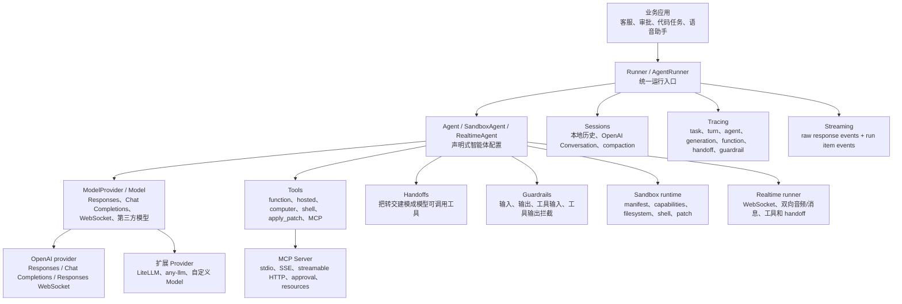
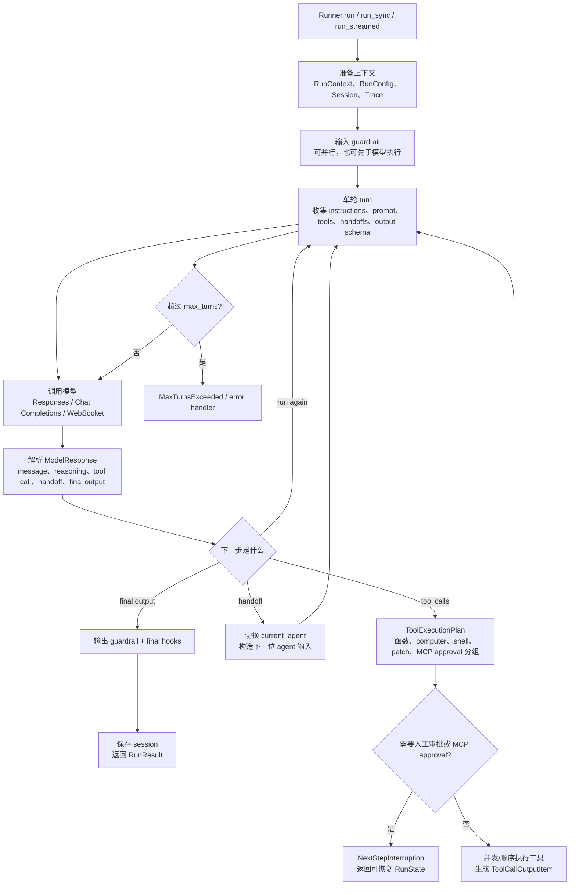
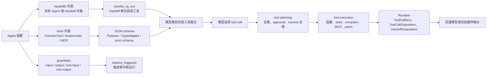
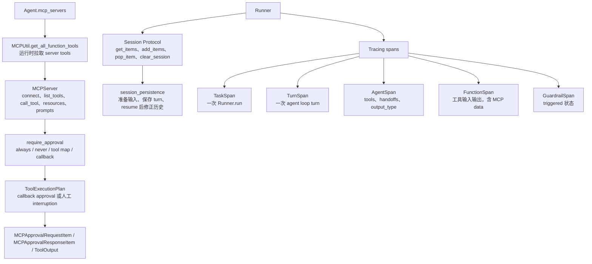
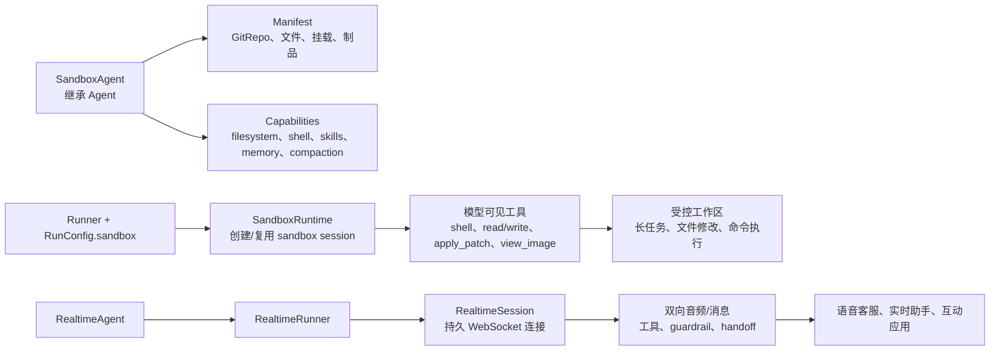
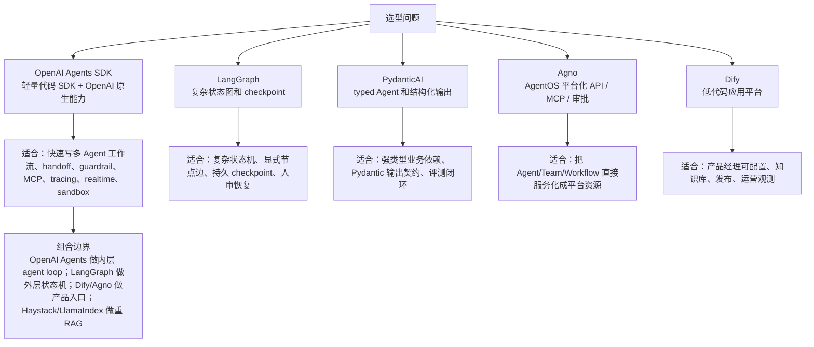
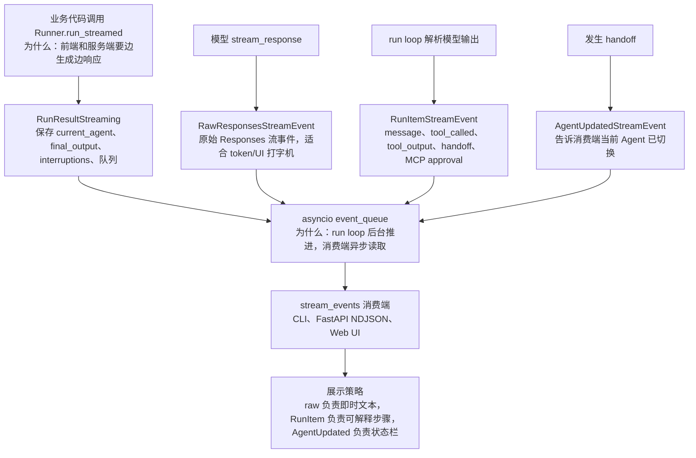
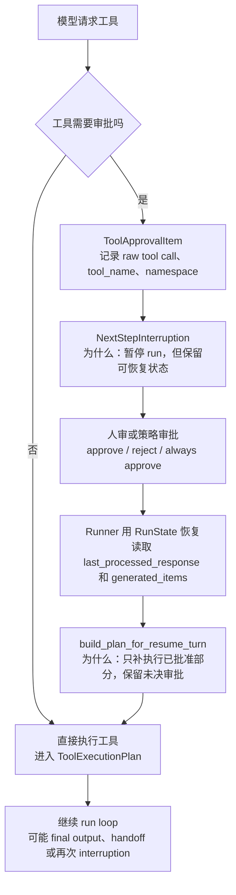
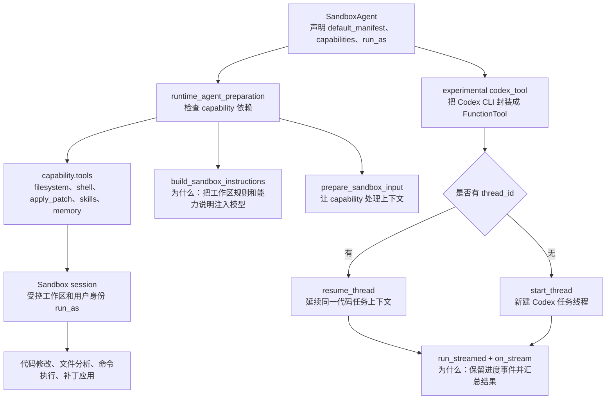
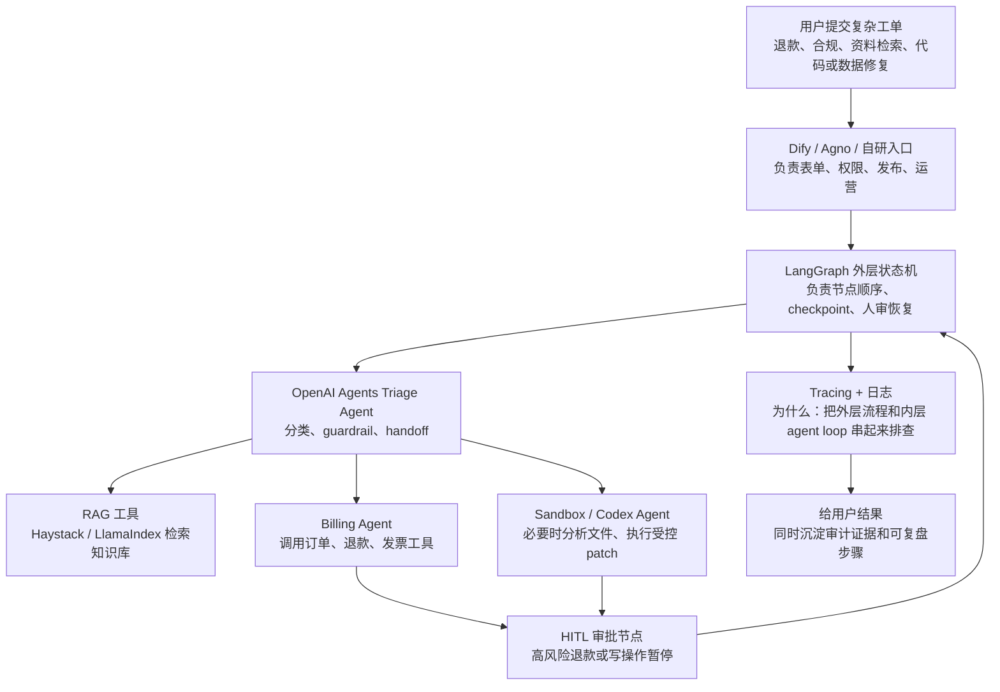

# OpenAI Agents Python 源码分析

源码版本：

- 仓库：`openai/openai-agents-python`
- 本地源码：`sources/openai-agents-python`
- 当前提交：`158b2f489ecf2f9aeea7a84cb53cc03fe930daea`
- 标签描述：`v0.18.0-7-g158b2f48`
- 包版本：`openai-agents 0.18.0`

## 1. 一句话定位

OpenAI Agents Python 是一个轻量但覆盖面很宽的多 Agent SDK。它不是 Dify 这种低代码平台，也不是 LangGraph 这种显式状态图运行时；它更像“代码优先的 Agent loop + OpenAI 原生模型能力 + 工具、handoff、guardrail、session、tracing、realtime、sandbox 的 SDK 套件”。

为什么这么设计：源码把最常用的 Agent 工作流收敛到 `Agent` 和 `Runner`，让开发者用 Python 对象声明 instructions、tools、handoffs、guardrails、output_type，再由 Runner 统一处理模型调用、工具执行、转交、流式事件、会话持久化和 tracing。复杂图编排可以外接 LangGraph，产品化入口可以外接 Dify/Agno/自研服务。

## 2. 总体架构图



## 3. 源码分层

| 层级 | 关键文件 | 作用 |
| --- | --- | --- |
| Public API | `src/agents/__init__.py` | 统一导出 Agent、Runner、工具、模型、session、tracing、realtime、sandbox 等能力 |
| Agent 定义 | `src/agents/agent.py` | 声明 instructions、tools、mcp_servers、handoffs、model、guardrails、output_type、tool_use_behavior |
| 运行入口 | `src/agents/run.py` | `Runner.run/run_sync/run_streamed` 和内部 `AgentRunner` |
| 运行内核 | `src/agents/run_internal/*` | turn preparation、run loop、tool planning、tool execution、session persistence、streaming、resume |
| 工具系统 | `src/agents/tool.py`、`tool_guardrails.py` | FunctionTool、hosted tools、shell/computer/apply_patch、工具输入输出 guardrail |
| Handoff | `src/agents/handoffs/__init__.py` | 把转交目标包装成模型可调用 transfer tool |
| Guardrail | `src/agents/guardrail.py` | 输入/输出拦截，tripwire 触发后停止运行 |
| MCP | `src/agents/mcp/*` | MCP server 生命周期、工具列表、调用、approval、resources、prompts |
| 模型适配 | `src/agents/models/*` | Model/ModelProvider 抽象，OpenAI Responses、Chat Completions、WebSocket、第三方模型扩展 |
| 会话记忆 | `src/agents/memory/*` | Session Protocol、SQLite、OpenAI conversation、Responses compaction |
| 可观测 | `src/agents/tracing/*` | task/turn/agent/function/generation/handoff/guardrail 等 span |
| Realtime / Voice | `src/agents/realtime/*`、`voice/*` | WebSocket realtime agent 和语音 pipeline |
| Sandbox / Codex | `src/agents/sandbox/*`、`extensions/experimental/codex/*` | 长任务工作区、文件系统、shell、patch、skills、sandbox provider |

## 4. 主流程：Runner 如何驱动 Agent



源码证据：

- `src/agents/run.py:197` 定义 `Runner`，`run.py:199` 是异步 `run`，`run.py:283` 是 `run_sync`，`run.py:365` 是 `run_streamed`。
- `src/agents/run.py:217-224` 的注释直接说明循环：调用 agent；如果 final output 则结束；如果 handoff 则换新 agent；否则执行工具并再次运行。
- `src/agents/run_internal/run_loop.py:1-3` 说明该模块负责 tool execution、approvals、turn processing。
- `src/agents/run_internal/tool_planning.py:178` 定义 `ToolExecutionPlan`，把函数工具、computer、custom tool、shell、apply_patch、local shell、MCP approval、interruption 分开。

为什么这么设计：Agent loop 的复杂点不在“调一次模型”，而在“模型响应后如何决定下一步”。OpenAI Agents SDK 把下一步抽象成 final output、handoff、tool execution、interruption、run again，既能保持 API 简洁，又能覆盖多 Agent 和人工审批。

## 5. Agent 设计：声明式配置对象

`Agent` 是一个 dataclass，核心字段包括：

- `instructions` / `prompt`：静态或动态系统指令。
- `tools` / `mcp_servers`：本地工具和 MCP 工具。
- `handoffs`：可转交的其他 Agent 或 Handoff。
- `model` / `model_settings`：模型实现和采样等配置。
- `input_guardrails` / `output_guardrails`：输入输出安全/质量拦截。
- `output_type`：最终输出类型，支持 dataclass、Pydantic、TypedDict、自定义 schema。
- `tool_use_behavior`：工具结果是否回灌模型，或直接作为 final output。

源码证据：

- `src/agents/agent.py:173` 定义 `AgentBase`，它持有 `tools`、`mcp_servers`、`mcp_config`。
- `src/agents/agent.py:270` 定义 `Agent`。
- `src/agents/agent.py:285-304` 定义 instructions 和 prompt。
- `src/agents/agent.py:306-309` 定义 handoffs。
- `src/agents/agent.py:311-323` 定义 model 和 model_settings。
- `src/agents/agent.py:325-335` 定义 input/output guardrails。
- `src/agents/agent.py:337-346` 定义 output_type。
- `src/agents/agent.py:353-379` 定义 tool_use_behavior。

代码片段：

```python
from agents import Agent, Runner, function_tool

@function_tool
def refund(order_id: str, reason: str) -> str:
    return f"refund submitted for {order_id}: {reason}"

agent = Agent(
    name="客服助手",
    instructions="判断客户诉求，必要时调用退款工具。",
    tools=[refund],
    output_type=str,
)

result = Runner.run_sync(agent, "订单 A100 需要退款")
print(result.final_output)
```

## 6. 工具、Handoff、Guardrail 的控制流



### 6.1 Handoff

Handoff 本质是把“转交给另一个 Agent”包装成一个工具。模型看到的是 `transfer_to_xxx` 这样的工具名，调用后 Runner 切换 current agent。

源码证据：

- `src/agents/handoffs/__init__.py:94` 定义 `Handoff`。
- `src/agents/handoffs/__init__.py:122-129` 定义 `on_invoke_handoff`，返回目标 agent。
- `src/agents/handoffs/__init__.py:168-172` 生成默认工具名 `transfer_to_{agent.name}`。
- `src/agents/handoffs/__init__.py:187` 之后定义 `handoff()` helper。
- `src/agents/handoffs/__init__.py:285-292` 使用 `TypeAdapter` 和 `ensure_strict_json_schema` 构造严格输入 schema。

### 6.2 Guardrail

Guardrail 是可组合的 tripwire：输入 guardrail 可以和模型并行，也可以先跑；输出 guardrail 在 final output 后执行；工具 guardrail 则作用在工具输入/输出边界。

源码证据：

- `src/agents/guardrail.py:19-28` 定义 `GuardrailFunctionOutput`，核心是 `tripwire_triggered`。
- `src/agents/guardrail.py:72` 定义 `InputGuardrail`。
- `src/agents/guardrail.py:93-98` 支持 `run_in_parallel`。
- `src/agents/guardrail.py:134` 定义 `OutputGuardrail`。
- `src/agents/tool_guardrails.py:152` 和 `tool_guardrails.py:181` 定义工具输入/输出 guardrail。

为什么这么设计：handoff、tool、guardrail 都被转成“模型可感知或运行时可拦截的边界对象”。这样可以让模型负责决策，让 SDK 负责验证、执行和恢复。

## 7. MCP、Session、Tracing



### 7.1 MCP 细节

源码证据：

- `src/agents/agent.py:203-213`：`AgentBase` 持有 `mcp_servers`，运行时会从这些 server 拉工具。
- `src/agents/agent.py:232-253`：`get_mcp_tools()` 调用 `MCPUtil.get_all_function_tools()`。
- `src/agents/mcp/server.py:224` 定义 `MCPServer` 抽象。
- `src/agents/mcp/server.py:244-259` 支持 `require_approval`、failure error function、tool metadata、custom data。
- `src/agents/mcp/server.py:285-304` 定义 `connect`、`cleanup`、`list_tools`、`call_tool`。
- `src/agents/mcp/server.py:318-361` 支持 prompts、resources、resource templates。
- `src/agents/run_internal/tool_planning.py:94-126` 执行 hosted MCP approval callback 并生成 approval response item。

### 7.2 Session 细节

源码证据：

- `src/agents/memory/session.py:11` 定义 `Session` Protocol。
- `src/agents/memory/session.py:22-49` 定义 `get_items`、`add_items`、`pop_item`、`clear_session`。
- `src/agents/memory/session.py:98-135` 定义 OpenAI Responses compaction-aware session 协议。
- `src/agents/run.py:252-263` 支持 `conversation_id` 和 `session` 两种上下文历史形态。

### 7.3 Tracing 细节

源码证据：

- `src/agents/tracing/span_data.py:25` 定义 `AgentSpanData`，包含 agent name、handoffs、tools、output_type。
- `src/agents/tracing/span_data.py:55` 定义 `TaskSpanData`。
- `src/agents/tracing/span_data.py:84` 定义 `TurnSpanData`。
- `src/agents/tracing/span_data.py:119` 定义 `FunctionSpanData`，包含工具输入输出和 MCP data。
- `src/agents/tracing/span_data.py:244` 定义 `HandoffSpanData`。
- `src/agents/tracing/span_data.py:294` 定义 `GuardrailSpanData`。

为什么这么设计：Agent 应用最难排查的是“模型为什么这么做、工具为什么被调用、谁转交给谁、哪里被 guardrail 拦住”。SDK 把这些动作转成标准 span，为调试和分享提供了天然时间线。

## 8. Model Provider：OpenAI 原生优先，但接口可扩展

`Model` 抽象只有两个核心方法：`get_response()` 和 `stream_response()`。`OpenAIProvider` 再根据配置选择 Responses、Chat Completions 或 Responses WebSocket。

源码证据：

- `src/agents/models/interface.py:31` 定义 `Model`。
- `src/agents/models/interface.py:48-78` 定义 `get_response()`。
- `src/agents/models/interface.py:80-108` 定义 `stream_response()`。
- `src/agents/models/interface.py:111` 定义 `ModelProvider`。
- `src/agents/models/openai_provider.py:36` 定义 `OpenAIProvider`。
- `src/agents/models/openai_provider.py:68-87` 支持 OpenAI Responses、Responses WebSocket、strict feature validation、agent registration、buffer streamed tool calls。
- `src/agents/models/openai_provider.py:120-137` 懒加载 AsyncOpenAI client，共享 httpx client。

为什么这么设计：OpenAI 自家 SDK 要优先吃满 Responses API、Conversation、WebSocket、tracing 等能力，但又不能把 Agent loop 锁死在单个模型实现上，所以用 `Model` / `ModelProvider` 做边界。

## 9. Realtime 与 Sandbox



### 9.1 Sandbox Agent

源码证据：

- `src/agents/sandbox/sandbox_agent.py:15` 定义 `SandboxAgent(Agent)`。
- `src/agents/sandbox/sandbox_agent.py:20-36` 定义 `default_manifest`、`base_instructions`、`capabilities`、`run_as`。
- `src/agents/sandbox/capabilities/*` 提供 filesystem、shell、skills、memory、compaction 等能力。
- `src/agents/sandbox/sandboxes/*` 提供 Docker、Unix local 等 sandbox client。

适用场景：代码修改、文件分析、长任务研究、需要 shell/patch 的受控工作区。

### 9.2 Realtime Agent

源码证据：

- `src/agents/realtime/agent.py:27` 定义 `RealtimeAgent`。
- `src/agents/realtime/runner.py:18` 定义 `RealtimeRunner`。
- `src/agents/realtime/runner.py:19-26` 明确说明它是 realtime agent 的 Runner，维护持久连接、执行工具、运行 guardrail、支持 handoff。
- `src/agents/realtime/runner.py:48-69` 创建并返回 `RealtimeSession`。

适用场景：语音客服、实时助手、会议助理、互动式多轮应用。

## 10. 真实示例：客服分流 + 工具 + Guardrail

```python
from dataclasses import dataclass
from agents import Agent, Runner, GuardrailFunctionOutput, input_guardrail, function_tool

@dataclass
class UserContext:
    user_id: str
    vip: bool

@input_guardrail
def block_sensitive(ctx, agent, user_input):
    text = user_input if isinstance(user_input, str) else str(user_input)
    blocked = "导出全部用户" in text
    return GuardrailFunctionOutput(
        output_info={"reason": "敏感批量数据导出"} if blocked else {},
        tripwire_triggered=blocked,
    )

@function_tool
def lookup_order(order_id: str) -> str:
    return f"订单 {order_id} 当前状态：已付款，待发货"

billing_agent = Agent(
    name="Billing",
    instructions="处理账单、退款、发票问题。",
    tools=[lookup_order],
)

triage_agent = Agent(
    name="Triage",
    instructions="判断客户问题类型，账单问题转交 Billing。",
    handoffs=[billing_agent],
    input_guardrails=[block_sensitive],
)

result = Runner.run_sync(
    triage_agent,
    "帮我查一下订单 A100，并看看能不能退款",
    context=UserContext(user_id="u1", vip=True),
)
print(result.final_output)
```

这个例子能对应源码里的三条主线：

- `handoffs=[billing_agent]` 会被包装成 `transfer_to_billing` 类工具。
- `lookup_order` 会被 `function_tool` 包装成 FunctionTool，并在 ToolExecutionPlan 中执行。
- `block_sensitive` 返回 `tripwire_triggered=True` 时会中断 run。

## 11. 应用场景

1. 多 Agent 客服分流：Triage Agent 决定交给账单、物流、售后 Agent。
2. 安全敏感工作流：用 input/output/tool guardrail 控制越权、敏感输出和危险工具调用。
3. IDE / 内部工具助手：用 MCP 接入内部服务，用 tracing 观察调用路径。
4. 语音实时助手：RealtimeAgent + RealtimeRunner 做双向语音和实时工具调用。
5. 代码任务执行：SandboxAgent 提供 workspace、shell、apply_patch、filesystem 能力。
6. OpenAI 原生应用：用 Responses API、conversation_id、previous_response_id、tracing、WebSocket 组合。

## 12. 和其他框架对比



| 对比对象 | OpenAI Agents SDK 的优势 | 对方更强的地方 |
| --- | --- | --- |
| LangGraph | 更轻，Agent/handoff/tool/guardrail 上手快，OpenAI Responses / realtime / tracing 原生 | 显式状态图、checkpoint、复杂中断恢复、可测试状态机 |
| PydanticAI | OpenAI 原生能力、handoff、realtime、sandbox、MCP 和 tracing 覆盖更完整 | typed deps、Pydantic 输出契约、evals 更聚焦 |
| Agno | SDK 更轻，适合直接嵌入 Python 代码和 OpenAI 原生功能 | AgentOS 平台化 API、服务入口、调度、审批管理更完整 |
| Dify | 更适合工程代码控制和自定义运行逻辑 | 低代码配置、产品发布、运营后台、知识库 UI |
| CrewAI / AutoGen | 工具/guardrail/tracing/session 体系更工程化 | 角色任务叙事和多 Agent 对话实验更直观 |

## 13. 专题一：Streaming 细节



源码里 Streaming 不是“把 token 原样吐出去”这么简单，而是拆成三类事件：

- `RawResponsesStreamEvent`：直接透传模型 Responses API 的原始流事件，适合做打字机效果。
- `RunItemStreamEvent`：SDK 把 message、tool call、tool output、handoff、MCP approval 等运行步骤包装成语义事件，适合做调试面板、时间线和审计。
- `AgentUpdatedStreamEvent`：handoff 后通知消费端当前运行 Agent 已变化，适合更新 UI 里的“当前处理人”。

为什么这么设计：原始 token 流解决“快”，语义 RunItem 解决“可解释”，AgentUpdated 解决“多 Agent 状态可见”。如果只暴露 token，工具调用、handoff、审批、MCP 列表这些关键节点都会变成黑盒。

源码证据：

- `src/agents/result.py:445-500` 定义 `RunResultStreaming`，内部有 `_event_queue`、guardrail queue、`interruptions` 和 `_last_processed_response`。
- `src/agents/stream_events.py:10-61` 定义三类 StreamEvent：raw response、run item、agent updated。
- `src/agents/run_internal/streaming.py:28-65` 把 `MessageOutputItem`、`ToolCallItem`、`ToolCallOutputItem`、`MCPApprovalRequestItem` 等映射成 `RunItemStreamEvent`，并明确跳过 `ToolApprovalItem`，因为审批项代表 interruption，不是普通流式展示项。
- `src/agents/run_internal/run_loop.py:589` 运行开始时先发 `AgentUpdatedStreamEvent`；`run_loop.py:1484-1485` 把模型原始流事件包装成 `RawResponsesStreamEvent`。
- `tests/fastapi/streaming_app.py:21` 用 `StreamingResponse(..., media_type="application/x-ndjson")` 演示了服务端把 stream events 暴露给 HTTP 客户端的形态。

分享时可以这样讲：OpenAI Agents Python 的 Streaming 是“前台体验 + 后台可观测”一体化设计。前端拿 raw event 做即时输出，工程侧拿 run item event 做工具链路、handoff、MCP 审批可视化。

## 14. 专题二：Resume / HITL 细节



Resume / HITL 的核心是：审批不是异常退出，而是运行时的一种合法下一步。模型已经产出了工具调用，SDK 把需要审批的调用放进 `ToolApprovalItem`，再用 `NextStepInterruption` 暂停 run。人审完成后，Runner 用保存下来的 `RunState` 和上一轮 processed response 继续推进。

为什么这么设计：人审场景最怕“重新跑一遍模型导致工具调用漂移”。源码选择保存上一轮模型响应和生成项，再在 resume turn 里重建执行计划，保证恢复时执行的是原先等待审批的工具，而不是让模型重新猜一次。

源码证据：

- `src/agents/items.py:509-535` 定义 `ToolApprovalItem`，保存 raw tool call、tool_name、tool_namespace、tool_origin 等审批追踪信息。
- `src/agents/items.py:632-635` 明确 `ToolApprovalItem` 不能直接转成 API input，说明它是 SDK 内部恢复/审批状态，不是普通模型上下文。
- `src/agents/run_internal/run_steps.py:170-174` 定义 `NextStepInterruption`，代表工具审批导致的 run 暂停。
- `src/agents/run_internal/tool_planning.py:178-193` 的 `ToolExecutionPlan` 有 `pending_interruptions`、`approved_mcp_responses`、`mcp_requests_with_callback`。
- `src/agents/run_internal/tool_planning.py:266-299` 的 `_build_plan_for_resume_turn` 专门为恢复轮次构建执行计划。
- `src/agents/run_internal/run_loop.py:731-800` 检测 `NextStepInterruption` 后调用 `resolve_interrupted_turn`，再保存 resumed items；如果恢复后仍有 interruption，就再次 finalize interruption。
- `tests/mcp/test_mcp_approval.py` 和 `tests/utils/hitl.py` 中的 `resume_after_first_approval` 覆盖 MCP 审批暂停与恢复。

真实例子：客服退款 Agent 调用 `refund_order(order_id, amount)` 前需要人工确认。首次 run 返回 `ToolApprovalItem`，页面展示“订单 A100 退款 120 元，是否批准”。主管批准后 resume，同一个 tool call 被执行；如果还有“发票作废”审批，则再次 interruption，而不是丢失上下文。

## 15. 专题三：Sandbox / Codex 扩展



SandboxAgent 面向长任务工作区：文件读写、shell、apply_patch、skills、memory、compaction 等能力不是硬编码进 Runner，而是通过 capability 注入工具、说明和上下文处理逻辑。Codex 扩展则把 Codex CLI 作为一个 FunctionTool 接入普通 Agent 流程。

为什么这么设计：Sandbox 和 Codex 都属于高权限、长上下文、可能有副作用的能力。源码把它们放在 `sandbox/*` 和 `extensions/experimental/codex/*`，并通过 manifest、run_as、thread_id、on_stream、tool name collision validation 做边界控制，避免和普通函数工具混在一起失控。

源码证据：

- `src/agents/sandbox/sandbox_agent.py:15-38` 定义 `SandboxAgent`，扩展 `default_manifest`、`base_instructions`、`capabilities`、`run_as`。
- `src/agents/sandbox/runtime_agent_preparation.py:74-82` 检查 capability 依赖并收集 capability tools。
- `src/agents/sandbox/runtime_agent_preparation.py:148-190` 构建 sandbox instructions，把基础说明、Agent instructions、capability instructions 合并。
- `src/agents/extensions/experimental/codex/codex_tool.py:236-258` 暴露 `codex_tool` 的配置入口，包括 thread、sandbox_mode、working_directory、persist_session、on_stream。
- `src/agents/extensions/experimental/codex/codex_tool.py:346-400` 运行时解析或创建 Codex thread，调用 `thread.run_streamed`，消费事件并把 usage 计入 Agent usage。
- `src/agents/extensions/experimental/codex/codex_tool.py:802-805` 用 `thread_id` 决定 `resume_thread` 或 `start_thread`。
- `src/agents/agent.py:95-117` 校验 Codex tool 名称冲突，避免多个 Codex 工具复用同名导致运行时歧义。

真实例子：内部研发助手收到“分析这个仓库的支付退款 bug，给出补丁”。外层 Agent 先用普通工具查工单和权限，再把代码任务交给 SandboxAgent 或 codex_tool。Sandbox/Codex 负责在受控 workspace 内读文件、跑命令、应用 patch；主 Agent 继续负责审批、解释和结果汇总。

## 16. 专题四：真实组合案例



一个更贴近落地的组合方式：

1. Dify / Agno / 自研前台负责用户入口、权限、表单、发布、运营和知识库配置。
2. LangGraph 做外层确定性流程：创建工单、分类、检索、审批、执行、回写，每个节点可 checkpoint。
3. OpenAI Agents Python 做内层智能体执行：Triage Agent 负责分类和 guardrail，Billing Agent 负责退款/发票工具，Ops Agent 负责 Sandbox/Codex 类代码或文件任务。
4. Haystack / LlamaIndex 作为 RAG 工具后端，被 OpenAI Agent 以 function tool 或 MCP tool 方式调用。
5. Tracing 把每次 Agent run 的工具调用、handoff、审批和模型响应串起来，LangGraph 记录外层节点状态。

为什么这么组合：LangGraph 擅长“流程确定性和恢复”，Dify/Agno 擅长“产品入口和运营”，OpenAI Agents Python 擅长“内层 Agent loop 和 OpenAI 原生能力”。不要让一个框架承担所有职责，边界清楚后，分享和落地都会更稳。

演讲口径：如果听众问“有 LangGraph 了为什么还要 OpenAI Agents Python”，可以回答：LangGraph 管外层流程状态，OpenAI Agents 管节点内部的模型、工具、handoff、guardrail、MCP、streaming、tracing。两者不是替代关系，更像“流程引擎 + Agent 执行单元”。

## 17. 设计思想总结

1. 声明式 Agent：Agent 只是配置，不直接执行；执行统一交给 Runner。
2. 工具化控制流：handoff 也是工具，MCP 也是工具，hosted tool 也是工具，模型通过统一工具表决策。
3. Runtime 承担确定性：模型负责选择，SDK 负责 schema、approval、guardrail、session、trace、resume。
4. OpenAI 原生优先：Responses、Conversation、WebSocket、tracing、agent registration 都被纳入 provider。
5. 可扩展边界清晰：Model、ModelProvider、Session、MCPServer、TracingProcessor 都是可替换接口。
6. 生产调试优先：RunItem 和 Span 让一次 agent run 可以被回放、解释和定位。

## 18. 分享口径

可以这样讲：

OpenAI Agents Python 的核心不是“又一个 agent prompt wrapper”，而是把 Agent 应用里最常见的控制点标准化了：`Agent` 声明模型、工具、转交和 guardrail，`Runner` 负责把模型响应推进成下一步，`RunItem` 记录每个可观察事件，`Session` 管历史，`Tracing` 管可观测，`MCP` 和 hosted tools 管外部能力，`Realtime/Sandbox` 扩展到语音和长任务工作区。

如果要和 LangGraph 放在一起讲，可以说：LangGraph 更像“外层确定性流程编排器”，OpenAI Agents SDK 更像“内层 Agent 执行单元”。复杂工单审批可以由 LangGraph 管状态节点和 checkpoint，每个节点里调用一个 OpenAI Agent 完成分类、检索、工具执行或实时交互。
