# PydanticAI 源码架构精读

分析对象：`sources/pydantic-ai`。源码来自 `pydantic/pydantic-ai`，当前固定提交为 `6a6d83d95d9c1fc37fcd808b3633241d7d2656ce`，提交时间 `2026-07-08T10:42:18+02:00`，提交信息 `Add Temporal coverage for nested multimodal tool returns (#6349)`。

> 一句话定位：PydanticAI 是 **Pydantic 风格的 typed Agent framework**。它不主打低代码平台，也不是 LangGraph 那种复杂状态机优先框架，而是把 Agent 的依赖、工具、结构化输出、模型适配、评测和观测都压到 Python 类型与 Pydantic schema 这条主线上。

## 1. 总体结论

PydanticAI 的核心设计可以概括成三句话：

1. **Agent 是类型契约的聚合点**：`Agent` 用 `deps_type` 声明运行依赖，用 `output_type` 声明最终输出，用 `@agent.tool` 声明工具，用 `RunContext[T]` 把依赖传给工具和动态 instructions。
2. **Agent loop 内部用图运行时表达**：一次运行不是简单 while 循环，而是由 `UserPromptNode`、`ModelRequestNode`、`CallToolsNode` 和 `End` 组成的内部 `pydantic_graph` 节点流。
3. **模型差异被隔离在 Model 和 Provider 两层**：`Model` 负责 request、stream、request parameters 和 wire format 映射；`Provider` 负责 authenticated client、base URL、profile 和 gateway。

最值得分享的主线：

- typed Agent：`Agent[DepsT, OutputT]`、`RunContext[DepsT]`、`output_type=BaseModel`。
- tool schema：普通 Python 函数通过 `_function_schema.function_schema()` 变成 `ToolDefinition`，再放进 `ModelRequestParameters.function_tools`。
- structured output：`ToolOutput`、`NativeOutput`、`PromptedOutput`、`TextOutput` 统一处理不同模型的结构化输出能力。
- provider adapter：`Model` 与 `Provider` 分层，OpenAI、Anthropic、Google、Bedrock 等模型实现都落在同一抽象下。
- pydantic_graph：Agent 主流程和独立 workflow runtime 共享 typed graph 思路。
- pydantic_evals：用 Dataset、Evaluator、OTel span tree 把 Agent 的最终答案、工具轨迹和调用预算纳入回归评估。

## 2. 最高层架构

架构图见：[architecture.mmd](architecture.mmd)。

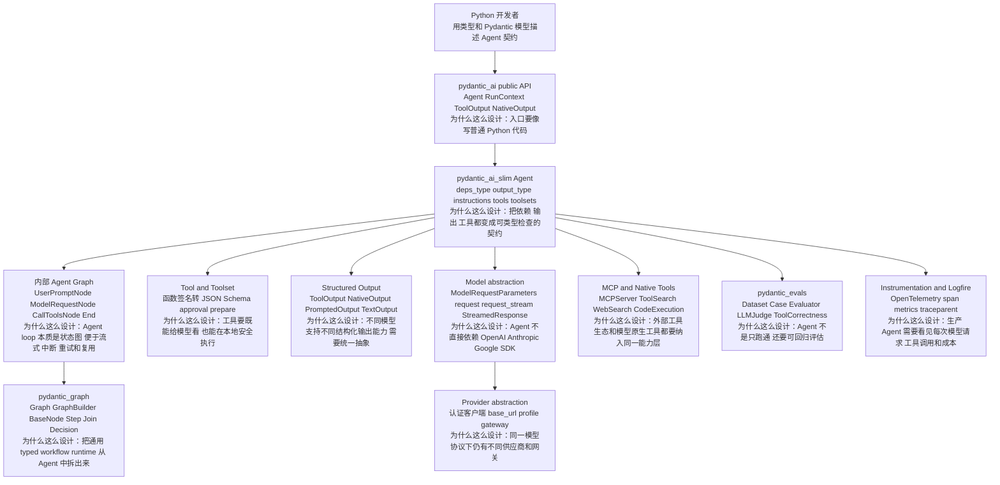

源码证据：

| 主题 | 源码位置 | 说明 |
| --- | --- | --- |
| 项目定位 | `sources/pydantic-ai/pyproject.toml:14` 到 `:16` | 包名是 `pydantic-ai`，描述是 `AI Agent Framework, the Pydantic way`。 |
| monorepo workspace | `sources/pydantic-ai/pyproject.toml:98` 到 `:104` | workspace 包含 `pydantic_ai_slim`、`pydantic_evals`、`pydantic_graph`、`clai`、`examples`。 |
| 根包依赖 | `sources/pydantic-ai/pyproject.toml:51` 到 `:52` | 根包依赖 `pydantic-ai-slim` 并默认带 openai、anthropic、google、cli、mcp、evals、web、retries、logfire extras。 |
| Agent 泛型契约 | `pydantic_ai_slim/pydantic_ai/agent/__init__.py:188` 到 `:192` | `Agent` 泛型化依赖类型和输出类型。 |
| Agent 内部图 | `pydantic_ai_slim/pydantic_ai/_agent_graph.py:275`、`:608`、`:1125` | 主节点是 `UserPromptNode`、`ModelRequestNode`、`CallToolsNode`。 |
| 独立图运行时 | `pydantic_graph/pydantic_graph/graph_builder.py:158`、`:430`、`:1139` | `Graph`、`GraphRun`、`GraphBuilder` 组成独立 typed workflow runtime。 |
| evals | `pydantic_evals/pydantic_evals/dataset.py:177`、`:281` | `Dataset` 组织 case 和 evaluator，并执行 task function。 |

## 3. 包结构怎么讲

| 目录 | 职责 | 分享时怎么讲 |
| --- | --- | --- |
| `pydantic_ai_slim/pydantic_ai` | Agent、tool、output、model、provider、MCP、instrumentation 主体 | “这是 PydanticAI 的 Agent 内核。” |
| `pydantic_graph/pydantic_graph` | 通用 typed graph runtime | “Agent loop 背后的状态推进能力被抽成了独立包。” |
| `pydantic_evals/pydantic_evals` | Dataset、Case、Evaluator、OTel 轨迹评估 | “框架不只负责调用模型，还给评估闭环留了官方路径。” |
| `clai` | CLI agent 入口 | “把 PydanticAI 能力包装成命令行体验。” |
| `examples` | bank support、flight booking、RAG、chat app 等示例 | “真实例子能看清 typed deps、typed output 和 tools 的写法。” |
| `tests` | Agent、tools、output schemas、MCP、streaming、providers、evals 测试 | “测试覆盖的是框架契约，而不只是示例能跑。” |

## 4. 主流程：一次 Agent.run 怎么走

流程图见：[agent-run-flow.mmd](agent-run-flow.mmd)。

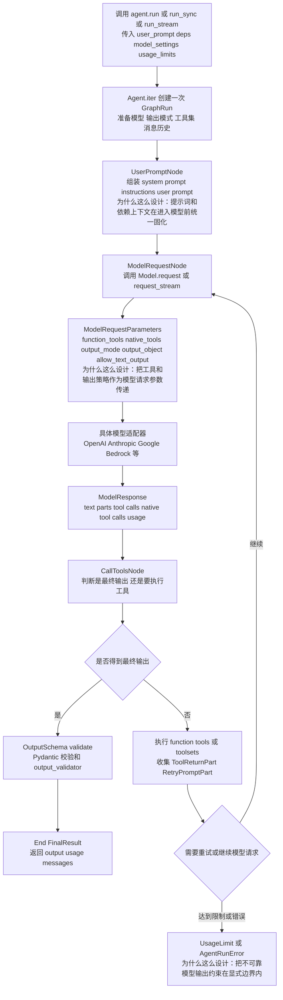

源码证据：

- `agent/abstract.py:408` 到 `:551`：抽象层定义 `run()`，返回 `AgentRunResult`。
- `agent/abstract.py:551` 到 `:598`：`run_sync()` 是同步便捷包装。
- `agent/abstract.py:742`：支持 `run_stream()`。
- `agent/__init__.py:937`：`Agent.iter()` 是一次运行的核心上下文管理入口。
- `_agent_graph.py:297`：`UserPromptNode.run()` 处理用户 prompt 和 instructions。
- `_agent_graph.py:620`：`ModelRequestNode.run()` 发起模型请求。
- `_agent_graph.py:1146`：`CallToolsNode.run()` 处理模型响应，决定结束或继续请求。
- `_agent_graph.py:1482`：最终节点返回 `End(FinalResult)`。

设计解释：

| 设计点 | 为什么这么设计 |
| --- | --- |
| `Agent.run()` 外层简单，内部 `iter()` 复杂 | 用户入口要简单，但 streaming、message history、usage、tools、output schema 都需要在运行上下文中统一协调。 |
| 内部用 graph node 表达 Agent loop | Agent 不是线性调用，模型可能输出工具调用、重试请求、最终答案、stream event；节点化后更适合扩展和观测。 |
| `GraphAgentDeps` 统一携带配置 | 用户依赖、模型、工具、输出 schema、usage limits 都要被每个节点访问，集中依赖对象比散落参数更稳。 |
| usage limits 和 retries 在 loop 中约束 | LLM 输出天然不稳定，框架必须把重试和预算作为运行时边界，而不是靠业务代码兜底。 |

## 5. 工具和结构化输出

流程图见：[tool-output-flow.mmd](tool-output-flow.mmd)。

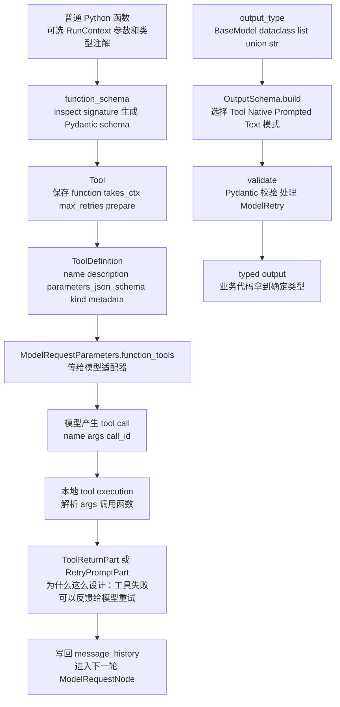

核心设计思想：

- 工具不是“随便塞一个 callable”，而是要能生成模型可读的 JSON Schema。
- 输出不是“解析一段 JSON 字符串”，而是有多种模式：作为 tool 输出、模型原生结构化输出、prompted 输出、纯文本处理函数。
- PydanticAI 的强项在于：工具入参和最终输出都能回到 Python 类型系统。

源码证据：

| 主题 | 源码位置 | 说明 |
| --- | --- | --- |
| `Tool` | `pydantic_ai_slim/pydantic_ai/tools.py:439` | `Tool` 包装一个 agent tool function。 |
| `ToolDefinition` | `pydantic_ai_slim/pydantic_ai/tools.py:687` 到 `:690` | 传给模型的工具定义，同时服务 function tools 和 output tools。 |
| 函数签名转 schema | `pydantic_ai_slim/pydantic_ai/_function_schema.py:103` | `function_schema()` 读取函数签名并生成 schema。 |
| FunctionToolset | `pydantic_ai_slim/pydantic_ai/toolsets/function.py:44` 到 `:47` | 普通 Python 函数可以组成 toolset。 |
| 输出模式 | `pydantic_ai_slim/pydantic_ai/output.py:48` | 结构化输出模式是 `tool`、`native`、`prompted`。 |
| 输出 marker | `output.py:77`、`:151`、`:206`、`:318` | `ToolOutput`、`NativeOutput`、`PromptedOutput`、`TextOutput` 四类 marker。 |
| 输出 schema | `_output.py:441`、`:745` | `OutputSchema` 和 `ToolOutputSchema` 负责最终校验。 |

可用于分享的代码片段：

```python
from dataclasses import dataclass
from pydantic import BaseModel
from pydantic_ai import Agent, RunContext

@dataclass
class SupportDeps:
    customer_id: int
    db: object

class SupportOutput(BaseModel):
    support_advice: str
    block_card: bool
    risk: int

agent = Agent(
    "openai:gpt-5.2",
    deps_type=SupportDeps,
    output_type=SupportOutput,
)

@agent.tool
async def customer_balance(ctx: RunContext[SupportDeps]) -> str:
    return await ctx.deps.db.customer_balance(ctx.deps.customer_id)
```

这个片段说明了 PydanticAI 的核心范式：业务依赖是 typed deps，工具通过 `RunContext[SupportDeps]` 拿依赖，最终输出是 Pydantic `BaseModel`。这比“让模型随便输出 JSON 再手写解析”更适合做可维护的业务 Agent。

## 6. Model / Provider Adapter

流程图见：[provider-adapter-flow.mmd](provider-adapter-flow.mmd)。

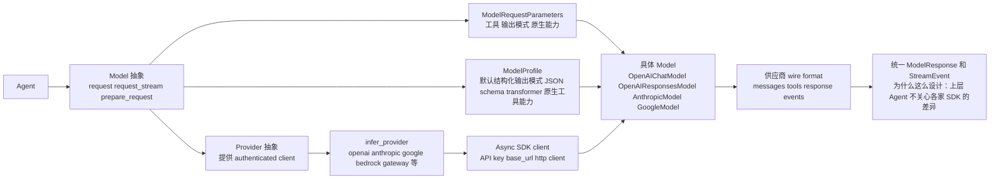

源码证据：

- `models/__init__.py:124` 到 `:128`：`ModelRequestParameters` 持有 function tools、native tools 等与模型请求相关的参数。
- `models/__init__.py:194` 到 `:195`：`Model` 是抽象模型类。
- `models/__init__.py:243` 到 `:247`：具体模型必须实现 `request()`。
- `models/__init__.py:280`：支持 `request_stream()`。
- `models/__init__.py:676`：`StreamedResponse` 抽象流式响应。
- `providers/__init__.py:23` 到 `:27`：`Provider` 负责提供 authenticated client。
- `providers/__init__.py:112`、`:242`：`infer_provider_class()` 和 `infer_provider()` 根据字符串推断 provider。
- `models/openai.py:728`、`:1705`：OpenAI 同时有 Chat API 和 Responses API 两类 model adapter。

设计解释：

| 设计点 | 为什么这么设计 |
| --- | --- |
| Model 和 Provider 分开 | 同一个模型协议可能走官方 API、Azure、OpenRouter、gateway 或自定义 base URL；认证客户端不应该混在 Agent 逻辑里。 |
| `ModelRequestParameters` 集中表达工具和输出 | 不同供应商的工具参数字段差异很大，先统一成内部参数，再由 adapter 映射到 wire format。 |
| `ModelProfile` 记录能力差异 | 有的模型支持 native structured output，有的更适合 tool output，有的原生工具集合不同；能力信息要显式化。 |
| 同时支持 stream 和非 stream | 交互式 Agent、Web UI、CLI 都需要 streaming；批处理和 evals 又需要普通 request。 |

## 7. pydantic_graph 与 pydantic_evals

流程图见：[graph-evals-flow.mmd](graph-evals-flow.mmd)。

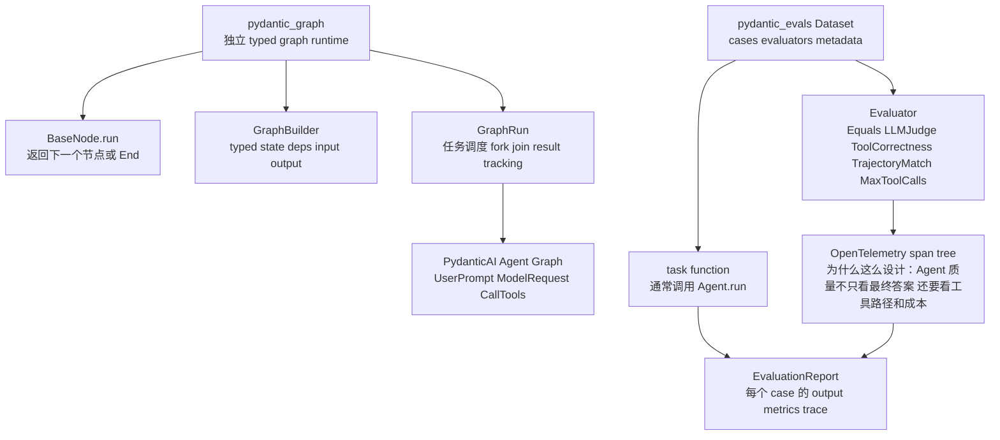

源码证据：

| 主题 | 源码位置 | 说明 |
| --- | --- | --- |
| `BaseNode` | `pydantic_graph/pydantic_graph/basenode.py:33` 到 `:37` | 节点运行后返回下一个节点或 `End`。 |
| `End` | `pydantic_graph/pydantic_graph/basenode.py:62` 到 `:65` | `End` 携带图最终返回值。 |
| `Graph` | `pydantic_graph/pydantic_graph/graph_builder.py:158` 到 `:162` | `Graph` 是 typed input、output、state、deps 的完整图定义。 |
| `GraphRun` | `graph_builder.py:430` 到 `:434` | 单次执行实例管理调度、fork/join 和 result tracking。 |
| `GraphBuilder` | `graph_builder.py:1139` 到 `:1143` | fluent interface 构造 typed graph。 |
| `Dataset` | `pydantic_evals/pydantic_evals/dataset.py:177` 到 `:181` | Dataset 管理测试 case 和 evaluator，并可保存为 YAML/JSON。 |
| `Evaluator` | `pydantic_evals/pydantic_evals/evaluators/evaluator.py:133` 到 `:136` | Evaluator 基于 `EvaluatorContext` 评估任务表现。 |
| agentic evaluators | `evaluators/agentic.py:191`、`:287`、`:511` | 支持工具正确性、工具轨迹匹配、最大工具调用次数等 Agent 专属评估。 |

这块适合这样讲：

> PydanticAI 不是只做一个 `agent.run()` 的封装。它把运行时和评测都拆出来：`pydantic_graph` 管状态推进，`pydantic_evals` 管质量回归。这样它更像“typed Agent 工程套件”，而不是单纯 SDK wrapper。

## 8. MCP、原生工具与观测

PydanticAI 同时接入三类外部能力：

1. **function tools**：本地 Python 函数，适合调用业务系统。
2. **native tools**：模型供应商原生工具，例如 web search、code execution、tool search 等。
3. **MCP tools/resources**：通过 Model Context Protocol 连接外部工具服务器。

源码证据：

- `pydantic_ai_slim/pydantic_ai/mcp.py:197` 到 `:225`：定义 MCP resource 抽象。
- `mcp.py:237` 到 `:253`：把 MCP SDK resource 转成 PydanticAI `Resource`。
- `_instrumentation.py:28` 到 `:32`：定义默认 instrumentation version、agent name、run id、conversation id baggage key。
- `_instrumentation.py:212` 到 `:220`：`open_model_request_span()` 包装模型请求 span，并准备 request context。
- `_instrumentation.py:408` 到 `:435`：`InstrumentationNames` 按版本配置 span name 和 attributes。

设计解释：

| 设计点 | 为什么这么设计 |
| --- | --- |
| MCP 资源单独建模 | MCP 不是普通函数调用，还包含 resource、prompt、annotations 等协议对象，需要显式转换层。 |
| native tools 和 function tools 分开 | 原生工具由模型侧执行，本地函数由框架执行，两者的安全边界、计费和返回路径不同。 |
| OTel/Logfire 作为观测底座 | Agent 出错时只看最终文本不够，需要定位模型请求、工具调用、stream TTFT、token、成本和 traceparent。 |

## 9. 真实例子：银行客服与航班预订

### 9.1 银行客服 Agent

`examples/pydantic_ai_examples/bank_support.py` 展示了最典型的 typed Agent：

- `SupportDependencies` 保存 DB 连接和 customer id。
- `SupportOutput(BaseModel)` 声明最终输出字段：建议、是否冻结卡、风险等级。
- `Agent(..., deps_type=SupportDependencies, output_type=SupportOutput)` 把依赖和输出都固定下来。
- `@support_agent.instructions` 动态注入客户姓名。
- `@support_agent.tool` 通过 `RunContext[SupportDependencies]` 查询余额。

对应源码证据：`bank_support.py:44` 到 `:56` 定义结构化输出和 Agent，`:66` 到 `:76` 展示 dynamic instructions 与 tool。

分享时可以这样说：

> 这个例子不是为了展示“模型会聊天”，而是展示业务 Agent 应该怎样被约束：客户数据通过 deps 传入，查询余额必须走 tool，最终输出必须满足 `SupportOutput`。这样 Agent 才能进入业务系统，而不是停留在 prompt demo。

### 9.2 航班预订 Agent

`examples/pydantic_ai_examples/flight_booking.py` 更像真实业务流程：

- `FlightDetails(BaseModel)`、`NoFlightFound(BaseModel)`、`SeatPreference(BaseModel)` 表示不同输出形态。
- `extraction_agent` 从网页文本中抽取航班。
- `search_agent.tool` 调用 `extraction_agent.run()`，形成 agent-as-tool。
- `@search_agent.output_validator` 做过程化校验，比如航班是否符合约束。
- 示例开启 `logfire.instrument_pydantic_ai()`，说明观测不是事后补丁。

对应源码证据：`flight_booking.py:23` 到 `:25` 配置 Logfire，`:28` 到 `:43` 定义 Pydantic 模型和 deps，`:62` 到 `:74` 展示 agent-as-tool，`:78` 到 `:83` 展示 output validator。

### 9.3 RAG 示例

`examples/pydantic_ai_examples/rag.py` 展示了 PydanticAI 对 RAG 的态度：它不内置一个完整 RAG 数据管线，而是把检索作为 tool 接进 Agent。

- `Deps` 里放 `AsyncOpenAI` 和 `asyncpg.Pool`。
- `agent = Agent(..., deps_type=Deps)`。
- `@agent.tool` 的 `retrieve()` 使用数据库和 embedding 检索文档。
- 同时接入 `logfire.instrument_asyncpg()` 和 `logfire.instrument_pydantic_ai()`。

这说明 PydanticAI 适合做 **typed Agent 控制层**；如果 RAG ingestion、hybrid retrieval、rerank 很复杂，可以组合 Haystack 或 LlamaIndex。

## 10. 和 LangGraph、LangChain、Haystack、CrewAI、AutoGen 对比

| 维度 | PydanticAI | LangGraph | LangChain | Haystack | CrewAI / AutoGen |
| --- | --- | --- | --- | --- | --- |
| 核心定位 | typed Agent framework | 状态图 Agent runtime | LLM 组件生态 | 生产级 RAG/Agent pipeline | 多 Agent 协作编排 |
| 核心抽象 | Agent、RunContext、Tool、Output、Model、Provider | StateGraph、Node、Edge、Checkpoint | Runnable、Tool、Model adapter、middleware | Component、Pipeline、DocumentStore | Agent、Task、Message、GroupChat |
| 最强点 | Pydantic 类型契约和结构化输出 | 复杂状态、恢复、中断、人审 | 生态集成和组合 | typed RAG pipeline、debug、tracing | 角色协作或多 Agent 对话 |
| RAG 态度 | 把检索作为 tool 或依赖接入 | RAG 可作为节点 | retriever 生态丰富 | RAG 主场 | 通常依赖外部 RAG |
| 复杂流程 | 可用内部 graph 或 pydantic_graph，但不是主打 checkpoint 平台 | 最强 | 需要组合 LangGraph | pipeline 强，长期状态机弱 | 协作强，状态恢复弱 |
| 输出约束 | 强，Pydantic-native | 取决于节点实现 | 支持但分散 | 组件输出契约 | 相对依赖 prompt 和任务定义 |
| 适合场景 | Python 团队做强类型业务 Agent | 长任务、多步状态机、人工中断 | 快速接生态和模型供应商 | 高质量 RAG 后端 | 研究、协作、角色分工 |

一句话对比：

- **和 LangGraph 比**：PydanticAI 更强调 typed Agent 和 schema；LangGraph 更强调长流程状态机、checkpoint 和 interrupt。
- **和 LangChain 比**：PydanticAI 更收敛，主线是 Agent 类型契约；LangChain 更像模型、工具、检索和 middleware 生态。
- **和 Haystack 比**：PydanticAI 不负责完整 RAG pipeline；Haystack 更适合索引、检索、重排、生成的显式组件图。
- **和 CrewAI/AutoGen 比**：PydanticAI 更像单个业务 Agent 的工程化内核；CrewAI/AutoGen 更强调多 Agent 协作与消息编排。

## 11. 组合架构建议

组合图见：[composition-flow.mmd](composition-flow.mmd)。

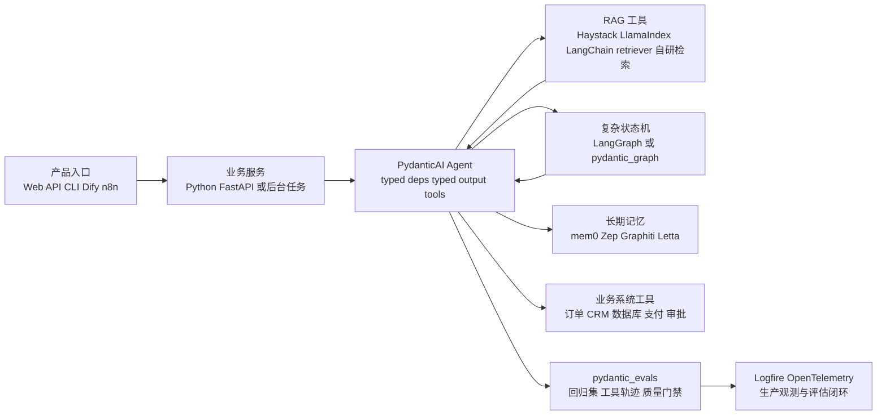

典型应用场景：

1. **强类型客服 Agent**：用 `deps_type` 注入用户、订单、权限上下文，用 tool 查业务系统，用 `output_type` 返回结构化处理建议。
2. **审批/风控助手**：模型负责解释和建议，Pydantic 输出负责把风险等级、原因、下一步动作固定为可审计字段。
3. **RAG 问答控制层**：Haystack 或 LlamaIndex 做检索管线，PydanticAI 把检索函数作为 tool，并负责最终结构化答案。
4. **评测驱动 Agent 开发**：用 `pydantic_evals.Dataset` 固定回归 case，用 `ToolCorrectness`、`TrajectoryMatch` 检查是否按预期调用工具。
5. **轻量 workflow**：流程不复杂时可直接用 PydanticAI 内置 Agent loop 或 `pydantic_graph`；复杂长流程再组合 LangGraph。

## 12. 局限性和边界

| 局限 | 解释 | 建议组合 |
| --- | --- | --- |
| 不是低代码产品平台 | 没有 Dify 那种应用配置、发布、运营、权限、知识库 UI。 | 外层接 Dify、自研 Web 或 n8n。 |
| 不是完整 RAG 数据框架 | RAG 示例把检索作为 tool，复杂 ingestion、hybrid retrieval、rerank 不是主线。 | RAG 内核用 Haystack 或 LlamaIndex。 |
| 复杂长期状态机不是主战场 | 内部 Agent graph 很强，但公开心智仍是 typed Agent，不是 checkpoint-first runtime。 | 多阶段、人审、恢复优先用 LangGraph。 |
| 多 Agent 协作叙事较弱 | 更关注单 Agent 的类型安全、工具和输出，不像 AutoGen/CrewAI 那样强调团队协作。 | 多 Agent 研究或角色任务用 AutoGen/CrewAI，关键业务 Agent 可用 PydanticAI 包住。 |
| Python/Pydantic 绑定明显 | 这是优势也是边界，非 Python 团队收益会下降。 | Java 团队可优先看 Spring AI Alibaba。 |

## 13. 分享口径

开场可以这样讲：

> PydanticAI 的源码最重要的不是“又封装了一个 Agent.run”，而是它把 Agent 工程里最容易失控的三件事类型化了：依赖从哪里来、工具怎么被模型调用、最终输出怎么被业务消费。源码里 `Agent`、`ToolDefinition`、`OutputSchema`、`ModelRequestParameters`、`Provider` 这些抽象都围绕这个目标展开。

三条主线：

1. **类型契约主线**：`deps_type`、`RunContext[T]`、`output_type` 让 Agent 和业务代码之间有明确边界。
2. **运行时主线**：内部 `_agent_graph.py` 把 prompt、model request、tool call、final result 拆成节点。
3. **工程闭环主线**：provider adapter 解决模型差异，instrumentation 解决可观测，pydantic_evals 解决回归评估。

结尾可以落到选型：

> 如果你要做 Python 业务 Agent，并且最关心“输出可信、工具入参可信、评测可回归”，PydanticAI 很值得看。如果你要做长任务状态机，用 LangGraph；做重 RAG，用 Haystack/LlamaIndex；做低代码运营平台，用 Dify；做多 Agent 讨论，用 AutoGen/CrewAI。

## 14. 专题补充一：Agent capability / middleware 链路

图见：[capability-middleware-flow.mmd](capability-middleware-flow.mmd)。

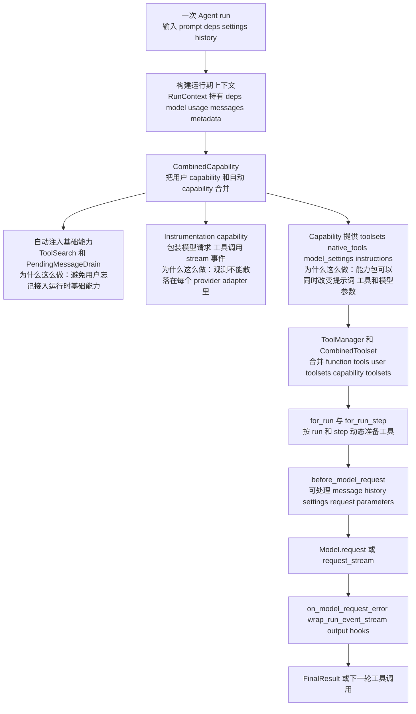

这条链路可以这样理解：PydanticAI 的 Agent 不是只保存 `tools` 和 `output_type`，它还有一层 capability/middleware 体系，用来把“运行前准备、模型请求包装、工具集合、观测、历史处理、输出 hook”统一挂到 Agent run 上。

源码证据：
- `agent/__init__.py:421` 到 `:425`：构造 Agent 时先 `wrap_capability_funcs()`，再 `_inject_auto_capabilities()`，最后用 `CombinedCapability(capabilities)` 形成根 capability。
- `agent/__init__.py:460` 到 `:487`：capability 可以提供 native tools、model settings、toolset；Agent 自身 tools、用户 toolsets、capability toolsets 会分层保存。
- `agent/__init__.py:2767` 到 `:2782`：自动注入 `ToolSearchCap` 和 `PendingMessageDrainCapability`，说明 tool discovery 和 pending message drain 被当成基础运行能力。
- `toolsets/abstract.py:110` 到 `:126`：`for_run()` 和 `for_run_step()` 分别支持按 run 和按 step 动态替换 toolset。
- `toolsets/combined.py:44` 到 `:52`、`:66` 到 `:88`：`CombinedToolset` 会并行解析子 toolset，并在工具名冲突时显式报错。
- `_agent_graph.py:956` 到 `:993`：模型请求前调用 `root_capability.before_model_request()`，处理后的 messages 会写回 `ctx.state.message_history`。

为什么这么设计：

| 设计点 | 设计原因 |
| --- | --- |
| capability 独立于 Agent 主参数 | 观测、工具发现、延迟加载、provider 能力适配都不适合继续塞进 `Agent.__init__` 的参数列表。 |
| toolset 有 `for_run` 和 `for_run_step` | 工具不是静态列表。比如审批工具只在某一步可见，MCP 连接需要生命周期，检索工具可能按租户动态过滤。 |
| `before_model_request` 处理 history | history processor、capability、provider profile 都可能改变消息形状，必须在真正发请求前统一处理。 |
| capability 可贡献 native tools / model settings | 一些能力不是普通函数工具，例如 ToolSearch、provider native tool、instrumentation 配置，需要更靠近模型请求层。 |

分享时可以强调一句：

> PydanticAI 的 middleware 不只是“请求拦截器”，它更像 Agent 运行时能力包：既能改 prompt/history，也能补工具、补原生能力、包裹 stream、接观测。

## 15. 专题补充二：Streaming 细节

图见：[streaming-flow.mmd](streaming-flow.mmd)。

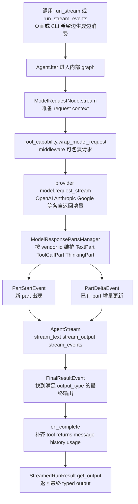

PydanticAI streaming 有两层：

1. provider stream：`Model.request_stream()` 从模型 SDK 拿增量。
2. agent stream：`AgentStream` 把 provider 增量解释成 `TextPart`、`ToolCallPart`、`FinalResultEvent`，再给 `run_stream()`、`run_stream_events()`、`stream_text()`、`stream_output()` 消费。

源码证据：
- `agent/abstract.py:741` 到 `:774`：`run_stream()` 的语义是找到第一个满足 `output_type` 的输出就 yield `StreamedRunResult`，如果要完整跑完图，建议用 `run()` 的 `event_stream_handler` 或 `iter()`。
- `_agent_graph.py:633` 到 `:690`：`ModelRequestNode.stream()` 准备 request context，并在 `_streaming_handler()` 里调用 `req_ctx.model.request_stream(...)`。
- `_agent_graph.py:712` 到 `:718`：streaming 请求同样走 `root_capability.wrap_model_request()`，所以 instrumentation/middleware 不会因为 stream 被绕开。
- `_parts_manager.py:58` 到 `:69`：`ModelResponsePartsManager` 维护 streamed response 的 parts，并基于 tool definition 把 tool call 升级成 typed part。
- `_parts_manager.py:121` 到 `:207`：文本增量会产生 `PartStartEvent` 或 `PartDeltaEvent`。
- `_parts_manager.py:300` 到 `:388`：工具调用增量可能先是 `ToolCallPartDelta`，等 name/args 足够完整后再发 `PartStartEvent`。
- `agent/abstract.py:879` 到 `:950`：遇到 `FinalResultEvent` 后构造 `StreamedRunResult`，`on_complete()` 会补齐工具调用结果、message history 和最终 output。
- `tests/test_streaming.py:4096`、`:4235`、`:4526`、`:4562`：测试覆盖 `PartStartEvent`、`PartDeltaEvent`、`FinalResultEvent` 和 `run_stream_events()`。

代码片段口径：

```python
async with agent.run_stream("帮我查明天上海到北京的航班") as result:
    async for chunk in result.stream_output(debounce_by=None):
        print(chunk)
    final = await result.get_output()
```

这里 `chunk` 可能是部分结构化结果，`final` 才是最终通过 Pydantic 校验的 typed output。演讲时要提醒：streaming 不只是字符串流，它也能承载结构化输出的“部分验证 -> 最终验证”过程。

## 16. 专题补充三：MCP 细节

图见：[mcp-flow.mmd](mcp-flow.mmd)。

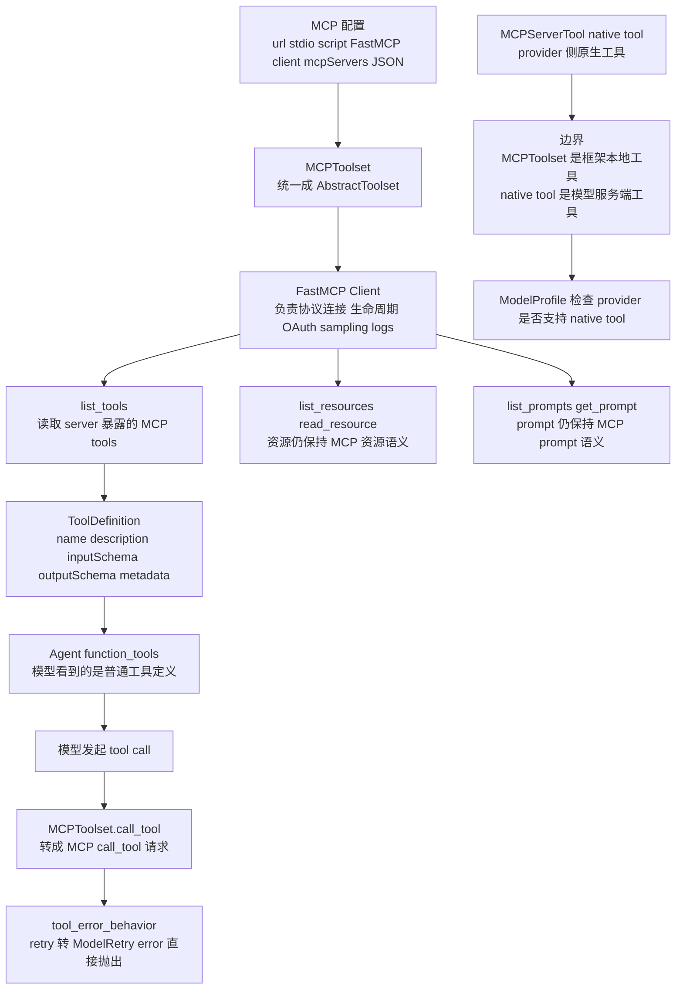

MCP 这里最容易讲混：PydanticAI 里有 `MCPToolset`，也有 provider native tool 里的 `MCPServerTool`。前者是框架本地工具集合，后者是模型服务端原生能力。

源码证据：
- `mcp.py:671` 到 `:677`：`MCPToolset` 基于 FastMCP Client，支持 tools、resources、sampling、elicitation、OAuth 和多种 transport。
- `mcp.py:811` 到 `:843`：构造函数接收 URL、stdio/script、FastMCP client、认证、缓存、sampling、日志、roots 等协议参数。
- `mcp.py:1137` 到 `:1159`：`get_tools()` 把 MCP server 的 tool 映射成 PydanticAI `ToolDefinition`，保留 `inputSchema`、`outputSchema`、annotations、task metadata。
- `mcp.py:1161` 到 `:1167`：`tool_for_tool_def()` 支持从缓存或 durable wrapper 中恢复 tool definition。
- `mcp.py:1254` 到 `:1307`：prompt 仍通过 `list_prompts()` / `get_prompt()` 暴露，不强行塞成普通函数工具。
- `mcp.py:1309` 到 `:1333`：resource 通过 `list_resources()` 暴露，并用 `Resource.from_mcp_sdk()` 转换。
- `mcp.py:1646` 到 `:1699`：`load_mcp_toolsets()` 读取 `mcpServers` JSON，每个 server 变成一个 `MCPToolset`，再用 server 名加 prefix 避免工具名冲突。
- `models/__init__.py:344` 到 `:391`、`:603` 到 `:608`：native tools 会去重，并通过 profile 和 model class 支持能力取交集。

真实例子：

```python
from pydantic_ai import Agent
from pydantic_ai.mcp import MCPToolset

docs = MCPToolset("http://localhost:8000/mcp", id="docs", include_instructions=True)
agent = Agent("openai:gpt-5.2", toolsets=[docs])
```

这个例子里，模型看到的是 `docs` 这个 MCP server 暴露出来的工具；工具执行发生在 PydanticAI 本地 runtime 与 MCP server 之间。若使用 provider 的 `MCPServerTool`，则是模型服务端直接调用 MCP server，鉴权、计费、可观测边界都不同。

## 17. 专题补充四：Provider profile / capability matrix

图见：[provider-profile-matrix.mmd](provider-profile-matrix.mmd)。

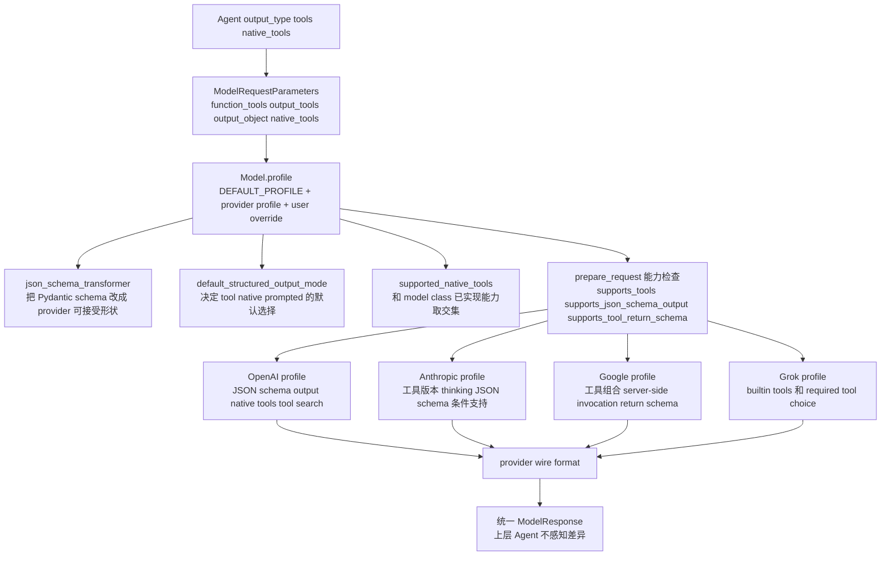

`ModelProfile` 是 PydanticAI 适配多 provider 的关键。它不是简单记录 model name，而是记录“这个模型到底支持哪些结构化输出模式、JSON schema 变体、native tools、tool return schema、thinking、inline system prompt”等能力。

源码证据：
- `models/__init__.py:300` 到 `:312`：`customize_request_parameters()` 会用 `json_schema_transformer` 改写 function tools、output tools、output object。
- `models/__init__.py:315` 到 `:393`：`prepare_request()` 合并 settings，处理 return schema，设置默认 output mode，检查 native/json/tool/image 能力。
- `models/__init__.py:351`：默认结构化输出模式来自 `profile['default_structured_output_mode']`，默认 fallback 是 `tool`。
- `models/__init__.py:381` 到 `:387`：如果模型不支持 native structured output、tool output、image output，会在请求前报错。
- `models/__init__.py:562` 到 `:608`：profile resolution 合并默认 profile、provider profile、用户 override，并把 profile 支持的 native tools 与 model class 实际实现取交集。
- `models/__init__.py:1302` 到 `:1312`：工具 return schema 在不支持原生 return schema 的模型上会被注入描述或清空。
- `profiles/openai.py:226` 到 `:247`：OpenAI profile 按模型名决定 ToolSearch 支持，并设置 `OpenAIJsonSchemaTransformer`、JSON schema output、native tools。
- `profiles/google.py:67` 到 `:77`：Google profile 设置 `GoogleJsonSchemaTransformer`、tools、tool return schema、tool combination 能力。
- `profiles/anthropic.py:243` 到 `:276`：Anthropic profile 按模型名决定 ToolSearch、JSON schema output、native tools。

讲法建议：

> PydanticAI 把 provider 差异前置成 profile，而不是让 Agent 主流程到处写 if openai / if anthropic。这样上层只表达“我要结构化输出、我要这些工具”，底层 profile 决定用 native、tool 还是 prompted，以及 schema 要怎么变形。

## 18. 专题补充五：pydantic_evals 评测闭环案例

图见：[evals-case-flow.mmd](evals-case-flow.mmd)。

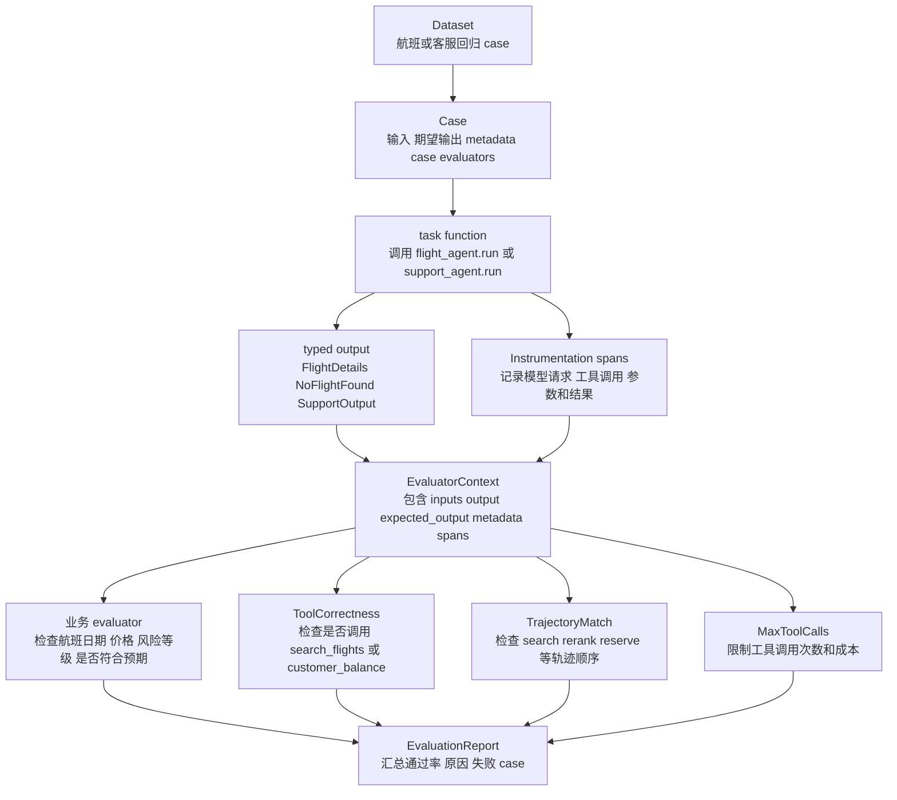

源码证据：
- `pydantic_evals/dataset.py:177` 到 `:181`：`Dataset` 管理 cases、dataset-level evaluators，并可保存为 YAML/JSON。
- `pydantic_evals/dataset.py:281` 到 `:417`：`evaluate()` 对每个 case 跑 task，再执行 evaluators 和 report evaluators。
- `pydantic_evals/dataset.py:417` 到 `:467`：`evaluate_sync()` 提供同步封装。
- `pydantic_evals/evaluators/evaluator.py:133` 到 `:214`：`Evaluator` 基于 `EvaluatorContext` 评估输入、输出、期望输出和 metadata。
- `pydantic_evals/evaluators/agentic.py:191`、`:287`、`:511`：内置 `ToolCorrectness`、`TrajectoryMatch`、`MaxToolCalls`，专门评估 Agent 工具轨迹。
- `examples/pydantic_ai_examples/evals/custom_evaluators.py:18` 到 `:55`：示例自定义 `ValidateTimeRange`、`UserMessageIsConcise`、`AgentCalledTool`。

航班 Agent 评测例子：

```python
from pydantic_evals import Case, Dataset
from pydantic_evals.evaluators import Evaluator, EvaluatorContext, ToolCorrectness, MaxToolCalls

class FlightDateMatches(Evaluator):
    def evaluate(self, ctx: EvaluatorContext) -> bool:
        return ctx.output.date == ctx.expected_output.date

dataset = Dataset(
    cases=[
        Case(
            name="上海到北京明早航班",
            inputs={"from": "SHA", "to": "BJS", "date": "2026-07-09"},
            expected_output={"date": "2026-07-09"},
        )
    ],
    evaluators=[
        FlightDateMatches(),
        ToolCorrectness(expected_tools=["search_flights"]),
        MaxToolCalls(max_calls=2),
    ],
)

report = dataset.evaluate_sync(lambda case: flight_agent.run_sync(case).output)
```

这个例子要讲清楚：评测不只看“答案像不像”，还要看工具路径是否符合预期、有没有过度调用工具、是否能把失败 case 固化成回归集。

客服 Agent 也可以类似评估：
- 输入：“我卡丢了，帮我处理。”
- 期望输出：`block_card=True`、`risk>=7`。
- 工具要求：必须调用 `customer_profile` 或 `freeze_card`。
- 成本约束：模型请求不超过 2 次，工具调用不超过 3 次。

## 19. 专题补充六：和 LangGraph 的组合边界图

图见：[langgraph-boundary-flow.mmd](langgraph-boundary-flow.mmd)。

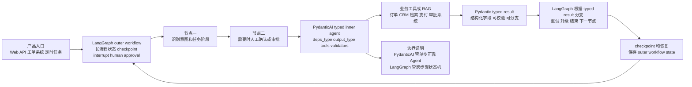

更明确的组合边界：

| 层次 | 建议由谁负责 | 原因 |
| --- | --- | --- |
| 单步业务 Agent | PydanticAI | 依赖、工具入参、结构化输出、output validator、evals 都是 typed-first。 |
| 长流程状态机 | LangGraph | checkpoint、interrupt、人工审批、多节点恢复、跨步骤状态更成熟。 |
| RAG 检索内核 | Haystack / LlamaIndex / 自研 | PydanticAI 可以把检索作为 tool，但不主打 ingestion、索引和 rerank pipeline。 |
| 评测闭环 | PydanticAI + LangSmith/自研观测均可 | PydanticAI 的 `pydantic_evals` 适合代码内回归；外部平台适合团队级可视化。 |

真实场景讲法：

> 如果要做“理赔处理助手”，LangGraph 可以负责外层流程：收集材料、检查缺失项、人工审批、失败恢复、最终归档。每个需要 LLM 判断的节点内部，再调用一个 PydanticAI Agent：它用 typed deps 拿保单和用户信息，用 tools 查订单和规则库，用 `output_type` 返回 `ClaimDecision`。这样 LangGraph 管流程可靠性，PydanticAI 管单步智能可靠性。
