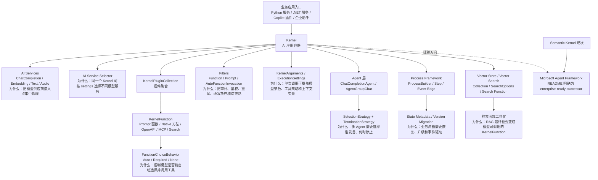
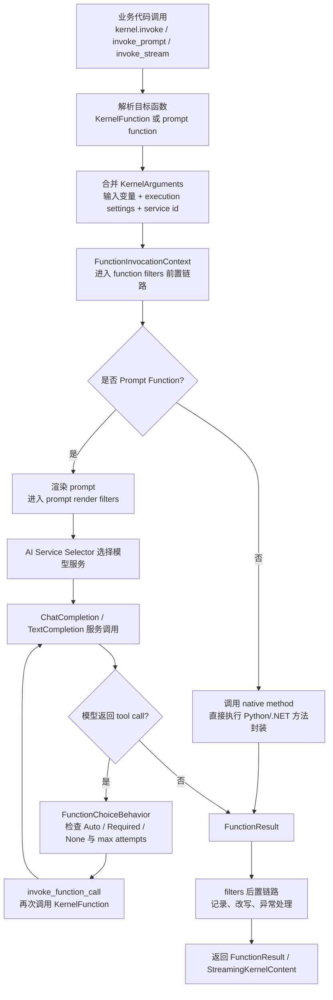
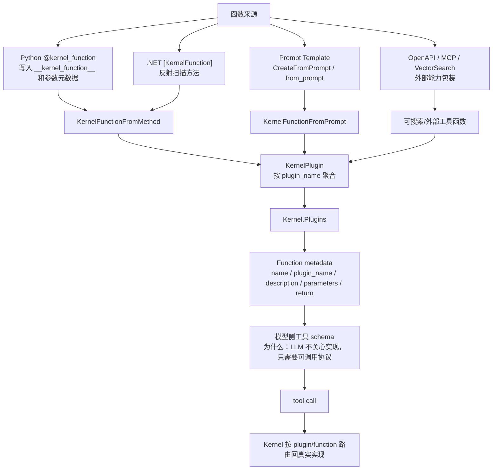
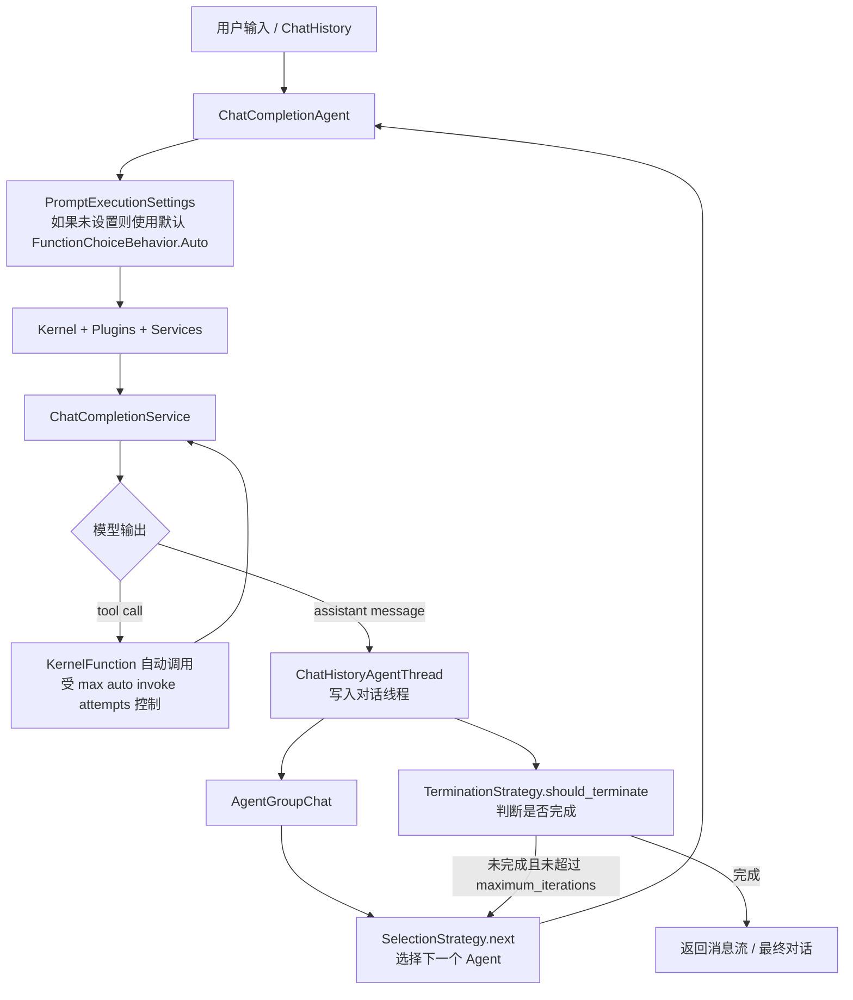
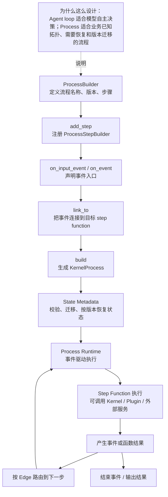
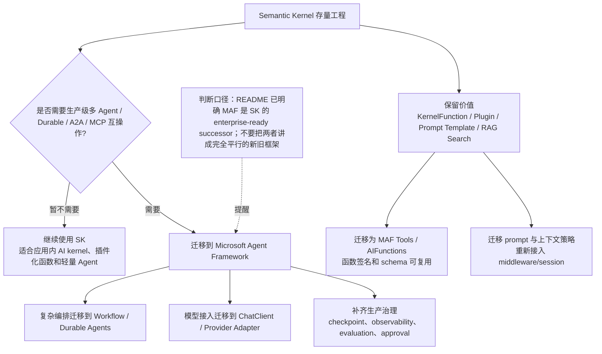
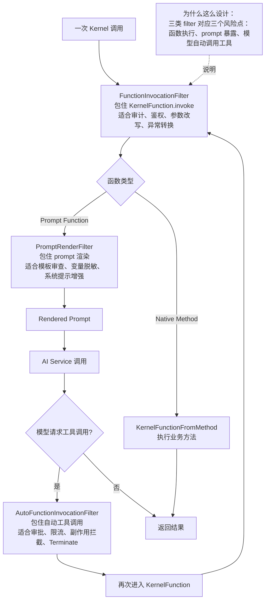
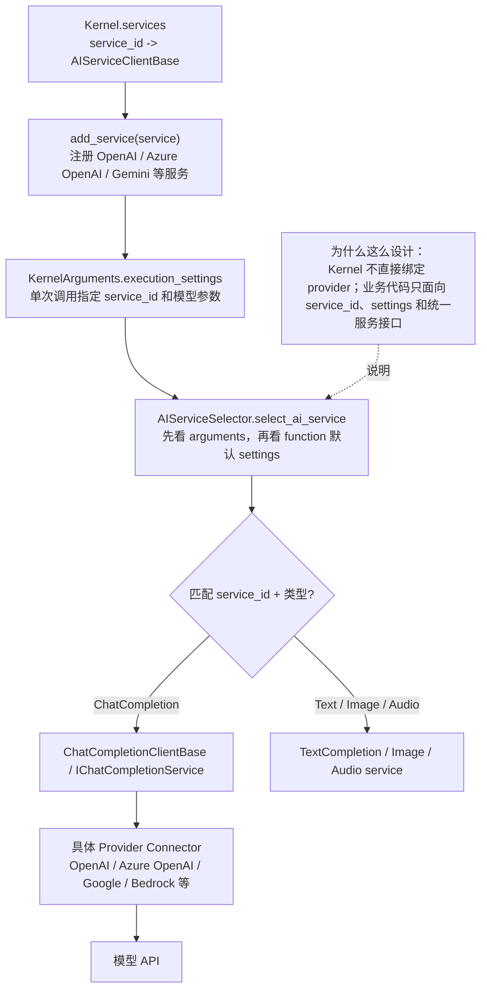
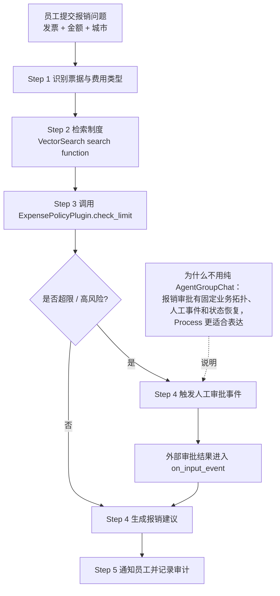

# Microsoft Semantic Kernel 源码分析

源码版本：
- 仓库：`microsoft/semantic-kernel`
- 本地源码：`sources/semantic-kernel`
- 当前来源：`main codeload snapshot`，GitHub commits 页面看到短 SHA `83bffe1`；因 GitHub API rate limit，未拿到完整 SHA。
- 关系说明：仓库 README 明确写到 Semantic Kernel 现在的企业级后继者是 Microsoft Agent Framework。

## 1. 一句话定位

Semantic Kernel 是一个“应用内 AI Kernel”：它把模型服务、插件函数、Prompt 函数、执行参数、过滤器、自动工具调用、Agent、Process 和向量检索统一收进 `Kernel` 这个容器里。它的重点不是只封装一次 LLM 调用，而是让业务系统可以用稳定的插件/函数协议把 AI 能力接到已有应用里。

为什么这么设计：企业应用通常已经有服务、权限、数据库、业务流程和已有代码资产。SK 的思路是把这些资产包装成 `KernelFunction` / `KernelPlugin`，让模型通过工具协议调用；而模型 provider、参数、过滤器和执行上下文留在 Kernel 层统一治理。

## 2. 总体架构图

图源：[architecture.mmd](architecture.mmd)



## 3. 源码分层

| 层级 | 关键文件 | 作用 |
| --- | --- | --- |
| 项目定位 | `sources/semantic-kernel/README.md` | 声明 SK 是 model-agnostic SDK，并说明 MAF 是 enterprise-ready successor |
| Python Kernel | `python/semantic_kernel/kernel.py` | `Kernel` 主入口，管理 filters、plugins、services、service selector |
| Python Function | `python/semantic_kernel/functions/kernel_function.py` | `KernelFunction` 抽象，统一 prompt function 和 method function |
| Python Decorator | `python/semantic_kernel/functions/kernel_function_decorator.py` | `@kernel_function` 把普通方法标注为工具函数并生成元数据 |
| Python Tool Choice | `python/semantic_kernel/connectors/ai/function_choice_behavior.py` | 控制 Auto / Required / None 工具选择与自动调用次数 |
| Python Agent | `python/semantic_kernel/agents/chat_completion/chat_completion_agent.py` | 基于 Kernel 和 ChatCompletion 的 Agent |
| Python GroupChat | `python/semantic_kernel/agents/group_chat/agent_group_chat.py` | 多 Agent 选择与终止策略 |
| Python Process | `python/semantic_kernel/processes/process_builder.py` | 事件驱动流程构建、状态元数据和版本迁移 |
| Python Vector | `python/semantic_kernel/data/vector.py` | 向量集合、检索协议、RAG 搜索函数工具化 |
| .NET Kernel | `dotnet/src/SemanticKernel.Abstractions/Kernel.cs` | .NET 侧 Kernel 容器、PluginCollection、Filters、ServiceSelector |
| .NET Function | `dotnet/src/SemanticKernel.Abstractions/Functions/KernelFunction.cs` | .NET 侧 KernelFunction 调用与 streaming 调用 |
| .NET Agent | `dotnet/src/Agents/Core/ChatCompletionAgent.cs` | .NET Agent 调用 ChatCompletionService，并在需要时 clone Kernel |

## 4. Kernel 主流程

图源：[kernel-invoke-flow.mmd](kernel-invoke-flow.mmd)



源码证据：
- `python/semantic_kernel/kernel.py:62` 定义 `Kernel`，这是 Python 侧主入口。
- `kernel.py:104`、`167`、`215`、`257` 分别提供 stream invoke、普通 invoke、prompt invoke、prompt stream invoke。
- `kernel.py:326` 提供 `invoke_function_call`，说明工具调用最终仍回到 Kernel 统一路由。
- `kernel.py:542` 的 `clone` 逻辑说明 Kernel 可以复制 services/plugins/filter 状态，用于隔离一次 Agent 或函数调用。
- `.NET` 的 `Kernel.cs:26` 定义 `Kernel`，`Kernel.cs:124` 暴露 `Plugins`，`132/140/148` 暴露 function、prompt、auto function invocation filters，`191` 暴露 `ServiceSelector`。

## 5. Plugin / KernelFunction / Tool 化

图源：[plugin-function-flow.mmd](plugin-function-flow.mmd)



源码证据：
- `kernel_function.py:78` 定义 `KernelFunction`，字段包含 name、plugin_name、description、parameters、return metadata。
- `kernel_function.py:128` 和 `156` 分别从 prompt、method 创建函数。
- `kernel_function.py:228` 抽象 `_invoke_internal`，`240` 的 `invoke` 负责创建 invocation context 并进入 filter 调用链。
- `kernel_function_decorator.py:13` 定义 `kernel_function` decorator；`61`、`71`、`76-79` 把函数标记、参数和返回值元数据写入方法属性。
- `.NET` `KernelFunctionFactory.cs:33-162` 提供多种 `CreateFromMethod`，`188-347` 提供 `CreateFromPrompt`。
- `.NET` `KernelPluginFactory.cs:246-250` 扫描 `[KernelFunction]` 方法并转换成 `KernelFunction`。

核心设计思想：SK 没有让模型直接知道“Python 函数”或“.NET 方法”。它先统一成 `KernelFunction`，再放入 `KernelPlugin`，最后暴露元数据给模型。这是典型的 Adapter + Metadata-driven Tooling 范式。

## 6. FunctionChoiceBehavior：自动工具调用控制层

`FunctionChoiceBehavior` 是 SK 从“函数注册”走向“模型自动调用工具”的关键控制点。它不只是开关，而是把工具选择模式、过滤条件和最大自动调用次数放进同一个策略对象。

源码证据：
- `function_choice_behavior.py:18` 设置默认最大自动调用次数 `DEFAULT_MAX_AUTO_INVOKE_ATTEMPTS = 5`。
- `function_choice_behavior.py:27` 定义 `FunctionChoiceBehavior`。
- `function_choice_behavior.py:66-73` 通过 `maximum_auto_invoke_attempts` 推导并设置是否自动调用 kernel functions。
- `function_choice_behavior.py:110`、`134`、`157` 分别提供 `Auto`、`NoneInvoke`、`Required`。
- `chat_completion_agent.py:120-122` 让 `ChatCompletionAgent` 默认使用 `FunctionChoiceBehavior.Auto()`。
- `chat_completion_agent.py:426-427`、`523-524` 在 settings 没设置时回填 agent 默认工具选择策略。

为什么这么设计：工具调用有真实副作用，不能只靠模型自由发挥。`Auto` 适合助手自己决定是否调用工具，`Required` 适合必须走工具的场景，`NoneInvoke` 适合纯问答或安全隔离场景；最大调用次数则防止模型陷入无限工具循环。

## 7. Agent / GroupChat

图源：[agent-group-chat-flow.mmd](agent-group-chat-flow.mmd)



源码证据：
- `chat_completion_agent.py:117` 定义 `ChatCompletionAgent`。
- `chat_completion_agent.py:328` 和 `376` 提供普通 invoke 与 streaming invoke。
- `agent_group_chat.py:30` 定义 `AgentGroupChat`。
- `agent_group_chat.py:37-41` 持有 `termination_strategy` 与 `selection_strategy`。
- `agent_group_chat.py:149-158` 在最大迭代次数内选择 Agent、执行 Agent、判断终止。
- `agent_group_chat.py:200-210` streaming 版也走同样的选择和终止策略。

设计范式：Strategy Pattern。多 Agent 协作里“谁发言”和“何时停止”是变化点，SK 把它们抽成 SelectionStrategy / TerminationStrategy，而不是硬编码在 group chat loop 里。

## 8. Process Framework

图源：[process-flow.mmd](process-flow.mmd)



源码证据：
- `process_builder.py:34` 定义 `ProcessBuilder`。
- `process_builder.py:37-40` 保存 entry steps、external event map、steps、version。
- `process_builder.py:45`、`119`、`132`、`142` 分别对应 add step、输入事件、事件入口和链接。
- `process_builder.py:164` 构建 `KernelProcess`。
- `process_builder.py:182` 开始处理 state metadata 校验、迁移与清理；`223-237` 处理版本匹配和迁移逻辑。

Process 的定位：它更像业务流程图，而不是纯 Agent 图。已知拓扑、审批、状态恢复、版本升级更适合 Process；让模型自由选择下一步的任务更适合 Agent loop。

## 9. Vector Store / RAG 细节

SK 的向量模块不是一个孤立的“memory 小工具”，而是一套数据抽象：字段定义、collection 定义、search options、collection protocol、vector search protocol，并且可以把搜索包装成 `KernelFunction`。

源码证据：
- `vector.py:278` 定义 `VectorStoreField`。
- `vector.py:421` 定义 `VectorStoreCollectionDefinition`。
- `vector.py:742` 定义 `VectorSearchOptions`。
- `vector.py:1133` 定义 `VectorStoreCollection`。
- `vector.py:1282` 提供 public `upsert`。
- `vector.py:1866` 提供 `hybrid_search`。
- `vector.py:2011` 提供 `create_search_function`。
- `vector.py:2093-2131` 的 `search_wrapper` 用 `@kernel_function` 包装检索逻辑。
- `vector.py:2261` 定义 `VectorSearchProtocol`，`2305` 提供 `hybrid_search` 协议。

关键理解：RAG 在 SK 里最终会回到工具化。检索不是只在回答前手写一段代码，而是可以作为模型可选择的搜索函数，这样 Agent 可以在需要证据时主动调用检索。

## 10. .NET 主线

.NET 侧的架构和 Python 侧保持概念一致，但更贴近 .NET DI、`IServiceProvider` 和强类型接口。

源码证据：
- `Kernel.cs:57-64` 构造 `Kernel` 时接收 `IServiceProvider` 和 `KernelPluginCollection`。
- `Kernel.cs:85` 提供 `Kernel.CreateBuilder()`。
- `Kernel.cs:156` 暴露 `Services`，`191-193` 通过 service provider 获取 `IAIServiceSelector`，没有则使用 ordered selector。
- `KernelFunction.cs:30` 让 `KernelFunction` 继承 `FullyQualifiedAIFunction`。
- `KernelFunction.cs:235-306` 是普通 `InvokeAsync`，`321-340` 是 streaming invoke。
- `KernelFunction.cs:478-482` 说明作为 `AIFunction` 调用时会按优先级获取 Kernel。
- `ChatCompletionAgent.cs:26` 定义 .NET `ChatCompletionAgent`，`62` 和 `165` 分别是普通和 streaming 调用。
- `ChatCompletionAgent.cs:76-84` 获取 Kernel，并从 `AIContextProviders` 获取上下文工具；`179-187` streaming 也走同样逻辑。

## 11. 真实例子：企业报销规则助手

场景：员工问“我这张 780 元的客户餐饮发票能不能报销，需要谁审批？”

用 SK 的拆法：
1. `ExpensePolicyPlugin` 暴露 `get_policy(city, expense_type)`、`check_limit(amount, expense_type)`、`find_approver(employee_id)` 三个 `KernelFunction`。
2. `VectorSearch` 把公司报销制度、地区规则、历史 FAQ 包装成一个搜索函数。
3. `ChatCompletionAgent` 默认 `FunctionChoiceBehavior.Auto()`，模型可以先检索制度，再调用限额检查和审批人查询。
4. `FunctionInvocationFilter` 可记录审计日志，或阻止模型调用会产生真实报销单的写操作。
5. 如果流程固定，例如“识别发票 -> 查规则 -> 找审批人 -> 生成人工确认单”，可用 Process Framework 建成事件驱动流程。

一个简化代码片段：

```python
from semantic_kernel.functions import kernel_function

class ExpensePolicyPlugin:
    @kernel_function(description="查询指定城市和费用类型的报销规则")
    def get_policy(self, city: str, expense_type: str) -> str:
        return "客户餐饮单笔 800 元以内可报销，超过需要部门负责人审批"

    @kernel_function(description="检查报销金额是否超过规则上限")
    def check_limit(self, amount: float, expense_type: str) -> str:
        return "未超限" if amount <= 800 else "超限，需要额外审批"
```

这段代码能作为证据对应 `kernel_function_decorator.py:13` 和 `61-79`：普通业务方法通过 decorator 写入函数元数据，然后进入 Kernel 的 plugin/function 体系。

## 12. 与 Microsoft Agent Framework 的迁移关系

图源：[migration-flow.mmd](migration-flow.mmd)



README 的关键证据：
- `README.md:4` 明确写到 Semantic Kernel 现在是 Microsoft Agent Framework，MAF 是 enterprise-ready successor。
- `README.md:17` 仍把 SK 定位为 model-agnostic SDK，用于 build、orchestrate、deploy AI agents and multi-agent systems。
- `README.md:31-35` 仍列出 Plugin Ecosystem、Vector DB Support、Process Framework 等能力。

分享时可以这样讲：SK 更像“把 AI 能力嵌入应用的 Kernel 和插件体系”；MAF 更像“生产级 Agent/Workflow runtime”。存量 SK 的 Plugin / Function / Prompt / RAG 资产不应被丢弃，而是迁移成 MAF 的 tool、context、workflow 节点和 provider client。

## 13. Filter 链路细拆

图源：[filter-chain-flow.mmd](filter-chain-flow.mmd)



三类 filter 的边界：

| Filter | 拦截位置 | 适合做什么 | 不适合做什么 |
| --- | --- | --- | --- |
| FunctionInvocationFilter | 每次 `KernelFunction.invoke` 外层 | 审计、鉴权、参数校验、异常转换、结果脱敏 | 不适合只针对 prompt 模板细节 |
| PromptRenderFilter | Prompt function 渲染阶段 | prompt 审查、变量脱敏、模板增强、注入系统约束 | 不适合拦截 native method 的真实副作用 |
| AutoFunctionInvocationFilter | 模型自动 tool call 前后 | 工具审批、限流、阻止危险工具、设置 terminate | 不适合替代工具本身的业务校验 |

源码证据：
- `filters/kernel_filters_extension.py:30-35` 定义三类 filter 列表：function invocation、prompt rendering、auto function invocation。
- `filters/kernel_filters_extension.py:37-59` 的 `add_filter` 把 filter 插入列表头部，并说明先添加的 filter 会先执行、后置逻辑最后执行。
- `filters/kernel_filters_extension.py:102-112` 的 `construct_call_stack` 把 filter 和 inner function 组装成 next 链路。
- `kernel_function.py:262` 创建 `FunctionInvocationContext`，随后 `KernelFunction.invoke` 进入 filter 链。
- `kernel_function_from_prompt.py:277` 创建 `PromptRenderContext`，说明 prompt 渲染有独立上下文。
- `kernel.py:429` 创建 `AutoFunctionInvocationContext`，`465` 附近进入自动函数调用处理。
- `.NET` `Kernel.cs:37-42` 保存三类 filter 集合，`132/140/148` 暴露对应集合。
- `.NET` `KernelFunctionInvokingChatClient.cs:41-57` 递归执行 `IAutoFunctionInvocationFilter`，`95` 附近检查 filter 是否请求 terminate。

为什么值得单独讲：Filter 是 SK 的治理扩展点。没有 filter，Plugin/Function 只是“让模型能调工具”；有了 filter，才能把审计、权限、安全、脱敏、审批、观测放进统一链路。

## 14. Connector / Provider 适配细节

图源：[provider-adapter-flow.mmd](provider-adapter-flow.mmd)



源码证据：
- `services/kernel_services_extension.py:26-33` 定义 `KernelServicesExtension`，其中 `services` 是 `service_id -> AIServiceClientBase` 映射，`ai_service_selector` 默认是 `AIServiceSelector`。
- `kernel_services_extension.py:55-66` 的 `select_ai_service` 把选择逻辑委托给 selector。
- `kernel_services_extension.py:68-109` 的 `get_service` 按 `service_id` 和 type 取服务，默认 service_id 不存在时会回退到第一个符合类型的服务。
- `kernel_services_extension.py:119-127` 可根据 service_id 生成对应 `PromptExecutionSettings`。
- `kernel_services_extension.py:129-139` 的 `add_service` 支持注册服务并控制是否覆盖。
- `services/ai_service_selector.py:17` 定义可继承的 `AIServiceSelector`。
- `ai_service_selector.py:35-38` 说明选择顺序：先看 arguments 里的 execution settings，再看 function 自带 settings；同一 service_id 时 arguments 优先。
- `ai_service_selector.py:60-66` 遍历 execution settings，用 `kernel.get_service` 匹配具体服务和 settings class。
- `.NET` `Kernel.cs:156` 暴露 `Services`，`191-193` 通过 service provider 获取 `IAIServiceSelector`。
- `.NET` 测试中 `OpenApi/RestApiOperationTests.cs:926-936` 同时注册 OpenAI 和 Azure OpenAI chat completion，并通过 service id 取回对应服务。

设计判断：SK 的 provider 适配不是“某个 connector 直接散落在业务代码里”，而是 `service_id + PromptExecutionSettings + AIServiceSelector` 三件套。这样一个 Kernel 可以同时挂 OpenAI、Azure OpenAI、Google 或其他服务，单次调用通过 settings 决定走哪个 provider。

## 15. Process Framework 真实业务案例

图源：[process-case-flow.mmd](process-case-flow.mmd)



业务落地解释：
1. `IntakeStep` 负责解析发票图片、金额、城市、费用类型。
2. `PolicySearchStep` 调用 Vector Search function 检索公司制度。
3. `CheckLimitStep` 调用 `ExpensePolicyPlugin.check_limit` 判断是否超限。
4. 如果超限，Process 发出外部审批事件；审批系统回调后，通过 `on_input_event` 回到流程。
5. 最后 `NotifyStep` 返回建议，并写审计日志。

源码证据：
- `process_builder.py:37-40` 保存 entry steps、external event target map、steps、version。
- `process_builder.py:119-126` 用 `where_input_event_is` 建立外部输入事件到目标 step 的映射。
- `process_builder.py:142-147` 的 `link_to` 把事件 id 连接到 edge builder，并登记 entry step。
- `process_builder.py:164-175` 构建 `KernelProcess`。
- `process_builder.py:182-237` 处理 state metadata、版本匹配和迁移。

和 AgentGroupChat 的边界：如果任务是“多个专家围绕问题讨论”，用 AgentGroupChat；如果任务是“已知业务步骤 + 外部事件 + 状态恢复 + 审批回调”，用 Process 更自然。

## 16. SK -> MAF 迁移专题

| Semantic Kernel 资产 | 迁移到 MAF 的对应物 | 迁移建议 | 风险点 |
| --- | --- | --- | --- |
| `KernelPlugin` | MAF tools / tool collection | 按业务域拆分工具组，保留函数描述和参数 schema | 插件里如果混有副作用函数，要补 approval / security |
| `KernelFunctionFromMethod` | MAF function tool / AIFunction | 保留函数签名、description、参数注解，重接 middleware | 异步、依赖注入、异常语义可能要适配 |
| Prompt function / template | MAF instructions / prompt assets / context provider | 把模板变量和上下文注入逻辑拆出来 | prompt filter 里的改写逻辑不要丢 |
| `FunctionChoiceBehavior.Auto/Required/None` | MAF tool choice / middleware / approval policy | Auto 迁为默认工具选择，Required 迁为强制工具节点或 policy | 自动调用次数、停止条件需要重新校准 |
| `FunctionInvocationFilter` | MAF middleware / tool invocation middleware | 审计、鉴权、脱敏逻辑迁到 middleware | 原 filter 执行顺序要重新验证 |
| `AutoFunctionInvocationFilter` | MAF approval / security / tool middleware | 高风险工具先迁，增加人工审批或 terminate 策略 | 忽略会导致副作用工具裸奔 |
| `ProcessBuilder` | MAF Workflow / Durable Agents | 长任务、审批、恢复、版本迁移优先迁 | 状态 schema 和历史 checkpoint 兼容需要专项处理 |
| `VectorSearch.create_search_function` | MAF tool 调用 RAG service | 搜索函数可先独立成后端服务，再挂成 tool | 检索结果格式和引用来源要保持稳定 |

迁移顺序建议：
1. 先盘点 SK 资产：plugins、functions、prompt templates、filters、processes、vector search functions。
2. 把无副作用查询工具迁到 MAF tools，作为低风险第一批。
3. 把有副作用工具迁到 MAF tool middleware / approval 后再开放自动调用。
4. 把固定业务流程从 `ProcessBuilder` 迁到 MAF Workflow / Durable Agents。
5. 最后迁移 AgentGroupChat 或多 Agent 场景，因为这里通常涉及选择策略、终止条件和消息历史兼容。

判断口径：SK 不是“没价值了”，它的存量价值在插件函数和应用内 Kernel 资产；MAF 承担的是后继生产运行时、Durable、A2A/MCP 互操作、观测和评测闭环。

## 17. 对比分析

| 框架 | 更像什么 | 与 SK 的边界 |
| --- | --- | --- |
| Microsoft Agent Framework | 生产级 Agent / Workflow runtime | README 已把 MAF 定位为 SK 后继者；新生产级多 Agent 项目优先看 MAF |
| LangChain | 组件生态和 Agent/RAG 编排入口 | LangChain 更生态化，SK 更强调 Kernel + Plugin + Function 的应用内容器 |
| LangGraph | 状态图和可恢复执行 | LangGraph 更适合显式状态图；SK Process 能表达业务流程，但 SK 的核心仍是 Kernel/plugin |
| LlamaIndex | 数据/RAG 框架 | LlamaIndex 更偏 ingestion/index/retriever；SK 向量检索最终会工具化到 KernelFunction |
| Haystack | Pipeline / Component RAG | Haystack 的组件图更强；SK 更适合把检索、业务函数、prompt 函数统一给 Agent 使用 |
| OpenAI Agents Python | 轻量 Agent SDK | OpenAI Agents 更贴近 Responses/Tracing/Handoff；SK 更适合 .NET/Python 双栈和存量插件体系 |
| PydanticAI | typed agent + schema | PydanticAI 类型约束更鲜明；SK 的核心抽象是 KernelFunction metadata 和 plugin 容器 |

## 18. 核心设计思想

1. Kernel as Application AI Container：Kernel 不是简单 client，而是 services、plugins、filters、arguments、selector 的容器。
2. Plugin-first：业务能力先插件化，再交给模型选择或业务代码显式调用。
3. Function as Protocol：无论 prompt、native method、OpenAPI、MCP、vector search，最后都尽量变成 `KernelFunction`。
4. Strategy Pattern：FunctionChoiceBehavior、SelectionStrategy、TerminationStrategy 把变化点外置。
5. Filter Chain：函数调用、prompt render、自动工具调用都允许进入过滤器链路，便于治理。
6. Dual-runtime Symmetry：Python 和 .NET 保持概念对齐，方便微软生态和企业系统接入。
7. Evolutionary Migration：README 已指向 MAF，说明 SK 的资产价值在插件/函数/prompt/RAG，而生产级 runtime 方向正在向 MAF 演进。

## 19. 分享口径

开场可以先说：Semantic Kernel 的名字里最重要的词是 Kernel。它想做的不是“再封装一个模型调用”，而是给应用一个 AI 内核，把模型服务、业务函数、Prompt、插件、过滤器、Agent 和检索统一起来。

三条主线：
1. Kernel 主线：一次调用如何从 `kernel.invoke` 进入 KernelFunction、filters、AI service selector，再返回结果。
2. Tool 主线：普通业务方法如何通过 decorator / attribute 变成 KernelFunction，再进入 plugin 和模型工具 schema。
3. 演进主线：SK 仍适合存量插件和应用内 AI 能力，但 README 已明确生产级后继方向是 Microsoft Agent Framework。

总结句：如果说 LangGraph 的核心是“状态图”，LlamaIndex 的核心是“数据索引”，那么 Semantic Kernel 的核心就是“把业务能力工具化后装进 Kernel，让模型和应用都能用同一套函数协议调用”。
