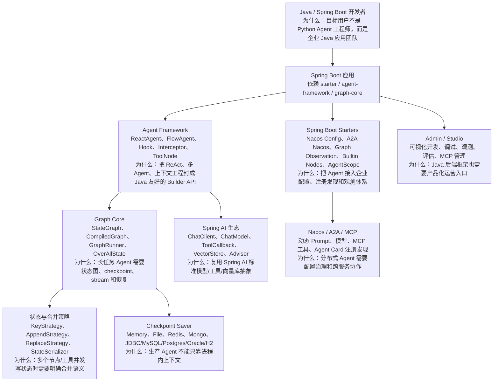
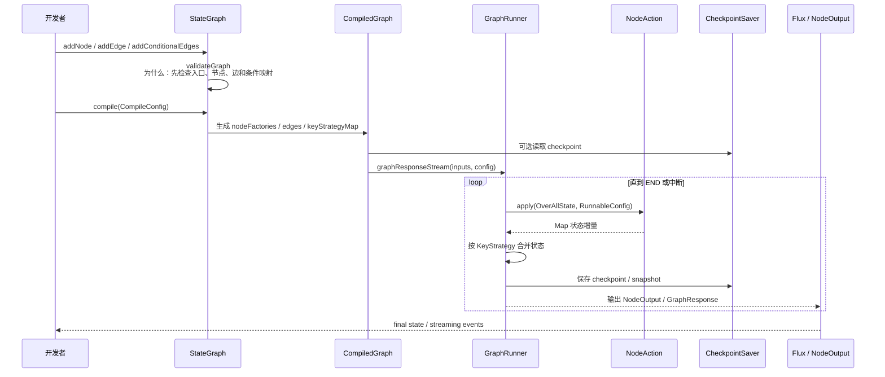
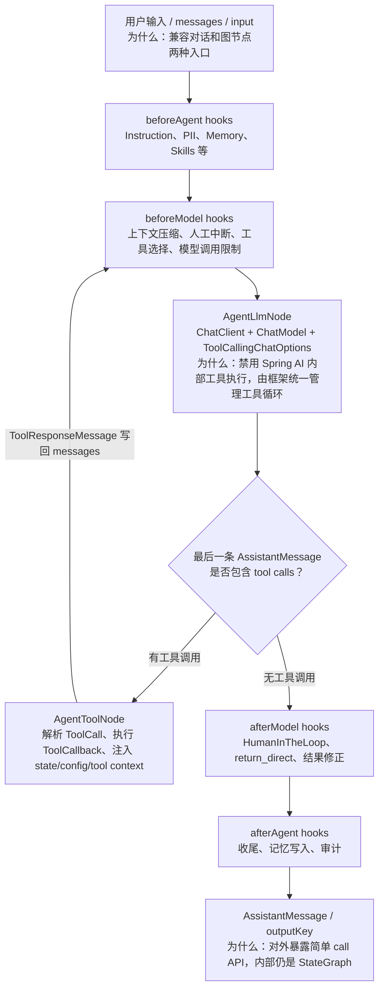
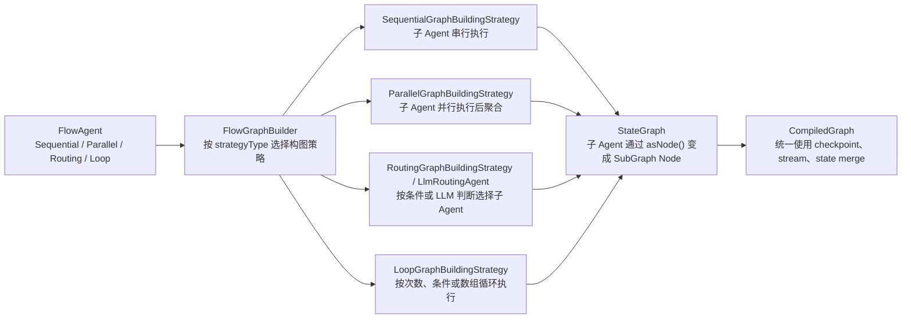
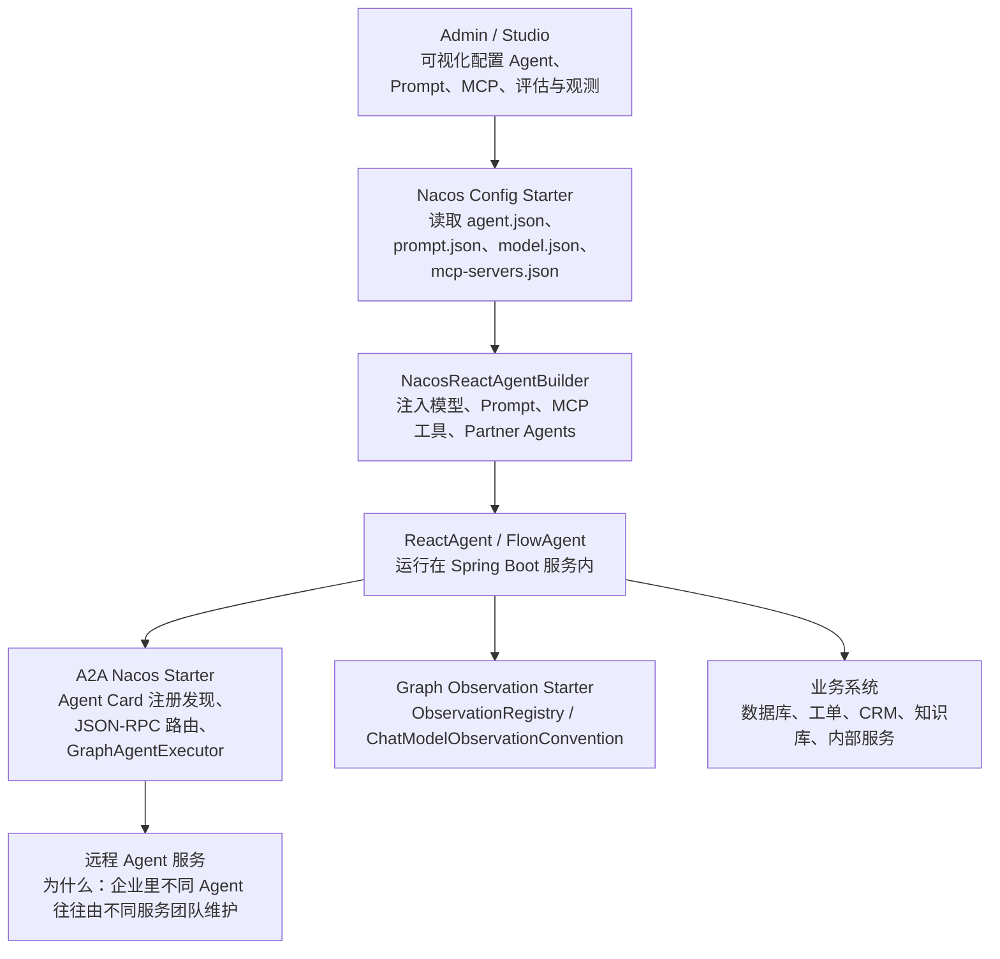
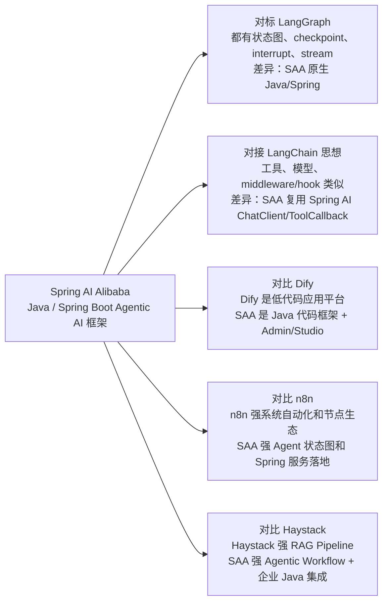

# Spring AI Alibaba 源码分析

分析对象：`sources/spring-ai-alibaba`。源码来自 `alibaba/spring-ai-alibaba` 的 GitHub main 快照，固定提交为 `4a823250415e7a42deb650410edf6948c35875bd`，提交时间 `2026-07-05T14:36:47Z`，提交信息为 `fix(a2a): populate message/chunk/outputType on A2A streaming outputs (#4761)`。根 `pom.xml` 显示版本 `1.1.2.2`，Java `17`，Spring AI `1.1.2`，Spring Boot `3.5.8`。

> 一句话定位：Spring AI Alibaba 是 **面向 Java / Spring Boot 开发者的生产级 Agentic AI 框架**。它不是单纯的模型 starter，而是把 `Graph Core` 状态图运行时、`Agent Framework`、Spring AI 模型/工具生态、Nacos/A2A/MCP 企业集成和 Admin/Studio 产品化入口组合在一起。

## 1. 总体结论

Spring AI Alibaba 的源码主线可以拆成三层：

1. **Graph Core**：`StateGraph -> CompiledGraph -> GraphRunner -> CheckpointSaver`，解决长任务 Agent 的状态推进、分支、并行、恢复、流式输出。
2. **Agent Framework**：`ReactAgent -> AgentLlmNode / AgentToolNode -> Hook / Interceptor -> FlowAgent`，把 ReAct、多 Agent、上下文工程、人工中断和工具执行封成 Java Builder API。
3. **Spring 企业集成层**：`spring-boot-starters`、Nacos Config、A2A Nacos、Graph Observation、Builtin Nodes、Admin/Studio，解决 Java 应用如何被配置、发布、观测和跨服务协作。

分享时可以这样讲：

> LangGraph 让 Python Agent 有了状态图运行时，Spring AI Alibaba 则是在 Java / Spring Boot 生态里做类似事情，并且进一步接入 Nacos、A2A、MCP、Spring AI、Admin/Studio，让企业 Java 团队能把 Agent 作为 Spring 服务落地。

## 2. 源码阅读路线图

如果是第一次读 Spring AI Alibaba，不建议从所有目录平铺展开。更好的顺序是先抓住“构建信息 -> 状态图运行时 -> Agent 封装 -> 多 Agent 编排 -> 企业集成 -> 示例验证”这条线。

| 顺序 | 先看什么 | 重点问题 | 为什么先看这里 |
| --- | --- | --- | --- |
| 1 | `pom.xml`、根 README | 这是一个什么类型的 Java 项目？有哪些模块？当前依赖栈是什么？ | 先确定它不是单 starter，而是 Maven 多模块工程，包含 graph-core、agent-framework、starters、admin/studio 和 examples。 |
| 2 | `spring-ai-alibaba-graph-core/StateGraph.java` | 图怎么声明节点、边、条件边、并行边？ | 这是底层抽象入口。读懂 `StateGraph`，才知道 Agent workflow 最终如何变成可执行状态图。 |
| 3 | `CompiledGraph.java`、`GraphRunner` 相关类 | 图编译后怎么运行、流式输出、保存 checkpoint？ | `CompiledGraph` 是运行时核心，解释为什么框架可以支持长任务、恢复、中断和 streaming。 |
| 4 | `OverAllState`、`KeyStrategy`、`CheckpointSaver` | 状态怎么合并？失败后怎么恢复？ | Agent 系统的难点不是一次调用模型，而是多节点、多工具、多轮执行时状态不能乱。 |
| 5 | `ReactAgent.java` | ReAct loop 怎么被包装成图？ | 这是对外最容易理解的 Agent API，也是从 Graph Core 过渡到 Agent Framework 的关键。 |
| 6 | `AgentLlmNode.java`、`AgentToolNode.java` | 模型节点和工具节点如何分工？为什么工具执行由框架接管？ | 这里能看到 Spring AI `ChatClient` / `ToolCallback` 和框架自身 tool loop 的边界。 |
| 7 | `FlowGraphBuilder.java`、`SequentialAgent`、`ParallelAgent`、`RoutingAgent`、`LoopAgent` | 多 Agent workflow 怎么构图？ | 这条线解释它不只是单 Agent，而是支持顺序、并行、路由、循环等组合。 |
| 8 | `spring-boot-starters/*` 中的 Nacos、A2A、MCP、Observation | 企业配置、远程 Agent、工具生态和观测如何接入？ | 这是 Spring AI Alibaba 区别于普通 Agent 框架的地方：它把 Agent 放进企业 Java 基础设施。 |
| 9 | `examples/multiagent-patterns`、`examples/chatbot`、`examples/deepresearch` | 这些抽象在真实代码里怎么用？ | 最后用 examples 反向验证前面的理解，避免只讲抽象类和接口。 |

分享时可以把这条路线压缩成一句话：**先看 `pom.xml` 定位项目，再看 `StateGraph/CompiledGraph` 理解运行时，然后看 `ReactAgent/AgentToolNode` 理解 Agent loop，最后看 `Nacos/A2A/MCP starters` 理解企业落地。**

## 3. 演讲口径版总结

这一节适合在分享开头或结尾使用，目标是在 5-8 分钟内讲清楚 Spring AI Alibaba 的价值。

**第一分钟：先讲定位。**
Spring AI Alibaba 不是简单的 Spring AI 模型 starter，而是面向 Java / Spring Boot 团队的 Agentic AI 框架。它把 Agent 的状态图运行时、ReAct loop、多 Agent flow、工具调用治理、Nacos/A2A/MCP 企业集成和 Admin/Studio 产品化入口放在同一个工程里。

**第二到三分钟：讲为什么需要 Graph Core。**
真实 Agent 不是一次 `chat()` 调用，而是多轮状态推进：先判断意图，再检索知识，再调用工具，再决定是否人工审批，还要支持失败恢复和流式输出。所以源码里用 `StateGraph` 表达节点和边，用 `CompiledGraph` 负责编译后的执行，用 `CheckpointSaver` 保存状态，用 `KeyStrategy` 明确状态合并语义。

**第四到五分钟：讲 ReactAgent 怎么跑。**
`ReactAgent` 把常见的 ReAct loop 封装成图：用户输入进入 hook，模型节点生成回答或 tool call，工具节点执行 `ToolCallback`，结果写回 messages，再回到模型节点，直到没有工具调用为止。这里最关键的设计是：工具执行不交给 Spring AI 内部自动完成，而是由 `AgentToolNode` 接管，这样 checkpoint、Human-in-the-loop、ToolInterceptor 和状态合并才能统一治理。

**第六分钟：讲企业特征。**
Spring AI Alibaba 的差异不只是“Java 版 Agent”。Nacos Config 让 Prompt、模型、MCP 工具、Agent 配置可以动态治理；A2A Nacos 让不同服务里的 Agent 可以注册发现；Observation 让图节点、模型调用、工具调用进入企业观测体系。这些设计说明它面向的是生产环境里的 Java 服务，而不是只在 Notebook 里跑 demo。

**第七到八分钟：讲怎么和 LangGraph 对比。**
它和 LangGraph 的共同点是状态图、checkpoint、stream、人类中断和复杂 Agent workflow。差异是 LangGraph 更适合 Python/JS 代码级 Agent 状态机，Spring AI Alibaba 更适合 Java / Spring Boot 企业团队，把 Agent 接入 Spring AI、Nacos、A2A、MCP、Observation 和已有服务治理体系。

一句话收束：**如果团队主栈是 Python，复杂状态机优先看 LangGraph；如果团队主栈是 Java/Spring，并且要把 Agent 做成可配置、可观测、可恢复、可跨服务协作的后端服务，Spring AI Alibaba 更贴近落地场景。**

## 4. 最高层架构

架构图见：[architecture.mmd](architecture.mmd)。



源码证据：

| 结论 | 证据 |
| --- | --- |
| 这是 Maven 多模块 Java 项目 | `sources/spring-ai-alibaba/pom.xml:51` 到 `:62` 声明 `graph-core`、`agent-framework`、`studio`、`sandbox`、多个 `spring-boot-starters`。 |
| 当前快照版本和技术栈 | `sources/spring-ai-alibaba/pom.xml:89`、`:92`、`:99`、`:101` 显示版本、Java、Spring AI、Spring Boot。 |
| README 明确三层定位 | `sources/spring-ai-alibaba/README.md` 中描述 Admin、Agent Framework、Graph 分别负责平台、Agent 开发、底层运行时。 |
| Graph 是 Agent Framework 底层运行时 | `StateGraph.java:52`、`CompiledGraph.java:59`、`ReactAgent.java:311`。 |

## 5. 项目结构

| 模块 | 作用 | 分享时怎么讲 |
| --- | --- | --- |
| `spring-ai-alibaba-graph-core` | 状态图、节点、边、条件路由、并行、checkpoint、store、stream、serializer | “Java 版 Agent 状态图运行时”。 |
| `spring-ai-alibaba-agent-framework` | ReactAgent、FlowAgent、Hook、Interceptor、ToolNode、Agent as node | “把底层图运行时包装成 Agent 开发框架”。 |
| `spring-boot-starters/*` | A2A Nacos、Nacos Config、Graph Observation、Builtin Nodes、AgentScope | “让 Agent 接入 Spring Boot 企业基础设施”。 |
| `spring-ai-alibaba-admin` / `studio` | 可视化开发、调试、观测、MCP 管理、评估 | “面向产品化和运维的一层”。 |
| `examples` | chatbot、voice-agent、multimodal、deepresearch、multiagent patterns、RAG workflow | “源码分析不要只看框架类，要用 examples 验证设计意图”。 |

## 6. 主流程一：Graph Core 如何运行

流程图见：[graph-flow.mmd](graph-flow.mmd)。



关键源码：

- `StateGraph.java:239` 到 `:309`：`addNode()` 支持普通节点、条件节点、并行条件节点。
- `StateGraph.java:373` 到 `:486`：`addEdge()`、`addConditionalEdges()`、`addParallelConditionalEdges()` 建立普通边、条件边和并行条件边。
- `StateGraph.java:530` 到 `:546`：`compile()` 校验图并创建 `CompiledGraph`，默认注册 `MemorySaver`。
- `CompiledGraph.java:79`、`:142`：编译时把节点保存为 `nodeFactories`，强调线程安全。
- `CompiledGraph.java:258`、`:310`、`:442`、`:464`：围绕 checkpoint saver 读取、更新、保存状态。
- `CompiledGraph.java:549` 到 `:638`：对外暴露 `graphResponseStream()`、`stream()`、`streamSnapshots()`。
- `CompiledGraph.java:648`、`:692`：支持同步 `invoke()` 和 `schedule()`。

设计解释：

| 设计点 | 为什么这么做 |
| --- | --- |
| `StateGraph` 和 `CompiledGraph` 分离 | 构图阶段关注声明和校验；运行阶段关注节点工厂、边路由、checkpoint 和 stream。这样图可以先被验证，再被多次执行。 |
| `KeyStrategy` | Agent 状态不是普通 Map。多个节点和工具可能同时写 `messages`、`documents`、`final_answer`，必须用 Append/Replace/Merge 约定合并语义。 |
| `CheckpointSaver` | 长任务、多轮 Agent、人工中断、失败恢复都需要可恢复状态。源码里提供 Memory、File、Redis、Mongo、JDBC 等多种 saver。 |
| `Flux` 流式输出 | Java 生态下用 Reactor 表达流式节点输出，适合模型 token、节点事件、snapshot 逐步返回。 |
| 条件边和并行节点 | Agent workflow 不只是线性 chain，真实业务有路由、并发、汇合和循环。 |

核心代码片段：

```java
StateGraph graph = new StateGraph("rag_workflow", () -> {
    Map<String, KeyStrategy> strategies = new HashMap<>();
    strategies.put("question", new ReplaceStrategy());
    strategies.put("documents", new ReplaceStrategy());
    strategies.put("messages", new AppendStrategy(false));
    return strategies;
});

graph.addNode("rewrite", node_async(rewriteNode))
     .addNode("retrieve", node_async(retrieveNode))
     .addNode("prepare_agent", node_async(prepareAgentNode))
     .addNode("rag_agent", ragAgent.asNode())
     .addEdge(START, "rewrite")
     .addEdge("rewrite", "retrieve")
     .addEdge("retrieve", "prepare_agent")
     .addEdge("prepare_agent", "rag_agent")
     .addEdge("rag_agent", END);
```

这段来自 `examples/multiagent-patterns/workflow/.../RagAgentConfig.java:117` 到 `:142`，能证明 Graph Core 的使用方式：先声明状态合并策略，再把业务节点、RAG 节点和 Agent 子图串成可编译运行的状态图。

## 7. 主流程二：ReactAgent 如何工作

流程图见：[react-agent-flow.mmd](react-agent-flow.mmd)。



关键源码：

- `ReactAgent.java:97` 到 `:120`：`ReactAgent` 持有 `AgentLlmNode`、`AgentToolNode`、hooks、model/tool interceptors。
- `ReactAgent.java:172` 到 `:229`：对外提供多个 `call()` 重载，隐藏内部图运行细节。
- `ReactAgent.java:303`：`asNode()` 可以把 Agent 放入更大的图或多 Agent flow。
- `ReactAgent.java:311` 到 `:587`：`initGraph()` 把 Instruction、before/after agent hook、before/after model hook、LLM 节点、Tool 节点组织成 `StateGraph`。
- `ReactAgent.java:714`、`:722`：`setupToolRouting()` 通过条件边在 model/tool/end 之间循环。
- `ReactAgent.java:762`：`makeModelToTools()` 根据 `AssistantMessage.hasToolCalls()` 决定是否进入工具节点。
- `AgentLlmNode.java`：使用 Spring AI `ChatClient`、`ChatModel`、`ToolCallingChatOptions`，并把 `internalToolExecutionEnabled(false)` 作为关键设计，避免 Spring AI 内部工具执行和框架工具循环冲突。
- `AgentToolNode.java:98`、`:167`、`:218`、`:290`：工具节点支持顺序执行和并行执行。

设计解释：

| 设计点 | 为什么这么做 |
| --- | --- |
| Agent 本身编译成 `StateGraph` | ReAct loop 本质上是状态机：模型 -> 工具 -> 模型 -> 结束。用图表达后可以插入 hook、checkpoint、stream 和中断。 |
| Hook 按位置分层 | `BEFORE_AGENT`、`BEFORE_MODEL`、`AFTER_MODEL`、`AFTER_AGENT` 让上下文工程、PII、人工中断、记忆写入有明确插入点。 |
| ModelInterceptor / ToolInterceptor | 类似 middleware，把模型调用、工具调用治理从业务 Agent 里剥离出来。 |
| AgentToolNode 独立执行工具 | 模型只生成 tool call，工具执行、超时、并发、取消、错误转换、状态注入由框架负责。 |
| 关闭 Spring AI 内部工具执行 | 工具调用必须被 Agent 框架接管，否则 checkpoint、HITL、ToolInterceptor、状态合并都会失效。 |

## 8. 主流程三：多 Agent Flow

流程图见：[multi-agent-flow.mmd](multi-agent-flow.mmd)。



关键源码：

- `FlowGraphBuilder.java:37` 到 `:49`：按 `strategyType` 从 `FlowGraphBuildingStrategyRegistry` 选择构图策略。
- `FlowGraphBuilder.java:55` 到 `:212`：`FlowGraphConfig` 统一承载 root/main/sub/conditional agents、ChatModel、hooks、state serializer。
- `SequentialAgent.java:24`、`:35` 到 `:36`：SequentialAgent 继承 `FlowAgent`，委托 `FlowGraphBuilder` 构图。
- `flow/strategy/*`：提供 Sequential、Parallel、Routing、Loop、Conditional 等构图策略。

设计解释：

| 范式 | 适合场景 | 设计价值 |
| --- | --- | --- |
| SequentialAgent | 调研 -> 分析 -> 写报告 | 明确阶段顺序，方便插入 checkpoint 和阶段输出。 |
| ParallelAgent | 多专家并行分析、多个工具并发查证 | 利用并行节点提升吞吐，再统一聚合结果。 |
| RoutingAgent / LlmRoutingAgent | 客服分流、销售/售后/技术支持分派 | 把路由决策从业务代码变成图边或 LLM 判断。 |
| LoopAgent | 反复检索、反思、修正、重试 | 把循环次数、条件、数组遍历显式化，避免 while loop 黑盒。 |

## 9. 企业集成：Nacos、A2A、MCP、Observation

企业集成图见：[enterprise-flow.mmd](enterprise-flow.mmd)。



关键源码：

- `NacosAgentInjector.java:23` 到 `:34`：从 Nacos 加载 `AgentVO`。
- `NacosAgentPromptBuilder.java:35`、`:50`、`:80`、`:105`：围绕 Prompt 配置注册和加载。
- `NacosMcpToolsInjector.java:31` 到 `:51`：从 `mcp-servers.json` 转换 MCP Gateway 工具。
- `NacosModelInjector.java:30` 到 `:48`：加载模型配置，并替换 ChatClient 内部模型。
- `GraphAgentExecutor.java:57`：A2A server 侧把 Graph/Agent 包装为远程可调用 executor。
- `NacosAgentRegistry.java:30`：把 Agent Card 注册到 Nacos。
- `A2aServerMultiAgentAutoConfiguration.java:90`、`:93`：多 Agent A2A 服务自动配置。

设计解释：

| 集成点 | 为什么重要 |
| --- | --- |
| Nacos Config | 企业不会把所有 Prompt、模型、MCP 工具写死在代码里，需要配置中心动态治理。 |
| A2A + Nacos | 多 Agent 不一定在同一个进程，Agent Card 注册发现让 Agent 像微服务一样协作。 |
| MCP Gateway | 工具生态需要标准化入口，MCP 工具可以被转换为 Spring AI `ToolCallback`。 |
| Observation | 生产 Agent 需要链路观测、模型调用指标、节点级 tracing，而不是只看日志。 |

## 10. 真实例子：企业知识助理 + 工单流转

场景：一家企业要做内部知识助理，员工问政策、报销、系统权限、工单进度。简单问题直接回答，复杂问题需要查知识库、调用工单系统、必要时转人工或跨部门 Agent。

用 Spring AI Alibaba 可以这样落：

1. Spring Boot 服务引入 Agent Framework 和 DashScope/OpenAI starter。
2. 用 `ReactAgent.builder()` 定义知识助理，挂载工单查询、权限申请、知识检索等 `ToolCallback`。
3. 用 Hook 做上下文工程：PII 脱敏、模型调用限制、工具调用限制、摘要压缩、Human in the loop。
4. 对复杂流程用 `StateGraph` 或 `FlowAgent`：先分类，再 RAG 检索，再判断是否调用工具，再决定是否升级人工。
5. 用 Nacos 管理 Prompt、模型、MCP 工具和 Agent 配置。
6. 用 A2A 把“财务 Agent”“IT Agent”“HR Agent”注册为远程 Agent，主 Agent 按任务路由。
7. 用 checkpoint saver 保证长任务可恢复，用 observation 追踪每次模型/工具调用。

这个真实例子能解释源码为什么这么设计：

- `StateGraph` 解决“流程不是一次函数调用，而是可恢复状态机”。
- `ReactAgent` 解决“ReAct loop 太常见，应该被框架封装”。
- `Hook/Interceptor` 解决“上下文治理和安全策略不能散落在业务代码里”。
- `Nacos/A2A/MCP` 解决“企业 Agent 要配置治理、工具生态和跨服务协作”。

## 11. 与 LangGraph / Dify / n8n / Haystack / LangChain 对比

组合图见：[comparison-combo.mmd](comparison-combo.mmd)。



| 维度 | Spring AI Alibaba | LangGraph | Dify | n8n | Haystack | LangChain |
| --- | --- | --- | --- | --- | --- | --- |
| 核心定位 | Java/Spring 生态 Agentic AI 框架 | Python/JS 状态图 Agent runtime | LLM 应用平台 | 通用自动化平台 | RAG/Agent Pipeline | LLM 组件生态 |
| 核心抽象 | StateGraph、ReactAgent、FlowAgent、Hook、ToolCallback | StateGraph、Node、Edge、Checkpoint | App、Workflow、Dataset、Plugin | Workflow、Node、Credential | Component、Pipeline、DocumentStore | Runnable、Tool、Provider Adapter |
| 最强场景 | 企业 Java 服务里的 Agent workflow、多 Agent、Nacos/A2A/MCP 集成 | 复杂 Agent 状态机和人类中断 | 低代码配置、发布、运营 | SaaS 集成和自动化 | 可调试 RAG Pipeline | 模型/工具生态组合 |
| 生产化能力 | Spring Boot、Nacos、A2A、Observation、checkpoint | checkpoint、interrupt、stream | UI、权限、观测、知识库 | 凭证、队列、执行历史 | serialization、snapshot、tracing | 生态强，平台需自建 |
| 局限 | Java 生态学习门槛高，低代码平台能力仍需 Admin/Studio 配合 | 非 Java 原生，平台自建 | 精细代码状态机不如代码框架 | Agent 不是唯一核心 | RAG 强于企业配置治理 | 复杂状态恢复要靠 LangGraph |

## 12. 局限性和阅读提醒

| 局限 | 说明 | 建议 |
| --- | --- | --- |
| 代码面较广 | 同时包含 Graph、Agent、Admin、Studio、Starters、examples。 | 分享时先讲 Graph + Agent 两条主线，再讲企业集成。 |
| 强依赖 Java/Spring 语境 | 如果团队主栈是 Python，学习成本高。 | Python 团队优先 LangGraph/Haystack/LlamaIndex；Java 团队优先 SAA。 |
| Admin/Studio 与框架边界需要区分 | 低代码体验来自平台层，不是 `graph-core` 本身。 | 源码分析时不要把 UI 平台能力和运行时能力混在一起。 |
| RAG 不是唯一核心 | 有 RAG example 和 VectorStore 接入，但它的主轴更偏 Agentic Workflow。 | 复杂 RAG 内核可组合 Haystack/LlamaIndex 思路或 Spring AI VectorStore。 |
| 企业集成复杂 | Nacos、A2A、MCP、Observation 让能力强，但部署和治理也更复杂。 | 从本地 ReactAgent + StateGraph 开始，再逐步接 starter。 |

## 13. 分享建议

如果要对外讲 Spring AI Alibaba 源码，建议顺序如下：

1. 先讲定位：它是 Java/Spring 生态的 Agentic AI 框架，不只是模型 starter。
2. 再讲架构：`Graph Core` 是底层状态图，`Agent Framework` 是上层 Agent API，`Starters/Admin` 是企业落地层。
3. 用 `StateGraph -> CompiledGraph -> GraphRunner -> CheckpointSaver` 讲主流程。
4. 用 `ReactAgent -> AgentLlmNode -> AgentToolNode -> Hook/Interceptor` 讲 ReAct loop。
5. 用 `Sequential/Parallel/Routing/Loop FlowAgent` 讲多 Agent 编排。
6. 用 Nacos/A2A/MCP/Observation 讲为什么它更适合企业 Java 场景。
7. 最后横向对比 LangGraph：共同点是状态图和 checkpoint，差异是 Spring AI Alibaba 深度绑定 Java/Spring 企业生态。
