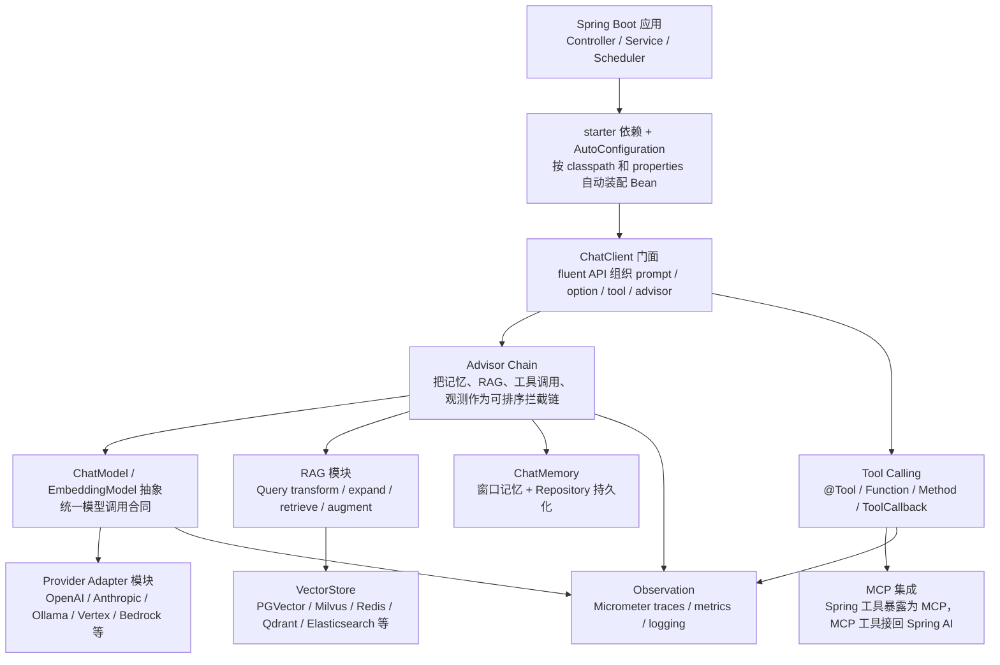
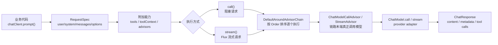
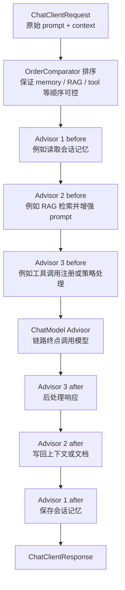
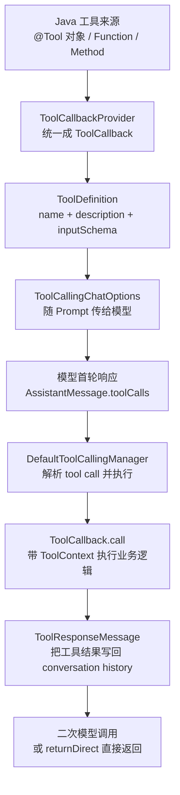
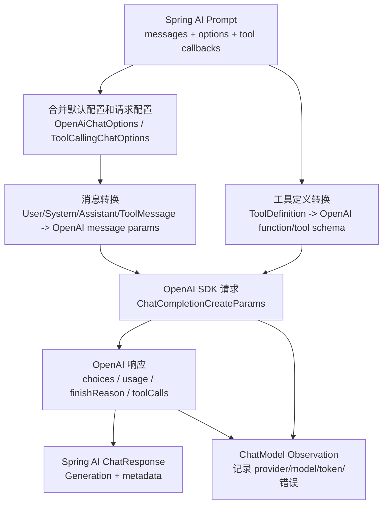
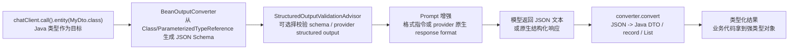
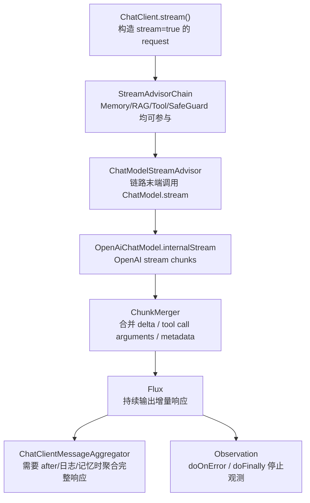
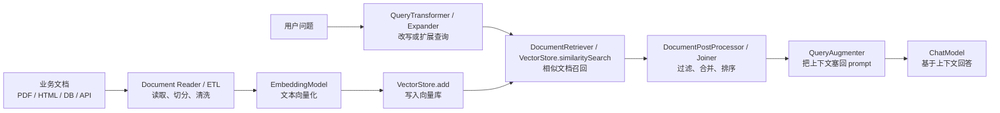
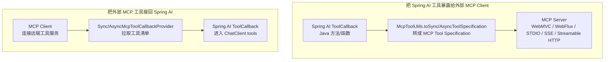
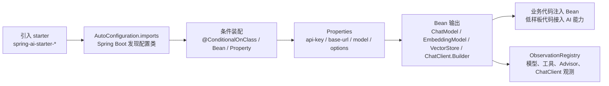

# Spring AI 源码分析

> 源码位置：`sources/spring-ai-main`
> 固定版本：GitHub codeload `main` 快照，`pom.xml` 显示 `2.0.1-SNAPSHOT`，本地无 commit SHA。
> 阅读目标：从 Spring Boot 应用开发者视角，看清 Spring AI 如何把模型、工具、RAG、记忆、MCP、观测和自动装配组织成一套企业 Java AI 应用框架。

## 1. 一句话定位

Spring AI 不是单个 Agent 框架，而是 Spring 生态里的 AI 应用抽象层：它把 `ChatModel`、`EmbeddingModel`、`VectorStore`、`ChatClient`、`Advisor`、Tool Calling、RAG、MCP、Observation 和 Boot Starter 拆成可替换模块，让 Java / Spring Boot 项目用熟悉的 Bean、Properties、AutoConfiguration 方式接入大模型能力。

## 2. 总体架构



为什么这样设计：

- Spring AI 把“模型调用”放在 `ChatModel` / `EmbeddingModel` 抽象后面，避免业务代码绑定某个 provider。
- 把“请求前后处理”放在 `Advisor` 链上，让记忆、RAG、工具调用、观测成为可插拔能力，而不是写死在 `ChatClient`。
- 把“接入成本”交给 Spring Boot 自动装配，业务侧更多面对 `ChatClient.Builder`、`ChatModel`、`VectorStore` 这些 Bean。

## 3. 模块脉络

根 `pom.xml` 是理解架构的第一入口。它声明了 `spring-ai-client-chat`、`spring-ai-model`、`spring-ai-rag`、`spring-ai-vector-store`、`models`、`vector-stores`、`auto-configurations`、`starters`、`mcp`、`memory-repositories` 等模块。

| 层次 | 主要模块 | 职责 |
| --- | --- | --- |
| 应用门面 | `spring-ai-client-chat` | `ChatClient` fluent API、Advisor 链、请求/响应规格 |
| 核心模型抽象 | `spring-ai-model` | `ChatModel`、`EmbeddingModel`、Tool Calling、ChatMemory、Observation |
| RAG | `spring-ai-rag`、`spring-ai-vector-store`、`document-readers` | 文档读取、向量库、检索增强链路 |
| Provider | `models/*` | OpenAI、Anthropic、Ollama、Vertex、Bedrock 等模型适配 |
| Boot 集成 | `auto-configurations/*`、`starters/*` | 按依赖和配置自动创建 Bean |
| MCP | `mcp/common`、`mcp/transport/*`、`auto-configurations/mcp/*` | MCP server/client 工具互通 |

## 4. 主流程：ChatClient 请求如何跑起来



源码证据：

- `spring-ai-client-chat/.../ChatClient.java` 定义 `ChatClient`，注释说明它是 stateless fluent API；接口暴露 `prompt()`、`prompt(String)`、`call()`、`stream()`、`defaultAdvisors()`、`defaultTools()` 等入口。
- `spring-ai-model/.../ChatModel.java` 中 `ChatModel extends Model<Prompt, ChatResponse>, StreamingChatModel`，同步调用合同是 `ChatResponse call(Prompt prompt)`，流式默认是 `Flux<ChatResponse> stream(Prompt prompt)`。
- `ChatClient.builder(ChatModel, ObservationRegistry, ...)` 会把 `ChatModel`、观测、Advisor 观测约定和工具调用 Advisor builder 组进 `DefaultChatClientBuilder`。

典型业务代码：

```java
String answer = chatClient.prompt()
    .system("你是一个企业知识库助手")
    .user("请解释报销政策里的发票要求")
    .advisors(retrievalAugmentationAdvisor)
    .call()
    .content();
```

## 5. Advisor 链：Spring AI 的“中间件”思想



`DefaultAroundAdvisorChain` 里有两条队列：`Deque<CallAdvisor>` 和 `Deque<StreamAdvisor>`。构建链时会筛选 Advisor 类型，并用 `OrderComparator.sort(...)` 排序；执行时 `nextCall()` / `nextStream()` 从队列里 `pop()` 当前 advisor，交给 advisor 决定是否继续调用下一个。

这是一种典型 Chain of Responsibility / around middleware 设计。好处是：

- RAG、记忆、工具调用、观测不需要侵入 provider adapter。
- 同一套能力能同时覆盖 call 和 stream。
- 业务可以用 order 控制先读记忆还是先做检索，先增强 prompt 还是先做策略检查。

## 6. Provider Adapter：为什么要拆 ChatModel

`ChatModel` 是所有聊天模型 provider 的共同合同。Provider 模块负责把 Spring AI 的 `Prompt`、`ChatOptions`、Tool Definition、Observation 映射成 OpenAI、Anthropic、Ollama、Vertex、Bedrock 等厂商各自的 HTTP/API 格式。

设计价值：

- 业务层依赖 `ChatModel` / `ChatClient`，不是依赖某个厂商 SDK。
- Spring Boot auto configuration 可以按 classpath 和 properties 创建 provider Bean。
- Tool Calling、Observation、RAG Advisor 可以在 provider 外围复用。

局限也在这里：不同模型厂商对结构化输出、工具调用、流式响应、token usage、metadata 的语义并不完全一致。Spring AI 能统一入口，但不可能抹平所有 provider 能力差异，所以复杂生产场景仍要看具体 provider 的 options 和测试表现。

## 7. Tool Calling



源码证据：

- `DefaultToolCallingManager.executeToolCalls(Prompt, ChatResponse)` 会从 `ChatResponse` 里找 `AssistantMessage.toolCalls`。
- 它执行 `ToolCallback.call(...)` 后构造 `ToolResponseMessage`，再把原始 messages、assistant tool call message、tool response message 合成新的 conversation history。
- `returnDirect` 会从工具 metadata 合并，决定是否跳过二次模型调用直接返回工具结果。
- 工具执行过程包在 Micrometer `Observation` 里，便于追踪每次 tool call。

真实例子：

```java
class OrderTools {
  @Tool(description = "查询订单物流状态")
  String trackOrder(String orderId) {
    return logisticsClient.query(orderId);
  }
}

String answer = chatClient.prompt()
    .user("帮我查一下订单 A10086 到哪里了")
    .tools(new OrderTools())
    .call()
    .content();
```

## 8. Provider Adapter 精读：以 OpenAI 为例



`OpenAiChatModel` 是理解 provider adapter 的好入口。它直接 `implements ChatModel`，但内部并不把 OpenAI 类型暴露给业务层，而是做三件事：

1. 把 Spring AI 的 `Prompt`、`Message`、`ChatOptions`、`ToolDefinition` 转成 OpenAI SDK 的请求参数。
2. 调用 OpenAI client 后，把 choices、usage、finish reason、tool calls 转回 Spring AI 的 `ChatResponse` / `Generation` / metadata。
3. 用 `ChatModelObservationDocumentation.CHAT_MODEL_OPERATION` 包住调用，记录 provider、model、token、错误等观测信息。

源码证据：

- `models/spring-ai-openai/.../OpenAiChatModel.java` 声明 `public final class OpenAiChatModel implements ChatModel`。
- `call(Prompt)` 进入 `internalCall(...)`，`stream(Prompt)` 进入 `internalStream(...)`。
- 构造器注入 `OpenAIClient`、`OpenAiChatOptions`、`ObservationRegistry`、`ToolCallingManager`。
- Builder 中默认用 `ToolCallingManager.builder().observationRegistry(...)` 创建工具调用管理器，说明 provider 适配层仍然和统一工具调用链路相连。

为什么这样拆：业务层只需要依赖 `ChatModel`，provider adapter 负责“协议翻译”。这样 OpenAI、Anthropic、Ollama、Vertex AI 可以共享 `ChatClient`、Advisor、RAG、Tool Calling、Observation 等上层能力。

## 9. Structured Output：Java 强类型输出链路



这块很适合 Java / Spring 场景，因为业务系统通常希望拿到 DTO、record、List，而不是裸字符串。

源码证据：

- `DefaultChatClient` 的 `entity(Class<T>)`、`entity(ParameterizedTypeReference<T>)`、`responseEntity(...)` 会创建 `BeanOutputConverter`。
- `BeanOutputConverter` 实现 `StructuredOutputConverter<T>`，负责从 Java 类型生成 JSON schema，并把模型输出转换成 Java 对象。
- `StructuredOutputValidationAdvisor` 同时实现 `CallAdvisor` 和 `StreamAdvisor`，说明结构化输出校验也被放进 Advisor / middleware 体系。
- 测试里覆盖了 `entity(MyBean.class, spec -> spec.useProviderStructuredOutput())` 和 `validateSchema()`，这说明 Spring AI 同时支持“框架侧解析”和“provider 原生结构化输出”两种路线。

真实例子：

```java
record TicketSummary(String category, int priority, String reason) {}

TicketSummary summary = chatClient.prompt()
    .user("用户说：我要退款，已经等了三天没人处理")
    .call()
    .entity(TicketSummary.class);
```

这段代码背后的核心不是“让模型随便吐 JSON”，而是用 Java 类型生成 schema/格式约束，再由 converter 做结果转换。生产上仍建议配合 schema validation、重试、异常兜底和样本评测。

## 10. Streaming 细节



Spring AI 的流式不是绕开主链路，而是有独立的 `StreamAdvisor` 体系：

- `DefaultChatClient.stream()` 构建 stream request，并调用 `advisorChain.nextStream(...)`。
- `ChatModelStreamAdvisor` 是链路终点，调用 `chatModel.stream(prompt)`。
- `OpenAiChatModel.internalStream(...)` 接收 provider chunk，把 chunk merge 成 Spring AI `ChatResponse`。
- `ChatClientMessageAggregator` 在日志、记忆、工具调用等场景中把流式片段聚合成完整响应，方便 after 阶段处理。
- Observation 使用 `doOnError` / `doFinally` 处理错误和关闭观测。

设计取舍：流式链路要同时满足“前端尽快看到 token”和“后处理需要完整响应”。所以 Spring AI 一边返回 `Flux<ChatResponse>`，一边在需要时聚合完整消息给 Advisor 使用。

## 11. 生产治理专题

Spring AI 的生产治理不只靠一层代码，而是分散在 AutoConfiguration、Observation、Advisor 和 Tool 边界里。

| 治理点 | 源码/设计依据 | 分享时怎么讲 |
| --- | --- | --- |
| 敏感日志 | `ChatClientAutoConfiguration` 和 chat observation auto configuration 在开启 prompt/completion 日志时打印敏感信息 warning | 内容日志要默认关闭，排障时限时、脱敏、受控开启 |
| 工具权限 | Tool Calling 通过 `ToolCallback` / `ToolContext` 执行业务方法 | 工具不是“模型权限”，而是服务端明确暴露的 Java 能力；要做租户、鉴权、参数校验 |
| 观测追踪 | ChatClient、ChatModel、Advisor、ToolCalling 都接入 `ObservationRegistry` | 生产排障应看一次请求经过哪些 advisor、调用哪个模型、用了多少 token、哪个工具失败 |
| Provider 切换 | `ChatModel` 抽象 + starter auto configuration | 可替换 provider，但不能忽略能力差异，需要按 tool calling、streaming、structured output 做兼容测试 |
| RAG 质量 | RAG pipeline 拆成 retriever、post processor、augmenter 等策略 | 框架只提供管线，效果要靠切分、召回、过滤、评测闭环 |
| 数据隔离 | `ChatMemoryRepository`、`VectorStore`、`ToolContext` 都进入业务数据边界 | 多租户场景要把 tenantId 放进 filter / memory conversationId / toolContext |

推荐生产组合：

1. `ChatClient` 只作为应用层入口，业务服务仍负责鉴权、限流、审计。
2. `Advisor` 做 RAG、Memory、日志和安全策略，但不要把复杂状态机硬塞进 Advisor。
3. `ToolCallback` 只暴露白名单能力，并对参数做服务端校验。
4. `ObservationRegistry` 打通 trace / metrics，prompt 内容日志默认关闭。
5. RAG 和 structured output 必须有评测样本，否则“能跑”不代表“可靠”。

## 12. RAG / VectorStore / Memory



Spring AI 有两类 RAG 路线：

- 简单路线：`QuestionAnswerAdvisor` 直接围绕 `VectorStore` + `SearchRequest` 做相似检索并增强 prompt。
- 完整路线：`RetrievalAugmentationAdvisor` 把 RAG 拆成 query transformer、query expander、document retriever、document joiner、document post processor、query augmenter。

源码证据：

- `VectorStore` 接口提供 `add(List<Document>)`、`delete(...)`，并继承 `VectorStoreRetriever`。
- `RetrievalAugmentationAdvisor.before(...)` 中按注释分 0-7 步执行：创建 Query、transform、expand、retrieve、join、post-process、augment、更新 `ChatClientRequest`。
- `MessageWindowChatMemory` 使用 `ChatMemoryRepository` 存取消息，默认 `maxMessages = 20`，并保留 system message、按完整 turn 裁剪窗口。

真实例子：企业制度问答可以离线把制度 PDF 写入 `VectorStore`；在线用 RAG 召回制度段落；追问时用 `ChatMemory` 保留“刚才问的是差旅报销”这个上下文。

## 13. MCP



`McpToolUtils` 是边界转换点：

- `toSyncToolSpecification(...)` / `toAsyncToolSpecification(...)` 把 Spring AI `ToolCallback` 转成 MCP server tool。
- `getToolCallbacksFromSyncClients(...)` / `getToolCallbacksFromAsyncClients(...)` 把 MCP client 发现的远端工具转回 Spring AI `ToolCallback`。

## 14. AutoConfiguration / Starters / Observation



`ChatClientAutoConfiguration` 显示了 Spring AI 的典型 Boot 集成方式：

- `@AutoConfiguration(after = ToolCallingAutoConfiguration.class)` 保证工具调用基础设施先准备好。
- `@ConditionalOnClass(ChatClient.class)`、`@ConditionalOnProperty(...)` 控制是否启用。
- 输出 prototype scope 的 `ChatClient.Builder`，每个注入点拿到克隆后的 builder，避免共享可变配置互相污染。
- 注入 `ObservationRegistry`，并在开启日志观测时显式提示 prompt/completion 可能暴露敏感信息。

## 15. 横向对比

| 框架 | 更适合 | 不太适合 |
| --- | --- | --- |
| Spring AI | 已经是 Spring Boot 技术栈，希望 AI 能力进入 Bean、配置、观测和企业服务治理 | 需要复杂状态图和 checkpoint 的长任务编排 |
| LangGraph | 多步骤、可恢复、显式状态机 Agent workflow | 单纯 Java 服务内模型调用 |
| LangChain | 快速组合 RAG / Agent / integrations | 强 Spring Boot 企业工程约束 |
| Dify / Langflow / n8n | 可视化搭建、运营配置、非研发参与 | 深度嵌入 Java 代码和内部事务边界 |
| mem0 / Zep / Graphiti | 长期记忆、跨会话用户画像、知识图谱检索 | 替代模型调用框架 |

## 16. 核心设计思想和设计范式

1. 门面模式：`ChatClient` 把 prompt、options、tools、advisors、call/stream 收到一个 fluent API 里，业务入口清晰。
2. Adapter 模式：`ChatModel`、`EmbeddingModel`、`VectorStore` 让不同 provider 被统一抽象接住。
3. Chain of Responsibility / Middleware：`Advisor` 链负责请求前后处理。
4. Builder 模式：`ChatClient.Builder`、`RetrievalAugmentationAdvisor.Builder`、`MessageWindowChatMemory.Builder` 都降低组合复杂度。
5. Strategy / Pipeline：RAG 的 transformer、expander、retriever、post processor、augmenter 是可替换策略。
6. Spring Boot Convention over Configuration：starter + auto configuration + properties 是接入体验的核心。
7. Observability as first-class：模型调用、工具调用、Advisor、ChatClient 都接入 Observation，而不是事后补日志。

## 17. 局限性

- 它不是 LangGraph 那样的显式状态图 runtime，复杂分支、人工中断、checkpoint 恢复通常要组合外部 workflow。
- Provider 能力差异仍然存在，尤其是 tool calling、structured output、stream metadata。
- RAG 质量不只由框架决定，还依赖文档切分、embedding、向量库、过滤条件和评测闭环。
- 对非 Spring 技术栈团队，AutoConfiguration 的优势会下降。
- 生产上要特别处理 prompt/completion 日志、工具权限、API key、租户隔离和数据合规。

## 18. 阅读顺序

1. `pom.xml`：先看模块边界和版本。
2. `spring-ai-client-chat/.../ChatClient.java`、`DefaultChatClient.java`：看业务入口。
3. `DefaultAroundAdvisorChain.java`、`BaseAdvisor.java`：看中间件链。
4. `spring-ai-model/.../ChatModel.java` 和一个 provider 模块：看模型适配。
5. `DefaultToolCallingManager.java`：看工具调用闭环。
6. `RetrievalAugmentationAdvisor.java`、`VectorStore.java`、`MessageWindowChatMemory.java`：看 RAG 和记忆。
7. `McpToolUtils.java`：看 MCP 双向转换。
8. `ChatClientAutoConfiguration.java` 和 provider auto configuration：看 Spring Boot 接入方式。

## 19. 分享口径

开场可以这样讲：

Spring AI 的核心价值不是“又封装了一个模型 API”，而是把 AI 应用开发拉回 Spring Boot 的工程体系：Bean、Properties、AutoConfiguration、Observation、Starter、Adapter、Advisor 链。它让 Java 团队不用离开 Spring 生态，就能做模型调用、工具调用、RAG、记忆和 MCP 集成。

三条主线：

1. 调用主线：`ChatClient -> AdvisorChain -> ChatModel -> Provider`。
2. 能力主线：`Tool Calling / RAG / Memory / MCP` 都作为可插拔能力挂到主流程上。
3. 工程主线：`Starter / AutoConfiguration / Observation` 把 AI 能力变成可治理的 Spring Boot 组件。

真实案例：

企业知识库助手可以用 Spring AI 内嵌在现有 Java 服务中：RAG 负责制度检索，ChatMemory 负责追问上下文，Tool Calling 查询订单或报销状态，Observation 追踪每次模型和工具调用。如果后续需要复杂审批流或长任务恢复，可以把外层流程交给 LangGraph、n8n 或企业工作流平台，Spring AI 继续做 Java 服务内的 typed AI 能力层。
