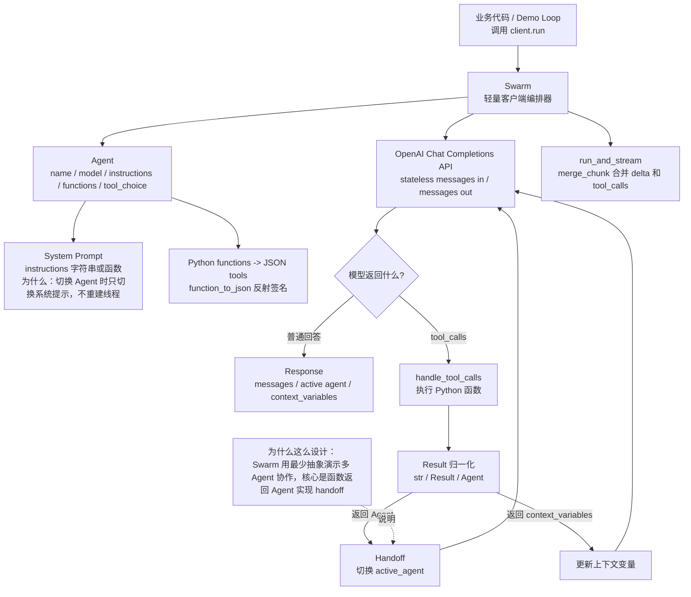
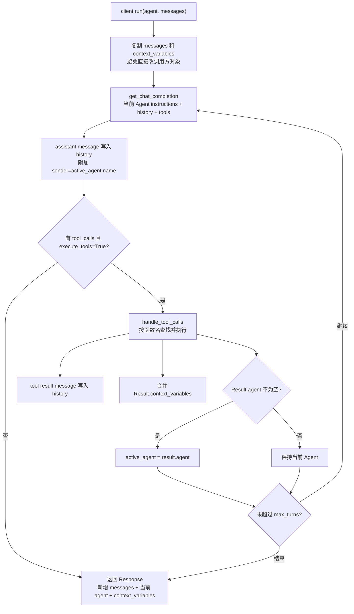
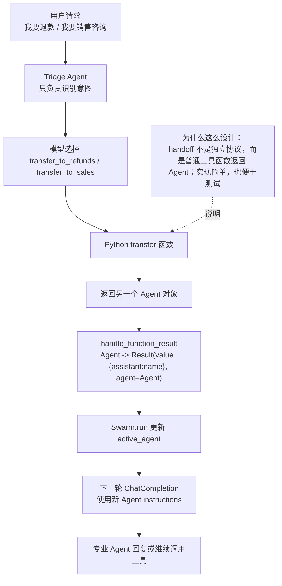
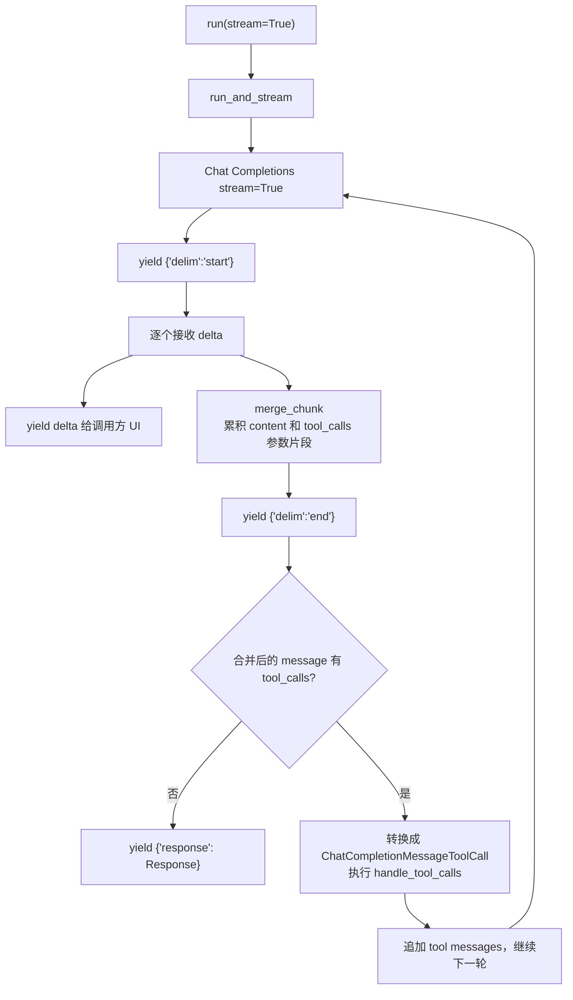
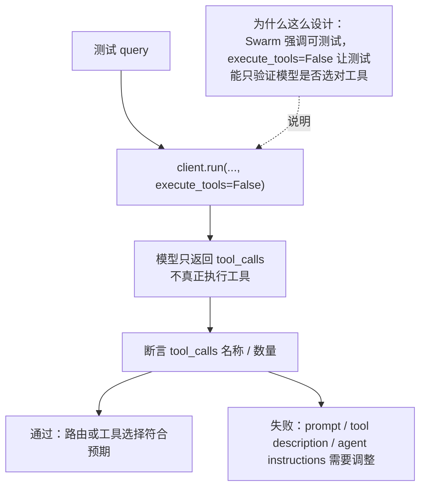
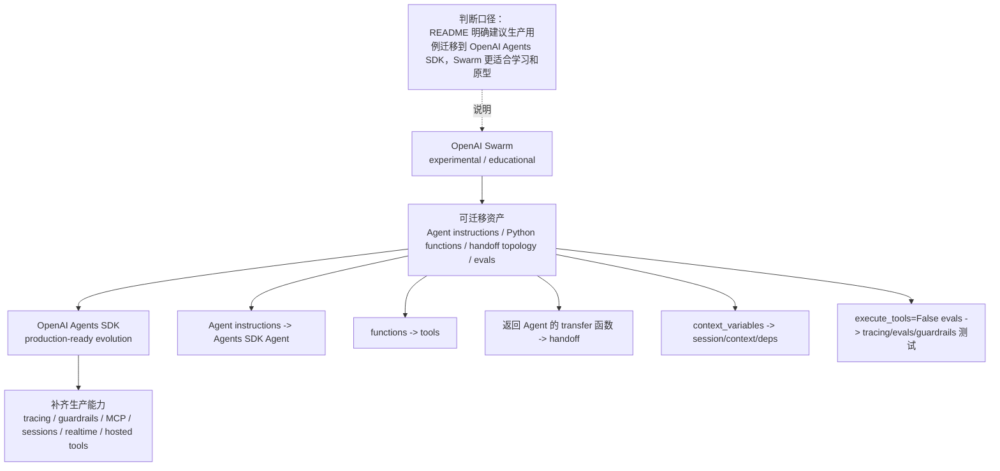

# OpenAI Swarm 源码分析

源码版本：
- 仓库：`openai/swarm`
- 本地源码：`sources/swarm`
- 当前来源：`main codeload snapshot`，GitHub Activity 页面显示最新提交短 SHA `6af0b4c`，完整 SHA 未通过本地 git 获取。
- 状态口径：README 明确标注 `experimental, educational`，并说明 Swarm 已被 OpenAI Agents SDK 替代，生产用例建议迁移。

## 1. 一句话定位

OpenAI Swarm 是一个极轻量、教育性质的多 Agent 编排框架。它用两个核心抽象讲清楚一件事：`Agent` 包含 instructions 和 functions，函数可以返回另一个 `Agent`，于是 handoff 就变成了普通工具调用的结果。

为什么这么设计：Swarm 不是生产运行时，也不追求完整平台能力。它的价值在于把多 Agent 协作拆成最小可理解模型：当前 Agent 调模型，模型选择工具，工具返回字符串、上下文或下一个 Agent，然后循环继续。

## 2. 总体架构图

图源：[architecture.mmd](architecture.mmd)



## 3. 源码分层

| 层级 | 文件 | 作用 |
| --- | --- | --- |
| 项目定位 | `README.md` | 说明 Swarm 是 experimental / educational，并建议迁移到 OpenAI Agents SDK |
| 核心循环 | `swarm/core.py` | `Swarm.run`、`get_chat_completion`、`handle_tool_calls`、`run_and_stream` |
| 数据模型 | `swarm/types.py` | `Agent`、`Response`、`Result` |
| 工具 schema / streaming 合并 | `swarm/util.py` | `function_to_json`、`merge_chunk`、`debug_print` |
| 测试 | `tests/test_core.py` | 覆盖普通回复、工具调用、`execute_tools=False`、handoff |
| 示例 | `examples/basic`、`triage_agent`、`airline`、`weather_agent` | 展示函数调用、上下文变量、路由、客服场景和 evals |

## 4. 核心抽象

源码证据：
- `swarm/types.py:14` 定义 `Agent`，字段只有 `name`、`model`、`instructions`、`functions`、`tool_choice`、`parallel_tool_calls`。
- `swarm/types.py:23` 定义 `Response`，返回新增 `messages`、最后的 `agent`、更新后的 `context_variables`。
- `swarm/types.py:29` 定义 `Result`，用于函数返回值归一化：`value`、`agent`、`context_variables`。
- `swarm/core.py:26` 定义 `Swarm`，构造时默认创建 `OpenAI()` client。

核心理解：
1. `Agent` 不是服务端线程，也不是 Assistants API 的 Assistant；它只是一次 Chat Completions 调用的 prompt + tools 配置。
2. `Result.agent` 是 handoff 的最小实现。
3. `context_variables` 是调用方显式传入和带回的状态，不是框架内置持久记忆。

## 5. Run Loop 主流程

图源：[run-loop-flow.mmd](run-loop-flow.mmd)



源码证据：
- `swarm/core.py:32` 的 `get_chat_completion` 负责构造 system prompt、history 和 tools。
- `core.py:50-56` 用 `function_to_json` 把 Python 函数转成 tools，并隐藏 `context_variables` 参数。
- `core.py:57-69` 调 `client.chat.completions.create`，如果有 tools 还会传 `parallel_tool_calls`。
- `core.py:231` 的 `run` 是普通非流式主入口。
- `core.py:252-271` 复制上下文，循环调用当前 active agent。
- `core.py:275-277` 如果没有工具调用或 `execute_tools=False` 就停止。
- `core.py:280-286` 执行工具、合并 tool messages 和 context variables，并在函数返回 Agent 时切换 active agent。

## 6. Tool / Handoff 机制

图源：[handoff-flow.mmd](handoff-flow.mmd)



源码证据：
- `core.py:71-84` 的 `handle_function_result` 把三种返回值归一化：`Result` 原样返回、`Agent` 包成带 agent 的 `Result`、其他值转成字符串。
- `core.py:89-134` 的 `handle_tool_calls` 按函数名查找 Python 函数，注入 `context_variables`，执行函数并把结果写成 tool message。
- `examples/triage_agent/agents.py` 中 `transfer_to_sales`、`transfer_to_refunds` 返回不同 Agent，展示了最小 handoff。
- `examples/airline/configs/agents.py` 中 triage、flight modification、flight cancel、flight change、lost baggage 组成更接近真实客服的路由网络。
- `tests/test_core.py:122-140` 验证函数返回 `agent2` 后，`response.agent == agent2`。

设计范式：Handoff as Tool Return。Swarm 不引入单独 graph、edge、handoff object，而是把“转交给另一个 Agent”降级成普通函数返回值。这让源码非常短，但也意味着权限、审批、状态恢复、观测都要使用者自己补。

## 7. Context Variables

Swarm 的上下文变量不是持久 memory，而是一次 `run` 输入、工具函数可读写、最终随 `Response` 带回的显式状态。

源码证据：
- `core.py:21` 固定内部参数名 `context_variables`。
- `core.py:35-40` 如果 `agent.instructions` 是函数，会把 `context_variables` 传进去生成动态 system prompt。
- `core.py:51-55` 把工具 schema 里的 `context_variables` 参数隐藏，不暴露给模型填写。
- `core.py:118-119` 如果 Python 函数签名里包含 `context_variables`，执行工具时由框架注入。
- `core.py:128-131` 合并 `Result.context_variables`。
- `examples/basic/context_variables.py` 展示了动态 instructions 和函数读取上下文。

为什么这么设计：Swarm 是 stateless between calls。它不做数据库、线程、checkpoint 或 memory；调用方拿到 `Response.context_variables` 后，可以在下一次 `run` 时传回去。

## 8. Streaming 细节

图源：[streaming-flow.mmd](streaming-flow.mmd)



源码证据：
- `core.py:139` 定义 `run_and_stream`。
- `core.py:161-170` 创建用于累计流式 delta 的 message，其中 `tool_calls` 是 `defaultdict`。
- `core.py:176-187` 对外 yield delta，并用 `merge_chunk` 累积完整 message。
- `core.py:191-198` 把 tool_calls 从 dict 转成 list；没有工具调用或不执行工具时结束。
- `core.py:202-212` 把流式合并出来的 tool call dict 转回 `ChatCompletionMessageToolCall` 对象。
- `util.py:21-29` 的 `merge_chunk` 负责合并 content 和 tool call 参数片段。

## 9. Evals / 可测试性

图源：[evals-flow.mmd](evals-flow.mmd)



源码证据：
- `tests/test_core.py:70-116` 验证 `execute_tools=False` 时不会执行工具，但会把 tool_calls 返回给调用方。
- `examples/weather_agent/evals.py` 用 `execute_tools=False` 验证天气问题是否调用 `get_weather`。
- `examples/triage_agent/evals.py` 同样验证 triage agent 是否选中正确 transfer function。

分享时可以强调：Swarm 的 eval 思路很朴素，但很有启发。很多 Agent 测试不必真的调用外部系统，先断言“模型是否选对工具/路由”就能发现大部分 prompt 和工具描述问题。

## 10. 真实例子：电商退款/销售分流

业务场景：用户说“这个订单太贵了，我想退款，但如果有折扣也可以考虑继续购买。”

Swarm 建模：
1. `Triage Agent` 只判断用户应该去 sales 还是 refunds。
2. `transfer_to_refunds()` 返回 `refunds_agent`，Swarm 自动切换 active agent。
3. `refunds_agent` 有 `process_refund` 和 `apply_discount` 两个函数。
4. 如果用户跑题，`transfer_back_to_triage()` 返回 triage agent。

简化代码片段：

```python
from swarm import Agent

def process_refund(item_id, reason="NOT SPECIFIED"):
    """Refund an item. Ask for user confirmation before processing the refund."""
    return "Success!"

refunds_agent = Agent(
    name="Refunds Agent",
    instructions="Help the user with a refund. If it was too expensive, offer a refund code.",
    functions=[process_refund],
)

def transfer_to_refunds():
    return refunds_agent

triage_agent = Agent(
    name="Triage Agent",
    instructions="Determine which agent is best suited to handle the user's request.",
    functions=[transfer_to_refunds],
)
```

这段例子对应 `examples/triage_agent/agents.py`：transfer 函数返回 Agent，Refunds Agent 再持有真正业务函数。

### 10.1 Airline 客服案例：更接近真实业务的 handoff 网络

如果分享时只讲退款/销售分流，听众会觉得 Swarm 只是一个玩具 demo。源码里的 `examples/airline` 更适合说明它怎样表达真实客服流程：

1. `triage_agent` 先根据用户问题判断大类，只暴露 `transfer_to_flight_modification` 和 `transfer_to_lost_baggage`。
2. `flight_modification` 不直接执行业务动作，而是继续判断用户要取消航班还是改签航班。
3. `flight_cancel`、`flight_change`、`lost_baggage` 各自绑定对应业务 policy 和工具函数。
4. 任一专门 Agent 发现用户话题不在当前职责内，可以调用 `transfer_to_triage` 回到总分流。
5. `context_variables` 把 customer context、flight context 注入动态 instructions，让分流 Agent 看到用户和航班背景，但不把这个参数暴露给模型填写。

源码证据：
- `examples/airline/configs/agents.py` 中 `triage_agent` 的 `instructions=triage_instructions`，这是一个读取 `context_variables` 的函数。
- `transfer_to_flight_modification()`、`transfer_to_lost_baggage()`、`transfer_to_flight_cancel()`、`transfer_to_flight_change()` 都是“返回另一个 Agent”的 transfer 函数。
- `flight_cancel` 绑定 `initiate_refund`、`initiate_flight_credits`、`case_resolved` 等工具；`lost_baggage` 绑定 `initiate_baggage_search`。
- `examples/airline/evals/function_evals.py` 对 triage 和 flight modification 做 function evals，说明 Swarm 的测试重点是“是否路由到正确工具/Agent”。

可以这样讲这个例子：用户说“我明天的航班不想坐了，能退吗？”首先进入 `Triage Agent`，它只判断这是航班修改类问题，于是返回 `Flight Modification Agent`；后者继续判断是 cancel 还是 change，然后返回 `Flight cancel traversal`；最终 cancel Agent 按 policy 决定调用退款、航班积分、人工升级或结案工具。Swarm 没有显式工作流图，但通过“Agent 函数集合 + transfer 函数返回 Agent”表达了一张轻量路由图。

简化代码片段：

```python
def transfer_to_flight_modification():
    return flight_modification

def transfer_to_flight_cancel():
    return flight_cancel

def triage_instructions(context_variables):
    customer_context = context_variables.get("customer_context")
    flight_context = context_variables.get("flight_context")
    return f"Route the user request. Customer: {customer_context}; flight: {flight_context}"

triage_agent = Agent(
    name="Triage Agent",
    instructions=triage_instructions,
    functions=[transfer_to_flight_modification, transfer_to_lost_baggage],
)

flight_modification = Agent(
    name="Flight Modification Agent",
    instructions="Determine whether the user wants to cancel or change their flight.",
    functions=[transfer_to_flight_cancel, transfer_to_flight_change],
    parallel_tool_calls=False,
)
```

为什么这么设计：Airline 示例把“客服 SOP”拆成多个小 Agent，每个 Agent 只暴露自己阶段允许调用的工具。这样模型不需要在一个巨大工具列表里选择，handoff 也天然变成权限收缩和任务聚焦。

## 11. 与 OpenAI Agents Python 的迁移关系

图源：[migration-flow.mmd](migration-flow.mmd)



迁移建议：

| Swarm 资产 | OpenAI Agents Python 对应物 | 迁移说明 |
| --- | --- | --- |
| `Agent.instructions` | Agent instructions | 保留角色和任务说明，但补 guardrails 和输出约束 |
| `Agent.functions` | tools | 普通 Python 函数迁为 tool；补输入 schema、错误处理和权限 |
| transfer 函数返回 Agent | handoff | 从“工具返回 Agent 对象”迁为显式 handoff |
| `context_variables` | session / context / deps | 明确哪些是用户上下文、运行依赖、会话状态 |
| `execute_tools=False` evals | tool choice / trace / evals | 保留“只测路由”的思路，结合 tracing 做更细验证 |
| `run_and_stream` | streaming / events | 迁为 SDK 的事件流，区分 token、tool call、handoff、final result |

能力差异表：

| 能力维度 | Swarm | OpenAI Agents Python | 分享时怎么讲 |
| --- | --- | --- | --- |
| 项目定位 | experimental / educational | production-ready agent SDK | Swarm 适合理解原理，Agents Python 适合落生产 |
| Agent 定义 | `Agent` dataclass，字段很少 | Agent + handoff + tool + guardrail 等更完整运行时概念 | Swarm 的抽象更薄，学习成本低 |
| Handoff | 工具函数返回 `Agent` | 显式 handoff 能力 | Swarm 展示 handoff 本质，SDK 补工程化表达 |
| 状态 | `messages` 和 `context_variables` 由调用方传入传出 | session / context / tracing 等能力更完整 | Swarm 是 stateless loop，生产要补状态治理 |
| 工具 | Python function 反射成 Chat Completions tools | tools、hosted tools、MCP 等更丰富 | Swarm 工具接入简单，但边界和权限较弱 |
| Streaming | `run_and_stream` 合并 chunk 和 tool call delta | 事件流更细，便于 UI、trace、handoff 观察 | Swarm 能看懂原理，SDK 更适合复杂前端 |
| 测试观 | `execute_tools=False` 先测 tool choice | evals、tracing、guardrails 组合验证 | Swarm 的测试思路值得保留 |
| 生产能力 | 缺少 guardrails、tracing、MCP、session、realtime | 补齐这些能力 | README 建议生产迁移的核心原因 |

## 12. 对比分析

| 框架 | 与 Swarm 的关系 |
| --- | --- |
| OpenAI Agents Python | Swarm 的生产级演进方向，补齐 handoff、guardrails、tracing、MCP、session、realtime 等能力 |
| LangGraph | LangGraph 是显式状态图和 checkpoint runtime；Swarm 是无状态轻量 loop |
| AutoGen | AutoGen 更偏多 Agent 消息运行时和团队对话；Swarm 更强调 handoff 作为工具返回值 |
| CrewAI | CrewAI 用角色、任务、流程表达协作；Swarm 用 Agent + function + handoff 最小抽象表达 |
| PydanticAI | PydanticAI 强类型输出和 deps 更强；Swarm schema 主要来自函数签名反射 |
| Semantic Kernel | SK 用 KernelPlugin/KernelFunction 做应用内工具容器；Swarm 用 Python functions 直接变 tools |

## 13. 局限性

1. README 已明确它是 experimental / educational，不建议生产使用。
2. 无内置持久 session、memory、checkpoint、权限、审计、tracing、guardrails。
3. `function_to_json` 的类型映射很简单，复杂 schema、嵌套对象、枚举、Pydantic 模型都不是重点。
4. handoff 依赖工具函数返回 `Agent`，表达力简洁，但缺少显式图结构和可视化状态。
5. 错误处理偏轻量，生产环境需要补超时、重试、幂等、工具副作用治理。
6. 依赖 Chat Completions API 的 tool calling 模式，和后续 Responses/Agents SDK 的事件模型不同。

## 14. 核心设计思想

1. Minimal Primitives：用 `Agent` 和 handoff 解释多 Agent 协作，而不是先引入复杂 runtime。
2. Handoff as Function Result：Agent 切换不是图边，而是工具函数返回另一个 Agent。
3. Stateless by Default：框架不保存状态，messages 和 context variables 由调用方传入和带回。
4. Functions as Tools：Python 函数签名和 docstring 被反射成 Chat Completions tools。
5. Testable Routing：`execute_tools=False` 让测试可以只验证工具选择和路由。
6. Educational over Production：源码短、概念清楚，但生产能力交给 OpenAI Agents SDK。

## 15. 源码阅读路线

推荐按“先模型、再转换、再循环、最后看案例”的顺序读：

| 顺序 | 文件 / 入口 | 重点看什么 | 看完应该理解什么 |
| --- | --- | --- | --- |
| 1 | `swarm/types.py` | `Agent`、`Response`、`Result` 三个 dataclass | Swarm 的全部核心状态都在这三个对象里 |
| 2 | `swarm/util.py:function_to_json` | Python 函数签名和 docstring 如何变成 tool schema | 为什么普通函数能被模型选择调用 |
| 3 | `swarm/core.py:get_chat_completion` | system prompt、tools、tool_choice、parallel_tool_calls 如何组装 | Agent 如何变成一次 Chat Completions 请求 |
| 4 | `swarm/core.py:handle_tool_calls` | 函数名映射、参数解析、`context_variables` 注入、Result 归一化 | tool call 如何落到本地 Python 函数 |
| 5 | `swarm/core.py:run` | while loop、tool message 追加、active agent 切换、max_turns | Swarm 主循环如何推进一轮又一轮对话 |
| 6 | `swarm/core.py:run_and_stream` 和 `util.py:merge_chunk` | token delta 和 tool call delta 如何合并 | streaming 为什么要先展示 UI，再凑齐工具调用 |
| 7 | `examples/basic` | bare minimum、function calling、context variables、handoff | 每个机制的最小可运行形态 |
| 8 | `examples/triage_agent` 和 `examples/airline` | transfer 函数、客服路由、function evals | Swarm 如何表达业务分流和可测试路由 |

阅读建议：不要一开始就从所有 examples 读起。先把 `core.py` 的 `run` 和 `handle_tool_calls` 串起来，再看 `triage_agent`，最后用 `airline` 解释“这个小抽象如何承载真实客服 SOP”。

## 16. 分享口径

开场可以说：Swarm 的价值不是“又一个大框架”，而是用很少代码把多 Agent 协作最核心的问题讲清楚：谁当前负责、能调用哪些函数、什么时候把对话交给另一个 Agent。

三条主线：
1. `Agent` 主线：instructions + functions 如何变成一次 Chat Completions 调用。
2. `run loop` 主线：模型返回 tool_calls 后，Swarm 如何执行工具、写回 tool message、继续下一轮。
3. `handoff` 主线：函数返回 Agent，Swarm 就切换 active agent；这既是最巧妙也最轻量的设计。

总结句：Swarm 适合用来理解 Agent handoff 的原理；真正做生产项目，应把这些概念迁移到 OpenAI Agents Python 或其他具备 session、tracing、guardrails、checkpoint 的运行时里。
