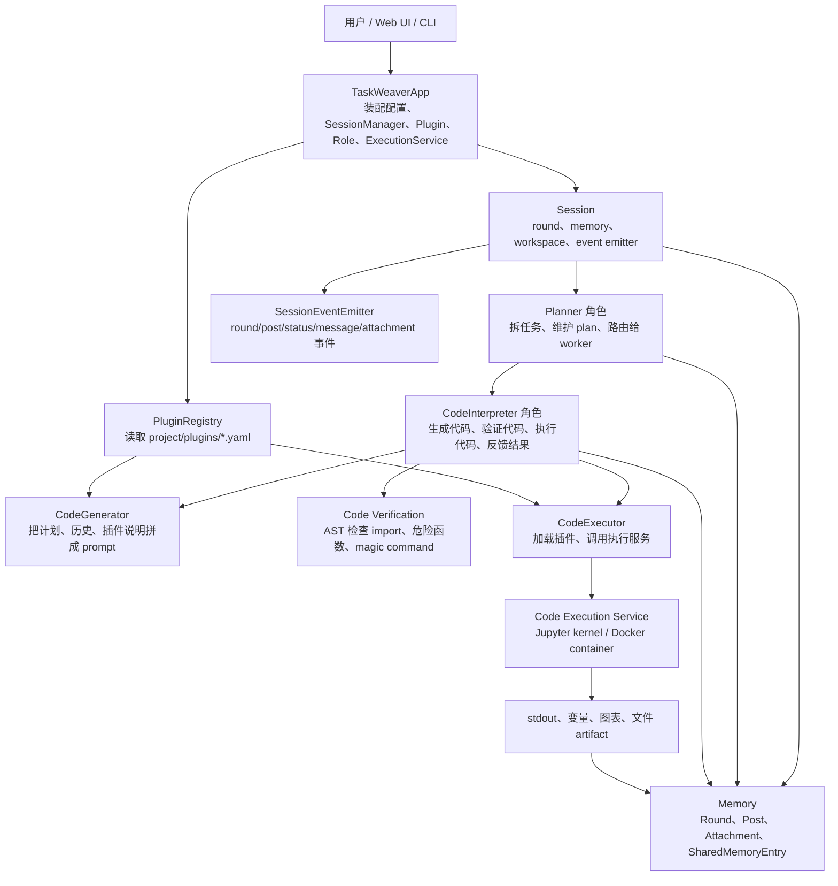
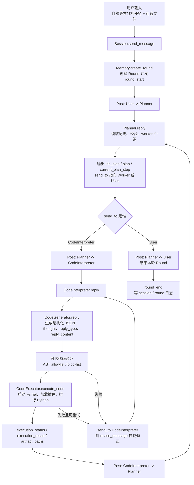
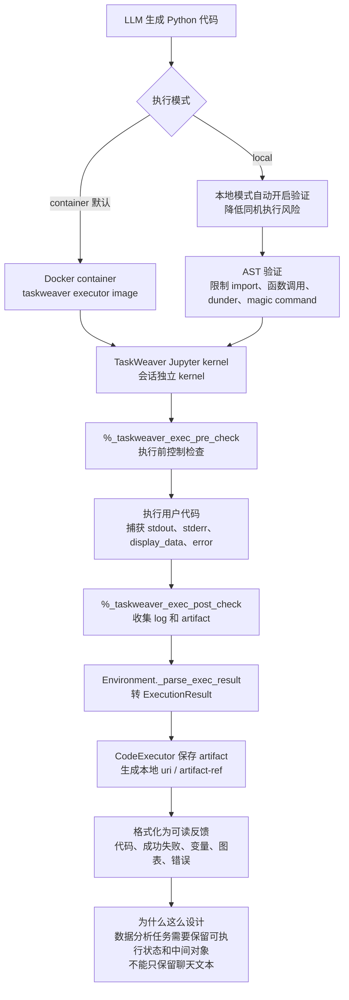
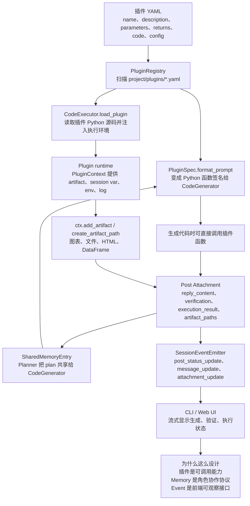
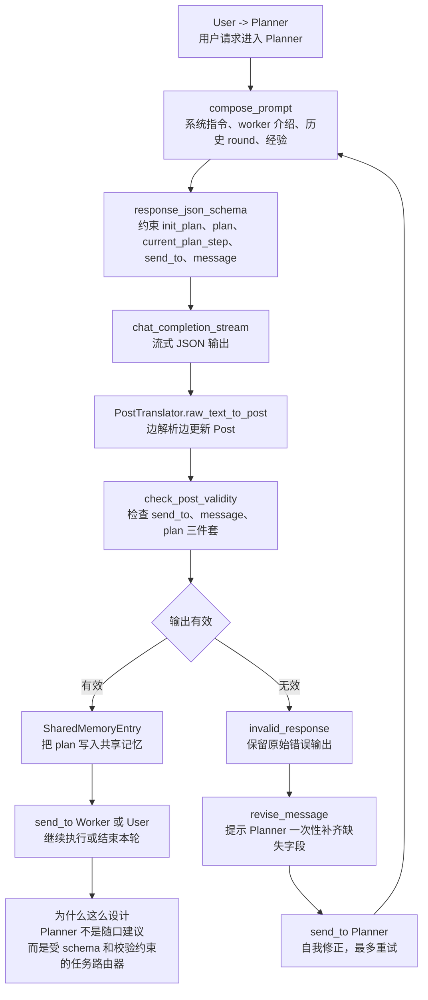
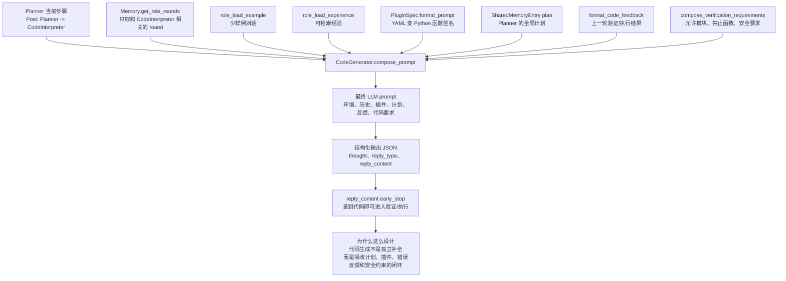
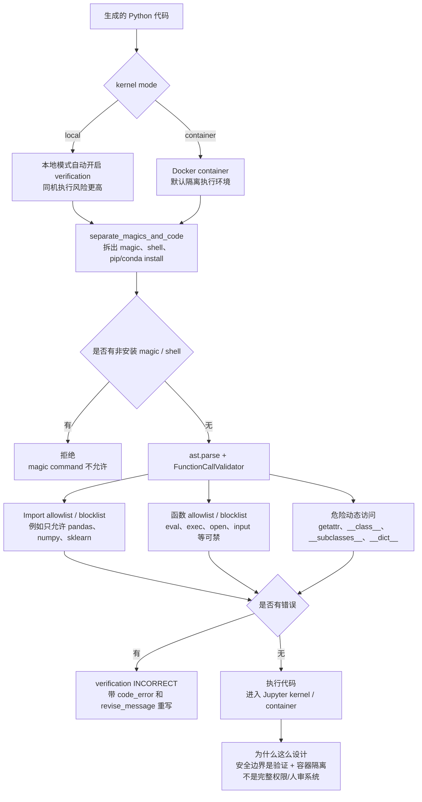
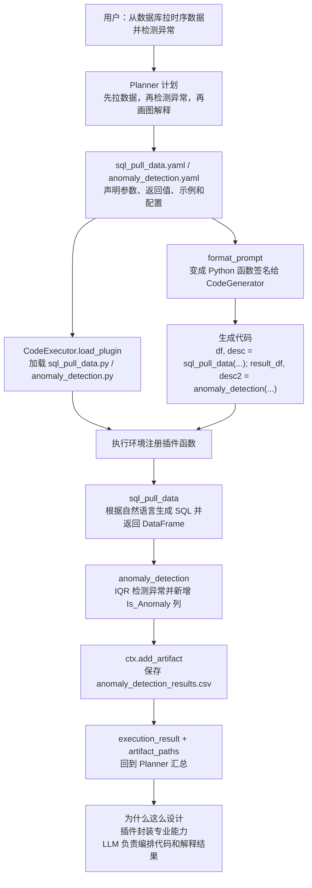

# TaskWeaver 源码分析

> 源码路径：`sources/TaskWeaver-main`
> 获取方式：GitHub `main.zip` 下载包，命令行 `git clone` 曾超时；包内版本文件为 `version.json`：`prod = 0.0.12`、`main = a0`。
> 分析目标：参考前面各框架分析，先讲架构，再讲主流程和分支，重点解释 TaskWeaver 为什么是“code-first 数据分析 Agent”。

## 1. 一句话定位

TaskWeaver 是微软开源的 code-first Agent 框架，主场景是数据分析、表格处理、可视化、算法插件编排。它和通用 Agent SDK 最大不同是：TaskWeaver 不只保存聊天历史，还把 LLM 生成的 Python 代码、执行结果、内存对象、artifact、插件调用和计划状态都纳入会话。

推荐分享口径：

> TaskWeaver 的核心不是“让模型直接调用工具”，而是让模型写 Python，并在一个有状态执行环境里运行 Python。它把数据分析任务从自然语言转成“计划 + 代码 + 执行反馈”的闭环。

## 2. 总体架构



核心分层可以这样理解：

| 层级 | 关键源码 | 作用 |
| --- | --- | --- |
| App 装配层 | `taskweaver/app/app.py` | 用依赖注入装配 SessionManager、Plugin、Logging、ExecutionService、Role |
| Session 层 | `taskweaver/session/session.py` | 创建 round、维护 memory、调度 Planner 和 worker 对话 |
| Role 层 | `taskweaver/role/role.py`、`taskweaver/planner/planner.py`、`taskweaver/code_interpreter` | Planner / CodeInterpreter / ext_role 都是 role |
| Memory 协议层 | `taskweaver/memory` | Round、Post、Attachment、SharedMemoryEntry 是角色通信协议 |
| Code-first 执行层 | `taskweaver/code_interpreter`、`taskweaver/ces` | 生成代码、验证代码、启动 Jupyter kernel 或 Docker container 执行 |
| Plugin 层 | `taskweaver/memory/plugin.py`、`taskweaver/plugin` | YAML 描述插件，Python 源码在执行环境中注册 |
| Event / Observability | `taskweaver/module/event_emitter.py`、`taskweaver/module/tracing.py` | 把 round/post/status/message/attachment 变化流式抛给 CLI / UI / tracing |

源码证据：

- `taskweaver/app/app.py:15` 定义 `TaskWeaverApp`，构造时把 `SessionManagerModule`、`PluginModule`、`LoggingModule`、`ExecutionServiceModule`、`RoleModule` 放入 injector。
- `taskweaver/session/session.py:44` 定义 `Session`，每个 session 有 workspace、execution cwd、memory、event emitter 和 worker instances。
- `taskweaver/session/session.py:111` 在 session 内创建 Planner，并把非 Planner 角色实例作为 workers。
- `taskweaver/module/execution_service.py:18-22` 默认 `kernel_mode` 是 `container`，并限制只能是 `local` 或 `container`。

## 3. 主流程：一次请求怎么跑



这个流程的关键是角色之间不是直接函数返回，而是通过 `Post` 进行通信。`Post` 里既有 `message`，也有结构化 `attachment_list`。Planner 的输出包含 plan、current_plan_step 和 send_to；CodeInterpreter 的输出包含 thought、reply_type、reply_content、verification、execution_status、execution_result、artifact_paths。

源码证据：

- `taskweaver/session/session.py:162` 的 `_send_text_message` 创建 round，并启动一次内部角色对话。
- `taskweaver/session/session.py:175` 内部 `_send_message` 会把 post 写入 round，再按 recipient 调用 Planner 或 worker。
- `taskweaver/session/session.py:205-219` 默认进入 Planner -> worker -> Planner 循环，并用 `max_internal_chat_round_num` 防止无限内部对话。
- `taskweaver/session/session.py:278` 的 `send_message` 支持传入事件处理器和文件；文件会上传到 session execution cwd。
- `taskweaver/planner/planner.py:77-80` Planner 把输出 JSON schema 的 `send_to` 限制为 worker alias 或 User。
- `taskweaver/planner/planner.py:321-332` Planner 把 LLM 流式输出转成 Post，并把 plan 通过 `SharedMemoryEntry` 写给后续 worker 使用。

## 4. CodeInterpreter：为什么是 code-first

TaskWeaver 的 CodeInterpreter 可以分成四步：

1. `CodeGenerator` 组装 prompt：历史对话、Planner 当前任务、插件函数签名、经验、代码生成要求。
2. LLM 输出结构化 JSON：`thought`、`reply_type`、`reply_content`。如果 `reply_type == python`，`reply_content` 就是要执行的代码。
3. 可选代码验证：AST 层检查 import、危险函数、magic command。
4. 执行代码：`CodeExecutor` 启动执行环境，加载插件，执行代码，格式化输出和 artifact。



为什么这么设计：

- 数据分析任务经常依赖 DataFrame、numpy array、模型对象、图表对象。只把工具结果转成字符串，会丢掉大量中间状态。
- Python 代码是比自然语言工具调用更强的组合语言，能表达循环、条件、数据清洗、可视化、统计建模。
- 代码执行失败后，可以把错误反馈给 CodeGenerator，让它重写代码形成反思执行闭环。

源码证据：

- `taskweaver/code_interpreter/code_interpreter/code_interpreter.py:94` 定义 `CodeInterpreter`。
- `taskweaver/code_interpreter/code_interpreter/code_interpreter.py:113-126` 如果执行模式是 local 且未显式开启验证，会自动开启代码验证并打印风险提示。
- `taskweaver/code_interpreter/code_interpreter/code_interpreter.py:150-157` `reply` 先创建 post proxy，再更新状态为 `generating code`。
- `taskweaver/code_interpreter/code_interpreter/code_interpreter.py:209-245` 进入 `verifying code`，失败时写入 verification/code_error，并通过 `revise_message` 让 CodeInterpreter 自我修正。
- `taskweaver/code_interpreter/code_interpreter/code_interpreter.py:269` 调用 `executor.execute_code`。
- `taskweaver/code_interpreter/code_interpreter/code_interpreter.py:310-313` 执行失败且未超过重试次数时，把 `send_to` 改回 `CodeInterpreter`，形成自修复循环。

## 5. Code Execution Service：执行隔离和 artifact

TaskWeaver 的执行服务本质上是一个“可被 Agent 驱动的 Jupyter 环境”。它支持 local 和 container 两种模式，默认配置是 container。container 模式会运行 `taskweavercontainers/taskweaver-executor:latest`，挂载 session 的 `ces` 和 `cwd`，再通过 Jupyter connection file 与外部通信。

执行时会先跑 `%_taskweaver_exec_pre_check`，再执行用户代码，最后跑 `%_taskweaver_exec_post_check`。`Environment._execute_code_on_kernel` 捕获 Jupyter iopub 消息，包括 stdout、stderr、execute_result、error、display_data、update_display_data。`_parse_exec_result` 会把图片、svg、artifact、log 转成统一 `ExecutionResult`。

源码证据：

- `taskweaver/ces/environment.py:108-114` 定义 `EnvMode` 和默认 Docker image。
- `taskweaver/ces/environment.py:237-313` container 模式启动 Docker container，挂载目录并等待 connection file。
- `taskweaver/ces/environment.py:273-276` container 模式把 `host.docker.internal` 等 magic host 指到 `0.0.0.0`，降低容器访问宿主机风险。
- `taskweaver/ces/environment.py:319` 定义 `execute_code`，前后分别执行 pre/post control magic。
- `taskweaver/ces/environment.py:584-591` 捕获 `display_data` / `update_display_data`。
- `taskweaver/module/execution_service.py:18-27` 默认 `container`，local 模式会输出安全提示。

## 6. Plugin + Memory + Event



插件不是 LangChain 那种普通 tool schema，而是更接近“可被生成代码调用的函数库”。YAML 负责声明名称、参数、返回值和配置；Python 文件负责实现；CodeGenerator 会把插件格式化成 Python 函数签名放入 prompt；CodeExecutor 执行前把插件源码加载到 kernel。

Memory 是 TaskWeaver 的内部协议。`Round` 表示一次用户请求，`Post` 表示角色之间的一条消息，`Attachment` 表示结构化输出，`SharedMemoryEntry` 用来跨角色共享计划、经验子路径等信息。

Event 层是 UI 和调试入口。`PostEventProxy` 在 post 创建、状态更新、send_to 更新、message 更新、attachment 更新、结束或错误时发事件，因此 CLI/Web UI 可以看到“正在生成代码、正在验证、正在执行”等过程。

源码证据：

- `taskweaver/memory/plugin.py:83-171` `PluginSpec` 把 YAML 参数/返回值格式化成 Python 函数签名。
- `taskweaver/memory/plugin.py:282-336` `PluginRegistry` 扫描 `plugins/*.yaml` 并支持启停。
- `taskweaver/code_interpreter/code_executor.py:132-144` `load_plugin` 读取插件 Python 源码并调用执行客户端加载。
- `taskweaver/plugin/context.py:9-80` `PluginContext` 定义 artifact、session var、env、log 等接口。
- `taskweaver/memory/attachment.py:10-42` `AttachmentType` 覆盖 plan、thought、reply_content、verification、execution_result、artifact_paths、shared_memory_entry、image_url 等类型。
- `taskweaver/module/event_emitter.py:21-48` 事件分 session、round、post 三层。
- `taskweaver/module/event_emitter.py:126-220` `PostEventProxy` 在状态、消息、附件更新时发事件。

## 7. 专题一：Planner 细节



Planner 在 TaskWeaver 里不是一个简单“规划提示词”，它更像任务路由器。它需要输出结构化 JSON，并且 JSON schema 会约束 `send_to` 只能是 worker alias 或 `User`。这意味着 Planner 的职责不是泛泛给建议，而是明确“下一步给谁做、当前计划是什么、当前步骤是什么”。

源码里 `taskweaver/planner/planner.py:77-80` 会把 `response_json_schema` 的 `send_to` 枚举收窄到可用 worker 和 `User`。`planner.py:260` 内部的 `check_post_validity` 会检查 `send_to`、`message`，并要求 attachment 中必须有 `init_plan`、`plan`、`current_plan_step`。如果 LLM 输出缺字段或格式不合法，Planner 不会直接往下执行，而是把原始输出作为 `invalid_response`，再附加 `revise_message`，让 Planner 自己补齐。

这个设计的意义是把“规划”变成可验证协议。分享时可以强调：TaskWeaver 的 Planner 不只是 ReAct 里的 thought，而是通过 schema、attachment 和 send_to 共同约束出来的调度层。

## 8. 专题二：CodeGenerator Prompt 细节



CodeGenerator 的 prompt 不是“把用户问题丢给模型”。它会拼接当前 Planner 步骤、当前角色相关的历史 round、插件函数签名、共享计划、上一次代码验证/执行反馈、经验和示例。也就是说，代码生成不是单轮补全，而是多轮闭环的一部分。

关键点：

1. `taskweaver/code_interpreter/code_interpreter/code_generator.py:147` 的 `compose_prompt` 是总入口。
2. `code_generator.py:196` 的 `compose_conversation` 会把 Planner 发给 CodeInterpreter 的当前任务、上一次 CodeInterpreter 的执行反馈、修正消息组织进对话。
3. `code_generator.py:225` 把 `PLUGINS` 填入 conversation head；`code_generator.py:418` 的 `format_plugins` 来自 `PluginSpec.format_prompt`。
4. `code_generator.py:245`、`254`、`271` 都会调用 `format_code_feedback`，把 verification / execution 的状态和错误变成下一次生成代码的输入。
5. `code_generator.py:126-129` 会把禁止函数写进代码生成要求；如果开启 verification，模型在生成前就能看到安全约束。

这解释了 TaskWeaver 的一个核心优势：它不是“失败后让用户重试”，而是把失败信息结构化地塞回 prompt，让 CodeInterpreter 自己修正。对于数据分析任务，第一次代码写错列名、包没导入、SQL 没拉到数据都很常见，这种反馈闭环比单次 tool call 更自然。

## 9. 专题三：代码验证与安全边界



TaskWeaver 的安全边界主要由两层组成：代码执行隔离和代码验证。默认执行服务是 container 模式；如果切到 local 模式，`CodeInterpreter` 会自动打开 verification，因为本机执行风险更高。

代码验证是 AST 级检查，不是完整沙箱。`taskweaver/code_interpreter/code_verification.py:217` 的 `separate_magics_and_code` 会拆出 magic、shell command 和 pip/conda install；非安装类 magic / shell command 会被拒绝。`code_verification.py:253` 的 `code_snippet_verification` 再用 `ast.parse` 和 `FunctionCallValidator` 检查 import、函数调用、变量赋值和危险属性访问。

默认禁止函数来自 `CodeInterpreterConfig`，包括 `eval`、`exec`、`open`、`input`、`__import__`，以及 `getattr`、`setattr`、`globals`、`locals` 等动态访问函数。`code_verification.py:8-24` 还把 `__class__`、`__subclasses__`、`__mro__`、`__dict__` 等 dunder / 反射路径列为危险访问。

分享时要讲清楚边界：TaskWeaver 的安全模型更像“代码检查 + 容器隔离”，而不是 AgentScope 那种工具级权限、人审、workspace policy。它适合数据分析代码执行，但如果要审批生产操作、限制每个工具的权限、做细粒度人审，需要外层系统补上。

## 10. 专题四：Plugin 真实例子



以示例插件 `sql_pull_data` 和 `anomaly_detection` 为例，可以更直观理解 TaskWeaver 的 plugin 机制。

`project/plugins/sql_pull_data.yaml` 声明插件名、描述、参数 `query`，返回 `df` 和 `description`，并在配置里给出 SQLite 数据库路径。对应实现 `sql_pull_data.py` 里，`SqlPullData.__call__` 会借助 LangChain 的 SQLDatabase 和 LLM，把自然语言问题转成 SQL，再返回 DataFrame 和描述。

`project/plugins/anomaly_detection.yaml` 声明输入 DataFrame、时间列、数值列，返回带 `Is_Anomaly` 列的新 DataFrame 和描述。实现 `anomaly_detection.py` 里，`AnomalyDetectionPlugin.__call__` 用 IQR 规则计算异常，并通过 `self.ctx.add_artifact` 保存 `anomaly_detection_results.csv`。

这条链路里，LLM 不需要知道 SQLDatabase 的实现细节，也不需要手写异常检测算法。它只需要在生成代码时调用：

```python
df, desc = sql_pull_data("pull data from time_series table")
result_df, desc2 = anomaly_detection(df, "datetime", "value")
```

插件把专业能力封装起来，CodeGenerator 负责编排调用顺序，CodeExecutor 负责把插件加载到执行环境，artifact 再回到 Post / Memory 中。这个设计比“直接让模型生成所有算法代码”更稳，也比“每个工具只返回字符串”更适合数据分析。

## 11. 真实例子：销售数据异常分析

场景：业务同学上传一份销售数据 CSV，问：“最近 30 天销售额为什么下滑？帮我找异常并画图。”

TaskWeaver 的执行过程可以这样讲：

1. 用户通过 CLI/Web UI 发消息，并上传 CSV。
2. `Session.send_message` 把文件放入 session 的 `execution_cwd`，消息前缀里说明已添加文件。
3. Planner 生成计划：读 CSV、做缺失值/异常检查、按日期聚合、画趋势图、解释可能原因。
4. Planner 把当前步骤发给 CodeInterpreter。
5. CodeGenerator 看到插件说明和当前计划，生成 Python：`pandas.read_csv`、groupby、rolling、matplotlib/seaborn 绘图。
6. CodeInterpreter 验证代码，如果用到被禁止函数或非法 import，则不执行，要求重写。
7. CodeExecutor 在 Jupyter kernel / container 中执行，保留 DataFrame、图表、stdout 和 artifact。
8. 执行失败时，错误日志反馈给 CodeGenerator 重试；执行成功时，把代码、结果、图表 artifact 回给 Planner。
9. Planner 汇总成面向用户的解释，并决定是否还要让 CodeInterpreter 继续分析。

这个例子解释了 TaskWeaver 的核心价值：它适合“需要实际算一遍”的任务，而不是只靠语言模型猜答案。对数据分析、可视化、实验复现、算法插件编排，代码执行历史比聊天历史更关键。

## 12. 横向对比

```mermaid
flowchart LR
    Need["任务类型"] --> TW["TaskWeaver<br>代码优先数据分析 Agent"]
    Need --> LG["LangGraph<br>显式状态图和 checkpoint"]
    Need --> AS["AgentScope<br>生产级 Agent runtime 和权限工作区"]
    Need --> OAI["OpenAI Agents Python<br>轻量 OpenAI-native Agent SDK"]
    Need --> Agno["Agno<br>AgentOS / API 平台化"]
    Need --> LI["LlamaIndex / Haystack<br>重 RAG 数据层"]
    TW --> TW1["强项<br>把数据分析表达成 Python<br>保留代码执行历史和内存对象"]
    LG --> LG1["强项<br>复杂确定性工作流、恢复和节点测试"]
    AS --> AS1["强项<br>权限、人审、workspace、服务会话"]
    OAI --> OAI1["强项<br>OpenAI Responses、handoff、guardrail、tracing 原生"]
    Agno --> Agno1["强项<br>产品化 Agent / Team / Workflow API"]
    LI --> LI1["强项<br>ingestion、索引、retrieval、rerank、eval"]
    TW1 --> Combo["组合建议<br>TaskWeaver 做数据分析 worker<br>LangGraph 做外层流程<br>AgentScope 管权限执行<br>RAG 框架管知识检索"]
```



| 对比对象 | TaskWeaver 更强的点 | 对方更强的点 |
| --- | --- | --- |
| LangGraph | 内置 Planner + CodeInterpreter + 有状态代码执行，更适合数据分析 worker | 显式状态图、checkpoint、恢复、复杂业务流程编排 |
| AgentScope | code-first 数据分析闭环更突出，保留代码执行历史和内存对象 | 权限、人审、workspace/sandbox、服务会话和生产控制面更系统 |
| OpenAI Agents Python | 对 Python 数据分析、插件注入、artifact 输出更专门 | OpenAI 原生 Responses、handoff、guardrail、tracing 更轻更直接 |
| Agno | 更像数据分析专用 Agent runtime | AgentOS、API、session/run 管理和产品化入口更完整 |
| AutoGen | 更强调“一个数据分析 worker 如何闭环完成任务” | 多 Agent 对话、群聊和研究型协作更成熟 |
| LlamaIndex / Haystack | 可以在执行代码中调用检索结果并做分析 | 大规模 ingestion、索引、检索、rerank、评测更专业 |

组合建议：如果项目是“业务流程 + 数据分析”，可以让 LangGraph 做外层流程，让 TaskWeaver 做数据分析节点；如果需要严格权限/人审/沙箱治理，可以用 AgentScope 或平台层包住 TaskWeaver 的执行入口；如果知识库检索很重，RAG 框架负责检索，TaskWeaver 负责拿检索结果做计算和可视化。

## 13. 核心设计思想和设计范式

### 13.1 Code-first Agent

TaskWeaver 把 Python 代码作为主要行动语言。相比 function calling，Python 可以组合多个库、多个插件和中间变量，更适合数据分析。

证据：`taskweaver/code_interpreter/code_interpreter/code_generator.py:328` 的 `reply` 从 LLM 生成结构化输出，`reply_type == python` 时把 `reply_content` 当代码执行。

### 13.2 Role-based Collaboration

Planner 和 CodeInterpreter 是角色，不是硬编码的一段流程。`RoleRegistry` 从 `.role.yaml` 加载角色，扩展角色如 web_search、image_reader、document_retriever、recepta 都可接入。

证据：`taskweaver/role/role.py:22-40` 定义 `RoleEntry` 从 YAML 加载模块路径、alias 和 intro；`taskweaver/role/role.py:285-323` `RoleRegistry` 扫描 ext_role 和 code_interpreter 目录。

### 13.3 Structured Post / Attachment 协议

角色之间靠 Post 通信，复杂内容靠 Attachment 表达。Planner 的 plan、CodeInterpreter 的 code、verification、execution_result 都是 attachment，不是混在一段文本里。

证据：`taskweaver/memory/post.py:13-31` 定义 Post；`taskweaver/memory/attachment.py:10-42` 定义不同 AttachmentType。

### 13.4 Reflective Execution

代码生成失败、格式解析失败、代码验证失败、执行失败，都可以通过 `revise_message` 回到 CodeInterpreter 自我修正。

证据：`taskweaver/code_interpreter/code_interpreter/code_interpreter.py:195-201` 生成失败时回到 CodeInterpreter；`240-245` 验证失败时回到 CodeInterpreter；`310-313` 执行失败时回到 CodeInterpreter。

### 13.5 Adapter / Registry

LLM provider、Role、Plugin、ExecutionService 都通过适配或注册表解耦。TaskWeaver 不是只绑定一个模型或一个工具集合。

证据：`taskweaver/llm` 下有 OpenAI、Anthropic、Gemini、Ollama、Qwen、Groq、ZhipuAI 等适配；`PluginRegistry` 和 `RoleRegistry` 都继承 `ComponentRegistry`。

### 13.6 Event-driven UI

PostEventProxy 把状态、消息、附件更新变成事件，因此前端可以显示“生成 prompt、调用 LLM、收到响应、验证代码、执行代码”这些中间状态。

证据：`taskweaver/module/event_emitter.py:126-220`。

## 14. 局限性

- 它更适合数据分析和代码执行任务，不是通用企业 Agent 服务框架。
- 默认 container 执行比纯 SDK 更重，需要 Docker、镜像、依赖和运行环境管理。
- 权限治理不像 AgentScope 那样细化到人审、工具策略、workspace 操作模式；它主要依赖代码验证和容器隔离。
- Planner/CodeInterpreter 的内部循环主要靠 prompt 和 post 协议驱动，复杂确定性流程不如 LangGraph 清晰。
- 对业务人员低代码配置、发布、运营，不如 Dify / Agno 这类平台化产品完整。
- 如果只要轻量 OpenAI-native agent，OpenAI Agents Python 更轻。

## 15. 推荐源码阅读顺序

1. `taskweaver/app/app.py`：先看应用如何装配各模块。
2. `taskweaver/session/session.py`：看一次消息如何变成 Round / Post，并在 Planner 和 worker 间循环。
3. `taskweaver/planner/planner.py`：理解 Planner prompt、JSON schema、计划输出和 shared memory。
4. `taskweaver/code_interpreter/code_interpreter/code_interpreter.py`：理解生成、验证、执行、重试闭环。
5. `taskweaver/code_interpreter/code_interpreter/code_generator.py`：看 prompt 如何包含插件、历史、计划、经验。
6. `taskweaver/code_interpreter/code_executor.py` 和 `taskweaver/ces/environment.py`：理解 Jupyter / container 执行服务。
7. `taskweaver/memory`：理解 Round、Post、Attachment、SharedMemoryEntry。
8. `taskweaver/memory/plugin.py` 和 `project/plugins`：理解插件声明和加载。
9. `taskweaver/module/event_emitter.py`：理解 UI 和日志如何看到流式过程。

## 16. 分享口径

开场：

> TaskWeaver 是一个很典型的 code-first Agent。它不是让模型直接回答数据问题，而是让模型先规划，再写 Python，再在有状态执行环境里运行代码，最后把代码、结果、图表和错误反馈纳入下一步推理。

三条主线：

1. 架构主线：App 装配 Session，Session 调度 Planner 和 CodeInterpreter，Memory 用 Round/Post/Attachment 串起角色协作。
2. 执行主线：CodeGenerator 生成代码，CodeInterpreter 验证和重试，CodeExecutor 在 Jupyter / Docker 中执行，并回收 artifact。
3. 扩展主线：Plugin YAML 变成 prompt 里的函数签名，Python 实现被注入执行环境，EventEmitter 把状态变化推给 UI。

结尾：

> TaskWeaver 最值得学习的地方，是它把“LLM 生成代码”工程化成一个闭环：计划、代码、验证、执行、artifact、错误反馈、再次生成。它适合做数据分析 worker，不一定适合替代 LangGraph、AgentScope、Dify 这类流程/生产/平台框架。
