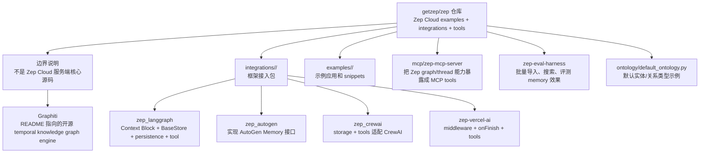
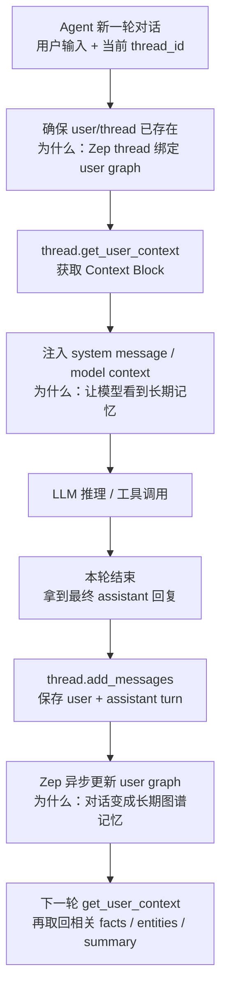
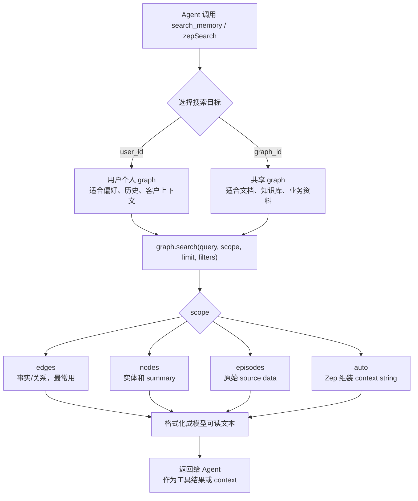

# Zep 源码架构精读

分析对象：`sources/zep`，固定源码提交 `826c5492d9cc3a7caf92a9870529f29b5a8546e3`。

本文参考 mem0 的分析方式，但要先讲清楚边界：当前 `getzep/zep` 仓库不是 Zep Cloud 服务端核心源码。它更像 Zep Cloud 的 examples、framework integrations、MCP server、evaluation harness 和 deprecated legacy CE 的集合。真正的开源 temporal knowledge graph engine，README 指向的是 `getzep/graphiti`。

## 1. 总体结论

Zep 和 mem0 都在解决 Agent memory，但这个仓库的源码形态完全不同：

- **mem0**：仓库里有本地 Memory core，可以沿 `Memory.add/search` 精读完整写入和检索实现。
- **getzep/zep**：当前主仓库主要是 Zep Cloud 的接入层。源码重点不是“怎么在本地实现 memory engine”，而是“不同 Agent 框架如何把 Zep Cloud 的 thread、Context Block、graph.add、graph.search 接进去”。
- **Zep 的产品抽象**：对话通过 `thread.add_messages` 写入，长期上下文通过 `thread.get_user_context` 取回，结构化记忆和知识通过 `graph.add/search` 进入 temporal knowledge graph。
- **工程主线**：框架适配器要做三件事：身份和线程绑定、上下文注入、回合结束后持久化。

分享口径：

> mem0 更像一个可嵌入应用里的本地 memory layer；当前 Zep 仓库更像一个 Zep Cloud memory service 的接入层集合。分析 Zep 源码时，重点看它如何把“云端图谱记忆能力”接到 LangGraph、AutoGen、CrewAI、Vercel AI SDK、MCP 等生态里。

## 2. 最高层架构

| 层级 | 源码位置 | 精读重点 |
| --- | --- | --- |
| 仓库定位 | `README.md` | 明确 examples/integrations/tools，不是产品服务端源码 |
| Integration Index | `integrations/README.md`、`integrations/CLAUDE.md` | 多框架、多语言包的组织方式和质量要求 |
| LangGraph Python | `integrations/langgraph/python/src/zep_langgraph` | Context Block、BaseStore、persistence、graph search tool |
| AutoGen Python | `integrations/autogen/python/src/zep_autogen` | AutoGen `Memory` 接口实现、graph/user memory |
| CrewAI Python | `integrations/crewai/python/src/zep_crewai` | storage contract、user graph、generic graph、tools |
| Vercel AI SDK | `integrations/vercel-ai/typescript/src` | middleware 注入 context、onFinish 持久化、toolset |
| MCP Server | `mcp/zep-mcp-server` | 将 Zep graph/thread 查询暴露成 MCP tools |
| Eval Harness | `zep-eval-harness` | 批量导入 conversations/documents、轮询 task、评测检索上下文 |
| Ontology | `ontology/default_ontology.py` | 默认实体类型、关系类型示例 |

架构图见：[architecture.mmd](architecture.mmd)。



读图说明：

- 这张图不要讲成“Zep 服务端架构”。它展示的是当前仓库能读到的工程边界：接入包、示例、MCP、评测工具。
- 真正被各个包调用的是 Zep Cloud SDK，而不是仓库内某个本地 `Memory` 类。
- 为什么这么设计：Zep 的产品能力在云端，开源仓库承担生态接入和示例职责；每个 framework package 只负责用该框架最自然的扩展点接入 Zep。

源码证据：

- `README.md:20` 说明仓库包含 example code、framework integrations、tools。
- `README.md:31` 指向 Graphiti 作为 powering Zep 的开源 temporal knowledge graph framework。
- `README.md:43` 标记 `legacy/` 是 deprecated Zep Community Edition。
- `integrations/README.md:6` 定义 `integrations/<framework>/<language>/` 组织方式。
- `integrations/CLAUDE.md:98-108` 总结 Zep integration loop：create user、create thread、add messages、retrieve context。

## 3. 主流程一：Context Block 注入

Zep 接入 conversational agent 的第一条主线是“每轮模型调用前，把 Zep 组装好的 Context Block 注入 prompt”。

流程图见：[context-flow.mmd](context-flow.mmd)。



源码证据：

- `zep_langgraph/context.py:41` 定义默认 Context Block wrapper。
- `zep_langgraph/context.py:48` 的 `get_zep_context()` 调 `thread.get_user_context`。
- `zep_langgraph/context.py:155` 的 `build_system_message()` 组装 LangChain `SystemMessage`。
- `vercel-ai/typescript/src/middleware.ts:116` 定义 `createZepMiddleware()`。
- `vercel-ai/typescript/src/middleware.ts:126` 在 `transformParams` 中注入 context。
- `vercel-ai/typescript/src/middleware.ts:135` 只在新 user turn 注入，避免 tool loop 每步重复注入。

设计含义：

> Zep 的核心接入范式不是让每个框架自己拼 RAG prompt，而是把长期记忆压成 Context Block，再通过框架自己的 system message / model context 扩展点注入。

## 4. 主流程二：回合持久化

第二条主线是“本轮对话结束后，保存 user/assistant turn”。这和 Vercel AI SDK 的 `onFinish`、LangGraph 节点结束后的 persistence 很匹配。

源码证据：

- `zep_langgraph/persistence.py:44` 定义单条 message 最大长度 `MAX_MESSAGE_CHARS = 4096`。
- `zep_langgraph/persistence.py:48` 定义单次调用最多 `MAX_MESSAGES_PER_CALL = 30`。
- `zep_langgraph/persistence.py:98` 的 `to_zep_message()` 把 LangChain message 转成 Zep `Message`。
- `zep_langgraph/persistence.py:145` 的 `_chunk_messages()` 把大批消息拆分。
- `zep_langgraph/persistence.py:197` 的 `persist_messages()` 调 `thread.add_messages`。
- `vercel-ai/typescript/src/helpers.ts:97` 的 `persistZepTurn()` 持久化 user/assistant turn。
- `vercel-ai/typescript/src/helpers.ts:215` 的 `createZepOnFinish()` 生成 AI SDK `onFinish` callback。

为什么这么设计：

- 对话 turn 要在模型最终回答后保存，否则容易把工具调用中间态、草稿、临时步骤写进长期记忆。
- Vercel AI SDK 里 middleware 每个 tool step 都可能触发，所以源码把“注入 context”和“持久化 turn”拆开：middleware 只注入，`onFinish` 只持久化。
- LangGraph Python 里也强调失败降级：Zep 写入失败只记录日志，不让宿主 Agent 崩掉。

## 5. 主流程三：Graph Search 工具

Zep 的另一条主线是把图谱搜索暴露成工具，让模型自己决定什么时候查长期记忆。

流程图见：[graph-search-flow.mmd](graph-search-flow.mmd)。



源码证据：

- `zep_langgraph/tools.py:94` 定义 `create_graph_search_tool()`。
- `zep_langgraph/tools.py:164` 定义同步版 `create_graph_search_tool_sync()`。
- `autogen/tools.py:17` 定义 `search_memory()`，在 `graph_id` 和 `user_id` 中二选一。
- `autogen/tools.py:114` 定义 `add_graph_data()`。
- `crewai/tools.py:36` 定义 `ZepSearchTool`。
- `crewai/tools.py:184` 定义 `ZepAddDataTool`。
- `vercel-ai/typescript/src/tools.ts:155` 定义 `createZepSearchTool()`。
- `vercel-ai/typescript/src/tools.ts:211` 定义 `createZepRememberTool()`。
- `vercel-ai/typescript/src/tools.ts:289` 定义 `createZepContextTool()`。

设计含义：

> Context Block 是“自动注入”；Graph Search Tool 是“模型按需检索”。两者不是替代关系，而是自动上下文和主动查询的两种接入模式。

## 6. LangGraph 集成精读

LangGraph Python 是最值得重点讲的接入包，因为它同时覆盖了 Context Block、Store、Persistence 和 Tool。

| 模块 | 源码证据 | 作用 |
| --- | --- | --- |
| `context.py` | `get_zep_context()`、`build_system_message()` | 在 agent node 入口取回 Context Block 并组装 system message |
| `persistence.py` | `persist_messages()` | 在节点或回合结束后写入 thread messages |
| `store.py` | `ZepStore(BaseStore)` | 用 backing KV store 保证 exact get/put，同时把 search 路由到 Zep graph |
| `tools.py` | `create_graph_search_tool()` | 生成 LangChain/LangGraph 可用的 graph search tool |

`ZepStore` 的设计很有意思。它不是把 Zep 伪装成完整 KV store，而是采用 hybrid-delegate：

- exact-key `get/put/delete/list_namespaces` 交给 backing `BaseStore`。
- `put` 同时把 JSON payload 送到 `graph.add`。
- `search` 路由到 Zep `graph.search`。
- 这样既兼容 LangGraph store contract，又不假装 Zep 图谱能提供强一致 KV 语义。

源码证据：

- `zep_langgraph/store.py:59` 定义 `MAX_GRAPH_ADD_CHARS = 10_000`。
- `zep_langgraph/store.py:86` 定义 `class ZepStore(BaseStore)`。
- `zep_langgraph/store.py:147` 的 `_partition()` 区分 backing ops 和 Zep search ops。
- `zep_langgraph/store.py:159` 的 `_ingest_put_payload()` 把 `PutOp` value 序列化成 JSON。
- `zep_langgraph/store.py:191` 的 `_results_to_search_items()` 把 Zep graph result 转成 LangGraph `SearchItem`。
- `zep_langgraph/store.py:323` 和 `:348` 实现同步 `batch()` 与异步 `abatch()`。

## 7. AutoGen 和 CrewAI 集成精读

AutoGen 的接入点是 `Memory` 接口，所以 `zep_autogen` 实现了 `ZepUserMemory` 和 `ZepGraphMemory`：

- `ZepUserMemory` 面向个人用户图谱和 thread context。
- `ZepGraphMemory` 面向 standalone graph。
- `update_context()` 会把 Zep context 或 graph context 加进 AutoGen 的 model context。
- `query()` 把 graph search result 转成 AutoGen `MemoryContent`。

源码证据：

- `zep_autogen/memory.py:25` 定义 `ZepUserMemory`。
- `zep_autogen/memory.py:78` 定义 `add()`，根据 metadata type 写 thread message 或 user graph。
- `zep_autogen/memory.py:148` 定义 `query()`。
- `zep_autogen/memory.py:235` 定义 `update_context()`。
- `zep_autogen/graph_memory.py:26` 定义 `ZepGraphMemory`。
- `zep_autogen/graph_memory.py:221` 的 `_retrieve_graph_context()` 并行搜索 edges/nodes 后 compose context。

CrewAI 的接入点更偏 storage + tool：

- `ZepStorage` 兼容历史 `save/search/reset` contract。
- `ZepUserStorage` 面向 user graph + thread context。
- `ZepGraphStorage` 面向通用 graph。
- `ZepSearchTool` / `ZepAddDataTool` 把 search/add 暴露给 CrewAI agent。

源码证据：

- `zep_crewai/memory.py:15` 定义 `ZepStorage`。
- `zep_crewai/user_storage.py:18` 定义 `ZepUserStorage`。
- `zep_crewai/graph_storage.py:17` 定义 `ZepGraphStorage`。
- `zep_crewai/utils.py:13` 定义 `search_graph_and_compose_context()`。
- `zep_crewai/tools.py:36` 定义 `ZepSearchTool`。
- `zep_crewai/tools.py:184` 定义 `ZepAddDataTool`。

## 8. MCP Server 和 Eval Harness

MCP server 的价值是把 Zep 记忆图谱能力暴露给支持 MCP 的客户端或 Agent：

- `search_graph`
- `get_user_context`
- `get_user`
- `list_threads`
- `get_user_nodes`
- `get_user_edges`
- `get_episodes`
- `get_thread_messages`
- node/edge/episode detail tools

源码证据：

- `mcp/zep-mcp-server/internal/server/tools.go:8` 开始定义 MCP tools。
- `mcp/zep-mcp-server/internal/server/server.go:26` 初始化 server。
- `mcp/zep-mcp-server/internal/server/server.go:68-89` 注册 13 个工具。
- `mcp/zep-mcp-server/internal/handlers/search.go:15` 处理 `search_graph`。
- `mcp/zep-mcp-server/internal/handlers/context.go:15` 处理 `get_user_context`。

Eval Harness 的价值是验证 memory 是否真的能被检索回来：

- `zep_ingest_users.py` 创建用户，写 conversations 和 telemetry。
- `zep_ingest_documents.py` 把文档 chunk 后写入 graph。
- `zep_evaluate.py` 并行搜索 user graph / document graph，生成回答，再评估 context completeness 和 answer correctness。

源码证据：

- `zep-eval-harness/zep_ingest_users.py:147` 创建用户。
- `zep-eval-harness/zep_ingest_users.py:223` 批量写 conversations。
- `zep-eval-harness/zep_ingest_users.py:306` 写 telemetry 到 graph。
- `zep-eval-harness/zep_ingest_users.py:365` 轮询异步 task。
- `zep-eval-harness/zep_ingest_documents.py:120` 处理 chunk set，并使用 `graph.add_batch`。
- `zep-eval-harness/zep_evaluate.py:180` 执行 parallel graph search。
- `zep-eval-harness/zep_evaluate.py:580` 评估 context completeness。

## 9. 核心设计思想和范式

| 设计思想 | 源码证据 | 解释 |
| --- | --- | --- |
| Cloud Memory Adapter | `README.md:20`、各 integration 包 | 仓库主线是接入 Zep Cloud，不是本地 memory engine |
| Context Block 优先 | `context.py:48`、`middleware.ts:126` | 把长期记忆组装成 prompt-ready system context |
| Tool-based Retrieval | `tools.py:94`、`tools.ts:155` | 把 `graph.search` 暴露成模型可主动调用的工具 |
| Hybrid Delegate | `ZepStore` | 用 backing store 保证 KV 语义，用 Zep graph 提供 semantic search |
| Framework-native Hook | AutoGen `Memory`、CrewAI storage、Vercel middleware | 每个框架按自己的扩展点接入，而不是抽一个统一大适配器 |
| Graceful Degradation | 多处 try/except / catch | Zep 失败记录日志并返回空 context 或空结果，不让宿主 Agent 崩溃 |
| Async Ingestion Awareness | `integrations/CLAUDE.md:108`、`ZepStore` 文档 | 写入图谱后不保证同 turn 内 read-after-write |
| PII-safe Logging | Vercel utils、LangGraph persistence | 截断和错误日志只记录长度/错误，不记录用户内容 |

## 10. 真实例子：Zep 如何接入 Agent

假设用户对一个源码分析助手说：

> 以后源码分析请用中文，先讲仓库边界，再讲主流程。我正在比较 mem0、Zep 和 LangGraph。

Zep 风格的接入可以拆成两类动作：

```text
新一轮对话开始:
  thread.get_user_context(thread_id)
  -> 取回用户长期偏好、项目背景、相关 facts
  -> 注入 system message

本轮对话结束:
  thread.add_messages(thread_id, user + assistant)
  -> Zep Cloud 异步更新 user graph
  -> 下轮 Context Block 可引用这些 facts
```

如果需要模型主动查更多长期记忆，可以给它一个 graph search tool：

```text
模型决定需要查记忆
  -> zepSearch({"query": "用户关于源码分析的偏好"})
  -> graph.search(scope="edges")
  -> 返回 facts 给模型
```

和 mem0 的讲法差异：

- mem0 示例重点是“LLM 如何抽 facts、embedding、hash 去重、score_and_rank”。
- Zep 当前仓库示例重点是“框架如何调用云端 Context Block / graph search / thread persistence”。

### 10.1 更真实的接入例子：客服 Agent 记住客户偏好

场景：电商客服 Agent 和用户对话。用户说：

> 我给父亲买鞋，优先要防滑、宽脚、黑色，不要太花。

Zep 接入层通常做三件事：

```python
context = client.thread.get_user_context(thread_id=thread_id)
messages = [system_with(context), user_message]
answer = model.invoke(messages)
client.thread.add_messages(thread_id=thread_id, messages=[user_message, answer])
```

下一轮用户只说“再推荐一双”，Agent 可以先拿 Context Block，里面已经有偏好事实，例如“给父亲买鞋、偏好防滑、宽脚、黑色”。如果模型还需要主动查图谱，可以调用 graph search tool：

```python
client.graph.search(user_id=user_id, query="用户给父亲买鞋的偏好")
```

| 动作 | Zep 仓库里的源码关注点 | 为什么便于接入 |
| --- | --- | --- |
| 自动拿 Context Block | LangGraph/Vercel middleware 调 `thread.get_user_context` | 应用不用自己拼长期记忆 prompt。 |
| 对话后写回 | `thread.add_messages` / `persistZepTurn` | 让云端异步更新 user graph。 |
| 主动查事实 | `graph.search` tools | 复杂问题可以让模型按需检索，而不是一次塞满上下文。 |
| 多框架接入 | LangGraph、AutoGen、CrewAI、Vercel 包 | 每个框架用自己的扩展点接 Zep。 |

## 11. 局限性和使用边界

| 边界 | 为什么重要 | 分享时怎么讲 |
| --- | --- | --- |
| 当前仓库不是服务端核心 | README 明确说不是 product/service | 不要把 examples/integrations 讲成 Zep Cloud 内核源码 |
| 依赖 Zep Cloud API | 核心 memory engine 不在本仓库 | 本地无法像 mem0 一样精读完整 add/search 内核 |
| 异步 ingestion | graph facts 不保证立即可查 | 设计时不要假设同一 turn 写后立刻读 |
| Context Block 是抽象结果 | 具体组装逻辑在云端 | 代码能看到调用点，看不到服务端组装算法 |
| 框架适配多而分散 | 每个 framework 都有自己的 hook | 分享要按“共同范式 + 代表包”讲，不要逐文件扫目录 |
| API 限制需要适配 | message/graph data 有长度限制 | 源码里有 truncate、chunk、limit clamp 等防御 |
| 隐私和租户治理 | user graph 保存长期个人信息 | 生产落地要讲 user_id/thread_id、删除、脱敏、审计 |

## 12. 和 mem0 / LangGraph 对比

| 维度 | Zep 当前仓库 | mem0 | LangGraph |
| --- | --- | --- | --- |
| 当前源码形态 | Cloud integrations + examples + tools | 本地 memory core + provider adapters | 状态图 runtime |
| 核心问题 | 如何把 Zep Cloud memory 接进各框架 | Agent/App 应该记住什么、怎么检索 | Agent 流程状态怎么流转 |
| 写入路径 | `thread.add_messages` / `graph.add` 调云端 API | `Memory.add -> LLM facts -> vector insert` | 节点更新 state/checkpoint |
| 读取路径 | `thread.get_user_context` / `graph.search` | `Memory.search -> hybrid scoring` | 节点读取 state/store |
| 最适合分享重点 | 接入范式、Context Block、Graph Search Tool、生态包 | add/search 内核、provider 抽象、hybrid retrieval | node/edge/checkpoint、可恢复流程 |
| 组合方式 | LangGraph node 或 tool 调 Zep | LangGraph node 调 mem0.add/search | 负责流程编排 |

一句话选型：

> 想读 memory engine 内核，看 mem0 或 Graphiti；想看 Zep 如何接入各种 Agent 框架，看当前 getzep/zep；想看状态流程编排，看 LangGraph。

## 13. 分享建议

建议分享顺序：

1. 先讲边界：当前仓库是 Zep Cloud examples/integrations/tools，不是服务端核心源码。
2. 再讲最高层架构：integrations、examples、MCP、eval harness、ontology、legacy。
3. 精读 LangGraph：Context Block、persistence、ZepStore、graph search tool。
4. 精读 AutoGen/CrewAI：框架 native hook 如何适配 Zep。
5. 讲 Vercel AI SDK：middleware 只注入，onFinish 才持久化。
6. 讲真实例子：一轮对话如何取 context、生成回答、保存 turn、下轮再召回。
7. 最后讲边界、局限性，以及和 mem0 / LangGraph 的关系。

收束口：

> Zep 当前仓库最值得看的不是一个本地 memory class，而是它如何把云端图谱记忆能力包装成各框架可理解的扩展点：LangGraph 的 Store 和 SystemMessage，AutoGen 的 Memory，CrewAI 的 Storage/Tool，Vercel AI SDK 的 middleware/onFinish，以及 MCP tools。读懂这些接入层，就能读懂 Zep 在 Agent 生态里的工程定位。
